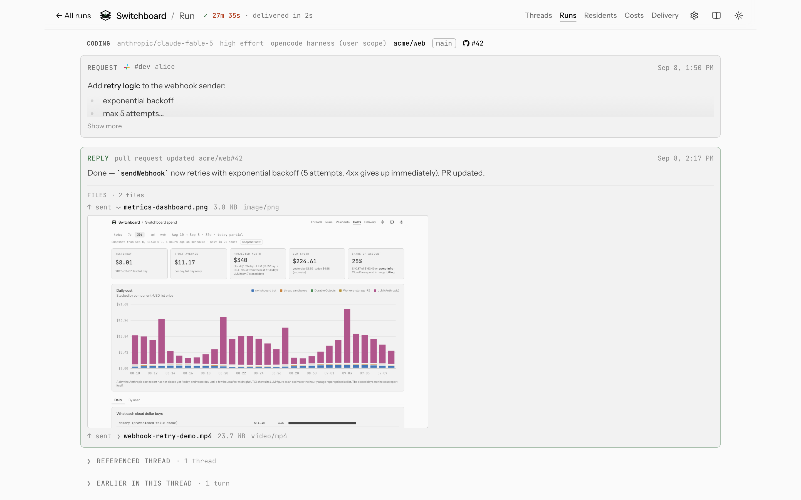
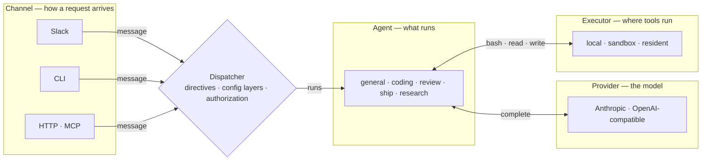

# OpenSwitchboard

[](https://github.com/coreplanelabs/switchboard/actions/workflows/ci.yml) [](https://scorecard.dev/viewer/?uri=github.com/coreplanelabs/switchboard) [](https://github.com/coreplanelabs/switchboard/releases/latest) [](LICENSE)

Mention it in Slack and an agent reviews the PR, ships the fix, or answers the question — on the model you choose, with its tools running where you decide.

*A 30-second recording goes here: a Slack mention, the status card ticking through the run, the PR link landing in the thread.*

<picture>
  <source media="(prefers-color-scheme: dark)" srcset="docs/public/screenshots/run-page-dark.png">
  
</picture>

*Every run has a page: the request, each step timed, the reply. Rendered from the dashboard's fixture preview, so the names are made up.*

## How it is put together

Every request crosses the same four seams, in the same order, whichever way it arrived. Each seam is an interface with more than one implementation, so a new platform, model, sandbox or agent is a new implementation, never a special case.

<!-- generated:four-seams · npm run docs:gen — drawn from docs/.vitepress/theme/seams.mjs and src/deploy/plan.ts, do not edit by hand -->



<!-- /generated:four-seams -->

The reply travels the same path back: the agent's answer and its status updates go through the dispatcher to whichever channel asked.

The dispatcher is the only place orchestration lives: it reads the message's directives (`agent:review model:openai/gpt-5 effort:low …`), resolves agent, model and effort through six config layers (request, thread, user, channel, defaults, the agent's own floor), checks who may run what, and runs the agent loop. Channels are transports; the core never imports a platform SDK. Why it is shaped this way: [How a request flows](docs/explanation/how-a-request-flows.md).

## What you need

| | You need | What it unlocks |
|---|---|---|
| **Required** | One model provider key — Anthropic, or any endpoint that speaks the OpenAI chat-completions shape (OpenAI, Groq, Ollama, vLLM) | Every agent. Models are named `<provider>/<model>` and switched per request, per person, or per channel. |
| **For Slack** | A Slack app (Socket Mode: a bot token and an app-level token) | The bot in your workspace. The terminal needs none of it: the CLI is a channel too, and the quick start below runs without Slack. |
| Optional | A GitHub App (or a repo-scoped personal token) | Agents read your repositories and manage issues; the coding agent pushes branches and opens pull requests. |
| Optional | A Cloudflare account | Production: the bot as a container behind a Worker, plus three more Workers — a state Worker (memory, run history and config that survive restarts), a resident Worker (always-warm checkouts of your repositories) and a sandbox Worker (a container per thread for tools); Cloudflare Access in front of the dashboard; the spend page. |
| Optional | An E2B account | Per-thread micro-VMs for tool execution without Cloudflare. |
| Optional | A Brave Search key (`BRAVE_SEARCH_API_KEY`) | Web search for the research agent. Without it that one tool reports no search backend; every other agent is unaffected. |

Every optional block of `config.yaml` is a capability computed once at startup: what is off is absent from `help`, the dashboard and the deploy plan, not merely disabled. The full matrix, with what each costs: [Turn features on and off](docs/how-to/turn-features-on-and-off.md); every account and where its credential goes: [Set up accounts](docs/how-to/set-up-accounts.md).

## Quick start

Node 24 (`.nvmrc` pins it; 22 or newer runs) and one provider key. Everything below runs on your machine with the terminal as the channel.

```bash
git clone https://github.com/coreplanelabs/switchboard.git
cd switchboard
npm ci
npm run cli -- init --organization <your GitHub org> --anthropic-key <your key>
npm run cli -- ask "what can you do?"
```

`init` writes the two gitignored files the tree deliberately lacks — `.env` with your key (mode 600) and `config/config.yaml` with your organization and every optional block off — from their checked-in examples; the same two copies by hand (`cp config/config.example.yaml config/config.yaml`, `cp .env.example .env`, then edit) work too. `ask` runs the whole pipeline — directives, config layers, authorization, the agent loop — with the answer printed to your terminal. Add directives the way you would in Slack: `npm run cli -- ask "model:anthropic/claude-opus-5 effort:high explain the config layers you resolve"`.

The clone is the install until the CLI is on npm. The tree carries it as the package `@coreplane/switchboard` — the same CLI, bundled with the files it reads — and the release workflow publishes it once the project turns publishing on; from that release, an empty directory is enough:

```bash
npx @coreplane/switchboard init --organization <your GitHub org> --anthropic-key <your key>
npx @coreplane/switchboard ask "what can you do?"
```

`curl -fsSL https://openswitchboard.dev/install.sh | sh` is the same `init` behind a Node version check (that script insists on Node 24). The bot — the long-running process that holds the Slack connection — is the published container image, `ghcr.io/coreplanelabs/switchboard`.

Next steps:

- [Get started](docs/tutorials/get-started.md) — the tutorial behind the commands above: an answer in your terminal, then in Slack, then from production.
- [Run it locally](docs/tutorials/run-it-locally.md) — the same loop, then connecting the process to Slack and GitHub.
- [Your first request in Slack](docs/tutorials/first-request-in-slack.md) — mention it, follow up, ask for something real.
- [Deploy](docs/how-to/deploy.md) — the Cloudflare deployment: the profile, the secrets, the first `deploy all`, and the release workflow after that.

## Learn more

- **Docs**: <https://openswitchboard.dev> — tutorials, how-to guides, reference and explanation, built from [`docs/`](docs/README.md) on every push.
- **Architecture**: [How a request flows](docs/explanation/how-a-request-flows.md) · [Execution and trust](docs/explanation/execution-and-trust.md) · [Worker topology](docs/explanation/worker-topology.md) · [The agents and their toolsets](docs/explanation/agents-and-toolsets.md) · [Design decisions](docs/explanation/design-decisions.md)
- **Contributing**: [CONTRIBUTING.md](CONTRIBUTING.md) for the setup and the one check every change must pass; [AGENTS.md](AGENTS.md) for the invariants and the commands, written for the agents that develop OpenSwitchboard and for anyone who wants to work the same way.
- **Security**: [SECURITY.md](SECURITY.md) — how to report a vulnerability, and what the trust model treats as one.
- **License**: [Apache-2.0](LICENSE).
