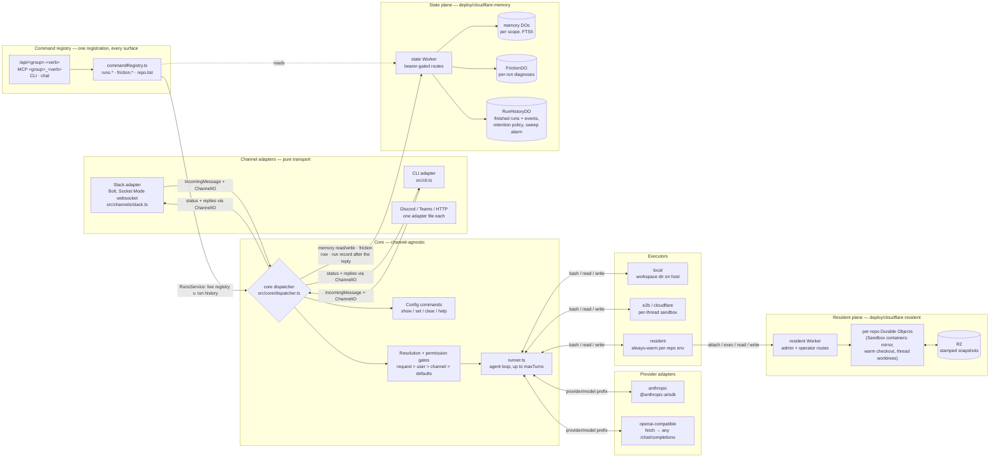
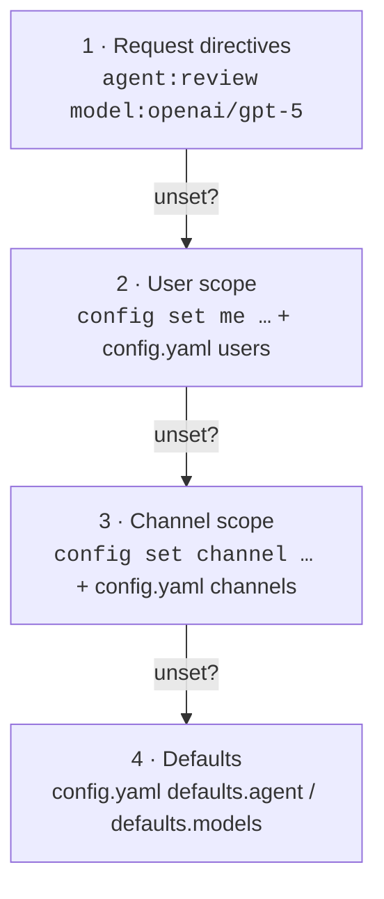
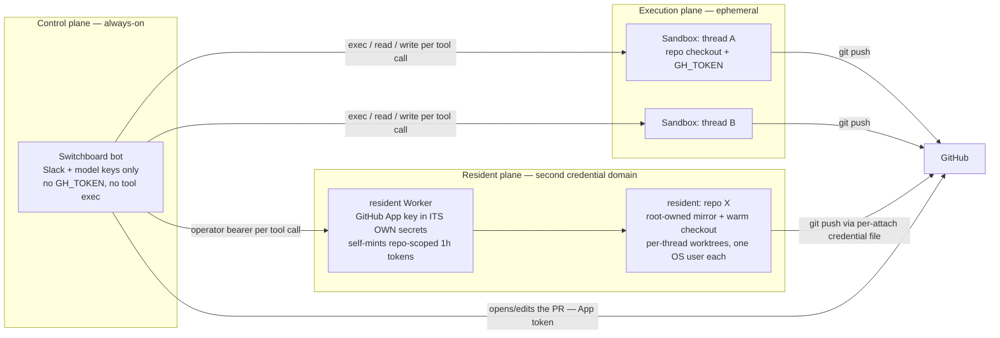
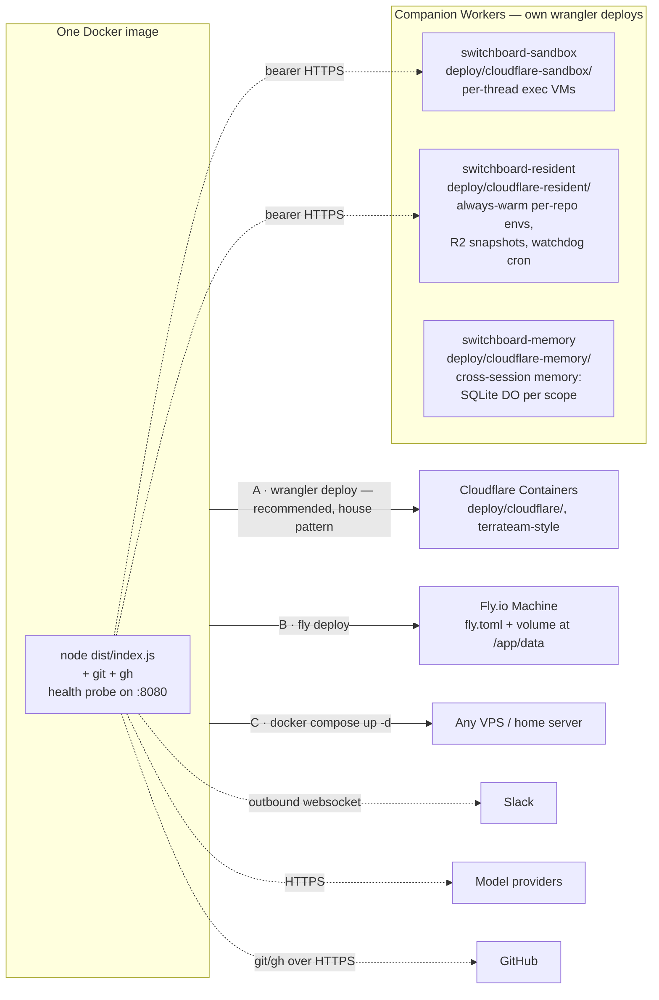

# Switchboard

A cheap, configurable agent gateway: requests arrive over a **channel** (Slack today; the CLI is a second channel; Discord/Teams/HTTP are adapters away), get routed to an **agent** (coding, review, ship, research, general), which runs on a **pluggable inference provider** and executes its tools through a **pluggable executor** (local or per-thread micro-VM). Replaces/subsumes a plain "Claude in Slack" bot with per-channel, per-user, and per-request configuration.

Every boundary is a swappable seam, same pattern at each one:

| Seam | Interface | Implementations | Adding one |
|---|---|---|---|
| Channel | `ChannelIO` + `IncomingMessage` (`src/core/types.ts`) | Slack (Bolt/Socket Mode), CLI | one adapter file in `src/channels/` |
| Provider | `Provider` (`src/providers/types.ts`) | Anthropic, OpenAI-compatible (OpenAI/Groq/Ollama/vLLM = config-only) | one adapter file, or just config |
| Executor | `Executor` (`src/execution/executor.ts`) | local host, E2B micro-VM, Cloudflare Sandbox (via `deploy/cloudflare-sandbox/` proxy Worker), resident repo environments (always-warm per-repo, via `deploy/cloudflare-resident/`) | one backend file + config |
| Agent | `AgentDef` data (`src/agents/registry.ts`) | general, coding, review, ship, research | one registry entry |

The **core dispatcher** (`src/core/dispatcher.ts`) is the only place orchestration lives: config commands, directive parsing, layered resolution, permission gates, history assembly, the agent run. Channels are pure transports; the dispatcher never imports a platform SDK.

Behavioral expectations live in [`features/`](features/README.md) — one spec per feature with validation criteria (unit tests or agent-runnable instructions), updated in the same PR as any behavior change, so every git SHA carries the criteria that describe it. Human-first architecture tours with diagrams live in [`docs/`](docs/) — start with [how Switchboard improves itself](docs/self-improvement-architecture.md).

- **How does it stack up against Claude in Slack?** See the [Switchboard-vs-Claude-Tag parity report (issue #81)](https://github.com/coreplanelabs/switchboard/issues/81) — a measured, receipt-linked side-by-side (same prompts, both bots, per-test metrics), not an asserted comparison.

## Agents

| Agent | What it does | Toolset (`src/agents/registry.ts`) |
|---|---|---|
| `general` | Default fallback — plain passthrough to the configured model; refers repo/web work to the other agents | `none` |
| `coding` | Implements a change and ships a PR ([features/agent-coding.md](features/agent-coding.md)). Cold path: clone → branch → edit → test → push. Resident path: the worktree is already warm and `gh` is not in the image. Either way the agent pushes the branch and submits a typed description; Switchboard renders the body at the pushed head and opens the PR itself ([features/pr-description.md](features/pr-description.md)) | `full` — bash, read, write, web fetch, diff digest, PR description submit, skills |
| `review` | Reviews a PR with full-repo context, reports ranked findings with a submitted verdict ([features/agent-review.md](features/agent-review.md)) | `readonly` — bash, read (read-only by convention), verdict, web fetch, diff digest, skills |
| `ship` | Runs the coding → review → fix loop to LGTM as one pipeline ([features/agent-ship.md](features/agent-ship.md)): opens the PR, loops pinned reviews and fix rounds until the review approves, reports merge-ready — a human still merges. Requires permission for `ship`, `coding`, and `review` | `full` — orchestrator only: the def is never sent to a model; each child round runs on the coding/review toolsets above |
| `research` | Answers questions with web search + URL reading; no repo or workspace is ever provisioned ([features/web-tools.md](features/web-tools.md)) | `web` — web search, web fetch |

Onboarded repos run in an always-warm **resident worktree** ([features/resident-repos.md](features/resident-repos.md)); everything else falls back to a cold per-thread workspace directory (`workspaces/<channel>-<thread>`). On both paths, follow-ups in the same thread reuse the same checkout.

## Configuration layers

Resolution order (highest wins):

1. **Per-request** — inline directives in the message: `agent:review model:openai/gpt-5 effort:low look at PR #42`
2. **Per-thread (sticky)** — a follow-up without directives stays on the agent/model/effort this thread last used (derived from the thread's history, never stored)
3. **Per-user** — `config set me --model openai/gpt-5 --effort medium`
4. **Per-channel** — `config set channel --agent review --efforts.coding medium`
5. **Defaults** — `config/config.yaml` (`defaults.agent`, per-agent `defaults.models` / `defaults.efforts`)
6. **Agent definition** — an agent's built-in `effort` in `src/agents/registry.ts` (review: `medium`), then the provider's own default

Runtime overrides persist to `data/overrides.json`. Static defaults for channels/users can also live in `config.yaml`. **Effort** (`low | medium | high`, how hard the model thinks per turn) is a first-class dimension with the same ladder as model — forced (`effort=`) or per agent (`efforts.<agent>=`) at every scope — because the wall clock is an agent's real budget and effort decides how much of it goes to thinking rather than work.

**Custom instructions** (per user / per channel, [#107](https://github.com/coreplanelabs/switchboard/issues/107)): `config instructions me "Always reply in bullet points"` and `config instructions channel "This channel is about billing"` store free text (≤2000 chars) on the same scopes. The dispatcher folds it into the system prompt as a clearly labeled advisory block — channel text on every run in that channel, a user's text only on runs that user requests; user wins on conflict. Instructions are prompt content only: they never change agent/model resolution or permission gates. A bare `config set me instructions` shows the current text; an explicit empty value (`config set me instructions ""`) clears it (any static `config.yaml` text then applies again, and the reply says so); `config show` displays them.

## Architecture

One long-lived Node process, no inbound server. The Slack adapter opens an **outbound websocket** (Socket Mode), so there is no public URL, webhook endpoint, or signature verification to host. State lives in the channel's own thread history, on the **state Worker** (memory, the friction ledger, and the run history — every finished run's record — in Durable Objects, see [features/run-history.md](features/run-history.md)), and on disk. A restart loses nothing durable: conversation context rebuilds from the thread, finished runs stay readable from the run history, and only runs that were in flight at the restart end without a record.



**State plane** (`deploy/cloudflare-memory/`): one Worker, three Durable Object classes behind a constant-time bearer — cross-session memory, the friction ledger, and the run history. Every finished run is built into a record at finish and written after the reply (retried, drain-tracked); the `RunHistoryDO` owns the retention policy (`retentionDays` / `maxRuns` / `maxBytes`, applied identically by the bot and the Worker through one shared module) and sweeps on an alarm. Without a `runHistory` config block, history is off and runs are live-only. Contract: [features/run-history.md](features/run-history.md).

**Commands** ([features/command-registry.md](features/command-registry.md)): an operator command is a typed TypeScript method registered once — id, positional `args` and camelCase `options` declared with zod (and inferred into the handler), scope, chat gate, effect, handler — and every surface is derived from that definition with no per-command code: HTTP `GET|POST /api/<group>.<verb>` (arguments and options by name; kebab-case query keys, camelCase JSON) behind Cloudflare Access (browser session or service token), MCP tool `<group>_<verb>` with a derived `inputSchema`, CLI `npx tsx src/cli.ts <group> <verb> <args…> [--kebab-option value…] [--json]`, and chat — the same grammar as a message (`runs stop <id> --mode soft`, `friction propose --dry-run --top 3`, `config set me --effort low`), with `--help`, `<group> help` and the bare `help` derived too. Every operator command is one of these — there is no other kind: `help show`, `config show|set|clear|instructions`, `runs list|get|events|friction|stop`, `friction report|propose|analyze`, `repo list|onboard|offboard|reconfigure|rebuild|test|build`, `memory list|forget`, `schedule list`, `deploy plan|all`, `env bootstrap` (the last three that spawn processes — `deploy all`, `env bootstrap`, `friction analyze` — are CLI-only). Authorization is resolved by the adapter (token scopes, Access identity + `permissions.operators` / `permissions.serviceTokens`, Slack admin gates) and checked before the input is parsed; no command ever starts an agent run — that path is `dispatch()` alone, reached from the CLI's `ask` built-in (`npx tsx src/cli.ts ask "…"`) and MCP's `dispatch` tool, which are channels, not commands.

**Resident repo environments** (`deploy/cloudflare-resident/`): repos an admin onboards (`repo onboard <owner/name>` in chat) each get an always-warm per-repo service — a bare mirror kept fresh by a refresh alarm, a built checkout, and per-thread git worktrees with OS-user isolation — so a coding request on an onboarded repo starts with zero setup (no clone, no install). Any other resident state falls back to the per-thread sandbox with a named reason on the status card. Behavioral contract: [features/resident-repos.md](features/resident-repos.md).

Channel adapters translate exactly three things: an incoming event → `IncomingMessage` (namespaced IDs: `slack:C0123`, `slack:U0123`, thread key `slack:C0123:<ts>`), history fetch → `HistoryItem[]`, and replies/status back to the platform (chunking, formatting, message editing are adapter concerns). Everything else is the dispatcher's.

**Agent loop** (`runner.ts`, vendor-blind): call `provider.complete()` → execute any requested tool calls → append results → repeat until the model stops or the turn budget runs out (coding 60, review 40, general 1). Progress notes edit a single Slack status message, rate-limited to one edit per 3s.

**Config resolution** — highest layer that specifies a value wins, independently for agent and model:



**Trust model (important):** the `review` agent is read-only by *toolset* (no `write_file`) and prompt convention — but `bash` can still mutate anything its executor can reach. The capability boundary depends on `execution.type`:

- `local` — tools run on the bot host; the boundary is the container filesystem/user and the scoped `GH_TOKEN`. Fine for dev and trusted operators.
- `e2b` — **control plane / execution plane split.** The bot (always-on, holds only Slack + model keys) ships every tool call to a per-thread E2B micro-VM that holds the repo checkout and `GH_TOKEN`. Blast radius of a malicious or prompt-injected request = its own sandbox plus a repo-scoped token; the bot host, other threads, and the hosting account are unreachable. Sandboxes expire after `timeoutMinutes` idle; thread follow-ups reconnect (map persisted in `data/sandboxes.json`), and an expired sandbox is transparently recreated (repos re-clone).



**Residents are a second credential domain**: the GitHub App private key lives in the resident Worker's own wrangler secrets (never the bot's env, never a container); the Worker mints 1-hour installation tokens scoped to exactly the resident's one repo, and each thread receives its token through a mode-600 per-attach credential file — never argv, never process-wide env. Repo code (installs/builds) always executes token-free and unprivileged. Two bearer scopes gate the Worker itself: the operator token (bot runtime: attach/exec/read/write/status) and the admin token (`repo onboard/offboard/reconfigure/rebuild` chat commands — fail-closed to admins, see Permissions).

The `Executor` interface in `src/execution/` is the seam — a Cloudflare Sandbox (or any other) backend is one file plus config, without touching agents, tools, or the runner.

## Deployment

The process must run somewhere always-on for the bot to be live. Because Socket Mode is outbound-only, "somewhere" is any box that can run a container — no ingress, load balancer, or TLS needed.



| Option | Fit | Notes |
|---|---|---|
| **A. Cloudflare Containers** (`deploy/cloudflare/`) — **recommended: the house pattern** | Proven in this org — `coreplanelabs/infrastructure` runs Terrateam (a long-lived server) exactly this way: singleton DO, `sleepAfter: 2h`, 5-min cron keep-alive. Our shim mirrors it, same account | Disk is ephemeral — but with `execution.type: e2b` workspaces live in sandboxes anyway, so the only loss on instance restart is `data/overrides.json` (put durable channel/user config in `config.yaml`). Thread context always rebuilds from Slack |
| **B. Fly.io Machine** (`fly.toml`) | Cheapest managed always-on (~$3–6/mo + volume) if org constraints don't apply | One volume at `/app/data` persists overrides + workspaces (set `workspaceDir: ./data/workspaces`) |
| **C. Docker on any VPS** (`docker-compose.yml`) | Max control / dev box | Volumes persist `data/` and `workspaces/`; compose restart policy covers supervision |

**Pairing note:** Cloudflare Containers + `execution.type: e2b` is the natural combination — the bot host becomes stateless-except-overrides, which is exactly what an ephemeral-disk platform wants. If you deploy on Cloudflare with `execution.type: local` instead, expect workspace checkouts to reset on instance restarts.

Railway/Render/k8s also work with the same image — anything that runs an always-on container with a volume. **Cloud sandbox providers (E2B, Modal, Daytona, Cloudflare Sandbox) are not a hosting option for the bot** — they solve a different problem: isolating each agent run's `bash` in a throwaway VM. That's the right future hardening step for the tool layer once untrusted users can reach the coding agent; the bot process itself still needs a long-lived home.

### Deploying on Cloudflare Containers (recommended)

Four Workers, deployed the same way `terrateam/` is in `coreplanelabs/infrastructure` (per-worker `package.json` with pinned wrangler, `wrangler deploy` with Docker running). Secrets are declared once in [`deploy/secrets.manifest.json`](deploy/secrets.manifest.json) — every secret, which Worker(s) hold it, and a note on what it is; each Worker's `npm run secrets` runs `deploy/bin/put-secrets.mjs <worker>`, which pipes `~/.secrets/switchboard/<NAME>` into `wrangler secret put` for that Worker's entries and refuses (uploading nothing) when a required value has no local file. The canonical copy of every value is the 1Password item `Switchboard: <NAME>` (Employee vault, tags `switchboard`, `switchboard/<worker>`), mirrored to `~/.secrets/switchboard/<NAME>` (mode 600). Rotating a shared bearer means putting the new value on every Worker the manifest lists for it. A unit test (`src/core/secretsManifest.test.ts`) checks each entry against its Worker's `Env` interface.

**Routine production deploy = one command, from a clean checkout of `origin/main`:**

```bash
RESIDENT_ADMIN_TOKEN=… npx tsx src/cli.ts deploy all   # `npx tsx src/cli.ts deploy plan` shows the plan first
```

Neither needs the git-ignored `config/config.yaml` (the CLI loads bot config — `SWITCHBOARD_CONFIG`, default `./config/config.yaml` — only for the commands that read it), so both run from a worktree or a fresh clone. It runs the four `npm run deploy`s in the **only supported order — memory (state Worker) → bot → resident → sandbox** — after checking that wrangler is on the coreplane-infra account and the tree is clean and at `origin/main`; the plan names any deploy dir without `node_modules` and the runner `npm ci`s it first. **Rotating any bot secret requires a container restart, not a build**: `wrangler secret put` creates a new Worker version but the running container keeps the env it started with — after the put run `SWITCHBOARD_DEPLOY_TOKEN=… npm run cli -- deploy restart`: the Worker's `POST /admin/restart` stops the container (SIGTERM → graceful drain; refused while runs are in flight unless `--force`) and the next request starts it on the current secrets; the command is done once `/healthz` reports a later `startedAt` (~30 s when idle). The bearer is an entry of `SWITCHBOARD_INGRESS_TOKENS` whose identity carries `deploy:write`. The Worker-side put alone is never live. The state Worker goes first because its Durable Object migrations must exist before the bot writes to them; the bot and resident steps are preflighted and the script **waits and retries** (every 60 s, up to 30 min) while runs are in flight instead of killing them — `-- --force` is the only way to bypass, and it says what it will kill. `-- --only bot,resident` / `-- --skip sandbox` keep the order; `-- --allow-branch` relaxes only the `origin/main` check. Ambient `CLOUDFLARE_API_TOKEN` / `CLOUDFLARE_ACCOUNT_ID` are stripped from every step (a set `CLOUDFLARE_ACCOUNT_ID` would override the pinned account). The wait is never silent — every retry prints `bot: still waiting — N run(s) in flight (draining: yes/no), waited Xm of 30m`. **Deployed ≠ live:** `wrangler deploy` uploads the bot's Worker version, but the *old* container keeps answering while it drains in-flight runs (up to 15 min), so the bot step is finished only when `GET /healthz` is answered by a container that is not draining and reports the deployed commit as its `build.commit` (stamped into the image by `deploy/cloudflare/write-build.mjs` → `build.json`, gitignored). The script exits 0 only then; if the old container is still draining at the deadline it prints what is in flight and exits 4 — never "success" while the old code is serving. Plan + gating live in `src/deploy/plan.ts` and `src/deploy/liveGate.ts` (unit-tested); the runner is `src/deploy/deployAllCli.ts`.

The per-Worker steps below are what the script runs, for first-time setup (secrets) or when you need one Worker by hand:

```bash
# one-time: wrangler login (account: coreplane-infra), Docker running

# 0. Values: ~/.secrets/switchboard/<NAME> for every entry in deploy/secrets.manifest.json
#    (from 1Password "Switchboard: <NAME>"; self-minted bearers are `openssl rand -hex 32`).
#    Shared bearers (SANDBOX_TOKEN, RESIDENT_*_TOKEN, MEMORY_TOKEN) must be the same
#    value on every Worker the manifest lists — the manifest is the list.

# 1. Sandbox worker — per-thread execution VMs at switchboard-sandbox.coreplanelabs.dev
cd deploy/cloudflare-sandbox && npm install
npm run secrets   # SANDBOX_TOKEN (manifest: sandbox)
npm run deploy

# 2. Resident worker — always-warm per-repo environments at
#    switchboard-resident.coreplanelabs.dev (per-repo Durable Objects on
#    Cloudflare Sandbox 1.0, R2 bucket for stamped snapshots, watchdog cron)
cd ../cloudflare-resident && npm install
npm run secrets   # manifest: resident — RESIDENT_ADMIN/OPERATOR/READ_TOKEN, GITHUB_APP_*,
                  # MEMORY_TOKEN (watchdog firing records; STATE_WORKER_URL is a wrangler var)
                  # (the resident holds its own copy of the App key — the
                  # second credential domain; see trust model above)
RESIDENT_ADMIN_TOKEN=… env -u CLOUDFLARE_API_TOKEN npm run deploy
                  # preflight first: refuses while any resident has a run in flight
                  # (a Worker deploy kills them); fails closed without the bearer.
                  # RESIDENT_DEPLOY_FORCE=1 bypasses. Ends with a wake ping: /healthz 200

# 3. Memory worker — durable cross-session memory at
#    switchboard-memory.coreplanelabs.dev (one SQLite Durable Object per memory
#    scope; no container, no Docker needed). Optional: only if memory.enabled.
cd ../cloudflare-memory && npm install
npm test          # runs the DO tests inside workerd
npm run secrets   # manifest: memory — MEMORY_TOKEN
env -u CLOUDFLARE_API_TOKEN npm run deploy   # ends with a wake ping: /healthz 200

# 4. Bot worker — always-on Switchboard container
cd ../cloudflare && npm install
npm run secrets   # manifest: bot — Slack, Anthropic, Brave, SANDBOX_TOKEN, RESIDENT_OPERATOR/ADMIN_TOKEN,
                  # MEMORY_TOKEN, GitHub App, CF_ANALYTICS_TOKEN (costs dash); ANTHROPIC_ADMIN_KEY
                  # (LLM spend on /costs) is optional and skipped when there is no local file
env -u CLOUDFLARE_API_TOKEN npm run deploy
                  # preflight first: refuses while the bot has runs in flight, is still
                  # draining from an earlier deploy, or the container app is mid-rollout
                  # (a second rollout on a draining instance kills the run — #250).
                  # No token needed (/healthz). SWITCHBOARD_DEPLOY_FORCE=1 bypasses.
                  # Ends with a wake ping: /healthz 200
npm run tail      # watch it connect: "switchboard running (providers: anthropic...)"

# Rotating a bot secret later: put it, then restart the container — no image build.
npm run secrets                                           # or: wrangler secret put <NAME>
SWITCHBOARD_DEPLOY_TOKEN=… npm run cli -- deploy restart  # from the repo root; ~30 s when idle,
                  # waits (heartbeat) while runs are in flight, --force kills them;
                  # done once /healthz reports a later startedAt
```

The bot shim mirrors terrateam exactly: singleton Durable Object, `sleepAfter: 2h`, 5-minute cron keep-alive, secrets forwarded as container env, `startAndWaitForPorts` with generous timeout. Production behavior comes from `config/config.production.yaml` (committed, no secrets), selected via `SWITCHBOARD_CONFIG`; the sandbox and resident Workers get stable custom domains on the `coreplanelabs.dev` zone so that config never changes. Repos are onboarded to the resident Worker at runtime from chat (`repo onboard` — next section), never at deploy time.

### What any host must provide

Platform-agnostic requirements, for evaluating alternatives:

- **Runtime:** 1 always-on Docker container, single instance, no autoscaling; 0.25–0.5 vCPU, 512MB–1GB RAM (mostly idle)
- **Network:** outbound HTTPS only — Slack (`slack.com`/`wss-*.slack.com`), model provider APIs, `github.com`, E2B. **Zero inbound** — the app dials out over a websocket
- **Secrets as env vars:** `SLACK_BOT_TOKEN`, `SLACK_APP_TOKEN`, `ANTHROPIC_API_KEY`, `E2B_API_KEY`, optionally `OPENAI_API_KEY`; `GH_TOKEN` only when `execution.type: local`; `SANDBOX_TOKEN` / `RESIDENT_OPERATOR_TOKEN` / `RESIDENT_ADMIN_TOKEN` when the Cloudflare sandbox / resident Workers are configured
- **No cloud credentials on the host** — the app makes no cloud API calls, and its agents execute model-generated commands, so least privilege matters here specifically
- **Storage:** optional small persistent volume at `/app/data`; degrades gracefully without it (repos re-clone, thread context rebuilds from the channel)
- **Health/logs:** `GET :8080/healthz` → 200 with `{ok, inFlight, draining, catchUp}`; `catchUp` is the reconnect catch-up's last outcome (`lastRunAt`, `channels`, `missed`, `skippedChannels`, plus `error` when the scan could not run and `missingScopes` when the bot token lacks required scopes) — the way to see a silently failing catch-up without container logs; logs on stdout

### Deploying on Fly.io

```bash
fly launch --no-deploy && fly volumes create switchboard_data --size 3
fly secrets set SLACK_BOT_TOKEN=... SLACK_APP_TOKEN=... ANTHROPIC_API_KEY=... E2B_API_KEY=...
fly deploy && fly logs   # set workspaceDir: ./data/workspaces in config.yaml first
```

### Deployment FAQ

**Can the bot itself run in a Cloudflare Sandbox?** Technically yes — a Cloudflare Sandbox is a container underneath, and terrateam proves long-lived processes run fine on Cloudflare Containers. But hosting the bot *via the Sandbox SDK* just re-implements deployment option A with an extra orchestration layer, so there's no reason to: deploy on Containers directly. Sandboxes earn their keep as the **execution plane** — where the agents' tools run (`execution.type: e2b` today; a Cloudflare Sandbox executor backend is one file plus a small proxy Worker, since its SDK runs Worker-side).

**Can it run on the Workers runtime / serverless-native?** Not as-is: the Slack adapter is a Socket Mode daemon and config/state use the filesystem. A serverless-native version means switching the Slack adapter to HTTP Events API (ack within 3s, continue work durably) and moving config/state off disk — the problem durable-agent frameworks (Vercel's eve, Cloudflare's Agents SDK) productize. Our seams map 1:1 onto those frameworks, so that door stays open; there's no reason to pay for it before horizontal scale matters.

## Usage in Slack

```
@switchboard help
@switchboard what's the syntax for a postgres lateral join?
@switchboard agent:coding ship a PR to github.com/acme/api that adds retry to the webhook sender
@switchboard agent:review model:anthropic/claude-opus-5 review acme/api#123
@switchboard config show
@switchboard config set channel --agent review
@switchboard config set me --models.coding openai/gpt-5
@switchboard config instructions me "Always reply in bullet points and sign off as Dan"
```

DMs to the bot work the same way (no mention needed). In channels, only the first message of a conversation needs the mention: once the bot is part of a thread (it replied, or was mentioned anywhere in it), every follow-up reply in that thread reaches it without re-mentioning.

## Permissions

Optional `permissions` block in `config.yaml` — absent means everything is open:

```yaml
permissions:
  admins: [slack:U0123ADMIN]      # bypass all restrictions
  agents:
    coding: [slack:U0456DEV]      # only these users (+ admins) may run coding
  channelConfig: []          # who may run `config set/clear channel`
                             # empty = admins only; key absent = everyone
  repos:                     # per-repo access for resident environments
    acme/api: [slack:U0456DEV]   # a listed repo admits members + admins and
                             # refuses everyone else BY NAME; map or key
                             # absent = open to every allowed coding user
  repoManagement: []         # who may run `repo onboard/offboard/reconfigure/
                             # rebuild` (`repo list` is open). FAIL-CLOSED:
                             # key absent OR empty = admins only
```

- Agent allowlists are enforced **at run time against the resolved agent**, so they can't be bypassed via `agent:` directives, `config set me`, or channel defaults.
- `config set me` is always allowed — pointing yourself at a restricted agent is harmless because the run-time gate still applies.
- Denials reply in-thread naming the admins to ask; `config show` lists which agents are unavailable to you.
- **`repoManagement` is the one fail-closed gate** — every other key is open when absent, but repo management defaults to admins-only because `repo onboard`/`rebuild` provision billable always-on compute and bind GitHub credentials.

## Setup

1. **Create the Slack app** (api.slack.com/apps → From scratch):
   - Enable **Socket Mode**; create an app-level token with `connections:write` → `SLACK_APP_TOKEN`.
   - **OAuth scopes** (Bot Token): `app_mentions:read`, `chat:write`, `channels:history`, `groups:history`, `im:history`, `im:read`, `im:write`, `files:read` (image attachments are downloaded and passed to the model; without this scope they're reported as unavailable), `reactions:write` (the bot reacts :eyes: to a message the moment it accepts it; without this scope requests still work, just without the receipt), `channels:read`, `groups:read`, `users:read` (channel/user display names for run labels, and the channel listing the reconnect catch-up scans — see below).
   - **Event subscriptions**: `app_mention`, `message.im`, `message.channels`, `message.groups` (the channel/group message events deliver thread follow-ups so no re-mention is needed mid-conversation).
   - **Reconnect catch-up** ([#184](https://github.com/coreplanelabs/switchboard/issues/184)): Socket Mode drops every event that arrives while the bot is disconnected (each deploy = drain + cold start). On every (re)connect the bot re-reads the recent history of the channels it is in and runs whatever has no receipt from it (no :eyes:, no bot reply after it) — dedupe is Slack itself, no persisted cursor. On by default with a 30-minute window — sized to the drain: a deploy over a run in flight closes the socket and blacks Slack out for the run's remaining duration (up to the 15-minute drain deadline plus a cold start, [#272](https://github.com/coreplanelabs/switchboard/issues/272)), and the catch-up is the only recovery for that gap; `slack.catchUp` in `config.yaml` tunes it (a window under 20 minutes is warned about at startup). It needs `channels:read`/`groups:read` to list channels — without them it silently does nothing, so on first connect the bot compares the token's granted scopes with the required set, logs any missing ones, and reports them (with the last scan's outcome or error) under `catchUp` on `GET /healthz`; the deploy preflight prints a warning from the same fields.
   - Install to workspace → `SLACK_BOT_TOKEN`.
2. **Configure**:
   ```bash
   cp config/config.example.yaml config/config.yaml
   cp .env.example .env   # fill in tokens/keys
   ```
3. **GitHub identity for coding/review agents**: create a **GitHub App** on the org (Settings → Developer settings → GitHub Apps → New): permissions Contents (read & write) + Pull requests (read & write) + Issues (read & write — agents read issues for task context and comment on them; without it any `gh issue` call 403s with "Resource not accessible by integration"), webhook off; generate a private key; install it on the repos the bot may touch. Set `GITHUB_APP_ID`, `GITHUB_APP_INSTALLATION_ID`, `GITHUB_APP_PRIVATE_KEY` — the bot mints 1-hour installation tokens on demand and injects them into sandboxes; PRs are authored as `<app-name>[bot]`. (Fallback: a repo-scoped fine-grained `GH_TOKEN` PAT.) With sandboxed execution the bot host itself needs no git/gh.
4. **Run**:
   ```bash
   npm install
   npm run dev          # or: npm run build && npm start
   ```
5. **Resident repo environments** (optional — always-warm per-repo executors):
   - Deploy the resident Worker (`deploy/cloudflare-resident/` — see Deployment above) and point config at it:
     ```yaml
     execution:
       resident:
         baseUrl: https://switchboard-resident.<your-zone>
     ```
     with `RESIDENT_OPERATOR_TOKEN` (runtime tool calls) and `RESIDENT_ADMIN_TOKEN` (repo-management commands) in the bot's env. Set the `GITHUB_APP_*` secrets on the **resident Worker** too — it self-mints repo-scoped tokens (trust model above); without them, clones are anonymous (public repos only) and pushes from resident threads are unavailable.
   - Onboard repos from chat (admin-gated, fail-closed via `permissions.repoManagement`):
     ```
     @switchboard repo onboard acme/api --ref main --test "npm test" --build "npm run build" --install "npm ci"
     @switchboard repo list                      # lifecycle: onboarding → warm
     @switchboard repo reconfigure acme/api test="npm run test:unit"
     @switchboard repo offboard acme/api --dry-run   # itemized plan, nothing executed
     @switchboard repo rebuild acme/api              # discard snapshots, reprovision from scratch
     ```
     Omitted commands are detected from the repo root (`packageManager` field or lockfile → pnpm / yarn / bun / npm; `build`/`test` only when `package.json` has the script, a no-op otherwise; a repo with no root `package.json` gets no install) — the reply names the toolchain and why, and falls back to the npm table with a warning when the root cannot be inspected. The thread then gets a second reply when provisioning reaches `warm` or fails, with the resident's own reason. Onboarding requires the repo to already be in the GitHub App installation's repository list when the App is configured (the onboard reply carries an honest warning when it is not).
   - Once a repo is `warm`, any coding/review request that names it (slug, GitHub URL, or PR link) runs in its resident: ready worktree on the thread's branch, deps installed, zero setup. Restrict who may use a given repo's resident with `permissions.repos`.

## Adding a provider

Add a block to `config.yaml` — no code needed for OpenAI-compatible endpoints:

```yaml
providers:
  groq:
    type: openai-compatible
    baseUrl: https://api.groq.com/openai/v1
    apiKeyEnv: GROQ_API_KEY
```

Then reference models as `groq/<model-id>` anywhere a model is accepted. For a provider with a genuinely different API, implement the small `Provider` interface in `src/providers/` and register it in `src/providers/registry.ts`.

## Adding an agent

Add an entry to `AGENTS` in `src/agents/registry.ts` (system prompt, toolset, turn/token budget) and give it a default model in `config.yaml` under `defaults.models`.

## Security notes

- The `bash` tool executes model-generated commands on the host with the bot's permissions. Run Switchboard in a container or dedicated user/VM, scope the `gh` token to the repos it should touch, restrict which channels can reach it, and put the `coding` agent behind a `permissions.agents` allowlist.
- API keys are only ever read from environment variables (`apiKeyEnv`), never from config files.
- Workspaces are confined for file tools, but `bash` is inherently unconfined — isolation belongs at the host level.
