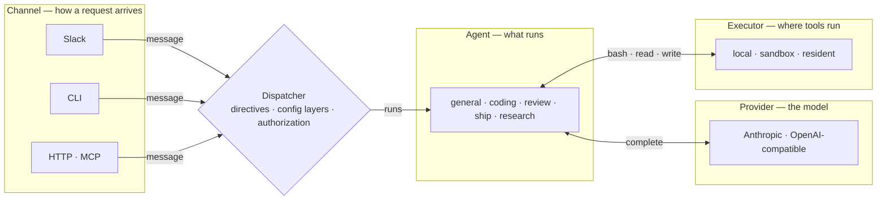

# OpenSwitchboard

[](https://github.com/coreplanelabs/switchboard/actions/workflows/ci.yml) [](https://scorecard.dev/viewer/?uri=github.com/coreplanelabs/switchboard) [](https://github.com/coreplanelabs/switchboard/releases/latest) [](LICENSE)

Mention it in Slack and an agent reviews the PR, ships the fix, or answers the question — on the model you choose, with its tools running where you decide.

<picture>
  <source media="(prefers-color-scheme: dark)" srcset="docs/public/screenshots/run-page-dark.png">
  
</picture>

## Quick start

Node 24 and an Anthropic API key; no Slack.

```bash
npx @coreplane/switchboard init --organization <your GitHub org> --anthropic-key <your key>
npx @coreplane/switchboard ask "what can you do?"
```

`init` writes `.env` (mode 600) and `config/config.yaml`; `ask` runs the whole pipeline. `curl -fsSL https://openswitchboard.dev/install.sh | sh` is the same `init`.

Next: [Get started](docs/tutorials/get-started.md).

## How it is put together

Four seams: Channel, Provider, Executor, Agent. Each is an interface with more than one implementation. The dispatcher sits between them: directives, config layers, authorization, the agent loop ([How a request flows](docs/explanation/how-a-request-flows.md)).

<!-- generated:four-seams · npm run docs:gen — drawn from docs/.vitepress/theme/seams.mjs and src/deploy/plan.ts, do not edit by hand -->



<!-- /generated:four-seams -->

## What you need

| | You need | What it unlocks |
|---|---|---|
| **Required** | A model provider key: Anthropic, or any OpenAI-compatible endpoint | Every agent |
| **For Slack** | A Slack app (Socket Mode: bot token + app-level token) | The bot in your workspace |
| Optional | A GitHub App, or a repo-scoped token | Repository reads; pull requests |
| Optional | A Cloudflare account | Production: the bot plus the state, resident and sandbox Workers |
| Optional | An E2B account | Per-thread micro-VMs without Cloudflare |
| Optional | A Brave Search key (`BRAVE_SEARCH_API_KEY`) | Web search for the research agent |

Off means absent from `help`, the dashboard and the plan ([Turn features on and off](docs/how-to/turn-features-on-and-off.md)). The bot is `npx @coreplane/switchboard start` on any machine with Node, or the published image `ghcr.io/coreplanelabs/switchboard`.

## Learn more

Docs: <https://openswitchboard.dev> ([`docs/`](docs/README.md)) · [CONTRIBUTING.md](CONTRIBUTING.md) · [AGENTS.md](AGENTS.md) · [SECURITY.md](SECURITY.md) · [Apache-2.0](LICENSE).
