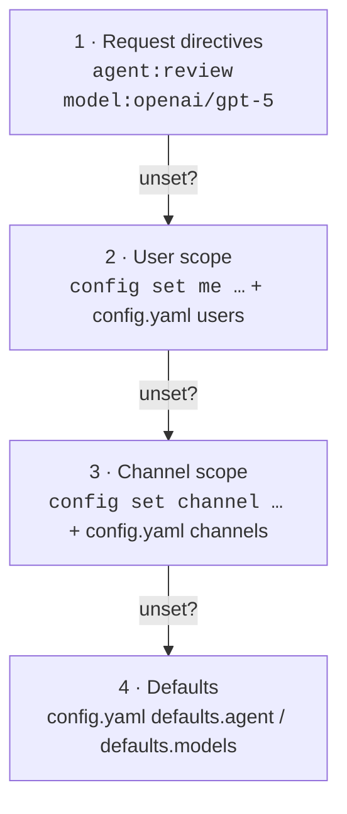
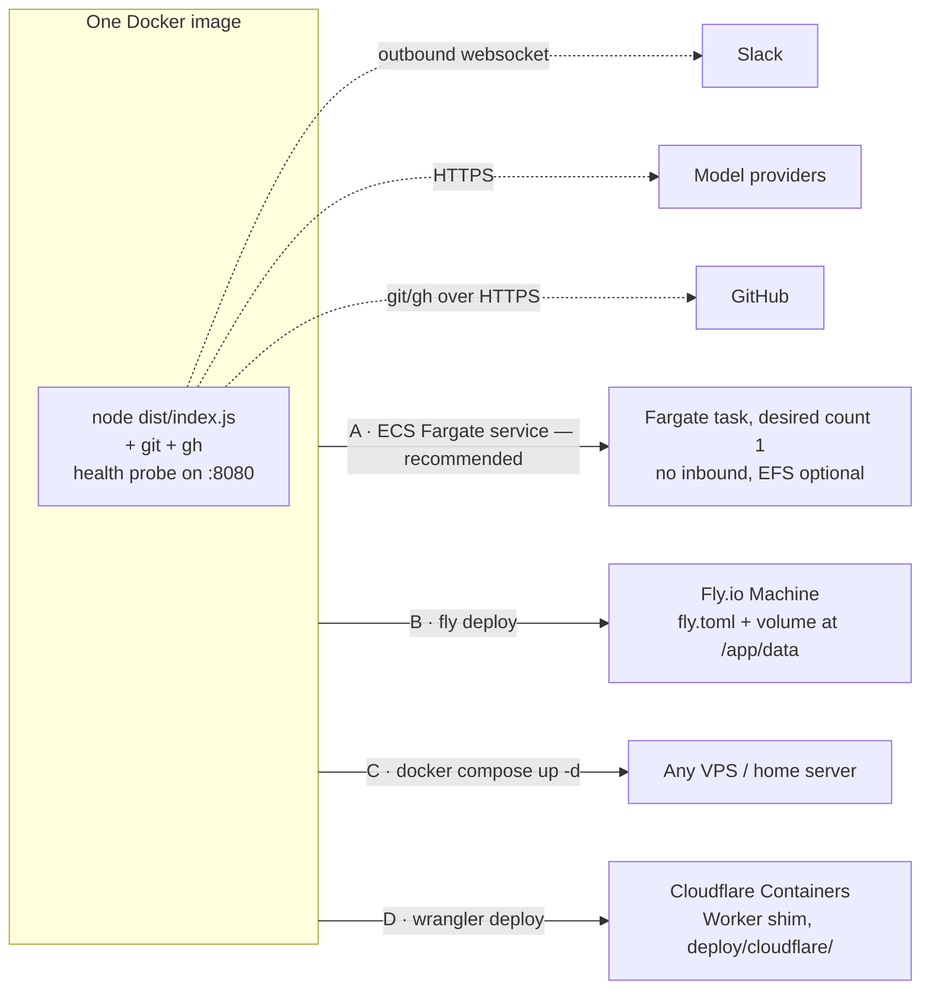

# Switchboard

A cheap, configurable Slack bot that routes requests to **agents** (coding, review, general) running on **pluggable inference providers**. Replaces/subsumes a plain "Claude in Slack" bot with per-channel, per-user, and per-request configuration.

- **Socket Mode** — no public URL, runs on any box (laptop, $5 VPS, a container).
- **Provider-neutral** — models are addressed as `<provider>/<model>`. Anthropic is supported natively; anything OpenAI-compatible (OpenAI, Groq, Together, Ollama, vLLM, ...) is config-only.
- **Agents** are prompts + toolsets + turn budgets; any agent can run on any model.

## Agents

| Agent | What it does | Tools |
|---|---|---|
| `general` | Default fallback — plain passthrough to the configured model | none |
| `coding` | Implements a change and ships a PR (clone → branch → edit → test → `gh pr create`) | bash, read, write |
| `review` | Reviews a PR with full-repo context, reports ranked findings | bash, read (read-only by convention) |

Each request runs in a per-thread workspace directory (`workspaces/<channel>-<thread>`), so follow-ups in the same thread reuse the same checkout.

## Configuration layers

Resolution order (highest wins):

1. **Per-request** — inline directives in the message: `agent:review model:openai/gpt-5 look at PR #42`
2. **Per-user** — `config set me model=openai/gpt-5`
3. **Per-channel** — `config set channel agent=review`
4. **Defaults** — `config/config.yaml` (`defaults.agent`, per-agent `defaults.models`)

Runtime overrides persist to `data/overrides.json`. Static defaults for channels/users can also live in `config.yaml`.

## Architecture

One long-lived Node process, no inbound server. Bolt opens an **outbound websocket** to Slack (Socket Mode), so there is no public URL, webhook endpoint, or signature verification to host. State lives in Slack threads and on disk — a restart loses nothing except in-flight runs.

```mermaid
flowchart LR
    subgraph slack [Slack]
        U[User mentions bot / DMs]
        T[(Thread history)]
        S[Status + result messages]
    end

    subgraph proc [Switchboard process]
        B[Bolt app<br/>Socket Mode websocket]
        H{handleRequest}
        CC[Config commands<br/>show / set / clear / help]
        R[Config resolution<br/>request > user > channel > defaults]
        RUN[runner.ts<br/>agent loop, up to maxTurns]
        TOOLS[Tools: bash / read / write<br/>confined to workspace dir]
    end

    subgraph providers [Provider adapters]
        A[anthropic<br/>@anthropic-ai/sdk]
        O[openai-compatible<br/>fetch → any /chat/completions]
    end

    subgraph disk [Local state]
        W[(workspaces/&lt;channel&gt;-&lt;thread&gt;/<br/>git checkouts)]
        OV[(data/overrides.json)]
        CF[(config/config.yaml)]
    end

    U -->|websocket event| B --> H
    H -->|config …| CC --> S
    H --> R
    T -->|conversations.replies<br/>rebuilds history per request| R
    CF --> R
    OV --> R
    R --> RUN
    RUN <-->|provider/model prefix picks adapter| A & O
    RUN <--> TOOLS <--> W
    RUN -->|progress + final answer| S
```

**Agent loop** (`runner.ts`, vendor-blind): call `provider.complete()` → execute any requested tool calls → append results → repeat until the model stops or the turn budget runs out (coding 60, review 40, general 1). Progress notes edit a single Slack status message, rate-limited to one edit per 3s.

**Config resolution** — highest layer that specifies a value wins, independently for agent and model:



**Trust model (important):** the `review` agent is read-only by *toolset* (no `write_file`) and prompt convention — but `bash` can still mutate anything the process can reach. The capability boundary is therefore the **host environment**: container filesystem, container user, and the scoped `GH_TOKEN`. Assume anything a channel member asks for can run with those credentials.

## Deployment

The process must run somewhere always-on for the bot to be live. Because Socket Mode is outbound-only, "somewhere" is any box that can run a container — no ingress, load balancer, or TLS needed.



| Option | Fit | Notes |
|---|---|---|
| **A. AWS ECS Fargate service** — **recommended if you run AWS** | Managed containers on the account you already have; no instances to own (the usual reason raw EC2 is banned org-side) | One always-on task (0.25–0.5 vCPU / 1GB, ~$9–12/mo); zero inbound SG rules; secrets from Secrets Manager; optional EFS at `/app/data` for persistent workspaces (fine without — state rebuilds from Slack, repos re-clone) |
| **B. Fly.io Machine** (`fly.toml`) — recommended otherwise | Cheapest managed always-on (~$3–6/mo + $0.15/GB volume); one-command deploys | One volume at `/app/data` persists overrides + workspaces (set `workspaceDir: ./data/workspaces`). Health-checked, auto-restarted |
| **C. Docker on any VPS** (`docker-compose.yml`) | You already have a box, or want max control | Volumes persist `data/` and `workspaces/`; compose `restart: unless-stopped` + Docker's systemd unit cover supervision |
| **D. Cloudflare Containers** (`deploy/cloudflare/`) | Only if consolidating on CF matters more than cost/simplicity | Needs a Worker + DO + cron shim just to stay alive; always-on container billing; **disk is ephemeral** — workspaces and `data/overrides.json` reset on instance restart (thread context rebuilds from Slack; put durable config in `config.yaml`) |

Railway/Render/k8s also work with the same image — anything that runs an always-on container with a volume. **Cloud sandbox providers (E2B, Modal, Daytona, Cloudflare Sandbox) are not a hosting option for the bot** — they solve a different problem: isolating each agent run's `bash` in a throwaway VM. That's the right future hardening step for the tool layer once untrusted users can reach the coding agent; the bot process itself still needs a long-lived home.

### Requesting a home for it (ECS Fargate or equivalent)

What the service needs — paste this into your platform-team request:

- **Runtime:** 1 Docker container (image provided, we can push to ECR), always-on, single instance (`desiredCount: 1`), no autoscaling
- **Size:** 0.25–0.5 vCPU, 512MB–1GB RAM (mostly idle)
- **Network:** *outbound HTTPS only* — `slack.com`/`wss-*.slack.com`, `api.anthropic.com`, `api.openai.com` (or other model endpoints), `github.com`. **No inbound traffic at all** (the app dials out to Slack over a websocket). Private subnet + NAT or public IP + empty inbound SG — either works
- **Secrets:** 4–5 env vars from Secrets Manager/SSM: `SLACK_BOT_TOKEN`, `SLACK_APP_TOKEN`, `ANTHROPIC_API_KEY`, `GH_TOKEN`, optionally `OPENAI_API_KEY`
- **IAM task role:** none/empty — the app makes no AWS API calls, and its `bash` tool executes model-generated commands, so least privilege matters here specifically
- **Storage:** optional 2–5GB persistent volume (EFS) at `/app/data` for git checkouts + runtime config overrides; degrades gracefully without it (restarts re-clone; thread context rebuilds from Slack)
- **Health:** `GET :8080/healthz` returns 200; restart-on-failure policy
- **Logs:** stdout/stderr → CloudWatch

### Why not run it *in* a sandbox (Cloudflare Sandbox, E2B, Modal)?

Sandboxes are per-run execution environments driven by a caller: ephemeral disk, lifecycle owned by whoever spawned them, designed to be torn down. The bot is the opposite shape — a long-lived daemon that must hold a websocket open 24/7 and *initiate* work. You can technically start a daemon inside a Cloudflare Sandbox (it's a container underneath), but you inherit exactly the Cloudflare Containers caveats above plus an extra orchestration layer — it's the same deployment, made worse.

Where a sandbox **is** the right tool: the agents' `bash`. The strongest future architecture splits the two — the bot (a small, tool-less process) lives on Fargate/Fly, and each agent run executes its commands in a throwaway per-thread sandbox (Cloudflare Sandbox, E2B, ...). That removes model-generated code execution from the bot host entirely. The `RunnableTool` interface in `src/tools/` is the seam: implement a sandbox-backed toolset and nothing else changes.

### Deploying on Fly.io (recommended if you don't want to manage an instance)

```bash
fly launch --no-deploy        # uses fly.toml; say no to Postgres/Redis prompts
fly volumes create switchboard_data --size 3
fly secrets set SLACK_BOT_TOKEN=xoxb-... SLACK_APP_TOKEN=xapp-... ANTHROPIC_API_KEY=sk-ant-... GH_TOKEN=github_pat_...
# in config/config.yaml set: workspaceDir: ./data/workspaces
fly deploy
fly logs                      # look for "switchboard running (providers: ...)"
```

What does **not** work: porting the app itself to the Workers runtime — the agents spawn real processes (`bash`, `git`, `gh`) and need a filesystem. A Workers-native rewrite (Events API webhooks → Worker, Durable Object per thread, Cloudflare Sandbox per workspace) is possible but is a redesign, not a deployment choice; there's no reason to pay for it until you need horizontal scale.

### Deploying on Cloudflare Containers

```bash
cd deploy/cloudflare
npm install @cloudflare/containers
wrangler secret put SLACK_BOT_TOKEN     # repeat for SLACK_APP_TOKEN, ANTHROPIC_API_KEY, GH_TOKEN, ...
wrangler deploy                          # builds ../../Dockerfile and ships it
curl https://switchboard.<your-subdomain>.workers.dev/healthz   # starts the container
```

The shim's field names track the `@cloudflare/containers` beta — sanity-check against [the Containers docs](https://developers.cloudflare.com/containers/) on first deploy.

## Usage in Slack

```
@switchboard help
@switchboard what's the syntax for a postgres lateral join?
@switchboard agent:coding ship a PR to github.com/acme/api that adds retry to the webhook sender
@switchboard agent:review model:anthropic/claude-opus-5 review acme/api#123
@switchboard config show
@switchboard config set channel agent=review
@switchboard config set me models.coding=openai/gpt-5
```

DMs to the bot work the same way (no mention needed).

## Permissions

Optional `permissions` block in `config.yaml` — absent means everything is open:

```yaml
permissions:
  admins: [U0123ADMIN]      # bypass all restrictions
  agents:
    coding: [U0456DEV]      # only these users (+ admins) may run coding
  channelConfig: []          # who may run `config set/clear channel`
                             # empty = admins only; key absent = everyone
```

- Agent allowlists are enforced **at run time against the resolved agent**, so they can't be bypassed via `agent:` directives, `config set me`, or channel defaults.
- `config set me` is always allowed — pointing yourself at a restricted agent is harmless because the run-time gate still applies.
- Denials reply in-thread naming the admins to ask; `config show` lists which agents are unavailable to you.

## Setup

1. **Create the Slack app** (api.slack.com/apps → From scratch):
   - Enable **Socket Mode**; create an app-level token with `connections:write` → `SLACK_APP_TOKEN`.
   - **OAuth scopes** (Bot Token): `app_mentions:read`, `chat:write`, `channels:history`, `groups:history`, `im:history`, `im:read`, `im:write`.
   - **Event subscriptions**: `app_mention`, `message.im`.
   - Install to workspace → `SLACK_BOT_TOKEN`.
2. **Configure**:
   ```bash
   cp config/config.example.yaml config/config.yaml
   cp .env.example .env   # fill in tokens/keys
   ```
3. **Host prerequisites for coding/review agents**: `git` and `gh` installed and authenticated (`gh auth login`) as a bot/machine account with access to your repos. The agents shell out to them.
4. **Run**:
   ```bash
   npm install
   npm run dev          # or: npm run build && npm start
   ```

## Adding a provider

Add a block to `config.yaml` — no code needed for OpenAI-compatible endpoints:

```yaml
providers:
  groq:
    type: openai-compatible
    baseUrl: https://api.groq.com/openai/v1
    apiKeyEnv: GROQ_API_KEY
```

Then reference models as `groq/<model-id>` anywhere a model is accepted. For a provider with a genuinely different API, implement the small `Provider` interface in `src/providers/` and register it in `src/providers/registry.ts`.

## Adding an agent

Add an entry to `AGENTS` in `src/agents/registry.ts` (system prompt, toolset, turn/token budget) and give it a default model in `config.yaml` under `defaults.models`.

## Security notes

- The `bash` tool executes model-generated commands on the host with the bot's permissions. Run Switchboard in a container or dedicated user/VM, scope the `gh` token to the repos it should touch, restrict which channels can reach it, and put the `coding` agent behind a `permissions.agents` allowlist.
- API keys are only ever read from environment variables (`apiKeyEnv`), never from config files.
- Workspaces are confined for file tools, but `bash` is inherently unconfined — isolation belongs at the host level.
