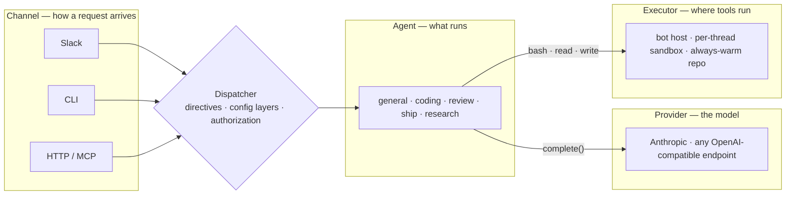

# Switchboard

Mention it in Slack and an agent reviews the PR, ships the fix, or answers the question — on the model you choose, with its tools running where you decide.

*A 30-second recording goes here: a Slack mention, the status card ticking through the run, the PR link landing in the thread.*

## How it is put together

Every request crosses the same four seams, in the same order, whichever way it arrived. Each seam is an interface with more than one implementation, so a new platform, model, sandbox or agent is a new implementation, never a special case.



The reply travels the same path back: the agent's answer and its status updates go through the dispatcher to whichever channel asked.

The dispatcher is the only place orchestration lives: it reads the message's directives (`agent:review model:openai/gpt-5 effort:low …`), resolves agent, model and effort through six config layers (request, thread, user, channel, defaults, the agent's own floor), checks who may run what, and runs the agent loop. Channels are transports; the core never imports a platform SDK. Why it is shaped this way: [How a request flows](docs/explanation/how-a-request-flows.md).

## What you need

| | You need | What it unlocks |
|---|---|---|
| **Required** | A Slack app (Socket Mode: a bot token and an app-level token) | The bot in your workspace. The CLI needs no Slack at all. |
| **Required** | One model provider key — Anthropic, or any endpoint that speaks the OpenAI chat-completions shape (OpenAI, Groq, Ollama, vLLM) | Every agent. Models are named `<provider>/<model>` and switched per request, per person, or per channel. |
| Optional | A GitHub App (or a repo-scoped personal token) | Agents read your repositories and manage issues; the coding agent pushes branches and opens pull requests. |
| Optional | A Cloudflare account | The four Workers: durable memory, run history and config that survive restarts; always-warm repo environments; per-thread sandboxes for tools; Access in front of the dashboard; the spend page. |
| Optional | An E2B account | Per-thread micro-VMs for tool execution without Cloudflare. |
| Optional | A Brave Search key | Web search for the research agent. |

Everything optional is a capability computed once at startup: what is off is absent from `help`, the dashboard and the deploy plan, not merely disabled. The full matrix, with what each costs: [Turn features on and off](docs/how-to/turn-features-on-and-off.md).

## Quick start

Node 24 (`.nvmrc` pins it; 22 or newer runs) and one provider key. Everything below runs on your machine with the terminal as the channel.

```bash
git clone https://github.com/coreplanelabs/switchboard.git
cd switchboard
npm ci
cp config/config.example.yaml config/config.yaml
cp .env.example .env          # set ANTHROPIC_API_KEY, or another provider's key
npx tsx src/cli.ts ask "what can you do?"
```

That is the whole pipeline — directives, config layers, authorization, the agent loop — with the answer printed to your terminal. Add directives the way you would in Slack: `npx tsx src/cli.ts ask "model:anthropic/claude-opus-5 effort:high explain the config layers you resolve"`. A published container image and a one-command installer arrive with the public release; until then, the clone above is the install.

Next steps:

- [Run it locally](docs/tutorials/run-it-locally.md) — the tutorial behind the commands above, then connecting the same process to Slack and GitHub.
- [Your first request in Slack](docs/tutorials/first-request-in-slack.md) — mention it, follow up, ask for something real.
- [Deploy](docs/how-to/deploy.md) — the Cloudflare deployment: the profile, the secrets, the first `deploy all`, and the release workflow after that.

## Learn more

- **Docs**: <https://openswitchboard.dev> — tutorials, how-to guides, reference and explanation, built from [`docs/`](docs/README.md) on every push.
- **Architecture**: [How a request flows](docs/explanation/how-a-request-flows.md) · [Execution and trust](docs/explanation/execution-and-trust.md) · [Worker topology](docs/explanation/worker-topology.md) · [The agents and their toolsets](docs/explanation/agents-and-toolsets.md) · [Design decisions](docs/explanation/design-decisions.md)
- **Contributing**: [CONTRIBUTING.md](CONTRIBUTING.md) for the setup and the one check every change must pass; [AGENTS.md](AGENTS.md) for the invariants and the commands, written for the agents that develop Switchboard and for anyone who wants to work the same way.
- **Security**: [SECURITY.md](SECURITY.md) — how to report a vulnerability, and what the trust model treats as one.
- **License**: [Apache-2.0](LICENSE).
