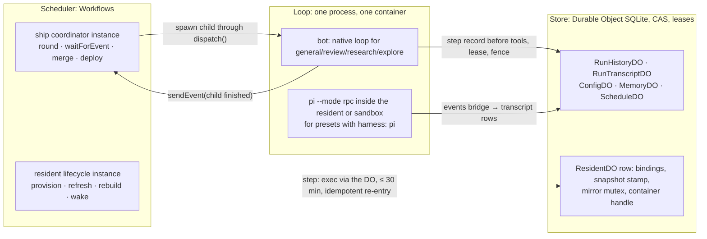

# Durable Objects are the store and never the scheduler, Cloudflare Workflows schedules the multi-step lifecycles, and the agent loop stays in a container

**The ask.** Decide: keep the run ledger on Durable Objects and never move the agent loop into a durable-execution engine; adopt Cloudflare Workflows as the scheduler for the resident lifecycle, built after the open-source flip as the next resident change; accept one order for the `agent:ship` redesign (record 0026 slice one, then spawn/await, then ship as a coordinator on Workflows) and the rule that ship's children are `dispatch()` runs even when a child runs on pi. Owner: the maintainer. Nothing here changes before the OSS baseline release (the OSS baseline release issue); the decision is needed so the four tracks that touch orchestration stop being planned independently. Written for an engineer who knows the dispatch pipeline and records 0016 and 0019 and has heard "Durable Objects are flaky for orchestration; Cloudflare says use Workflows."

Success criteria: (1) a reader can say, per Durable Object in the deployment, whether it is a store or a scheduler, and the design leaves exactly one scheduler; (2) the resident lifecycle no longer needs a watchdog to resurrect itself, and `alarm-missed` leaves its reason vocabulary; (3) the ship redesign, the pi spike and 0026 slice one each know what they wait on; (4) the OSS baseline release gate is unchanged.

## TL;DR

Two Durable Object patterns run in production: the run ledger, where an object is a transactional SQLite store with a lease and a fencing token, receipted on the durable-runs tracker across repeated kill -9s and a forced deploy, with zero state Worker errors under the eight-run burst; and the resident lifecycle, where an object plus a self-rearming alarm chain and a cron watchdog is a hand-built scheduler, behind eight incidents of one shape. The bet is that the second pattern moves to Cloudflare Workflows and the first does not: a Workflow step is retried and must be idempotent, and the agent loop's step, a model turn plus a `git push`, is neither, so the engine's default is the failure the ledger was built to prevent. The cost is a second orchestration primitive in the deployment and a port of a 6,600-line engine's cycles to steps; what it buys is the end of the alarm-chain incident class and one order for ship, pi and 0026. Decided: the split, Workflows for the resident lifecycle, the ship order, pi per child and never as the orchestrator, the ship parent as a Workflow instance. Open: two measurements at the step-to-container seam, which are the resident plan's first receipts, so nothing is built on this record before they exist.

## Today at `6a76d0e`

| Fact the design depends on | Where |
|---|---|
| Every Durable Object is SQLite-backed (`new_sqlite_classes`); no Queues, KV, D1 or Workflows binding exists in any Worker | `deploy/cloudflare-memory/wrangler.template.jsonc:39-49`, every `deploy/*/wrangler.template.jsonc` |
| The run ledger: `live_runs` with a 30 s lease and a per-generation fencing token, a write-ahead step record, a per-run transcript object; boot reclaims expired leases before the Slack socket opens; a fenced write is a hard stop; the only alarm is a six-hour retention sweep | `src/core/runLedger/types.ts:11-16`, `src/core/runLedger/resume.ts:60`, `src/core/boot.ts`, `deploy/cloudflare-memory/worker.ts:816` |
| The resident lifecycle: a 600 s self-rescheduling refresh alarm that doubles as keep-warm under a 20 min sleep window, a `*/10` cron watchdog that re-arms dead chains and stamps `alarm-missed`, every step budget chosen to fit the alarm handler's ~15-minute wall clock, and a rule that lifecycle code never arms the alarm slot because the Container SDK owns it | `deploy/cloudflare-resident/worker.ts:311,318,332,346,1227,3086`, `deploy/cloudflare-resident/wrangler.template.jsonc:119` |
| Eight incidents in the tracker, all the alarm-chain shape: a token-mint failure leaving the lifecycle stuck, a park on `alarm-missed` that never runs the refresh, a build killed by a deploy sitting degraded until the next alarm, a review on a stale mirror until the next alarm, a container replaced mid-snapshot leaving a dead chain the watchdog could not see, a restore discarded by a budget the alarm ceiling forced (twice), and a restore interrupted by a swap going `down` for good | the tracker's resident issues, by those titles |
| Ship is one `dispatch()`, one card, N serial child rounds in one process, 120 minutes by default, not resumable; after a kill the next generation tells the thread how to re-issue | `src/core/dispatch/ship.ts`, `src/core/shipPipeline.ts:66`, [ship restart plan](../plans/2026-09-08-003-feat-ship-restart-plan.md) |
| Cloudflare Workflows: state is what a step returns, at most 1 MiB per step and 1 GB per instance; a step is retried and "should (ideally) be idempotent"; an instance "may hibernate and lose all in-memory state"; a step's configurable timeout must be "30 minutes or less" (the limits page lists a step's wall clock as unlimited, so the 30 minutes is the rule this record adopts as the step budget), and longer waits are `waitForEvent` (24 h default, up to 365 days, buffered if the event arrives early); 10,000 steps per instance | developers.cloudflare.com/workflows: limits, rules of Workflows, events and parameters (read at the survey sha) |

The full survey, including how a run reattaches to its resident or sandbox after a resume, is in the appendix.

## The shape

Two questions decide where a piece of orchestration state lives. Is it a fact about a run, a repository or a configuration that must be true across processes? Then it is a row in a Durable Object, written with compare-and-swap and read by whoever asks: the **store**. Is it a sequence of steps, each minutes long, that must run to completion across process deaths, with retries and waits? Then it is a Workflow instance: the **scheduler**. The one thing that is neither is the **loop**: a model turn followed by tool calls, where a retry is a second answer and a second push. The loop runs in exactly one process at a time inside a container, the bot today and, for coding presets, pi inside the execution container once the agent harness exploration's spike passes, and the store records it step by step so that the next process can continue it, never repeat it.

The closest known shape is Temporal: activities are the units an engine retries, workflows are the code that orders them, and the thing you never put inside an activity is a non-idempotent side effect without its own ledger. The one way this differs is that our "activity" is the whole agent loop, which cannot be split into idempotent pieces, so it lives outside the engine entirely and only its lifecycle (start it, wait for it, react to its end) is a Workflow step.

## One trace

The case most likely to be wrong: a resident Worker deploy lands in the middle of a refresh cycle, the class the tracker records twice (a build killed by a deploy, a restore interrupted by a swap), under the Workflows design.

1. The refresh instance for the resident `acme/monorepo` is on its `install` step, 4 minutes into a 10-minute budget, awaiting `ResidentDO.installDeps(key)`, the engine's install step exposed as a method, through the resident Worker binding.
2. The deploy swaps the isolate. The container survives, the in-flight process handle does not: the RPC fails with the SDK's `runtime changed` error, the shape the resident Worker already classifies as `runtime-replaced` and the client re-attaches on once. Today this is where the chain dies: the swap kills the callback before the `finally` that re-arms the alarm runs, and nothing durable says a cycle was in progress; the resident sits `degraded` until the watchdog's 600 s pass, or goes `down` for good.
3. The engine marks the step failed and schedules the retry under the policy this record chooses for lifecycle steps: six attempts in total, 30 s initial delay, exponential, so the delays sum to about 15 minutes, longer than the 3 to 10 minutes a resident rollover takes to settle. Nothing in the instance's memory is trusted; the step's inputs are the event payload and the previous steps' returns (`{ lockfileKey, checkoutSha }`).
4. The retry re-enters `install`. The first thing the step does is read the checkout's state from the DO: is `node_modules` present for this lockfile key, is the mirror mutex free? That read is the idempotency check the rules of Workflows require, and it is the same `materializeDeps` plan the wake path runs today.
5. The mutex is held by the dead incarnation from step 1. Today's mirror mutex is an in-memory promise chain that an isolate swap simply drops; the port makes it a row, new work the resident plan owns. The mutex row carries the holder's **incarnation id**, the random id the DO mints each time its isolate starts, and the step's budget as an expiry; the retry, arriving 30 s later, compares the holder's incarnation with the DO's current one, sees a mismatch, and takes the mutex without waiting for the 10-minute expiry, which stays as the backstop for a holder that died without an isolate swap. The orphaned-step-process class the resident already fixed once is the reason the step kills any process still owning the tree before it installs.
6. `install` runs to completion in 6 minutes, returns `{ depsKey }`, 40 bytes. The step is durable; a second deploy now cannot make it run twice.
7. The `snapshot` step archives the checkout to R2 and writes the stamp `{ref, sha, lockfileHash}` on the DO row with compare-and-swap against the stamp it read at the start of the instance; a wake that raced it and wrote first wins, and the step returns `{ superseded: true }` instead of throwing.
8. The instance returns. It was one cycle, created by the resident Worker's existing `*/10` cron with the id `refresh_acme_monorepo_<10-minute bucket>` (instance ids may hold only letters, digits, `_` and `-`), so a second cron firing in the same bucket is refused as a duplicate id, and a resident with no live binding inside `IDLE_AFTER_S` gets an instance only at the idle cadence the row already records (six hours), which the cron reads before creating anything. The cron's call into the DO is what keeps a warm container inside its 20-minute sleep window; no alarm is armed and no watchdog re-arms anything. A cycle that fails all five retries is a failed instance the Workflows dashboard shows by name, and the next cron firing starts the next cycle from the row's last good state.
9. An attach that arrives during steps 3 to 6 reads the row as it does today: `warm` with the last good snapshot, and the thread run proceeds on that snapshot while the cycle finishes in the background.

The property: a resident deploy costs a refresh cycle one retry, never a park or a `down`, and no step's effects happen twice because every step begins by reading the row it is about to change.

## The difficulty map

1. **The step-to-container seam** (most work). A Workflow step awaiting a container command through the Container SDK, idempotent re-entry after a runtime swap, the 30-minute step cap against today's 10-minute install and 5-minute restore budgets, and who owns the mutex and the container handle. Section "The resident lifecycle on Workflows."
2. **The ship order.** Four tracks converge on ship; the risk is in the order and the dependencies, not in code. Section "Ship: four tracks, one order."
3. **pi's place.** The agent harness exploration plan (proposed, closed unmerged, tracked in the tracker) puts ship's fan-out inside pi in its Phase 4; that bypasses `dispatch()`. Section "pi runs a child, never the coordinator."
4. **The loop argument itself.** Low risk of being wrong, high risk of being re-asked. Section "Why the loop never enters the engine."

## The resident lifecycle on Workflows

The constraint is that the resident's cycles (provision: clone, install, build, snapshot; refresh: fetch, install if the lockfile moved, build, snapshot; wake: restore, materialize deps; rebuild) are already written as sequences of budgeted steps, each a command in the container, and the only thing that runs them today is a chain of alarms that must re-arm itself and a watchdog that notices when it did not. Every incident in the today table is a failure of the re-arming, not of the steps.

The design keeps `ResidentDO` as the **coordinator**: it holds the container, the thread bindings, the snapshot stamp, the mirror mutex, and it answers attach, exec, read, write and status exactly as today. What leaves it is the driving of cycles. Each cycle becomes a Workflow definition in the resident Worker (`ResidentProvision`, `ResidentRefresh`, `ResidentWake`, `ResidentRebuild`), with one instance per resident per cycle, the instance id `<cycle>_<owner>_<name>_<bucket or attempt>` in the platform's id alphabet. A step is one of today's engine steps, called on the DO through the Worker binding, and the DO's method is the idempotent unit: it reads the row, decides whether the work is already done, takes the mutex with an expiring holder, runs the command, writes the result with compare-and-swap. The step returns a reference (a key, a sha, a byte count), never a payload. A cycle is one short instance, not a loop: the resident Worker's `*/10` cron, which exists today as the watchdog's trigger, creates one refresh instance per warm resident with a deterministic id per resident and 10-minute bucket, and the instance runs its steps and returns. A perpetual instance that slept between cycles was considered and rejected by arithmetic: about five steps per cycle every 600 s reaches the 10,000-step instance cap in roughly two weeks. The keep-warm the alarm doubled as is the cron's own call into the DO, well inside the 20-minute sleep window and independent of how fast the engine wakes a hibernated instance. The other limits are far away: a paid account runs 50,000 concurrent instances and creates 100 per second per Workflow, against at most `RESIDENT_CAP` residents with one instance each every ten minutes.

Why the alarm chain cannot be made reliable by more watchdog: a Durable Object has one alarm slot, it is armed only by code that runs to completion, and nothing durable records that a sequence was supposed to continue. Every failure between two `setAlarm` calls, an isolate swap, a throw after the retries, the 15-minute ceiling, ends the chain silently, and the only remedy is a second timer that guesses. A Workflow instance is exactly that missing durable fact: the engine, not our code, records that a sequence is in progress and which step it reached.

Invariants: (a) no DO method run by a step has effects a second call with the same inputs would repeat, proven by calling every step method twice in the unit suite and asserting one command log; (b) a step never runs longer than its budget, which the DO method enforces on its own command as today (`REFRESH_INSTALL_TIMEOUT_MS`) so a step timeout and a command timeout agree, and every budget is under 30 minutes, so the 10-minute install and the 5-minute transfer budgets stand and the 15-minute alarm ceiling that squeezed them is gone; (b′) an instance runs one cycle and returns, so no instance approaches the 10,000-step cap; (c) `ctx.storage.setAlarm` is never called by lifecycle code, as today, and after the port no lifecycle timer exists at all, so the watchdog's `re-arm` branch is deleted and `alarm-missed` cannot be stamped; (d) an attach during a cycle reads the same row states it reads today.

Failure modes: a step fails five times and the instance fails; the row keeps its last good state, the next cron firing starts the next cycle, which is the recovery the watchdog performs today by other means, and the failed instance is visible by id in the Workflows dashboard and in the resident's `/status`. A container swap mid-step is one retry, as traced. A restore that outlives the step's 30 minutes is not a case that exists: the longest restore on record is 481 s (the discarded-restore incident) and the transfer budget is 300 s; a checkout that needs more is the resident disk-sizing problem in the tracker, not a scheduling one.

What it beats: keeping the alarm chain and hardening the watchdog again. Each of the eight incidents added a watchdog branch or a reason string; the mechanism that needs a watchdog is the defect. Cloudflare's own product for "steps with retries and waits across process deaths" exists and runs on the same platform as the DO it would drive.

## Why the loop never enters the engine

The loop's step is a streamed model turn of 5 to 120 seconds followed by its tool calls, among them `bash` and `git push`. Held against the Workflows contract, point by point:

- **The engine persists what a step returns; the loop's state is the transcript.** Many megabytes, with thinking blocks the provider verifies by signature and rejects if edited. It cannot fit a 1 MiB return and cannot be trimmed, so it stays in `RunTranscriptDO`, written before the tools run, exactly as record 0019 has it. The engine removes nothing from the storage design.
- **The engine retries a step and requires it to be idempotent; the loop's step is neither.** A retry is a second model call, which is a different answer, and a second `git push`. The durable-runs plan's stop condition forbids exactly that, and record 0019 keeps it as "a step whose effects are unknown at resume is reported, not re-run", which is why the write-ahead step record and the settlement rules exist (side-effect-free tools re-run, `RERUN_SAFE_TOOLS` names the idempotent writes such as `write_file` and the `submit_*` calls, and `bash` and GitHub writes get a synthetic "restarted, re-check effects" result). Under the engine those rules would still be needed, written against the engine's grain. The hard part does not move.
- **What the engine would remove** is the mortal-process protocol only: lease, heartbeat, fencing generation, reclaim at boot, handoff on SIGTERM. That is `src/core/runLedger/writeThrough.ts` and `src/core/boot.ts`, 1,072 lines, shipped and receipted.
- **What it would cost.** The loop leaves the container, so the model key, the Slack token and the GitHub App key move into a Worker, the boundary record 0016 draws. Socket Mode cannot run in a Worker, so Slack becomes the HTTP Events API, the deferred alternative of 0016. A hard stop mid-model-call loses the in-process abort, because terminating an instance does not interrupt a step's in-flight fetch. Every iteration pays the engine's scheduling latency, unmeasured, on runs of 50 to 200 iterations. A step over 30 minutes fails.
- **pi dissolves the question.** The agent harness exploration plan's Option C puts the coding loop inside the execution container, next to the repository, driven over RPC by the bot. No Worker hosts a loop, and a bot death no longer kills a coding run: the next generation re-attaches to the RPC stream, the ledger's lease shrinks to "which generation is attached," and a container death resumes from the transcript the events bridge mirrored. Record 0016 named "durable-agent frameworks" as the open door; Workflows is Cloudflare's, and it fits the lifecycles around the loop, not the loop.

## Ship: four tracks, one order

Ship today is the structure a coordinator replaces: one process holding N serial child rounds, so the parent dies with the process and its children are agent names, not profiles. Four tracks land on it and each is planned in its own record; this section only fixes their order and what each hands the next.

- **Record 0026 slice one** first. It makes every run a profile (reach, identity, budget, machine class) and names ship's budget as the ship preset's declared budget with children clipped to the remainder. Until it lands, a ship child cannot be described as a profile, and the coordinator would be written against the agent table 0026 retires.
- **Spawn/await** (the run-coordination epic, Phase 1 and 2) second. The substrate a coordinator needs: a child is a `dispatch()` run started as the requesting user with the full pipeline, depth 1, fan-out capped, `parentRunId` on its record. This keeps records 0002 and 0007 intact per child: the policy table is asked once for every child, and no registry command or sub-agent starts a run.
- **Ship as a coordinator on Workflows** third. The ship Workflow is defined in the bot's shim Worker, beside the admin routes it already fronts, and every step is a call into the bot container over the shim's loopback: `spawn` asks the bot to `dispatch()` the coding child and returns the child's run id; `waitForEvent("run finished")` waits for the event the bot sends when that run's terminal record is written; `pr-check` asks the bot to run the idempotent GitHub lookups ship already has (open PR by head branch, edit not create); then the review child, the fix child, until approve; then `waitForEvent` for the merge, which a `poll-pr` step supplies by asking the bot every ten minutes, and for the deploy. The coordinator itself holds no credential of any kind; the bot does every GitHub call and sends every event. The parent survives every bot death with no lease of its own, because a child that dies is that child's ledger problem.

Decided: the ship parent is a Workflow instance, not a `dispatch()` run. A parent has no model turn, its steps are minutes to days, and a `dispatch()` parent is ship today, which dies with the process. The parent's card and run record are written by the bot on the parent's behalf from the events it receives, the way the reclaim closes a card it did not open; if the ship plan finds that contract needs a `dispatch()` run in front of the instance, that is the one revisable clause here.
- **The deploy stage** waits on the distribution series (published images, `deploy images`, and the reusable workflow that runs `deploy images` then `deploy all`), because for a packaged installation "deploy" is no longer a checkout build.

Invariants: every ship child passes the authorize stage as the requesting user, at every spawn, so a requester who lost `agent:run:coding` during a days-long merge wait ends the pipeline with a named refusal in the thread, never a child; no coordinator step holds a model, Slack or GitHub credential; every step is safe to retry, the spawn included, because a retried spawn meets the child's `thread_key UNIQUE` claim and reads the 409 as "already spawned, wait for it".

Failure mode: the coding child is killed and resumed by the ledger while the parent waits. The bot sends `run finished` from every terminal record write, the finish after the reply, the reclaim's `interrupted` close and the admission's close alike, so a generation that died between the finishing CAS and the send is covered by the generation that closes or resumes the run; the parent dedupes by run id, and its `waitForEvent` timeout is the child's budget plus a margin, after which a `read-record` step asks the bot for the run's record instead of waiting on. A child that closed `interrupted` reaches the parent as that status, and the parent tells the thread and stops, the behaviour the ship restart plan chose.

## pi runs a child, never the coordinator

The agent harness exploration plan (proposed, closed unmerged, tracked in the tracker) has a Phase 4 that reads: "pi's sub-agent extension for `ship` (plan, implement, self-review fan-out) under the parent run's budget." A pi sub-agent is spawned by pi inside one container, with pi's own tool set and no `dispatch()` in the path; that is a run the policy table never saw and a run the ledger never claimed. It violates 0002 and 0007 and it would put the coordinator back into a mortal process. Decided: `harness: pi` is a property of a preset, so a coding child can run on pi inside its resident worktree, with our tools and the policy gate as the pi extension the harness plan already specifies; the fan-out belongs to the coordinator above. Phase 4 of the harness plan is reframed to "each ship child may run on pi", and the adoption record that plan's Phase 2 produces is where `harness` enters the preset definition. Record 0026 is not edited.

## Why not X

**Why not run the agent loop as a Workflow and delete the ledger?** The step is not idempotent and the state does not fit a step return; see "Why the loop never enters the engine." The ledger stays whichever way the loop runs.

**Why not a Durable Object per run?** Record 0016 deferred it with three decisive facts: three secrets move into a Worker, fifty transcripts share one isolate, and the alarm ceiling forces per-step re-entry anyway. Workflows is a better later end state than a DO runner for the same reasons, and this record does not choose either.

**Why not keep the alarm chain and fix the watchdog properly?** Eight incidents, each fixed with a new watchdog branch or reason string, are the evidence that the mechanism is the defect. The Container SDK also owns the alarm slot, so every lifecycle timer is already multiplexed through a shim.

**Why not put the coordinator in the bot as a `dispatch()` run with a long budget?** That is ship today, and it dies with the process. A parent with no model turn has no reason to be in the loop's process.

## Boundaries of the design

Not decided here: the sandbox tier's lifecycle (one container per thread with an idle sleep; nothing to schedule); the memory, config and schedule objects (stores, unchanged); the bot's own container lifecycle (the shim's keep-alive cron is the platform's, not a scheduler of ours); whether `general`, `review`, `research` and `explore` ever leave the native loop (they do not, in this record). Nothing here moves the OSS baseline release: the resident port and the ship coordinator are built after the flip, and 0026 slice one is already sequenced after the baseline release by that release's issue. Migration for the resident: the Workflows binding ships in the resident Worker, cycles start as instances, and the alarm chain is deleted in the same release; a resident mid-cycle at that deploy loses its chain exactly as it does in any deploy today, and the first cron firing after the deploy creates its refresh instance, whose first step reads the row and continues from the last good state.

## What would change our mind

| Assumption | Cheapest test | When |
|---|---|---|
| A Workflow step can await a DO method that runs a 10-minute container command without a platform timeout below the step's own | one instance with one `install` step against a staging resident, timed | before the resident plan's first PR |
| A resident deploy costs a cycle one retry, not a failed instance | the trace, run live: deploy the resident Worker during a refresh instance | the resident plan's receipt |
| Scheduling latency between steps is under a few seconds, which matters only on the wake path, where an attach waits on the restore inside its 5-minute transfer budget; the refresh loop tolerates minutes | the same instance, read from the Workflows dashboard | before the resident plan's first PR |
| The bot can send `child finished` exactly once per child | the finishing CAS already runs once; a unit test on the send | the ship plan |

Reversibility: the two seam tests run before the port's first PR, so a failure there costs a plan record and nothing else. After the port, the step methods are the engine's old step methods unchanged and the alarm chain is deleted in the port's release; reversing is reverting that release, one resident deploy. The ship order costs nothing to reverse before its third step; the pi reframe is one sentence in a plan that has not started.

## Rollout

Nothing before the OSS baseline release. Then: 0026 slice one (three PRs, already sequenced). After the flip: a plan record for the resident port with the two tests above as its first receipts, then the port as the next resident change; the agent harness exploration's Phase 0 and 1 in parallel. Then the run-coordination epic's Phase 1 and 2, then the ship coordinator's plan record, its deploy stage written against the distribution series' result.

## Open questions

| Question | Owner | Resolves it | Before |
|---|---|---|---|
| Does a step awaiting a long DO RPC hit any limit below 30 minutes, and what does the step see when the isolate swaps mid-RPC? | maintainer | the staging instance test, run twice: once quiet, once with a resident deploy mid-step | the resident plan's first PR |

## Validation criteria

| Criterion | Proof |
|---|---|
| No lifecycle code arms an alarm; the resident Worker has no `alarm-missed` reason | `[gap]` the resident plan: a grep test beside `deploy/cloudflare-resident/preflight.test.mjs` |
| Every step method is idempotent: called twice with the same inputs, one command log | `[gap]` the resident plan: `deploy/cloudflare-resident/*.test.ts` |
| A resident Worker deploy during a refresh instance ends in a completed instance, one retry | `[gap]` human-gated, the resident plan's live receipt |
| Every ship child passes the authorize stage as the requesting user | `[gap]` the ship plan: `src/core/dispatch/authorize.test.ts` |
| The native loop's ledger behaviour is unchanged by this record | `src/core/runLedger/writeThrough.test.ts`, `src/core/boot.test.ts` (existing) |

## Sources

- [0002](0002-dispatcher-is-the-only-orchestrator.md), [0007](0007-authorization-policy-table.md), [0016](0016-long-lived-process-not-serverless.md), [0019](0019-durable-run-ledger-resume-after-kill.md), [0026](0026-capability-profiles-and-request-routing.md).
- The [durable-runs plan](../plans/2026-09-08-001-feat-durable-runs-plan.md) (D1, the DO runner deferred), the [ship restart plan](../plans/2026-09-08-003-feat-ship-restart-plan.md), the agent harness exploration plan (proposed, closed unmerged; its tracking issue carries the reframe this record makes).
- In the tracker: the parity tracker's gap analysis that produced record 0026, the run-coordination epic, the OSS baseline release issue, and the resident lifecycle incidents named in the today table.
- Cloudflare Workflows: limits, rules of Workflows, events and parameters; Durable Objects: alarms (all read at the survey sha).
- Temporal's activity and workflow split, as the borrowed shape.

## Appendix: the survey

| Fact | Where |
|---|---|
| The four Workers: memory (state), bot, resident, sandbox; the docs site is not a Worker of an installation | `src/deploy/profile.ts` `WORKER_KINDS`, record [0023](0023-one-production-target.md) |
| No Worker was ever named "operator"; the word is the bot→resident bearer scope, a retired authorization role, and the person at the deploy CLI | `deploy/secrets.manifest.json` `RESIDENT_OPERATOR_TOKEN`, record 0009, `AGENTS.md` |
| `MemoryDO` is one SQLite database per scope key with an FTS5 candidate table; retrieval runs before the model turn, reflection after the reply, both authorization-gated; pending reflections at SIGTERM become `run_jobs` | `deploy/cloudflare-memory/worker.ts:187-243`, `src/core/memory/` |
| A resumed run re-sends the system prompt stored at claim, verbatim; memory is not re-retrieved because the cached prefix and thinking blocks are bound to that text. The tool list is recomposed live from the static toolset plus MCP discovery; the stored `tools` column has no reader yet | `src/core/dispatch/provision.ts:731`, `src/core/dispatch/run.ts:186`, durable-runs plan D3 |
| Resident attach is idempotent per thread key with the credential re-minted; a resident Worker redeploy invalidates process handles and the client re-attaches once, never blind-retrying `/exec` | `src/execution/resident.ts`, `deploy/cloudflare-resident/worker.ts` (`attachThread`) |
| A sandbox is one container per thread key with an idle sleep; after a long gap `/workspace` is empty, which is why settlement never re-issues a command | `deploy/cloudflare-sandbox/worker.ts:58-71,257-260`, `src/core/runLedger/resume.ts:60` |
| Two provider adapters behind one seam; OpenRouter is a `providers:` entry on the OpenAI-compatible adapter, zero code | `src/providers/registry.ts`, `src/providers/openaiCompat.ts:33-41`, the agent harness exploration's Phase 0 |
| The mortal-process protocol the engine would replace | `src/core/runLedger/writeThrough.ts` (720 lines), `src/core/boot.ts` (352 lines) |
