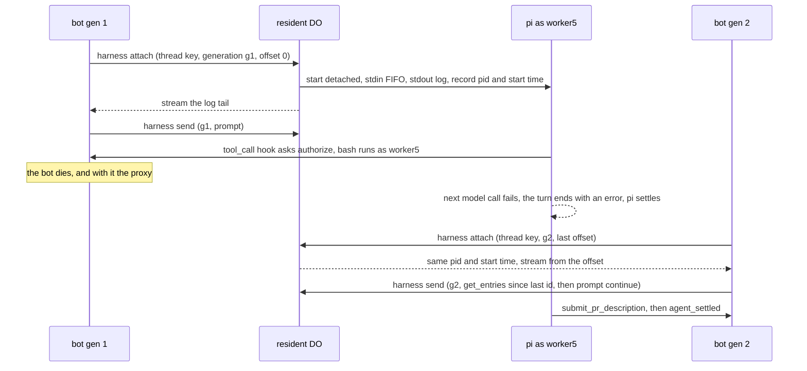

# pi is the harness for every preset, and the native turn loop retires in a replacement series that never leaves two harnesses in steady state

**The ask.** Decide: `@earendil-works/pi-coding-agent`, pinned at 0.85.1, is the one harness every preset runs on; the native turn loop, both provider adapters and the model-facing half of the executor are deleted; and the deletion happens as a replacement series of five pull requests, each landing one pi piece and removing its native counterpart in the same change, each gated by that preset's live receipt, so no release carries two harnesses and no week is without a fallback. Owner: the maintainer; decided 2026-09-13 ("if we are already convinced about pi let's just collapse now and remove the native code"); the one pushback he accepted is the series in place of a single cutover. This record fixes the shape, the order and the gates; it does not reopen the harness question. Written for a veteran engineer new to Switchboard who has read records 0002, 0007, 0016, 0019, 0026 and 0029 and the two investigation receipts on the tracker.

Success criteria: (1) at no release do two loops serve the same preset; (2) no execution container ever holds a model key, before or after; (3) a pi run's record replays on the run page in the shape of a native run and is complete without pi's session file; (4) every tool call a pi run makes is decided by the policy table as the requesting user; (5) a bot death mid-run costs a coding run at most one failed model call and never a tool's effects; (6) per-task cost and wall time at or better than the measured pi arm.

## TL;DR

On five identical coding tasks, same model, same afternoon, pi cost $2.56 and 327 s against the native loop's $3.71 and 774 s, ten pull-request-shaped outcomes out of ten; the gap is cache reads and turns (51 against 69), some of it prompt tuning could close, so the numbers rule out that pi costs more rather than prove it 31 % cheaper. The bet rests on what the native loop lacks and pi has (sessions, compaction, a process that outlives the bot) and on deleting code we alone maintain: 2,339 lines whole and the model-facing half of 1,132 more, out of 85,214. Keeping both harnesses is worth less than deleting one, because two prompt surfaces means every rule landing twice. What was measured is pi on an operator's machine with a direct key, not this design; the proxy hop, the per-call authorize round trip and the detached process in a resident are measured by steps 1 and 2 before anything native is deleted. The cost is three unbuilt pieces (a per-run credential proxy, a detached-process attach route, an events bridge with generated tool schemas), about 434 MB on each of three images, and a one-way door after the fifth step. Decided: pi for every preset, per child and never as ship's orchestrator, in the order proxy, coding, review and explore, ship (nothing moves), then general, research and conductor. Open: how repository skills reach pi, whether pi's own `AGENTS.md` reading duplicates the contract we inject, and the map from five effort tiers onto seven thinking levels.

## Today at `f3c740d4`

Only the facts the design turns on; the fuller survey is the appendix.

| Fact the design depends on | Where |
|---|---|
| The native loop is 3,471 lines in nine files (`src/runner.ts` 937; `src/providers/` 694; `src/execution/executor.ts`, `resident.ts`, `cloudflareSandbox.ts` 1,132; `src/tools/workspace.ts` 708) of 85,214 non-test `.ts` lines under `src/`. Every preset reaches it through `runAgent`, from three call sites: the run stage, the description turn (the coding definition clipped to 8 turns / 5 min) and the head-move re-review; the in-process ship round loop's two children were call sites until the plan runner became ship's one implementation | `src/core/dispatch/runLoop.ts:463`, `src/core/descriptionTurn.ts:40-41,164`, `src/core/reviewRound.ts:488` |
| The resident runs an agent command as one `/exec`: privilege-dropped to the thread's OS user (`worker2` to `worker17`; `worker1` builds), 5 min by default, 20 min at most, output collected at the end; no route holds a stream open across calls. A resident Worker deploy swaps the isolate (the container survives), invalidates the SDK's process handle (`runtime-replaced`) and re-mints the DO's incarnation id; the collect phase is never retried. Nothing kills a detached process: the sweep removes an idle worktree and recycles its user without a kill, and `kill -9 -1` runs only on a forced detach with an op in flight | `deploy/cloudflare-resident/worker.ts:414-439,464,546-560,1521-1532,1680-1725,5087-5160,5453-5507`, `src/execution/residentDetach.ts:30-38`, `docs/reference/specs/resident-repos.md:30`, `src/execution/bashTimeout.ts:7,15` |
| The bot alone holds the model key and calls the provider itself (the review abridge's `meat` binary runs on the bot host with the same key); there is no proxy, no run-scoped credential, no per-run meter beyond the `model.turn` span's token attrs; `maxTokens` is a per-call output cap, `maxTurns` is the runaway guard derived from the wall clock (six turns a minute over `maxMinutes`) and ends a run pacing like a loop with a tool-less write-up that says so; the costs page's LLM line is the Anthropic Admin cost report by workspace | `src/runner.ts:251-313,612-620,738-750`, `src/core/meatProcess.ts:85`, `src/core/costs.ts:21-22` |
| The policy table has no tool-level row; what bounds a coding run's push is the repo-scoped token attach writes into the worktree, and the authorization spec carries the tool-level gate as a `[gap]`; the `agent` actor kind and `onBehalfOf` exist and effective grants intersect | `src/core/authz/policy.ts:83-88`, `src/core/authz/types.ts:12,47`, `src/execution/residentCredentials.ts:8`, `deploy/cloudflare-resident/worker.ts:4461`, `docs/reference/specs/authorization.md` item 1 and the roadmap row "Agent actors gate tool-level actions" |
| The pi investigation: 34 sourced facts on the RPC protocol, extensions, key resolution, sessions and security; an event map with seven kinds that have no home on the run stream; the driver that ran the measurement, on the operator's machine in a warm checkout, never in a container; pi is MIT, its start was inside the dry run's 2 s wall | the spike receipt and the comparison comment on the tracker; `src/load/piRpc.ts:67` (`PI_EVENT_HOME`), `piProcess.ts`, `piExtension.ts`, `piTasks.ts`, `piPolicyPreview.ts`, `scripts/load.ts` |
| The execution images measured 3.28 GB / 924 MB (sandbox) and 2.65 GB / 718 MB (resident), unpacked / compressed, in the pull request that grew them (merged 2026-09-12); both copy in Node 24.21.0, above pi's `>= 22.19.0` floor; both containers are 4 vCPU / 12 GiB / 20 GB, the resident hosts up to 16 thread users under a 1,536 MB heap cap each. The bot redeploys on every release: three on 2026-09-12 alone (v1.204.0 to v1.206.0) | the validation table of the pull request that grew the images, `deploy/cloudflare-sandbox/Dockerfile:13`, `deploy/cloudflare-resident/Dockerfile:12,43`, both `wrangler.template.jsonc`, `gh release list` |
| Ship has one implementation, the plan runner: every `agent:ship` request hands to it and its children are `dispatch()` runs; the in-process round loop is deleted and `ship.coordinator` is no longer a key; the plan's decision that pi runs a child and its harness-seam unit word the adoption as a `harness: native \| pi` preset property | `src/core/coordinator/contract.ts`, `src/core/dispatch/ship.ts`, `docs/reference/specs/agent-ship.md` item 16, the program plan (the decision that pi runs a child, the harness-seam unit, the round-loop retirement unit) |

## The shape

pi is to Switchboard what a language server is to an editor. The server is a separate process started beside the files, driven over a line protocol on stdio, and it owns the expensive loop (parse and analyse there; the model turn and its tool calls here); the editor keeps everything the user sees and every rule about what is allowed, and it can restart, reattach or replace the server without the document changing. Here the **harness** is pi in `--mode rpc` inside the execution container, one process per run, with pi's own `read`, `bash`, `edit`, `write`, `grep`, `find` and `ls` as the coding tools and our **extension**, a root-owned package installed in the image outside every worktree, adding our terminal tools, a `tool_call` hook and the provider headers. The bot keeps the dispatcher, the policy table, the run ledger, the record, tracing, the Slack card and the run page, and drives pi through the **bridge**, a bot-side client that sends `prompt`, `steer` and `abort`, maps every pi event to a `RunEvent` or a span, mirrors every session entry into the ledger transcript, and supplies what pi lacks: the wrap-up steer three minutes before the deadline, the turn cap as a steer to write up with tools blocked, the soft stop as a steer then an abort after a grace, the hard stop and the wall clock as `abort`. The one way this differs from the editor shape is that the process runs in a container the bot does not host: the model credential therefore goes through the **proxy**, a route on the bot that validates a **run bearer** minted for this run and forwards to the real provider with the real key, and the stdio stream goes through an **attach route** on the resident and sandbox Workers, so a bot that dies and comes back can find the same process.

## One trace

The case most likely to be wrong: a coding child of the plan runner on the switchboard resident, with the bot dying while a command runs.

1. The run stage claims the run in the ledger as generation g1 and attaches the resident worktree as today (`/attach`: thread user `worker5`, worktree under `/workspace/threads/`, head sha). It mints the run bearer, bound to the run id, expiring at the 45-minute budget plus 5 minutes, and calls the attach route's `attach` operation with the thread key, g1, offset 0, the bearer and the profile's model.
2. The resident DO finds no process for the thread and starts one through the exec path's `su`: a wrapper from the image opens the FIFO `/home/worker5/.pi/rpc.in` for writing on a spare descriptor, then execs `setsid -f pi --mode rpc --no-extensions -e /opt/switchboard/pi-tools/index.ts` with stdin the FIFO and stdout appended to `/home/worker5/.pi/rpc.log`; pi inherits the write end, so the FIFO never runs out of writers while pi lives. `PI_CODING_AGENT_DIR=/home/worker5/.pi` holds a `models.json` the DO wrote from the profile (one provider, `api: anthropic-messages`, `baseUrl` the proxy, `apiKey: "$SWITCHBOARD_RUN_BEARER"`); the environment is the exec path's plus the bearer and the proxy URL, no model key, Slack token or GitHub App key. The DO records the pid and its start time from `/proc/<pid>/stat`, marks g1 attached, and streams the log as the response body (a file read from the offset every 500 ms, heartbeat-framed like `/exec`).
3. The bridge sends `prompt` with the first turn the dispatcher composes today, one `send`: a seconds-long command as `worker5` writing one line to the FIFO; the extension's `before_agent_start` hook sets the composed system prompt. The bridge writes `harness: { pid, startTime, logOffset, lastEntryId }` on the run's ledger row under g1's fence.
4. pi calls the model through the proxy. The proxy validates the bearer (this run, unexpired, unrevoked), pins the preset's model and `max_tokens`, forwards with the bot's key, and closes one `model.turn` span with `inputTokens`, `outputTokens`, `cacheReadTokens` and `cacheWriteTokens` read from the streamed response, the attrs the runner sets today.
5. The model calls `bash("npm test -- src/core/redact.test.ts")`. The extension's `tool_call` hook fires before execution and asks the bot, `POST /harness/authorize` with the bearer, the tool name and its input; the bot evaluates the table for the agent actor on behalf of the requester and answers `allow`. pi runs the command as `worker5`. `tool_execution_start` and `tool_execution_end` become `tool_call` and `tool_result` under a `tool.bash` span; the bridge mirrors the new session entries verbatim and advances `lastEntryId`.
6. A deploy kills the bot while the tests run. The command finishes in the container (58 s) and pi writes the tool result into its session; pi's next model call reaches no proxy, and with auto-retry disabled by the bridge at start the turn ends with `stopReason: error` and `agent_settled` follows, since no retry, compaction or queued message remains. pi sits idle with its session intact; the lease expires after 30 s. Had the death landed on a `tool_call`, the hook would have retried the authorize call against the shim for up to 90 s (three lease lengths) before blocking, so a short roll costs the tool nothing.
7. Generation g2 boots, reclaims the row, reads the harness facts and calls `attach` with g2 and the offset. The DO matches the pid's start time, marks g2 attached (a late `send` from g1 is refused) and streams from the offset. The bridge sends `get_entries` since `lastEntryId`, mirrors the tool result and the errored assistant entry it never saw, and sends `prompt` ("continue"), which runs at once on an idle session where `follow_up` would only enqueue. No command is re-issued and nothing is settled: the test result survived in pi's session, where today the same death loses the command and settles its step as "restarted, re-check effects".
8. The model calls `submit_pr_description`, the extension tool whose schema is generated from the bot's definition; the extension writes the object as a `custom` session entry, the bridge validates it with `parsePrDescription` and records `pr_description`. pi emits `agent_settled`; the bridge finishes the run through `RunEnding`, the post-step observes the workspace over the bot's own `/exec` as today, opens the pull request and revokes the bearer, and the run's release calls the route's `stop`, which kills the verified pid as `worker5` before `/detach` returns the user to the pool.

The property: a bot death costs the run one failed model call and one extra prompt, and never a tool's effects, because the work happened in a process the bot does not host. The container-roll variant: the process dies with the container, the mirrored entries (stored as pi wrote them, so the write-back is a concatenation, not a reconstruction) are written to a session file on the new container, pi restarts with `--session <path>`, and the one in-flight turn is lost, its last `bash` settled as "restarted, re-check effects" by the rule the ledger already has.

## The difficulty map

1. **The detached process and the re-attach** across bot deaths and container rolls, inside an exec model that offers one capped command and no stream (most work, together with the rest of step 2). Section "The detached process and the re-attach".
2. **The proxy and the run bearer**, and the meter the run page and the costs page read from it. Section "The proxy, the run bearer and the meter".
3. **Record completeness**: seven pi event kinds with no home, and compaction changing what the record mirrors. Section "The record under pi".
4. **The gate as an in-container hook** that asks the bot. Section "The gate is a hook that asks the bot".
5. **Generated tool schemas**: one definition, two renderings. Section "Generated tool schemas".
6. **Presets without a workspace** on a pi with no built-in tools. Section "Presets without a workspace".

## The detached process and the re-attach

The constraint is the resident's exec model. A pi process reads stdin until EOF and writes one JSON object per line until then; the resident's only way to run something as the thread's user is `/exec`, one command under `su`, collected at the end, 20 minutes at most. Two events end a command's life today and the design treats them apart: a resident Worker deploy swaps the DO's isolate, the container and its processes survive (the resident spec's "deploy while warm"; the spike receipt read a deploy as a roll, and this record follows the spec), but the SDK's process handle dies (`runtime-replaced`), the DO's incarnation id is re-minted, and the collect phase is never retried; a container replacement (a refresh, a rebuild, disk pressure) kills every process. No route holds a stream open across calls, and nothing today kills a process that outlived its command. The sandbox Worker has the same shape and already tells agents to `setsid -f` any job past the ceiling. A coding run is 45 minutes of a process that must outlive the bot and any one request, and must die when its run does.

The design separates the process's life from any request's life, and ties it to the run's. The attach route (`POST /harness/{attach,send,stop}` on both Workers) is three operations built from primitives the DO already has. `attach` is idempotent per thread key like `/attach`: it starts pi once, through the wrapper in the trace, then streams the log from the offset the caller names, reading the file every 500 ms with the `/read` primitive into a heartbeat-framed response; the response is bounded like every streamed route and the bridge re-opens it from its offset, as the run page's SSE reader does. `send` writes one line to the FIFO by a seconds-long command as the thread's user; if its collect phase is lost to a swap, the bridge looks in the log for pi's `response` carrying the command's `id` before resending. `stop` kills the verified pid as the thread's user. The process is identified by pid and start time from `/proc/<pid>/stat`, recorded at spawn and checked on every operation, so a recycled pid never matches and an isolate swap costs nothing but re-opening the file. The DO records which generation attached last and refuses a `send` from any other, the way the ledger fences a zombie's writes. Every operation stamps the thread's activity, so the hour-long clean-idle sweep never evicts a worktree under a live pi, and every path that ends a run or releases a worktree (the run's release, a hard stop, `/detach`, the sweep) calls `stop` first, so no user returns to the pool with a live process. The bridge writes four facts on the run's ledger row under the fenced generation write: pid, start time, the log offset consumed, and the id of the last session entry mirrored. That is the whole re-attach state; the next generation reads it, re-opens the stream, and asks pi for `get_entries` since the last id, pi's own catch-up over its session tree.

Why this and not a Unix socket: a socket needs a server inside the container to accept a second client after the first vanishes, a daemon we would write; a file and a FIFO need only the kernel. Why not the SDK's process handle the DO collects from today: it dies at the isolate swap a deploy produces. Why not run pi in the bot container with pi's tools executing remotely through our executor (pi's built-in tools take pluggable operations, and the spike receipt floated that for the review child): it puts the loop back in the process whose death this design is about, so a bot death kills the run again and criterion (5) is lost; it also rebuilds the executor seam this series deletes. It stays as the named fallback if the detached design fails its proof.

Invariants: (a) one pi process per thread key at a time, keyed by pid and start time on the DO's row; (b) the bridge writes `harness` facts only under its generation's fence, and `send` is accepted only from the attached generation; (c) the extension is root-owned under `/opt/switchboard`, `--no-extensions` disables discovery while `-e` still loads it, so a `.pi/extensions/` directory committed in the checkout never loads; (d) the pi process's environment is constructed by the route and carries the bearer, the proxy URL and the exec path's defaults, never a model key, a Slack token or a GitHub App credential, and the worktree's repo-scoped token is the only credential a `bash` command can reach, as today; (e) pi's session directory is a cache under the thread user's home, not on the snapshotted checkout disk, and the mirrored transcript is the record; (f) no thread user returns to the pool with a live pi.

Failure modes: the bot is gone past the container's 20-minute sleep window with no other request; the container sleeps, the process dies, and the next generation finds no matching process and takes the container-roll path. pi exits on its own (a crash, an `extension_error` it cannot recover from); the log ends, `attach` reports the exit, and the run fails with pi's last lines as the diagnostic, never a frozen card. The numbers this section lacks: pi's resident set per process (one Node 24 process per concurrent thread, up to 16 on a 12 GiB resident, each under the image's 1,536 MB heap cap), its start time in the container (inside 2 s on the operator's machine), and the hook's round trip; all three are measured by the proof this section's gate names.

## The proxy, the run bearer and the meter

The constraint is record 0016's credential boundary: no Worker and no execution container holds a model key; the bot process does. pi resolves its key from a flag, `auth.json`, an environment variable or `models.json`, and calls the provider itself. So pi must believe it holds a key while holding a token the bot minted for this run alone.

The proxy is two routes on the bot's HTTP server, `/v1/messages` (Anthropic-shaped, so effort, adaptive thinking and prompt caching pass through untouched) and `/v1/chat/completions` (OpenAI-shaped, for the compatible providers), reached through the shim Worker the way `/ingress` is, since the shim forwards every path it does not answer itself and `/ingress` already sits outside the Access application. A request carries the run bearer as the provider key. The proxy validates the bearer (minted for this run, inside its expiry of budget plus 5 minutes, not revoked by `RunEnding`), ignores the request's `model` and sends the preset's, pins `max_tokens` to the profile's `maxTokens` (a per-call output cap, as today), refuses a call past the profile's `maxTurns` — the runaway guard derived from the wall clock, not a budget a working run reaches (recorded as `turn_budget_exhausted`; the bridge, which counts `turn_end`, has already steered the write-up at the last turn with tools blocked, so the tool-less write-up the native loop gives stays), streams the provider's response back, and closes one `model.turn` span per call carrying the token attrs the runner sets today. That last clause is what keeps the run page, the friction analyzer and the costs page on one vocabulary: nothing downstream learns that the turn happened in another process. pi's own `usage.cost` is a catalog estimate and never what a page shows; the proxy's meter is. The bearer is never logged, never on a command line, never in a file inside the checkout; it enters the container in the process environment, which means any command the model runs can read it and spend through the proxy, bounded by the same turn guard (`maxTurns`) and `max_tokens` the model is bounded by, and revoked with the run.

Invariants: a bearer authorizes exactly one run's calls; a call after the run's ending or past `maxTurns` is refused; the model and `max_tokens` on the wire are the profile's; every proxied call is one `model.turn` span with the runner's attrs. Failure modes: the bot is dead and pi's call fails; auto-retry is off, so the turn ends with `stopReason: error` and the re-attached generation continues the session with `prompt`, the trace's step 7. The alternative it beat: handing the key to the container under pi's offline switches. pi's own security posture says whole-pi-in-container puts the provider key in the container, and record 0016 forbids exactly that.

## The record under pi

The constraint is that Switchboard's record is the run's source of truth: the run page, the friction analyzer, the ledger's resume and the receipts read the `RunEvent` stream and the transcript, and pi's session file is a cache the container may lose. The spike receipt's event map places every documented pi event on the stream or marks it homeless, and seven kinds are homeless: `tool_execution_update`, `bash_execution_update`, the `compaction_*` pair, the `auto_retry_*` pair, `summarization_retry_*`, `extension_error`, and the dialog form of `extension_ui_request`.

Each gets one of three dispositions. Two new `run_note` kinds carry four of them: `compacted` (`tokensBefore`, `tokensAfter`, the summary entry's id, and the retry count folded in from `summarization_retry_*`) and `harness_error` (an `extension_error`, which is our code failing and therefore a run fact; and a dialog request, which only pi's own code could raise since our extension asks nothing, answered `cancelled` and recorded here). One is folded: `tool_execution_update` carries partial output, and the stream records results at the end, capped at `TOOL_OUTPUT_CAP` (8,000) as today. Two are made impossible by the bridge: `bash_execution_update` is the operator's RPC `bash`, never sent; `auto_retry_*` is disabled at start. A third new kind, `tool_refused`, comes from the gate, not from pi's list.

Compaction is allowed, and this is the one place the record's meaning changes. Today the transcript is what the model saw; under pi, after a compaction the model sees a summary and the transcript keeps the original entries plus the `compaction` entry pi writes (its session format has the kind), so the record is a superset of the model's context and the model's view at any turn is derivable from it. A container-roll resume writes the session back from the mirrored entries and pi rebuilds its context from the file exactly as after its own restart, which is why the mirror carries every entry kind verbatim, not only messages.

Invariants: every documented pi event has a home or a decided disposition (a unit test holds the table); no event is dropped without a note; a pi run's record replays on the run page with the shape of a native run; the transcript is complete without the session file. Failure mode: a pi version bump adds an event kind; the bridge records it as `harness_error` with the kind's name, so the bump is visible in the first run's record and the table is extended before the pin moves. The alternative it beat: forbidding compaction so the transcript stays equal to the model's context. It throws away one of the two properties pi was adopted for, and record 0019 already accepted that a resume is a valid continuation, not a byte-identical replay.

## The gate is a hook that asks the bot

The constraint is records 0002 and 0007: every run starts in `dispatch()` and every permission is a row in one table. Today nothing decides a coding run's tool calls; what bounds its push is the repo-scoped token attach writes into the worktree, and the authorization spec carries the tool-level gate as a `[gap]`. pi's built-in `bash` runs inside the container with the same bound and no more, so adopting pi does not create the need for tool-level rows; it makes the gap the only place a tool decision can live.

The design: the extension's `tool_call` hook, which fires after `tool_execution_start` and before execution and can block with a reason the model reads, asks the bot on every call, `POST /harness/authorize` with the run bearer, the tool name and its input. The bot resolves the agent actor on behalf of the requester (item 1 of the authorization spec; effective grants are the intersection) and evaluates the table. The table gains its first tool-level rows in step 2's pull request: the push target as `authorize(agent, "repo:use", repo)`, as the spec's gap row words it, and the shell and write tools as rows on the run resource whose action names the plan fixes. A refusal is a `run_note tool_refused` and the model sees the reason. The hook carries no copy of the rules and caches nothing, so a requester who loses a grant mid-run is refused on the next call, the property the coordinator's spawn already has per child. The cost is one bot round trip per tool call carrying a few hundred bytes, against the command's whole output today; its latency is one of the numbers step 2's proof reports.

Invariants: a hook that cannot reach the bot within 90 s blocks the tool (pi's fail-safe: a throwing handler blocks); the decision is computed in the bot from the table, never in the container; the extension file is not writable by the thread user. Failure modes: the bot is dead longer than the wait, so the tool is refused with "authorization unavailable" and the model retries after the re-attach; the extension is replaced in the container, which the image test for the read-only path and `--no-extensions` exist to prevent, and whose blast radius is the worktree's repo-scoped token, the same as today's `bash`. The alternative it beat: a grant set handed over the stream at start. No round trip, but a copy of the rules in the container and a grant that outlives its revocation for the run's length.

## Generated tool schemas

Record 0008 says a definition exists once. The extension registers `submit_pr_description`, `submit_handoff`, `submit_dispositions`, `submit_verdict`, `update_status`, `diff_digest` and the relay tools with plain JSON Schema, which pi validates without TypeBox (proven in the spike). Today those schemas live in `src/tools/workspace.ts` as the native tool table, and the spike's driver's extension is a hand copy that says so. The tool definitions become the one source: a `gen` step renders the extension's schema file from them and a `check` step fails `verify` when the rendering drifts, the shape the docs tables already use; at step 5 the native rendering is deleted and the definitions have one reader.

## Presets without a workspace

`general`, `research` and `conductor` provision no machine (`machine: none`): their tools run in the bot process and there is no container to host pi. For these presets pi runs as a child process of the bot container, with `--no-builtin-tools` and the extension supplying `web_fetch`, `web_search`, the GitHub reads and issue writes, and the conductor's five run tools (`spawn_run`, `await_runs`, `send_to_run`, `list_runs`, `get_run_status`) as relays to bot routes over loopback with the run bearer, executed in the bot with the bot's credentials and the policy table. No attach route is needed, the proxy is loopback so the meter stays one, and the bridge is the same code. The dispatcher remains the only place a run starts: the conductor's spawn relay calls `dispatch()` exactly as its in-process tool does today. MCP-bridged tools take the same relay shape at this step, since pi has no MCP client. A bot death takes pi with it for these presets, today's behaviour, and the ledger's resume applies unchanged.

## Why not X

**Why not keep both harnesses behind `harness: native | pi` on the preset?** Two prompt surfaces to keep in agreement, every budget, cap and record rule landing twice, and a native path that serves fewer requests each release while every reviewer must still read it. The owner rejected it on those terms; the series gives the same fallback per step without the steady state.

**Why not tune the native loop's prompt and tools until it matches pi's numbers?** It might, and the measurement cannot say how much of the gap is prompt size. At parity the native loop still has no sessions, no compaction and no process that outlives the bot, and the code stays ours; the measurement's job was to rule out that pi costs more, and it did.

**Why not adopt `@earendil-works/pi-ai` as the provider layer and keep our loop?** Fifteen providers for the price of one adapter, and none of sessions, compaction or survival; the measured gap is in turns and cache reads, which are the loop's, not the adapter's.

**Why not write our own compaction and sessions?** The native loop has neither and the ledger's transcript is not a session tree; building both is the harness's whole surface again, against a harness that already has them and measured cheaper.

**Why not one cutover?** Three pieces are unproven at this sha (the detached re-attach, the proxy's overhead, the record's completeness); a single release that removes the native loop before they are proven has no fallback for the week it is wrong. Each step keeps the previous step's native path until its own receipt is posted.

## Boundaries

What stays, unchanged: the dispatcher and its stages; the policy table (it gains rows, not a second evaluator); the run ledger (lease, fence, reclaim, the write-ahead step record, 1,945 non-test lines that now also carry the four harness facts); the record and tracing vocabulary; the Slack card and the run page; the GitHub credentials and their minting; the residents and sandboxes and their lifecycles; the coordinator and the plan runner; memory (retrieval in provision before the turn, reflection after); the review abridge's `meat` process, which already holds the bot's key on the bot host; the bot's own post-step commands over `/exec` (workspace observation, the reading diff, the verification guard), which are the bot's, not the agent's. pi applies per child, never as ship's orchestrator: pi's sub-agents are an example extension spawning ungated child processes, the shape record 0029 forbids. There is no `harness` field on a preset, because there is one harness; the program plan's decision that pi runs a child and its harness-seam unit, which word the adoption as `harness: native | pi`, are superseded by this record, and the harness-seam unit's scope is steps 2 and 3. Reflection's one `provider.complete` call moves at step 5 to pi-ai as a library in the bot process; the description turn and the head-move re-review become a `prompt` on the run's own pi session in the step their preset moves. The follow-ups the owner accepted the same day (the conductor's cap and hand-off to the plan runner, cost roll-up per plan and unit, unit threads on a configurable channel) belong to other units; the one that touches the harness, children reporting facts as they go, is one more generated extension tool at step 2. Compatibility: the `agent:` directives, the presets, the run page and every spec row about behaviour hold; `run-loop.md` retires with its code at step 5, and `agent-coding.md`, `execution.md`, `costs.md`, `authorization.md`, `run-visibility.md`, `tracing.md` and `http-ingress.md` change in the step that changes their code.

## What would change our mind

| Assumption | Cheapest evidence | When |
|---|---|---|
| A detached pi survives a bot restart and a resident Worker deploy, and a later command as the same user can read its log and write its FIFO; its resident set fits sixteen to a resident | on a staging resident: the wrapper with a JSONL echo loop in pi's place through `/exec`; read and write it 25 minutes later; repeat across a resident deploy and a bot restart; read the process's RSS and start time | before step 2's first pull request; the step's gate |
| pi's homeless events can all be given a disposition without forking pi | the bridge's mapping test over the spike receipt's list, then one live coding run whose record replays on the run page | inside step 2 |
| The proxy's per-call overhead does not erase the wall gain | the five spike tasks re-run through the proxy with a minted bearer; the proxy's span median under 2 s per call (51 calls against a 447 s gain) | step 1's receipt |
| pi's RPC protocol and extension API are stable enough to pin: 0.85.1 is twelve minors past the deprecated scope's last release, its cadence unrecorded here | the driver's dry run against the scripted provider on every bump, the `imagePins` check on the version; two consecutive breaking bumps freeze the pin, and pi is MIT, so a fork is the floor | every bump |

If the first assumption fails on the resident within its exec model, the fallback is named above: pi in the bot container with remote operations through the executor for coding, at the cost of criterion (5). If the second fails, pi is not the harness and this record is superseded before step 2 ships. Reversibility: each step is one pull request that deletes its counterpart, and reverting it restores that step's native path until the next step lands on top; after step 5 there is no native path and reversal is a fork of the last native release. That door is one-way by the owner's choice.

## Rollout

Five pull requests, in order, each gated by a live receipt on the tracker before the next starts. (1) The proxy and the run bearer on the bot, with the meter: no behaviour changes; the receipt is the spike's driver run through the proxy with equal tokens and the overhead measured. (2) pi 0.85.1 pinned in both execution images under the `imagePins` check, the extension package with generated schemas, the bridge, the attach route on both Workers with `stop` wired into release, detach and the sweep, the two record kinds and `tool_refused`, the tool-level rows; the coding preset moves, and with it the description turn as a `prompt` on the same session; deleted in the same change: the run stage's native coding path, the `full` toolset (ship's definition drops its vestigial `toolset: full`), the native `write_file`, `submit_pr_description`, `submit_handoff` and `submit_dispositions`, and the coding executor exec path; the gate is the detached re-attach proof above plus five coding tasks on the switchboard resident with a bot kill and a resident roll mid-run, records complete, pull requests opened. (3) Review and explore move, and with them the head-move re-review and the round loop's review child; deleted: the native `bash`, `read_file`, `diff_digest`, `submit_verdict`, the `readonly` and `explore` toolsets, and the sandbox executor's tool transport; the gate is a review on a real pull request and a 30-minute explore run on a cold sandbox. (4) Ship: nothing moves; the plan runner's children are presets already on pi, and the round loop is already gone. (5) General, research and conductor move onto pi in the bot container, whose image grows by the same 434 MB; deleted: `src/runner.ts`, `src/providers/` and `src/tools/workspace.ts`, with pi-ai as the library behind reflection (OpenRouter comes with it); `run-loop.md` retires; the gate is `ask` on general and research in production and a conductor run with two children. The execution plan for the series is a separate record.

## Open questions

| Question | Owner | Resolves it | Before |
|---|---|---|---|
| How do a repository's skills (`skills/<name>/SKILL.md`, read by our `use_skill` tool) reach pi: through pi's own skill discovery, or as a relay tool? | maintainer | step 2's first live coding run on a repository with skills | step 2's gate |
| pi reads the repository's `AGENTS.md` into its context on its own; does that duplicate the agent rules the child contract already injects, and which one wins? | maintainer | the first live coding run's transcript | step 2's gate |
| The map from the five effort tiers (`low` to `max`) onto pi's seven thinking levels (`off` to `max`), set by the bridge with `set_thinking_level` | maintainer | one table in step 2's pull request, checked against the proxy's pass-through of `output_config.effort` | step 2 |

## Validation criteria

| Criterion | Proof |
|---|---|
| Every documented pi event type has a home on the stream or a decided disposition | `src/load/piRpc.test.ts`, the `PI_EVENT_HOME` describe block (existing; extended to the new note kinds in step 2) |
| An agent actor's effective grants are the intersection with its principal's | `src/core/authz/authorize.test.ts::effectiveGrants` (existing) |
| The ledger's lease, fence and reclaim are unchanged by the harness facts | `src/core/runLedger/writeThrough.test.ts` (existing) |
| The proxy refuses a bearer not minted for the run, an expired one, a revoked one and a call past `maxTurns`; forwards a valid one with the preset's model and `max_tokens`; records one `model.turn` span with the runner's attrs | `[gap]` step 1: the proxy module's tests, bound in `docs/reference/specs/http-ingress.md` |
| A detached pi survives a bot restart and a resident Worker deploy; the next generation re-attaches by pid and start time and catches up with `get_entries`; a bot death costs one failed model call and no tool's effects; `stop` runs on every ending path and no user returns to the pool with a live pi | `[gap]` step 2: the route's tests, plus the human-gated live receipt on the tracker |
| A pi run's record replays on the run page in the shape of a native run and is complete without the session file | `[gap]` step 2: an integration test over a recorded stream, plus the live receipt |
| The hook refuses a tool the table denies, emits `tool_refused`, and blocks when the bot is unreachable past the wait | `[gap]` step 2: the extension's tests and `src/core/authz/policy.test.ts` rows |
| The extension path is root-owned and not writable by a thread user; a `.pi/extensions/` directory in the checkout does not load; the pi environment carries no model key, Slack token or GitHub App credential | `[gap]` step 2: an image test beside `src/deploy/imagePins.test.ts` |
| The extension's schema file equals the rendering of the tool definitions | `[gap]` step 2: the `gen` + `check` pair under `verify` |
| At no release do two loops serve the same preset | `[gap]` each step: a source-scan test that the step's deleted symbols and `runAgent` callers are gone, in the step's pull request |
| Five coding tasks on pi cost and take no more than the spike's pi arm | `[gap]` step 2, human-gated: the five-task table on the tracker |

## Built at step 2 — where the shape landed differs from the text above

Step 2 landed as one pull request under the spec [harness-pi.md](../reference/specs/harness-pi.md). The rest of this record holds; these are the departures, each with its reason.

- **A `harness` field exists — as the series' switch, not as a steady state.** `AgentDef.harness` (`native` on every preset today) and a deployment's `harness:` block let the series land dark and let one deployment move a preset early, or back. "Why not X" rejects two harnesses in steady state; the field goes when the last preset moves at step 5.
- **The transport is the exec path, polled — not yet the attach route.** The FIFO, the log, the one-line `send` and the process environment are as designed; the log is read by `tail`/`head`/`base64` over the existing `/exec` every 750 ms instead of streamed, and the process is the wrapper's pid checked by `kill -0`, not pid plus start time under a generation fence. The attach route with its streamed read and its identity check is the next step of this series, and the detached re-attach proof (the first "what would change our mind" row) is owed there, not here.
- **The bearer travels in the exec's `env` option**, which the resident Worker's `/exec` gained: the route constructs the environment, as designed, over the existing exec route rather than a new one.
- **The extension is written per run, not root-owned in the image.** The bot writes `extension.js` into the run's own directory outside the checkout before pi starts; pi loads it before the model's first command and RPC mode has no reload, so a rewrite mid-run loads nothing, and `--no-extensions` with `defaultProjectTrust: never` keeps a checkout's `.pi/` out. The blast radius of the difference is the worktree's repo-scoped token, as before.
- **Tool schemas are served, not generated.** The extension fetches the run's relayed tool definitions from the bot (`GET /harness/tools`) and registers them; one definition, one reader, and the `gen`+`check` pair in "Generated tool schemas" is not needed.
- **Our tools relay to the bot and run there** (`POST /harness/tool`) with the run's own context — the preset's toolset less the workspace tools pi has of its own; pi's `read`, `bash`, `edit`, `write`, `grep`, `find` and `ls` run in the container as designed.
- **The gate judges the coding preset's tool rules, not policy-table rows.** The rules the spike previewed are enforced (origin-only pushes, the protected base branch, no merge or approval, no credential reads or environment dumps, paths inside the checkout); the table's tool-level rows remain the authorization spec's open gap.
- **The mirror writes the runner's transcript, not pi's entries verbatim.** pi's messages become the ledger's `ChatMessage`s through the existing step records, so `planResume` and every reader of a native row read a pi row unchanged; a container-roll resume rebuilds pi's session file from that transcript (one linear branch, a reconstruction) rather than concatenating pi's own entries; thinking blocks are not in the transcript and a compaction is a `compacted` note rather than a mirrored entry.
- **The effort map is the identity**: the five tiers are pi's thinking levels by name, which closes the third open question. The other two await the first live coding run on a repository with skills.

## Sources

- Records [0002](0002-dispatcher-is-the-only-orchestrator.md), [0007](0007-authorization-policy-table.md), [0008](0008-one-command-definition-every-surface.md), [0016](0016-long-lived-process-not-serverless.md), [0019](0019-durable-run-ledger-resume-after-kill.md), [0026](0026-capability-profiles-and-request-routing.md), [0029](0029-durable-objects-store-workflows-schedule.md), [0031](0031-the-coordinator-runs-a-plan-not-a-pull-request.md).
- The [orchestration program plan](../plans/2026-09-10-001-feat-orchestration-program-plan.md): the decision that pi runs a child, the OpenRouter, spike, adoption, harness-seam and round-loop retirement units, Appendix A (the harness exploration, absorbed).
- On the tracker: the spike receipt (the investigation's 34 facts, the event map, the driver), the comparison of 2026-09-12 (the ten-run table and its rate card), the harness exploration issue that record 0029 reframed, the pull request that grew the images.
- pi's own tree and package at the version pinned: `docs/rpc.md` (`agent_settled` fires when no retry, compaction retry or queued follow-up remains; `follow_up` is delivered only at the end of an active run), `docs/extensions.md` (`before_agent_start` carries the system prompt; `context` modifies messages only), `docs/session-format.md`, `docs/security.md`, `docs/models.md`.

## Appendix: the survey

| Fact | Where |
|---|---|
| Measurement, 2026-09-12: pi $2.56 / 327 s, native $3.71 / 774 s on five tasks, `anthropic/claude-fable-5` both arms; turns 51 vs 69; output tokens 18,086 vs 18,938; cache reads 820,287 vs 1,327,104; every native run in a cold sandbox (35 to 55 s install), net of install still 1.6 to 2.6× slower; one rate card (input $10/M, output $50/M, cache read $1/M, cache write $12.5/M); 52 tool calls on the pi arm, none refused | the comparison comment, the spike receipt's run table |
| pi 0.85.1 (published 2026-09-05, MIT), `engines.node >= 22.19.0`, 434 MB of `node_modules`; framing is one JSON object per line, LF only; `agent_settled` is the only "nothing more will happen" signal; the process never exits on its own, stdin EOF shuts it down; auto-retry 3× at 2/4/8 s; auto-compaction on by default; the dry run settled in 2 s wall | spike receipt facts 1 to 4, 8, 10, 11, 31 and its live receipts |
| Extensions add tools with plain JSON Schema, veto in `tool_call` (a throwing handler blocks), set provider headers; `--no-extensions` disables discovery while `-e` paths load; built-in tools take pluggable operations; key resolution is flag, `auth.json`, environment, `models.json`; Anthropic-shaped and OpenAI-shaped custom endpoints with `compat`; effort survives as seven thinking levels; `usage.cost` is a catalog estimate | spike receipt facts 13 to 28; `src/effort.ts:9` (the five tiers) |
| Sessions are JSONL trees of entries linked by id and parent id; `--session <path>` resumes after the process dies losing only the in-flight turn; `get_entries {since}` over RPC; sub-agents are an example extension spawning `pi --mode json -p` children with no external gate | spike receipt facts 29, 30, 32; record 0029 "pi runs a child, never the coordinator" |
| The ledger: lease 30 s, heartbeat 10 s, transcript rows under 1.5 MB, `RERUN_SAFE_TOOLS` names the writes a resume may re-issue, everything else gets the restart result; output caps `TOOL_OUTPUT_CAP` 8,000 and `COMMAND_CAP` 4,000 | `src/core/runLedger/types.ts:12-22`, `src/core/runLedger/resume.ts:60-90`, `src/core/runEvents.ts:495,501` |
| The shim forwards every path it does not answer itself to the bot container; `/ingress` is outside the Access application; the coordinator's `POST /admin/coordinator/authorize` is the precedent for a Worker asking the bot's policy table over a bearer | `deploy/cloudflare/worker.ts:411,426`, `docs/reference/specs/access-gate.md:15`, `src/core/coordinator/instancesRoute.ts:18` |
| The presets and their caps: coding 45 min / 64k tokens, review 25 min, research 8, general 5, explore and conductor 120 min, each with `maxTurns` derived as six turns a minute over its wall clock (coding 270, review 150, research 48, general 30, explore and conductor 720); ship declares `toolset: full` though its parent has no turn; toolsets `full`, `readonly`, `web`, `assistant`, `explore`, `conductor`, `none`; machine classes `none`, `blank`, `repo-cold`, `repo-resident` | `src/agents/registry.ts:22,50,393-506`, `src/tools/workspace.ts:654-700` |
| The resident: thread worktrees under `/workspace/threads`; `IDLE_AFTER_S` 3,600 s lets the cron drop cadence and `SLEEP_AFTER` (20 min without a request) sleeps the container; `CLEAN_IDLE_RELEASE_S` 3,600 s evicts a clean tree by `rm -rf` and returns its user; `lastAttachAt` is the activity stamp; `kill -9 -1` as the user runs only from a forced detach with an op in flight; the sandbox Worker tells agents to `setsid -f` jobs past the ceiling | `deploy/cloudflare-resident/worker.ts:420,464,470,920,1504,3426,5375,5453-5507`, `src/execution/residentDetach.ts:30-38`, `deploy/cloudflare-sandbox/worker.ts:343-348` |
| Memory retrieval is composed into the prompt in provision; reflection's one model call is `deps.provider.complete`; OpenRouter is a documented `providers:` entry on the compatible adapter and its paid A/B is owed | `src/core/dispatch/provision.ts:132`, `src/core/memory/reflection.ts:364`, `config/config.example.yaml:23-32`, the OpenRouter unit on the tracker |
