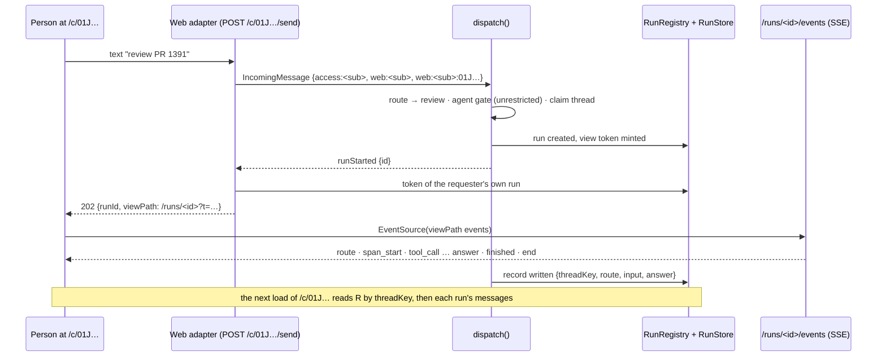

# The home page is a chat; the browser is a channel adapter; a turn is a run; the conversation is the thread's records; delight is motion over surfaces that already exist

**The ask.** Decide (the maintainer, before the first PR opens): adopt this shape for the dashboard's home. The maintainer's frame, 2026-09-16: the landing page "should just be a chat interface", "must be delightful" as the goal and prerequisite, with "subtle things that world class designers do", and will grow beyond a raw chat over time. Written for an engineer who knows the dispatch pipeline ([record 0024](0024-dispatcher-as-a-staged-pipeline.md)), the live run page ([live-view.md](../reference/specs/live-view.md)), the front door ([record 0036](0036-one-front-door-the-router-offers-every-command-and-ship.md), [record 0039](0039-the-front-door-writes-nothing-from-prose-and-never-routes-twice.md)) and the dashboard identity records ([0041](0041-the-settings-page-is-a-surface-over-the-registry-and-configures-the-shared-tiers.md), [0042](0042-a-dashboard-session-is-the-person-its-email-names-identity-not-authority.md)), and has not read the web app.

Success criteria: (1) a signed-in person types a plain request at `/` and watches the run it starts, with its route, its work and its reply, without leaving the page; (2) the page adds no rule the pipeline does not already hold: the router, the gates, thread admission, the hand-back and the run record decide exactly as they do for Slack; (3) nothing new is stored: a conversation is readable at `/` for as long as its runs are in history, and a follow-up starts from what the last run knew; (4) a browser session may run exactly the agents a Slack workspace member may run, and `restrict.agents` closes the same agents for both; (5) every motion on the page is bound to a rule a test checks, honours `prefers-reduced-motion`, and no element ever moves that the person did not cause, except a pulse and a clock; (6) the maintainer judges the page delightful on a fixture preview before any server change lands.

## TL;DR

The dashboard has ten routes and no way to ask Switchboard anything: `/` redirects to `/runs`, no adapter dispatches a browser identity, and the only chat surface is Slack. The bet is that the home page is the fifth channel adapter and that it needs nothing of its own: a **conversation** is the runs of one thread, already stored by thread key; an **assistant turn** is the run itself, rendered by the run page's one view model over the same event stream; the router's receipt, the hand-back and the steer arrive as the events and replies they already are. The cost is one adapter, one page, two chat write actions added to the browser baseline, one read per run when a conversation loads, and a conversation that lives exactly as long as run retention, 30 days by default. Decided: the adapter, the conversation as records, the turn as a run, the motion rules, and the page over fixtures first; open: whether switching conversations is a page load or a client-side swap, settled by feel on the preview. Doing nothing leaves the product's front door in Slack and the dashboard a place to watch, never to ask.

## Today at `15462685`

The delta from what a veteran expects, each with its proof.

| You would expect | What is true | Proof |
|---|---|---|
| The dashboard's home is a page | `/` is a public `302` to `/runs`; the Access gate covers `/api`, `/runs`, `/residents`, `/costs`, `/delivery` and `/settings` by prefix, not `/` | [`src/index.ts`](../../src/index.ts) lines 882 to 945 |
| Authorization keeps a browser from starting a run | Nothing does: the agent gate is `mayRunAgent`, which passes every agent not under `restrict.agents` for any actor, grants or none. No browser starts a run because no adapter dispatches an `access:` identity; a browser holds every group's read but not Slack's `memory:write` and `mcp:write` | [`src/core/dispatch/authorize.ts`](../../src/core/dispatch/authorize.ts) lines 74 to 84; [`src/core/authz/grants.ts`](../../src/core/authz/grants.ts) lines 52 to 67 and 310 to 312; record 0041 |
| A chat surface needs a message store | Every run record carries `threadKey`, `userId`, `userName` and `route`; the request and the reply are its `input` and `answer` events, which the list read omits and `getRun(id, { include: "messages" })` returns | [`src/core/runRecord.ts`](../../src/core/runRecord.ts) lines 71 to 78, 164 and 399; [`src/core/runEvents.ts`](../../src/core/runEvents.ts) lines 446 and 452; [`src/core/runsService.ts`](../../src/core/runsService.ts) lines 201 and 288 |
| A chat renders the reply as it streams | pi's streaming deltas are dropped at the source: text lands per turn as one `assistant` event; the run page renders live and finished runs through ONE model, and the unit page folds a finished run's timeline open in place | [`src/core/harness/pi/process.ts`](../../src/core/harness/pi/process.ts) lines 19 to 22; [`web/src/lib/runPageModel.ts`](../../web/src/lib/runPageModel.ts) `createRunPageModel`; [`web/src/pages/UnitPage.vue`](../../web/src/pages/UnitPage.vue) lines 32 to 35 |
| The requester's channel gets the live link at start | `runStarted` carries `{ id }` alone; the Slack card gets `liveViewLink(run.id, run.token)` through its status handle, the async HTTP ingress answers a tokenless `/runs/<id>`, and the runs index reads the viewer's own live tokens from the registry | [`src/core/types.ts`](../../src/core/types.ts) line 255; [`src/core/dispatch/provision.ts`](../../src/core/dispatch/provision.ts) lines 412 to 415; [`src/channels/http.ts`](../../src/channels/http.ts) line 330; [`src/channels/liveView.ts`](../../src/channels/liveView.ts) line 465 |

Run history is off unless configured, and its retention defaults to 30 days, 5,000 runs or 2 GiB ([run-history.md](../reference/specs/run-history.md) item 4). The router answers in about a second (record 0036's trace). A Slack DM is `dm` visibility by its id alone; `web:` would be `unknown` today ([`src/core/authz/channelDirectory.ts`](../../src/core/authz/channelDirectory.ts) lines 19 to 25).

## The shape

*Amended 2026-09-16 (while proposed), after the maintainer's first look at the page over fixtures: the chat lives under one prefix, `/chats` and `/chats/<conversation>`, so the Access application covers it with one rule, and `/` redirects there; `POST /chats/<conversation>/send` is the adapter's route. The rail is the person's RECENT conversations, bounded by the seed, with a filter (⌘K) and a link to the runs page for everything else, so nothing on the page pages; the new-chat control carries its shortcut (⇧⌘O); a chip sends its words on click; the reach line under the composer is dropped as noise; and the mark gains a life of its own on the page (an idle float, a pulse down its route on every send) beside two more motions outside the 8 px rule: the composer's ring sweep on focus and the mark's pulse, both under 700 ms and both off under reduced motion. Later the same day: the chips speak for Switchboard (a review, a shipped change, an investigated run, a channel's agent, an MCP server) and one asks what it can do; the composer's placeholder guides the hand by state; `/` at the start of a message opens a palette of the chat commands the viewer may run, each with the command's own description, filtered as they type, a pick inserting the chat form (the slash never reaches the bot); and every control is at least 44 px tall where the pointer is a finger. Nothing else in this record changes.*

The **web channel** is adapter #5, a file beside `http.ts` that shares its body parsing and its IO shape and nothing of its auth: `POST /c/<conversation>/send` behind the dashboard gate turns the body into an `IncomingMessage` whose `userId` is the session's `access:`, whose `channelId` is `web:` (the person's own lane, `dm` visibility by prefix) and whose `threadKey` is `web::<conversation>`, and calls `dispatch()`. Its `ChannelIO` answers the request the way the HTTP adapter does, with one addition: when a run was created, `202` with the run id and the run's view path, `/runs/<id>?t=<token>`, the adapter reading the token from the registry after `runStarted` exactly as the runs index reads the viewer's own live rows; when the pipeline answered inline with no run (a config reply, a hand-back, a steer acknowledgement, a refusal), `200` with the reply text. A command that does work is an inline run and answers `202` like any run. Its `history()` is the thread's finished runs read as turns, the `input` text as the person's, the `answer` as the agent's, stamped, one `getRun` per run within the seed's page. The **home page** at `/` is the chat: a transcript of the conversation's runs, a composer, a rail of the person's recent conversations, and an empty state. Each **assistant turn** is a run mounted on the run page's model: live, it follows the run's event stream and draws the pending-turn row, the folded steps and the reply where they will end up; finished, it shows the request, the receipt, the reply and a one-line fold that opens the timeline in place. The page also follows the runs index feed for its thread, so a run that appears without this tab asking, the settle stage's fresh turn or a resume, is drawn. The **browser baseline** gains the two chat write actions Slack's holds, `memory:write` and `mcp:write`, so a command typed in the composer answers as it does in Slack; the agent gate needs nothing.

The closest known shape is the Slack DM with the bot: one lane per person, every message a request, the card the live surface. The one difference: the live surface here is the run page's own model, so the chat adds no status words of its own.

## One trace: a follow-up typed while the run is live

The case most likely to be wrong is the one Slack handles by thread admission and a chat page could easily duplicate: a second message in a conversation whose run is still working.

1. The maintainer opens `/`, signed in through Access. The gate verifies the JWT and resolves the actor `access:a1` with the browser baseline; once record 0042 lands the actor also carries `self: [access:a1, slack:U…]`, and until then `is-self` matches `access:a1` alone. The page seeds with the rail (the person's runs on channel `web:a1`, grouped by thread, newest first) and an empty transcript for a new conversation `01JC…`.
2. They type "review https://github.com/acme/api/pull/1391" and press Enter. The composer's text moves into the transcript as the person's turn; the page POSTs `/c/01JC…/send`.
3. The adapter builds `{ userId: "access:a1", channelId: "web:a1", threadKey: "web:a1:01JC…", text, userName: "alice", receivedAt }` and calls `dispatch()`. `history()` answers `[]`: the thread has no finished run.
4. The fast path finds no command. The route stage builds the front door exactly as for Slack and the model answers `route { preset: "review", reason: "a pull request link" }`. The agent gate passes: `review` is unrestricted. The profile gate intersects review's profile with the `web:a1` channel's boundary. The thread is claimed; the run is created; the registry mints its view token.
5. `runStarted` fires with the id; the adapter reads the run's token from the registry and answers `202 { runId: "r-9", viewPath: "/runs/r-9?t=…" }`. The page mounts an assistant turn on `createRunPageModel`, draws the pending-turn row with the model's name, and opens the run's event stream.
6. The `route` event arrives; the turn's receipt chip paints `review · a pull request link` in the review token's colour. Steps begin; from the second call the cards fold into one tallying group, as on the run page.
7. Forty seconds in, the maintainer types "also check the migration" and presses Enter. The composer has read "steer" since the run went live; the page POSTs the same route.
8. `dispatch()` reaches thread admission: the thread's slot is held by `r-9`, the follow-up names no other agent, so the message is pushed to `r-9`'s inbox and the dispatcher replies the steer acknowledgement through `io.reply`. No run was created; the adapter answers `200 { reply: "↪ Folded into the review run…" }`.
9. The page already drew the message as the person's turn on Enter and does not paint the acknowledgement. The live turn's stream carries the `input` event the harness records when it drains the inbox; the page matches it to the turn it drew and stamps it `↪ folded in at 0:40`. One message, drawn once, confirmed by the run's own event.
10. Had `r-9` ended before draining, the settle stage would have run the unconsumed follow-up as one fresh turn of the same agent, a new run in this thread; the page hears of it on the index feed and mounts it under the person's turn as its answer. Had `r-9` been stopped, the settle's note that the follow-up was not run arrives the same way and paints under the turn. Nothing typed is lost, and no tab needs to have asked.
11. The `answer` event lands: the reply reveals under the folded work. `finished`, then `end`: the composer returns to "send", the turn's clock freezes at 2 m 14 s, and the run row on `/runs` reads `via Web · alice`.
12. They reload, then type "and the tests?". The page seeds from the store: one run by `threadKey`, then its messages. `history()` answers the two turns of `r-9`; the thread has a session log, so the seed starts from that log's tail plus the request, exactly as in Slack.

The property: a second message during a live run never starts a second run, never invents a second status, and the page learns what happened from the run's own events and the thread's feed, never from the adapter's reply.

## The difficulty map

1. Authority: a browser session starting a run, the identity the run carries, what the baseline needs and does not. [A browser session may start a run](#a-browser-session-may-start-a-run).
2. The conversation without a store: what a page load and a follow-up read, what an inline exchange is, what retention does. [The conversation is the thread's records](#the-conversation-is-the-threads-records).
3. The turn as a run: one fold, the hand-back into the composer, the receipt from the `route` event, the token's path. [A turn is a run](#a-turn-is-a-run).
4. Delight as engineering: the motion rules, what is forbidden, what a test checks. [Delight is motion over surfaces that exist](#delight-is-motion-over-surfaces-that-exist) (most work).

## A browser session may start a run

The constraint: authorization is one table asked once against the resolved actor (invariant 3), and every gate a run passes already answers for any actor id. The agent gate passes an unrestricted agent for anyone and a restricted one only for a holder of `agent:run:<name>`; the profile gate reads the channel's boundary; thread admission reads the thread. What has kept the browser out is not a rule but an absence: no adapter has ever dispatched an `access:` identity, which is the sentence record 0041 built its `me` refusal on.

The design: the web adapter dispatches the session as itself. The run's `userId` is `access:`, its `userName` the linked Slack name when record 0042 has one, else the email's local part, and `visibilityOf("web:…")` answers `dm`, so the person's conversation is theirs by `is-self` and an admin's by `all-channels`, never public. `resolveChatActor` learns the `access` namespace so the actor is resolved by rule, not by the unknown-namespace fallback it lands in today. The browser baseline gains `memory:write` and `mcp:write`: the two chat actions Slack's baseline holds and the browser's lacks, so `memory remember` and `mcp add --scope me` typed at `/` answer as in a DM; `config:write` and `repo:write` stay off every baseline, and the reads the browser holds today it keeps. Which agents a session may run is decided as it is for Slack, by `restrict.agents` and grants, so criterion (4) holds with no new rule. Record 0041's refusal of `me` on the Access surface rested on a sentence this record makes false; 0041 takes a dated amendment while proposed: `me` is offered on the dashboard once this adapter ships, and the user tier a web run resolves is read over the requester's `self` set once 0042 lands, so a `me` written from Slack or the dashboard applies to both.

Invariants: no policy row changes; `dispatch()` asks the questions it asks for Slack; the run record's `userId` is the JWT's subject and never the linked Slack id (identity, not authority); a session Access admits but the link cannot map still starts runs under its own id.

Blast radius: whoever the operator's Access policy admits can start an unrestricted agent from `/`, exactly as whoever the workspace admits can from a Slack DM, under the same profile budgets (minutes per preset), the same `restrict.agents`, and the boundary the person's user tier sets; an operator who admits more people to the dashboard than to Slack reads criterion (4) before deploying, and narrows with `restrict.agents`. A gate's refusal paints as an inline turn with the text Slack shows. A JWT without an email starts runs as `access:` with the subject as its name. The release note is breaking (`feat(web)!`): "a signed-in dashboard session can now start runs from `/`; `restrict.agents` closes what you want closed".

The alternative it beat: a `dashboard.chat: false` switch, or a per-surface grant an operator must add before `/` works. Nothing in the pipeline refuses a browser today, so a switch would be the first surface-specific rule in the core, and a grant-first default would leave the home page a dead form on every fresh installation.

## The conversation is the thread's records

The constraint: a chat page needs the conversation on every load and the model needs it on every follow-up, and the repository holds two stores that already carry it: the run store, one record per run whose `input` and `answer` events are read per run, listed by `threadKey` or `channel` under the viewer's predicate; and the session log, one object per thread and agent, that a follow-up seeds from ([session-log.md](../reference/specs/session-log.md) item 9). A third store would drift from both.

The design: a **conversation** is the set of runs whose `threadKey` is `web::<conversation>`. The page seed for `/c/<conversation>` is `listRuns({ threadKey, status: "all", visibleTo })` for the newest 20 runs, then one `getRun(id, { include: "messages" })` each, projected to turn facts: id, stamps, status, the `input` text, the `answer` text, the `route` decision, the model, the step count. Older runs page in as `/runs?all=1` does. The rail is `listRuns({ channel: "web:" })` grouped by `threadKey`, newest first, each titled by its first request cut to one line. `history()` is not a third source but the adapter's input to the dispatcher's seed: the conversation's runs as stamped turns, the same list on every call. The seed decides what to do with it, as it does for Slack (session-log item 9): a thread with a session log starts from that log's tail and takes from `history()` only the person's lines newer than the previous run's end; a thread without one takes the history whole. Duplicate lines from the adapter are therefore harmless, and the adapter holds no rule.

An **inline exchange**, a message the pipeline answered with no run (a hand-back, a `help` answer, a gate refusal, a steer acknowledgement), is shown once and is not part of the conversation: no record holds it, so the next seed never sees it. This is a deliberate delta from Slack, whose thread history carries the person's every line: an inline exchange is answered when it happens, and the one case where the words mattered later, a hand-back, ends in the paste, which is a typed command the fast path answers inline too.

Invariants: the adapter writes nothing; the thread key is the conversation id, so the workspace, the session log and the thread's live slot are keyed by it as in every channel; a conversation older than run retention is gone from the rail and the transcript, and the page says so where the divider would be (`retentionSentence`); with run history off, a conversation lives only while the registry keeps its runs, and the rail says that too.

Failure modes: a run the provider refused under its usage policy leaves a record whose `answer` is the refusal; the turn shows it as the run page does. A run whose record was never written leaves a gap the follow-up's seed marks with `GAP_MARKER`, as for Slack. One `getRun` with messages is unmeasured today; if 20 of them exceed 200 ms on the state Worker (measured on the first live conversation past 20 runs), the record gains a stored projection of the request and reply text, which the runs index would use too.

The alternative it beat: a conversations table or Durable Object holding messages. Every field it would hold is already on the run record or its events, and the one it would add, an inline exchange, Slack does not keep either.

## A turn is a run

The constraint: the run page already knows how to draw work in flight and work finished through one fold, and the maintainer's standing rule is that in-progress work draws where it will end up, with no second vocabulary (live-view item 18). A chat that rendered "thinking…" bubbles beside a run page that drew pending-turn rows would be two products.

The design: an **assistant turn** is a component that owns one `createRunPageModel` and feeds it either the run's live stream or, for a finished run, the events served in history mode when the person opens the fold. Closed, a finished turn shows the request, the receipt chip, the reply and one line of facts: `review · claude-fable-5 · 7 steps · 2 m 14 s · open run`. Live, it shows what the run page shows in the same order. The **receipt chip** is the `route` event: the preset and its reason, painted in the preset's data colour (`--sb-review`, `--sb-research`, `--sb-skill` already name three; a preset without one is ink). A **hand-back** is the reply beginning `HAND_BACK_PREFIX`: the page fills the composer with the command, focused, with the hint "Enter runs it", and paints no turn; "use opus for my coding runs" becomes `config set me --models.coding …` in the composer, and Enter runs it as a typed command under the `me` row every `user` actor holds. An **inline turn** is any other run-less reply: painted once, plain. A steer acknowledgement is neither: the person's turn was drawn on Enter, the page ignores the `200`, and the live turn's `input` event stamps that turn as folded in. The view path the `202` carries is the requester's own capability link, the same one the Slack card shows the requester, minted by the registry and read by the adapter after `runStarted`; the seed carries it for the viewer's own live runs as the index does, and for no one else's.

Invariants: `v-html` appears nowhere; every reply renders through `MarkdownText`; the chat holds no timeline state of its own; the turn's clock is the run page's projected runner clock, one ticking number per in-flight thing; the reply arrives whole because the harness drops deltas, so no typewriter is drawn over a whole reply; `via Web` joins the index's surface names.

Failure modes: the stream drops: the turn shows the run page's disconnected phase and its link, and the composer stays "steer" until `end` or a reload; the model throws on a frame: the turn falls back to the request and the reply text, the run page's own guard.

## Delight is motion over surfaces that exist

The constraint: the design system is a zero-chroma neutral in which colour is data ([`web/src/assets/main.css`](../../web/src/assets/main.css)), and the maintainer's ask is subtle, not over the top. In that system delight cannot come from hue or gradients; it comes from motion, rhythm, weight and the honesty of every element. The run page's motion today is chevron turns, a 200 ms fold and one 1.5 s outline reveal, each off under reduced motion. This is where the work is, so the rules are written to be tested.

The rules, each a spec row:

1. **Every transition the chat page adds is opacity plus at most 8 px of translate, 120 to 200 ms, ease-out, and only opacity under `prefers-reduced-motion`.** Checked by a unit test over the page's motion utilities.
2. **Nothing moves that the person did not cause**, except the pending row's pulse and a clock's tick. New content arriving below the fold never scrolls the reader; a `↓ new` pill appears instead, and the transcript pins to the bottom only when the reader was there.
3. **The sent message travels.** On Enter the composer's text moves into the transcript as the person's turn (a FLIP transition, 180 ms) and the composer empties in the same frame; the turn is never drawn twice, and a steer's `input` event confirms the turn already standing instead of adding one.
4. **In-progress draws where it ends up.** The assistant turn is the pending-turn row from its first frame and becomes the finished turn in place; no bubble is replaced by another.
5. **One control, two states.** The send button is the stop control while the conversation's run is live and reads "steer" when text is typed then; it is never disabled while a run is live.
6. **The mark tells the story once.** On the empty state the brand mark draws its route (top plane to the two lanes) over 600 ms on first paint, then rests; never on a page with a transcript.
7. **The empty state is grounded.** The greeting names the person (the linked name, else the email's local part); the suggestion chips are derived from data, never a hand list: the onboarded repositories, the chat commands the person may run, their last three conversations. Chips stagger in at 40 ms.
8. **The composer is alive but quiet.** It grows with its text to eight lines, its hairline brightens to ink on focus, Enter sends and Shift+Enter breaks a line, and typing `agent:` or a command group offers the registry's own catalogue.

The design system's own rules hold unchanged: chroma is data alone (the receipt chip, a failed status, the heat ramp), and the type ladder is the run page's three voices.

Beyond the header, the page holds: the transcript; the composer; the **rail** of recent conversations (a sheet on a phone); the empty state with greeting and chips; under the composer a one-line **reach** fact, the MCP sources and agents the person's runs can reach ([record 0040](0040-the-front-door-knows-the-data-sources-a-run-can-reach.md)'s source list rendered as facts), and the live-run count in the tab title and favicon, exactly as the index does. Deferred: attachments (the adapter has no upload; Slack's staged-file path is the later step), sharing a conversation, renaming one, and a client-side conversation switch (open question 1).

## Why not X

**Why not add a mode to the HTTP ingress that takes the Access session instead of a bearer token?** The adapter's own contract is that nothing about identity leaks in; the ingress authenticates a bearer, maps it to a `service` actor of `machine` visibility whose history arrives in the body, and the web adapter differs in exactly those three things. It is a sibling file that shares the body parser and the IO shape, not a flag inside a module whose every test assumes a token.

**Why not a `chat.send` command on the registry with an `/api` twin?** No registry command starts a model run; that is `dispatch()`'s job alone (invariant 3). A command that dispatched would be the one exception the invariant exists to forbid.

## Boundaries

Not here: the org tier and Workspace tab (record 0041's deferral); record 0042's three PRs, which this record wants for the linked name and the `self` set and degrades to the subject id without; `/runs` stays a section and the brand mark becomes the way home; file and image attachments; a mobile app. Compatibility: `/` stops redirecting and starts serving a gated page, so the Access application must list `/` and `/c` before the release rolls (a bare 403 on `/` is that gap, not a gate bug); bookmarks to `/runs` are unchanged.

## What would change our mind

If the maintainer does not find the fixture preview delightful, the motion rules change and nothing else does, which is why the page ships over fixtures first. If 20 message reads exceed the 200 ms seed budget, the record gains a request-and-reply projection (the fallback above). If a month of use shows people missing inline exchanges from their history, those become records of a run-less kind, the one store change this design avoids. Reversibility: the adapter and page delete cleanly; the two baseline actions revert by one constant; conversations leave with retention.

## Rollout

Four PRs. (1) This record, `proposed`. (2) The page over fixtures: `web/src/pages/HomePage.vue`, its components, the fixtures in `scripts/web-preview.ts` (an empty state, a finished conversation, a live conversation fed by the preview's scripted stream), `screenshots:gen`, and the spec `docs/reference/specs/web-chat.md` with the motion rows as `[gap]` bound to unit ids; the maintainer judges it here. (3) The server: `src/channels/web.ts`, `access` in `resolveChatActor`, `web:` in `visibilityOf` and the index's surface names, the two baseline actions with their tests and spec rows, the gate and the `/` and `/c/*` routes, the seed, 0041's amendment; a breaking title. (4) The rail, the empty-state chips and the reach line, each derived from a registry read. The maintainer adds `/` and `/c` to the Access application before (3) deploys.

## Open questions

| Question | Owner | Resolves it | Before |
|---|---|---|---|
| Is a conversation switch a page load (house shape) or a client-side swap? | the maintainer | the fixture preview: if the reload reads as a flash, (4) adds the swap | PR 4 |
| Does the user tier resolve over the `self` set for every channel, or for `web:` alone? | record 0042's series | its second PR, where `self` reaches the config resolver | PR 3 |
| Do 20 message reads fit the 200 ms seed budget on the state Worker (one read is unmeasured today)? | PR 3's author | the first live conversation past 20 runs, timed | PR 3 |

## Validation criteria

Bound in `docs/reference/specs/web-chat.md` when PR 2 opens; `[gap]` until then. (1) a plain request at `/` creates one run whose record carries `web::<conversation>`, `access:` and `dm` visibility, `[unit]` over the adapter; (2) `grantsFor("access:")` holds `memory:write` and `mcp:write` beside its reads and nothing else new, and a restricted agent is refused on both surfaces, `[unit]` in `grants.test.ts`; (3) a page load of `/c/<id>` seeds exactly the thread's runs the viewer may read, and a stranger's `/c/<id>` is the same 404 as an unknown run, `[unit]`; (4) a message during a live run answers `200` with the steer text and creates no run, and a follow-up the run never drained appears as the thread's next run, `[unit]`; (5) a hand-back reply fills the composer and paints no turn, `[unit]` in the page tests; (6) the `202` carries a view path the requester's own live run accepts, and no other viewer's seed carries it, `[unit]`; (7) every motion rule above has a test over the stylesheet or the component, `[unit]`; (8) the maintainer signs off the fixture preview as delightful, human-gated; (9) `/` on the deployed installation answers `302` to Access unauthenticated and the page signed in, `[agent]`.

## Sources

- The maintainer's ask, 2026-09-16 (quoted in the ask above), and the run-page rule of 2026-09-07 (live-view item 18): in-progress work draws where it ends up; no second status vocabulary.
- Records [0011](0011-thread-admission-one-live-run.md), [0013](0013-capability-tokens-for-live-run-pages.md), [0024](0024-dispatcher-as-a-staged-pipeline.md), [0034](0034-one-agent-per-unit-a-run-continues-a-transcript.md), [0035](0035-a-session-log-outlives-its-runs-compaction-is-a-pointer.md), [0036](0036-one-front-door-the-router-offers-every-command-and-ship.md), [0039](0039-the-front-door-writes-nothing-from-prose-and-never-routes-twice.md), [0040](0040-the-front-door-knows-the-data-sources-a-run-can-reach.md), [0041](0041-the-settings-page-is-a-surface-over-the-registry-and-configures-the-shared-tiers.md), [0042](0042-a-dashboard-session-is-the-person-its-email-names-identity-not-authority.md).
- Specs: [live-view.md](../reference/specs/live-view.md), [authorization.md](../reference/specs/authorization.md), [thread-admission.md](../reference/specs/thread-admission.md), [session-log.md](../reference/specs/session-log.md), [run-history.md](../reference/specs/run-history.md), [http-ingress.md](../reference/specs/http-ingress.md).
