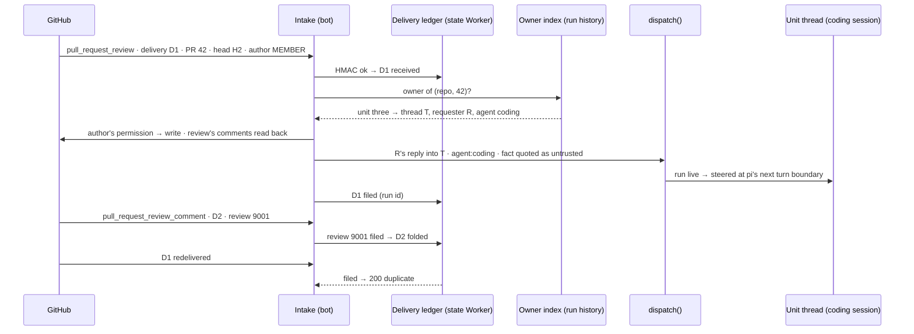

# An outside fact finds the thread that owns the work and lands as its owner's turn

**The ask.** Decide: adopt this as the one way any outside fact reaches an agent, build it after four smaller streams, and add no interim event-specific intake meanwhile. The four streams come first for stated reasons: the findings ledger is where a person's finding shows beside the agent's, the thread-artifact seed is what the woken session reads, the git proxy (record 0048) turns "a coding run can only push its branch" from a prompt line into a property of the door, and the cost views price a filed turn; each is days of work, so the hold is weeks, not a quarter, and today's cost of the hold is a person relaying every human review by hand at about 260 reviews a day in this repository. Stored schedules, once part of this design, are record 0049, which shares the dispatch path and nothing else. Owner: the maintainer. Written for an engineer who knows the dispatch pipeline and records 0034, 0037, 0039 and 0044, so that whoever builds this later has the context it was decided in. Success criteria: (1) a person's review on a pull request a coding run pushed reaches the session that wrote the code, once per review, with nobody relaying it in chat; (2) no run starts under an identity the outside party supplied, and no author without write permission on the repository starts a run at all; (3) the check-run path keeps its behaviour to the line; (4) the ship runner's state machine gains no state.

## TL;DR

One outside fact can wake one agent today: "CI finished at head X" reaches the ship runner's merge step through an in-memory map, while a person's review, a comment or a merge reaches no agent until someone pastes it into chat, and a review requesting changes parks the runner at a merge door it cannot pass. The bet is **filing**: the intake reads the fact, finds the thread that owns the pull request through the rows the run history already keeps, and dispatches it as that thread's owner's own reply, so admission steers it into the live session or makes it the next turn and the coding session that wrote the code answers it under the authority it already has and no more. The cost is a delivery ledger with states, five payload readers, two indexed columns with their store routes, and one permission read per filed review. The risk is an outsider's words starting a write-capable turn with nobody between them, bounded by who may file a turn, by a mode per fact kind and by record 0048's door. Decided: the mechanism, the reply path, the owner precedence, the permission rule, the modes; open: where a chat-owned pull request's owner lives once retention has dropped its run, and whether a person's mid-round review should steer or queue.

## Today at `cece6a73`

You would expect the GitHub webhook to be a general door; it is a repository webhook with one secret per deployment that reads `check_run` `completed` and acknowledges everything else as `ignored`. You would expect it to find who cares by a durable index; it asks `MergeWaitRegistry`, an in-memory map from head sha to waiting coordinator instances, lost on restart on purpose. You would expect one path into a thread; there are two, and the difference decides this design: the findings step dispatches through the coordinator's spawn route, a retried step under an idempotency key, so it is refused `coordinator_thread_live` on a live thread and never steers, because a retried spawn landing in an inbox would run twice; a person's reply has no such key and is steered into a live run at pi's next turn boundary or settled as one fresh turn when the run ends first. You would expect the rows naming a thread to be queryable by pull request; `coordinator_units` is listed by instance only, with the repository and requester on the instance row, and run records carry `repo`, `pr`, `threadKey`, `userId`, `agent` for 30 days with no pull request filter. You would expect deliveries deduplicated; nothing reads `X-GitHub-Delivery`. The survey is Appendix A.

## The shape

Filing is an inbox per conversation keyed by the artifact the conversation owns: a pull request belongs to the thread whose run pushed it, a fact about it is a letter addressed there, and the owner reads it. Three parts on seams that exist: a **fact reader** per event kind turns a verified webhook body into a typed fact (kind, repository, pull request, head, author with GitHub's `author_association`, text, URL); the **owner index** answers (repository, pull request) with the owning thread, its requester and the agent that pushed; **filing** is a `dispatch()` of the fact as the owner's reply, in one of three **filing modes** per kind, `turn` (start or steer a run), `note` (write the fact on the card and record, start nothing) or `off`. A **delivery ledger** in front gives each delivery id one row with a state, so a delivery that never filed can be re-driven and one that filed never files twice. The closest known shape is email threading: `In-Reply-To` names the conversation, the client files the message there, and the reader answers from their own account, never the sender's. The one way this differs is that filing carries authority: the owner's agent reads the letter with the owner's grants, so the sender's words are quoted as untrusted data and never become the actor.

## One trace: a person's review lands during a fix round, out of order, and is redelivered

Unit three's pull request 42 is at head H2, and the runner's findings step has a coding run live in the unit thread T. A teammate submits a review requesting changes with two inline comments, which GitHub sends as three deliveries in no promised order: one `pull_request_review` and two `pull_request_review_comment`, each with its own delivery id and one review id, 9001.

1. The first comment delivery, D2, arrives before the review. The intake verifies the HMAC, writes D2 as `received`, and finds no row for review 9001; it parks D2 as `received: awaiting review 9001` and dispatches nothing.
2. The review arrives as D1; the intake verifies the HMAC and writes D1 as `received`.
3. The review reader makes the fact: repository, 42, H2, the author's login and `author_association: MEMBER`, the body, the review id, and the comments read back from the API once, both of them, with path and line; the fact never depends on comment deliveries having arrived.
4. The owner index finds unit three through its indexed column: thread T, requester R from the instance row, agent `coding`. A unit row wins; no run record is read.
5. The kind's mode is `turn`, so the intake reads the author's permission on the repository once and caches it an hour: `write`. `NONE` or `FIRST_TIME_CONTRIBUTOR` would have skipped the read and filed a `note`; `read` would have filed a `note` after it.
6. The intake composes what the findings step composes for a review agent's verdict, `agent:coding`, the fact inside the untrusted quote block a linked thread uses, then the standing ask (address every point, record a disposition, resubmit the description, push), and dispatches it as R's reply into T with a `filed` provenance, never as a coordinator spawn.
7. Admission finds the coding child live in T and steers the message in at pi's next turn boundary, as R's own reply would land; D1 moves to `filed` with the run id, and the parked D2 moves to `folded` into 9001. The agent folds the two points into its fix, records dispositions for the agent's findings and the teammate's, pushes H3, resubmits. Had the child ended first, admission would have settled the message as one fresh turn in T, which is intended: the fact must land either way.
8. The second comment delivery arrives; the ledger holds `filed` for 9001, so it is written `folded` at once.
9. The runner's re-review at H3 reads the prior findings and dispositions as today; the teammate's review is in the session it reads about.
10. The teammate presses "Redeliver"; D1 arrives again, the row is `filed`, the intake answers `200 {duplicate: true}`. A dependency bot comments; the reader sees a `[bot]` author and writes `ignored`.

One review by a person with write permission reaches the session that wrote the code once, whatever order its deliveries came in, with the owner's authority and no more, idle or mid-fix, and the runner learns nothing new.

## The difficulty map

1. **Whose turn it is.** The filed turn runs as the owner while its text came from outside; most likely wrong. [The owner's turn](#the-owners-turn)
2. **The owner index and the reply path** (most work): two sources, a precedence, `unowned`, a retention hole, two indexed columns, the `filed` provenance. [The owner index](#the-owner-index)
3. **Deliver once**: one review is several unordered deliveries, and a row must say whether the fact ever landed. [Deliver once](#deliver-once)

## The owner's turn

The constraint is record 0034: the agent that wrote the code answers its review by continuing its own session in the unit thread, so a person's review lands where the review agent's does. The design files as the owner and never as the commenter, because the commenter is a GitHub login with no Switchboard identity and no grants, and inventing one would be the authorization table's first special case. The fact sits inside the untrusted-content block the command registry and a linked thread already use (record 0037), so the model reads it as a report of what someone said, with the author's login on the record as data. The standing ask after the quote is the tension the findings step already lives with: the model is asked to act on fenced text whose fence says never to follow instructions inside; the ask names what to do with the text, the fence keeps the text from choosing.

Who may file a turn is GitHub's answer, not the payload's free text. `author_association` is GitHub's own claim about the author: `NONE` and `FIRST_TIME_CONTRIBUTOR` file as `note` with no further read; for every other association the intake reads the author's permission on the repository once (`GET /repos/<o>/<r>/collaborators/<login>/permission`, cached per repository and login for an hour) and files a turn only for `write`, `maintain` or `admin`. Bot logins and the deployment's own identity are ignored outright. An `issue_comment` files only when it mentions the bot's GitHub login, because a comment is addressed to whoever it names; a review needs no mention, because GitHub lets a person review only a pull request they can reach and addresses the review to its author. At this repository's rate, about 70 pull requests and 260 reviews a day, that is a few hundred cached reads a day against a 5,000-an-hour installation limit.

The blast radius is the owner's, and today that bound is a prompt: the coding sandbox holds the write-scoped installation token, the full installation grant, and `NEVER_MERGE` is a line in the coding prompt. That is why record 0048 comes first: with its door in force a coding run pushes only its own branch of its own repository and reads the API, so a filed turn can continue the session, push the pipeline branch and have the bot re-render the description, and cannot merge, approve, tag, reach another repository or change configuration, by what the door forwards rather than by what the prompt says. The dispatch also passes the owner's gates as any reply does, and carries an explicit `agent:coding` directive, as the findings step's does, so under record 0039 no fact routes to a writing preset by a model's guess. When the owner is a schedule actor (record 0049: a stored schedule that ran `agent:ship` owns its units' pull requests), the filed turn runs under that row's grants, which ship already required to include the coding run. The modes are configuration, `intake.github.modes` with a per-repository override, validated at load; a deployment with no webhook secret has no intake, as today. Decided and revisable: a review requesting changes, a comment-only review carrying inline comments, and a mention are `turn`; an approval, a body-only review, a merge and a base branch that moved are `note`; a `pull_request_review_comment` is never filed alone.

Invariants: a filed run's `userId` is the owner from the index, never a payload value; a `turn` follows a permission read answering `write`, `maintain` or `admin`, both recorded on the ledger row; every filed message carries the fact inside the untrusted block and a directive naming the agent the index returned; a bot author dispatches nothing and is recorded `ignored`; a `note` starts no run.

Failure modes. The owner has left: the gate refuses as it would their own reply, the row stays `received` with `unfiled: gate`, the pull request's page shows it, nothing is rerouted, because an ownerless pull request is a person's to reassign. A person's non-coding run is live in T: admission refuses the `agent:coding` reply with a pointer (`agent_mismatch`), the row stays `received`, and a redelivery re-drives it once the thread is free. The owner's thread is `http:` with no channel to post into: `unfiled: no_channel`; only Slack and browser threads take a turn. The review child is live in the review thread while T is idle: the filed turn starts a fresh coding run, pushes H3, and the H2 review is voided by the reviewed-head guard, costing one review round, as a person's own reply in T costs today; if that proves common, filing waits for the review child's `run-finished` event on the bus the runner already publishes, never on a timer. Steer latency is one model turn, measured in unit two against the length of a fix round; if a turn is long enough that a steered review arrives after the fix is pushed, the answer is the queue option, not a shorter turn.

The alternative this beat is a `github:<login>` service actor with its own grants row. It carries the author's name into the run record and fails on the first repository with an outside contributor: either every login that can comment needs grants, or the intake grants them implicitly, which is authority from the payload.

## The owner index

Two kinds of thread push pull requests and neither is indexed by pull request: a unit's pull request is on its `coordinator_units` row, listed by instance only, with the repository and requester on the instance row; a chat thread's is on its coding run's record, which `runs list` cannot filter by. Of the last hundred pull requests merged here, 14 came from plan units and 86 from chat-owned runs or people, so the second source is the common one. The index therefore adds one indexed column to each table on the state Worker, `pull_request` as `<repo>#<number>` on `coordinator_units` and on `runs`, filled by the same lazy backfill `usage_json` used, with one store route each: units by pull request joining the instance row, runs by pull request newest first. It reads unit rows first, because the runner's thread is the one continuing the session, then run records, taking the newest run whose agent pushed, and returns the thread, the requester and the agent, or `unowned`. `unowned` is acknowledged and counted, never routed: a hand-opened pull request later reviewed in a thread has no run that pushed, and a coding turn in a thread that only reviewed would be a run nobody asked for. The count sits on the dashboard beside the ledger.

A filed message is dispatched as the owner's reply with a `filed` provenance on `DispatchOptions` and on the run record (delivery id, fact kind), never with the coordinator's tag. The difference is the idempotency key: a spawn is a Workflow step the runner may retry, so the same text landing in an inbox would run twice, and admission refuses it on a live thread for that reason; a filed fact has its delivery id as its one-time key on the ledger, is addressed to the thread, and must land whether or not a run is live, so admission's rules for a person's reply apply to it unchanged. The findings step's message composition is reused; its route, its key and its `busy` answer are not.

The retention hole is the one open question. Run history keeps records 30 days by default; a chat-owned pull request open longer loses its owner, while a unit row, kept with its instance, does not. No pull request is open here past 30 days today, which is why the evidence is cheap: the count of `unowned` deliveries whose pull request a run once pushed, over the first two weeks; if it is not zero, a `pull_requests` table on the state Worker, written when a coding run's post-step opens or edits a pull request, is read first. It is not built now because the same table from day one is the same table before the evidence.

## Deliver once

Three facts shape this. A delivery id arrives twice only by an operator's manual redelivery, which reuses the id; GitHub does not retry and the shim forwards each delivery with one fetch. One review is several deliveries in no promised order: the `pull_request_review` carries body and state, each inline comment is its own `pull_request_review_comment` with the same review id. And a turn is not idempotent the way the merge door's re-ask is.

The **delivery ledger** is one table on the state Worker's `RunHistoryDO`, keyed by delivery id, retained seven days, one state per row: `received` once the signature verified (so an unauthenticated poster cannot burn an id), then `filed` with the run id, `noted`, `folded` with the review id, `ignored`, `unowned`, or still `received` with a reason, `unfiled: <why>` when the dispatch was refused or `awaiting review <id>` for a comment whose review has not arrived. The review delivery is the unit of filing and reads its comments back from the API, so comment order never matters: a comment delivery is `folded` at once when its review's row exists and parked otherwise, and the review's filing folds every parked row for its id. A redelivery of a settled row answers its outcome and does nothing; a redelivery of a `received` row re-drives it, which is how a fact refused at a busy moment lands later by a person's hand, and how a parked comment whose review never arrived stays visible rather than lost. At this repository's rate that is a few thousand rows of about a hundred bytes a week against a 2 GiB policy. The `check_run` path writes the ledger for the dashboard's sake but does not depend on it: with the ledger up or down it behaves as today, which is success criterion 3.

Invariant: no delivery id is ever `filed` twice, and no review id is filed twice. Failure mode: the ledger is unreachable, every kind but `check_run` answers 503, GitHub records a red delivery, nothing is dispatched on a door that cannot promise a state. Why not the merge-wait registry's in-memory shape: a restart loses it, and a manual redelivery is exactly what an operator reaches for after a restart.

## Why not X

**Why not have the pull request carry its owner, a thread key in the body the bot already re-renders every round, or a label, and make the lookup a payload read?** Because then the actor comes from the payload. Anyone with write permission edits the body or the label, points it at another thread, and their review runs under that thread's owner; success criterion 2 forbids exactly that. A verified opaque id in the body still needs the store to verify, so it buys nothing over the indexed column, and thread keys are platform ids the public tree keeps out on purpose.

**Why not have the coding agent read the pull request's human reviews with `gh` at its next round?** There is no next round: the runner reviews again only after its own review requested changes, an approved pipeline waits at a merge door that a human `changes_requested` keeps shut until the clock ends, and a chat-pushed pull request has no runner and an idle session. The review arrives when the person reviews; waking on it is the feature.

**Why not extend the ship runner's `waitForEvent` to pull request events?** The runner is a state machine over its own children's ends; a person's comment is not one of its steps, and the fix already has a home the runner reads at its next round.

**Why not poll GitHub?** A timer fires too early and wakes nothing, or too late and is the relay we have; the signed webhook exists, and record 0029 counts eight incidents of hand-built timers on the resident lifecycle.

**Why not GitHub Actions in each repository calling `/ingress`?** Every repository would carry a workflow and a token, and the trust decision would leave the deployment's webhook for files any contributor can edit.

## Boundaries

The runner's state machine gains no state; a filed turn is a person's turn the runner meets at its next round, and a merge is a note because `pr-check` already ends a unit a person merged. A base branch that moved is derived, not sent: on a `push` to the base of an owned open pull request the intake asks GitHub once for mergeability and notes `base moved, conflicts` only on `false`; a pending answer is not retried, because the next push or the runner's `pr-check` asks again. The five event kinds read are `pull_request_review`, `pull_request_review_comment`, `issue_comment`, `pull_request` (closed and merged) and `push`; the deployment's webhook must subscribe to them, a human-gated step. Slack bursts, incoming webhooks and a "run when" gate are not mechanisms here: a channel is a channel, an incoming webhook is an `/ingress` token whose body names the thread, and the router already classifies before a preset runs. Trackers are channel adapters when they come (invariant 1), never intakes. Stored schedules are record 0049. `/ingress` is unchanged.

## What would change our mind

If the first five filed reviews landing on a live fix round produce worse fixes than a fresh turn, by the re-review's re-raised findings on those units, `turn` on a live thread becomes "queue as the next turn", one admission option. If `unowned` deliveries for pull requests a run once pushed are not zero in two weeks, the `pull_requests` table is built. If the permission rule excludes people an installation wants heard (a triage-role reviewer), it gains a per-repository allowlist. If review rounds voided by a mid-round review are common, filing waits for the review child's end on the run bus. Reversibility: every mode is configuration defaulting to today's `check_run` behaviour; the ledger, the columns and the readers are additive.

## Rollout

After the four streams land, one plan of four units. Unit one: the ledger with its states and parking, and the intake refactored into a reader per kind, `check_run` byte-identical and ledger-independent. Unit two: the two indexed columns with their store routes, the owner index, the `filed` provenance, filing for reviews (comments read back and folded) and mentions, the association pre-filter and permission read, the modes, the quote, the bot rule, and the steer-latency measurement. Unit three: the notes (approval, body-only review, merge, base moved) and the `unowned` count. Unit four: the specs: `http-ingress.md` item 12 becomes the door's items, `thread-admission.md` gains the `filed` reply row, `run-history.md` gains the columns, and `known-limits.md` loses the line this record's own PR adds. Validation criteria are `[gap]` rows bound in the plan, one per invariant above. Human-gated: the webhook subscription.

## Open questions

| Question | Owner | Resolved by | Needed before |
|---|---|---|---|
| Does a chat-owned pull request keep its owner past run retention? | the maintainer | the `unowned` count over two weeks after unit two | the `pull_requests` table decision |
| Does steering a person's review into a live fix round help or thrash? | the maintainer | re-raised findings on the first five such units, and the steer latency unit two measures | unit two's admission option becoming a default |

## Appendix A: the survey at `cece6a73`

| Fact | Where |
|---|---|
| `POST /webhooks/github`, raw body capped at 1 MiB, one pure handler; the shim forwards each delivery with one fetch and no retry | `src/channels/githubWebhook.ts`; `deploy/cloudflare/worker.ts` lines 490 to 524 |
| A repository webhook per repository with one secret per bot deployment | `docs/how-to/turn-features-on-and-off.md` line 34; `deploy/secrets.manifest.json` lines 44 to 47; `src/index.ts` line 689 |
| HMAC over the raw body; only `check_run` `completed` read; everything else `200 ignored` | `src/core/coordinator/checksIntake.ts` lines 12 to 14, 97 to 109 |
| `MergeWaitRegistry`: in-memory, head sha to instances, 60-minute expiry | `checksIntake.ts` lines 34 to 69 |
| The send crosses through the shim's event relay `POST /admin/coordinator/instances/<id>/events` | `src/core/coordinator/instancesRoute.ts` lines 133 to 200 |
| Nothing reads `X-GitHub-Delivery` | `git grep -i x-github-delivery` at the sha, no hits |
| The findings step composes from a review's findings; `childRequestText` writes `agent:coding`; the dispatch carries `DispatchOptions.coordinator` as the instance's `userId`, under the spawn's key `<parentInstanceId>:<step>` | `src/core/coordinator/briefs.ts` lines 127 to 141; `src/core/dispatch/spawn.ts` lines 162 to 166; `src/channels/adminCoordinator.ts` lines 23 to 36, 598 to 645 |
| A coordinator spawn on a live thread is refused `coordinator_thread_live`, answered `busy`, never steers | `src/core/dispatch/admission.ts` lines 329 to 333, 411 to 415; `adminCoordinator.ts` lines 667 to 671; `thread-admission.md` item 8 |
| A person's reply during a live run is steered at pi's next turn boundary; the unconsumed rest is one fresh turn; a reply naming another agent is refused `agent_mismatch` | `thread-admission.md` items 1, 2, 4; `src/core/threadAdmission.ts` lines 174 to 185 |
| `coordinator_units` (`instance_id, unit, json, updated_at`) listed by instance only; repository and requester on the instance row | `src/core/coordinator/contract.ts` lines 203 to 237; `deploy/cloudflare-memory/worker.ts` lines 1340 to 1346, 1419; `adminCoordinator.ts` lines 396, 604 to 605 |
| A run record carries `agent`, `channelId`, `userId`, `threadKey`, `repo`, `pr {number, url, head}` (last `pr_opened` wins), `usage`; retention 30 days, 5,000 runs, 2 GiB; `usage_json` was added by `ALTER TABLE` with a lazy backfill | `src/core/runRecord.ts` lines 67 to 91, 206 to 237, 619 to 623; `deploy/cloudflare-memory/worker.ts` lines 1452, 2213 to 2237 |
| `runs list` filters agent, channel, thread, parent, mine, status, since; no repository or pull request | `src/core/commands/runs.ts` lines 139 to 171 |
| The untrusted fence on the command registry, MCP results and a linked thread's quote; the prompt forbids following instructions inside it | `src/core/commandRegistry.ts` lines 588 to 593; `mcp-tools.md` item 18; `src/core/dispatch/references.ts` line 282; `src/agents/registry.ts` line 221 |
| The coding sandbox holds the write-scoped installation token, the full grant; merge and approve are forbidden by prompt | `src/execution/githubApp.ts` lines 32 to 34; `src/execution/factory.ts` lines 858 to 866; `src/agents/registry.ts` line 166 |
| Record 0029 counts eight alarm-chain incidents on the resident lifecycle | record 0029 lines 17, 26 |
| About 500 pull requests merged in seven days, about 3.7 reviews per closed pull request; of the last 100 merged, 14 on plan-unit branches and 86 not; no open pull request older than 30 days | GitHub search, the pulls and reviews APIs at the time of writing |
