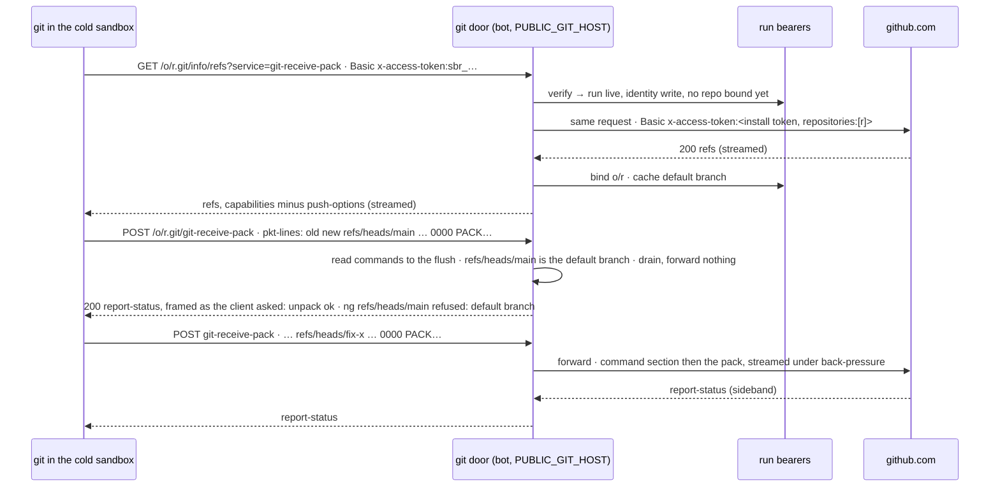

# A cold run's only GitHub credential is its run bearer; the bot's git door, on its own hostname, exchanges it per request and enforces the repository and the ref

**The ask.** Decide: adopt the git door for every run on the cold sandbox and E2B planes, and build it before record 0047, which files a person's pull request review into the coding session that wrote the code and needs that session's pushes bounded by something firmer than a prompt line; leave the resident plane on its credential file. Owner: the maintainer. Written for an engineer who knows the model proxy (`model-proxy.md`) and the three execution planes (`execution-and-trust.md`). Success criteria: (1) no GitHub token in a cold sandbox's or an E2B micro-VM's environment, creation environment, files or command lines, at any moment of a run; (2) a write run on those planes pushes only non-default branches of one repository, bound at its first push, and a push elsewhere is refused with a reason git prints; (3) every `gh` invocation the prompts and the read token's documented uses make keeps working with no prompt change; (4) the token-in-sandbox class of finding is closed by construction on those planes, not by redaction; (5) the resident plane is untouched.

## TL;DR

A run on the cold sandbox or E2B plane holds a one-hour GitHub installation token in its environment for the whole run: pi starts once with the token minted at that moment, a write run's token reaches every repository of the installation because the mint narrows permissions and never repositories, and a lexical guard against `printenv` is the only thing between the model's commands and the token. The bet is the model proxy's design pointed at GitHub: the run bearer the container already holds for its model calls becomes its only GitHub credential too, `git` and `gh` speak to a hostname of the bot's that they take for GitHub Enterprise, and the bot verifies the bearer, applies the policy a token cannot express (a write only to non-default branches of the one repository the run bound at its first push; the API read-only for every run) and forwards with an installation token it mints per request, pinned to that repository. The cost is one reverse proxy on the bot with a receive-pack command parser that answers refusals in git's own report-status, a second hostname in the deployment, the environment rewiring of two executors, and one measurement of how large real pushes are against the platform's request body ceiling. Decided: the door, its hostname, the policy, bind-on-first-push, the bearer's reuse, the resident unchanged. Open: the ceiling and the real push sizes, both measured by unit one before unit three turns the door on.

## Today at `cece6a73`

You would expect a cold run's write token to be scoped to one repository; `mintInstallationToken` posts a `permissions` subset for the read scope and nothing for the write scope, never a `repositories` list, while the resident's own mint sends `repositories: [<its one repo>]` on every call. You would expect the token to be handed over per command; the executor does re-resolve it per `exec`, but pi is started once with the environment of that moment and its `bash` children inherit it, so the token minted at start, handed out with at least 25 minutes left, is the run's for its 45-minute budget. You would expect this design to have to cover every coding run; it does not, because `coding`, `review` and `ship` run on the resident when the repository is onboarded and warm, with its per-attach one-shot credential file, and reach the cold sandbox only as the fall-through, while `explore` and every E2B run live there always. You would expect a model key in the container; there is none: pi's `models.json` names the bot's proxy at `PUBLIC_BASE_URL` as its one provider, keyed by the run bearer `sbr_<runId>.<secret>`, minted at provision, revoked at the run's end, valid five minutes past the budget, adopted or rotated across restarts. You would expect the prompts to write through `gh`; they forbid it by name and use it for reads (`gh pr view`, `gh pr diff`, `gh pr checkout`, `gh search code`, `gh api`, `gh repo list`, `gh repo clone`, `gh run view --log`, `gh pr checks`), and both the sandbox image and E2B set `gh auth git-credential` as git's helper. The survey is Appendix A.

## The shape

The **git door** is a reverse proxy in the bot process, answering on a hostname of its own (`PUBLIC_GIT_HOST`, a second route to the same container), that terminates GitHub's smart-HTTP and REST protocols so that `git` and `gh` take it for a GitHub Enterprise instance. Every request to the bot, including a container's own call to one of the bot's public hostnames, enters through the **shim**, the Worker in front of the bot's container (`deploy/cloudflare/worker.ts`), so the platform's request limits apply to the door as they do to the model proxy. The client authenticates with the run bearer it already holds, sent the way each client sends credentials, Basic `x-access-token:<bearer>` from git and `token <bearer>` from `gh`; the door looks the bearer up (the run, its identity, its bound repository, whether it is live), decides, and forwards to github.com with an installation token minted for that request's need: a read token for every API call and every fetch, a write token pinned to the run's bound repository for a push. The credential the client holds works only at the door and only while the run lives; the credential GitHub sees never leaves the bot. The closest known shape is the model proxy already in this tree, and outside it a credential-injecting egress proxy; the one way this differs from a plain injecting proxy is that the client's credential names a run, so the policy is per run and per ref, and a refusal is spoken in git's protocol so the model reads why.

## One trace: a repository-less coding run, a wrong push, the right one, then the run ends

A coding run lands on the cold sandbox plane with no repository resolved (the request named none, and the prompt tells the model to find it), budget 45 minutes. The dispatch mints the bearer as today and writes the environment: `GH_HOST=<git host>`, `GH_ENTERPRISE_TOKEN=<bearer>`, no `GH_TOKEN`; git's helper is already `gh auth git-credential`, so git asks `gh`, which answers with the bearer for that host.

1. The model runs `gh repo list acme --limit 50` and `gh repo clone acme/api`. `gh` POSTs `/api/graphql` and GETs `/api/v3/...` on the door, which verifies the bearer, forwards with a read token, and rewrites `Link` headers to its own host; the clone is `GET /acme/api.git/info/refs?service=git-upload-pack` then `POST /acme/api.git/git-upload-pack`, forwarded with the read token, streamed both ways. Nothing is bound: reads are open to every repository the installation covers, as the read token is today.
2. The model runs `git push origin HEAD:main` by mistake. git sends `GET /acme/api.git/info/refs?service=git-receive-pack`. The door verifies the bearer (an unknown run is 404, a wrong secret 401, a revoked or expired one 403, as the model proxy answers), sees identity `write` with no repository bound, mints a write token with `repositories: ["api"]` and forwards. GitHub answers 200, so the door binds `acme/api` on the run's entry, reads the default branch once (`main`) and caches it there, and streams the refs back with `push-options` removed from the advertised capabilities. Had GitHub answered 404, a typo or a repository outside the installation, nothing would have bound.
3. git sends `POST /acme/api.git/git-receive-pack`. The door reads pkt-lines until the first flush, at most 64 KiB, skipping `shallow` lines, and finds one command, `<old> <new> refs/heads/main`, whose capabilities asked for `report-status` and `side-band-64k`. That is the default branch. The door drains the rest of the body without forwarding a byte and answers 200 with a report-status of its own, framed in sideband band 1 as the client asked: `unpack ok`, `ng refs/heads/main refused: default branch`. git prints `! [remote rejected] HEAD -> main (refused: default branch)`; the tool output carries it; the model reads it.
4. The model runs `git push -u origin fix-x`. Same discovery; the command names `refs/heads/fix-x`; the door forwards the buffered command section, then streams the pack as it arrives, then streams GitHub's sideband report back. `ok refs/heads/fix-x`.
5. `gh pr view 42 --json title` runs; `gh` POSTs `/api/graphql`; the door forwards with a read token; the query is a read; `gh` prints.
6. The wind-down asks for the write-up and one last push before the budget ends; the bearer is live; the push goes through as in step 4.
7. The run ends and the bearer is revoked. A process the run left behind runs `git push`; the door answers 403 `revoked` and forwards nothing.

The property this proves: the container never held anything that works outside the run's life, outside the one repository it bound for a write, or against that repository's default branch, and every refusal reached the model in words.

## The difficulty map

1. **The push** (most work): reading the command section across git's request shapes, refusing in the framing the client negotiated, streaming the pack, and a body ceiling nobody has measured. Most likely wrong. [The push](#the-push)
2. **`gh` as a GitHub Enterprise client** on a hostname of ours: the prefixes, the auth shape, `Link`, the shapes the prompts use. [gh talks to an Enterprise that is us](#gh-talks-to-an-enterprise-that-is-us)
3. **Binding and the bearer**: a write run with no repository, the mint cache per repository, the bearer's life. [Binding and the bearer](#binding-and-the-bearer)
4. Rewiring two executors, the specs, the security model and record 0009's note. [Rollout](#rollout)

## The push

The constraint is the protocol as git actually sends it. Smart HTTP is two requests per operation, `GET <repo>.git/info/refs?service=<svc>` and `POST <repo>.git/<svc>`, `git-upload-pack` for fetch and clone and `git-receive-pack` for push. Fetch may use protocol v2 and its bodies carry nothing we police. Push has no v2: a receive-pack body is pkt-lines of `<old-sha> <new-sha> <refname>`, the first carrying a NUL and the client's capabilities, possibly preceded by `shallow <sha>` lines from a shallow clone, terminated by a flush packet, then the pack bytes, or nothing when every command is a delete. Two more shapes matter. For a body over `http.postBuffer` (1 MiB) git first POSTs a probe whose body is a bare flush and then streams the real body chunked, so a POST with zero commands must be forwarded, not refused. And a client that negotiated `push-options` sends a second pkt-line section after the flush. The door removes `push-options` from the capabilities it advertises on the discovery response, so no client of ours sends that section, and `push-cert` is not advertised by GitHub. The parser is fail-closed: a line in the command section that is neither `shallow` nor a command is refused.

A refusal must be spoken in git's protocol, because git shows a non-2xx body only on the discovery GET and prints just `RPC failed; HTTP 403` for the POST. So the door drains the request without forwarding a byte and answers 200 with a report-status of its own, `unpack ok` and one `ng <ref> <reason>` per refused ref, framed the way the first command line's capabilities asked: inside sideband band 1 when the client requested `side-band-64k`, as `report-status-v2` when it requested that, bare pkt-lines otherwise; git prints it as `! [remote rejected] <ref> (<reason>)`. The **ref rule**: a write identity may update `refs/heads/<name>` for any `<name>` that is not the repository's default branch, and may delete nothing; `refs/tags/*` (release tooling's, bot-side) and every other namespace are refused; a force-push cannot be told from a fast-forward in the command section, so protected branches stay GitHub's rulesets' to guard, as this repository's `main` already is, and the ref rule is defense in depth for repositories without one. An allowed push forwards the buffered section then pipes the rest of the request upstream and the response downstream under back-pressure, the shape the model proxy's node adapter already has.

The upstream credential is minted per request with the mint the bot already has, with two changes: a write token is minted with `repositories: [<the bound repository>]`, and the mint's cache gains a key per (scope, repository) instead of one slot per scope, so the mint rate stays one per repository per 35 minutes and, at tens of concurrent cold runs over a handful of repositories, a few dozen mints an hour. Fetches and clones forward with the read token for any repository the installation covers, as the read identity may today. A run with identity `none` has no door.

Invariants a test can check: no request reaches github.com without a verified bearer whose run is live; a receive-pack whose commands name the default branch, a delete, a tag or a foreign namespace is refused in a report-status, in the negotiated framing, before any byte is forwarded; a probe POST with zero commands is forwarded unchanged; a write token is minted with the bound repository and never without; the door's log line names the run, the service, the refs and the status and never a credential.

Failure modes. GitHub answers 401 mid-operation on an expiring token: it passes through, git reports it, the next request mints afresh. The platform's request body ceiling is below a real push: the shim answers 413 and the push fails loudly, and there is no second path, because the bot's container is reachable only through the shim. That ceiling is the one number this record does not have, and it comes with a second unknown, whether the shim streams a chunked body to the container or buffers it, which decides whether "under back-pressure" means anything on the request side. Unit one measures three things before unit three turns the door on: the ceiling and the streaming behaviour, by synthetic pushes of 30 MB and 100 MB from a cold sandbox to a scratch repository (the platform's documented figure is 100 MB on this plan, to be confirmed), and the real distribution, by logging the body size of every receive-pack and the byte count of every upload-pack the door sees while it runs in shadow, since the door carries every cold run's clone and fetch as well as its pushes. If real pushes approach the ceiling the record is amended with the number and the known limit; a coding run's push of source is expected to be far under it, but that is the guess the measurement replaces.

The alternative this beat is a credential helper in the container asking the bot for a short-lived token per operation. The token still lands in the container for the operation and in git's memory, any process there can call the helper, and git's credential protocol carries host and path but never the ref, so the ref rule is unenforceable. The door sees the command section; that is the whole reason to terminate the protocol.

## gh talks to an Enterprise that is us

The constraint is that `gh` cannot be pointed at a proxy for github.com but can be pointed at another host: with `GH_HOST=<host>` and `GH_ENTERPRISE_TOKEN` it treats `<host>` as GitHub Enterprise, calls `https://<host>/api/v3/<path>` for REST and `https://<host>/api/graphql` for GraphQL, and clones `https://<host>/<owner>/<repo>.git`. Those paths cannot move, and on the bot's main hostname `/api/*` is already the dashboard's command surface behind Cloudflare Access, which `access-gate.md` binds to one predicate and no second prefix list. So the door answers on a hostname of its own, `PUBLIC_GIT_HOST`, a second custom domain on the same Worker in the deployment profile, with no Access application on it, and the bot's server dispatches on the `Host` header before any path: on the git host the three prefixes `/api/v3/*`, `/api/graphql` and `/<owner>/<repo>.git/*` are the whole surface, and on the main host nothing changes. That also keeps every `.git` path out of the main host's root namespace, and the unit tests give the door a plain non-`localhost` hostname through the `Host` header, which `gh` needs to treat a host as Enterprise at all.

The **API rule** is simpler than the ref rule: every API request forwards with a read token, whatever the run's identity. REST accepts GET and HEAD and answers 405 to anything else; GraphQL accepts POST because `gh` reads through it (`gh pr view` is a GraphQL query), and a mutation fails at GitHub with 403 because the token cannot write. `Link` headers in responses point at `api.github.com`, so the door rewrites them to its own host, or `gh api --paginate` would leave the door with no credential. `X-GitHub-Api-Version`, `Accept` (including the `diff` media type `gh pr diff` asks for) and a 302 to a blob host (`gh run view --log`) pass through.

The proof is a conformance test that runs every `gh` shape the prompts and the read token's documented uses contain, `gh repo list`, `gh repo clone`, `gh search code`, `gh api`, `gh pr view`, `gh pr diff` with and without `--name-only`, `gh pr checkout`, `gh pr checks`, `gh run list`, `gh run view --log`, `gh cache list`, against the door with a fake upstream, asserting the forwarded path, method, headers and token scope, plus one live coding run and one live explore run on the production target with the door on. `gh auth status` probes `/api/v3/user`, which an installation token cannot answer today either; parity is a warning both ways.

Invariants: every API request carries a read token; a non-GET, non-HEAD REST request is 405 at the door; every listed shape forwards to the path github.com expects with `Link` rewritten.

## Binding and the bearer

The constraint is that a write run can exist with no repository: `coding` is a resident preset that falls through to the cold sandbox when the request resolved no repository, and its prompt tells the model to find one with `gh repo list`. A pin needs something to pin to. The design **binds on first push**, after GitHub has confirmed the repository: the first `git-receive-pack` discovery a write run makes is forwarded with a write token pinned to that repository, and only a 2xx from GitHub binds the repository on the run's bearer entry and caches its default branch there, so a typo or a repository outside the installation binds nothing. Every later write must name the bound repository or is refused in the report-status; there is no unbind, so a run that bound a real but wrong repository pushes nowhere else for its life, ends, and the next run binds afresh. A run whose request resolved a repository is bound at provision, and its first push must match it. Reads never bind.

The bearer is the model proxy's, unchanged in life and mechanics: minted at provision, revoked at the run's end, valid five minutes past the budget, adopted by a re-attaching generation and rotated for a relaunched process. Its entry gains the GitHub identity it carries (`read`, `write`, or none), the bound repository and the cached default branch. The wind-down's last push happens before the budget ends, as its last model call does; the post-step that opens or edits the pull request is bot-side on the App credential and never used the bearer. A bearer copied out of a transcript is a bearer: it pushes that run's bound repository's non-default branches from anywhere for the run's life and nothing after; the token it replaces pushed every repository of the installation for an hour from anywhere. That is the whole trade.

## Why not X

**Why not mint with `repositories: [<repo>]`, keep the lexical guard against `printenv`, and stop there?** It is right and the door does it too, but it is not the boundary: the token still sits where model-written commands run for the run's life, the guard is a regex over the command text that `python -c 'import os; print(os.environ)'` walks past, and it still permits a push to the default branch and every API write the installation holds.

**Why not put the door on the sandbox Worker instead of the bot?** The Worker would need the App key, which only the bot and the resident hold (record 0009); the bot already has the mint, the bearer store and the spans, and the sandbox Worker is a thin exec proxy on purpose.

## Boundaries

The door covers runs on the cold sandbox plane and on E2B. The resident plane is unchanged: its own App key, per-repository tokens, a one-shot per-attach credential file, root-owned mirror, no ref rule of its own; a door there is a later record if the credential file ever proves a problem. The `local` executor is unchanged. The bot's own GitHub use (issue writes, pull request open and edit, the review post) stays on the unpinned App credential in the bot process, so "a write token is minted with the run's repository" holds at the door and nowhere else. Fetch and clone are not policed by repository. A force-push cannot be told from a fast-forward. The bot becomes the data plane for every cold run's clone, fetch and push bytes, which record 0016's sizing of the long-lived process already accepts and the shadow log measures. AGENTS.md invariant 5's clause "GitHub is the REST API on the App credential" is extended to smart-HTTP on the same credential, still from the bot and never a shell-out.

## What would change our mind

If unit one's measurement shows real pushes near the platform's body ceiling, or the shim buffering request bodies, the door still ships for reads, the API and the ref rule, and the record is amended with the ceiling as a known limit for large pushes. If `gh`'s Enterprise emulation breaks a listed shape in a way the conformance test cannot fix, unit two ships `gh` on a read-scoped token in the environment while `git` uses the door, halving the win and keeping the push boundary. Reversibility: `execution.gitDoor` is a flag, off until unit three, and every unit before it leaves today's environment intact.

## Rollout

Unit one: the door on `PUBLIC_GIT_HOST`: upload-pack and receive-pack forwarding, the command parser with its fail-closed rule, the report-status refusal in the negotiated framing, the `push-options` strip, bind-on-first-push after GitHub's confirmation, the (scope, repository) mint cache, the bearer's identity, binding and default branch, unit tests against a `git http-backend` fixture as the fake upstream, and the shadow log of receive-pack and upload-pack sizes with the two synthetic pushes and the shim's streaming behaviour recorded in the PR. Unit two: the API door: the `Host`-first dispatch, the read token on every call, `Link` rewriting, the conformance test over the listed `gh` shapes. Unit three: the environment rewiring of the cold sandbox and E2B behind `execution.gitDoor` (`GH_HOST`, `GH_ENTERPRISE_TOKEN`; `GH_TOKEN` absent from the per-command and the creation environment when on), the second custom domain and its route in the deployment profile, one live coding run and one live explore run, then the flag's default flips to on. Unit four: the specs and records: `execution.md` item 5's environment map, `model-proxy.md` a new item for the second door, `security-model.md`'s execution and control plane rows rewritten (a cold run holds a run bearer; the bot mints repository-pinned write tokens and carries push bytes), a dated re-evaluation note appended to record 0009, and the open token-in-logs issue closed with the live run as its receipt.

## Appendix A: the survey at `cece6a73`

| Fact | Where |
|---|---|
| The bot mints one-hour installation tokens; the read scope posts a `permissions` subset (contents, pull_requests, issues, actions, checks, metadata: read); the write scope posts no body; `repositories` is never sent; one cache slot per scope; a cached token is handed out with at least 25 minutes left | `src/execution/githubApp.ts` lines 63 to 70, 74, 85, 203, 212 to 217 |
| The resident's mint posts `repositories: [<own repo>]`, caches per slug with a ~25 minute margin, and the private key never enters the container; git receives the token through a one-shot credential file | `deploy/cloudflare-resident/worker.ts` lines 817 to 870; `resident-repos.md` item 8 |
| `coding`, `review` and `ship` are `repo-resident` presets and reach the per-thread sandbox only when no resident serves the resolved repository or none was resolved; `explore` is `repo-cold`; the coding prompt tells the model to find the repository with `gh repo list` | `src/agents/registry.ts` lines 240, 654, 669, 693, 723; `src/execution/factory.ts` lines 286 to 299; `src/core/dispatch/provision.ts` line 399 |
| The executor re-resolves env per `exec` and sends it as `env` in the body; pi is started once with that environment and its `bash` children inherit it | `src/execution/cloudflareSandbox.ts` lines 39 to 45, 151, 164; `src/execution/sandboxEnv.ts`; `src/core/harness/container.ts` lines 257, 550 |
| E2B bakes the first resolved env into the micro-VM's creation and sends env per command | `src/execution/e2b.ts` lines 63 to 67, 83 to 84 |
| A lexical guard refuses env dumps and `$…_TOKEN` reads in coding runs' commands | `src/core/harness/pi/toolRules.ts` lines 96 to 107 |
| The sandbox SDK pin is 0.13.0-next.751.1; no `base64 -d` inlining remains | `deploy/cloudflare-sandbox/package.json` line 19; `git grep` at the sha |
| pi's `models.json` names the bot's proxy at `PUBLIC_BASE_URL` as its one provider, keyed by the bearer; a container reaches it through the shim; no service binding from the sandbox Worker to the bot exists | `src/core/harness/pi/process.ts` lines 117 to 118, 205 to 242; `src/index.ts` line 423; `deploy/cloudflare-sandbox/wrangler.template.jsonc` |
| The run bearer: `sbr_<runId>.<secret>`, minted at provision, revoked at the end, `BEARER_MARGIN_MS` = 5 minutes, adopt and rotate, hash stored, constant-time compare, never logged; the door answers 404 unknown run, 401 wrong secret, 403 revoked or expired | `src/core/modelProxy/runBearers.ts` lines 18 to 31, 109 to 293; `model-proxy.md` items 2 and 3 |
| The model proxy's node adapter streams responses under back-pressure | `src/channels/modelProxy.ts` lines 668 to 671; `model-proxy.md` item 9 |
| `/api/*` on the main host is the dashboard's command surface behind Cloudflare Access, recognized by one predicate and never a second prefix list | `src/channels/commandHttp.ts` lines 28, 92 to 100; `src/index.ts` line 1002; `access-gate.md` line 15 |
| Prompts use `gh` for reads (`repo list`, `search code`, `api`, `pr view`, `pr diff`, `pr checkout`) and forbid writes by name; the read token's documented uses add `pr checks`, `run list`, `run view --log`, `cache list`; the resident review prompt says `gh` is not installed there | `src/agents/registry.ts` lines 240, 242, 245, 403, 406, 413, 431, 470, 480, 541, 547; `src/core/reviewTarget.ts` line 103; `execution.md` item 5 |
| The sandbox image and E2B set `gh auth git-credential` as git's credential helper | `deploy/cloudflare-sandbox/Dockerfile` line 55; `src/execution/e2b.ts` line 21 |
| The post-step opens or edits the pull request bot-side on the App credential before the run's end | `src/core/dispatch/runLoop.ts` lines 1049, 1185, 1209, 1351 |
| The security model's control plane row says "no code-pushing credential"; record 0009's consequence 3 already concedes the bot-minted sandbox token | `docs/explanation/security-model.md` lines 32 to 34; record 0009 line 24 |
| This repository's default branch is guarded by an active ruleset (pull request required, no deletion, no force) with no bypass | GitHub rulesets on the repository at the time of writing |
| Run history keeps records 30 days by default | `src/core/runRecord.ts` line 620 |
