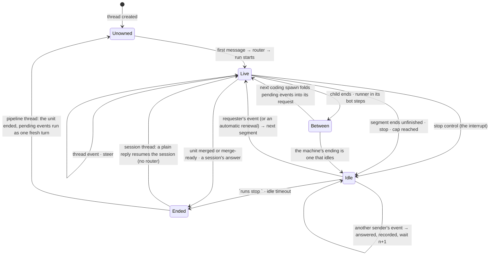

# A thread has one owner for its life, a message is one event in a mode the sender chooses, and a pipeline idles instead of ending

**The ask.** Decide (the maintainer, before the plan is written): adopt this as the one model of a plain follow-up in a thread, for every agent, surface and ingress; retire the `continue` sentence on the stop card and the reply-that-spends-a-renewal that record 0046's plan named as its unit eleven; amend record 0046 so a continuation a person woke carries the person's words beside the previous handoff; and name the model-driven thread owner as the next record, gated on a measurement this record specifies, not built here. Written for an engineer who knows the dispatcher's routing and admission stages and has not followed the lease work.

**Accepted 2026-09-17**, executed from [the plan](../plans/2026-09-17-004-feat-a-thread-has-one-owner-and-a-pipeline-idles-plan.md), with three decisions the maintainer took at acceptance. An idle unit parks the plan's later units; the walk stays sequential. A stop pauses a unit rather than ending it, and the only exits are `runs stop <unit key>` and the idle limit. No mode is a typed word: a plain message steers the owner, and an interrupt is the stop control the surfaces already carry followed by a message, so the `!steer`, `!queue` and `!interrupt` prefixes the draft borrowed from Capy are withdrawn, `queue` with them, and the open question on an interrupt permission is closed by the stop control's own permission. A wake after a stop reopens the cut segment under its remaining lease and spends no renewal, because that lease was not spent; the lease rule below applies at a lease or a cap. The owner rule and the fold between rounds are not behind the idle setting: turning idle off returns the old endings, not the old routing.

Success criteria the decision is judged against:

1. A person's plain reply into a thread whose pipeline unit stopped continues that unit, with the person's words in the next segment's request, on every channel that carries a thread history, with no keyword and no command.
2. No preset gains a verb for "continue": the same event and the same lifecycle carry a coding session, a research thread and a ship pipeline.
3. A plain reply during a live run is steered, and a stop followed by a reply interrupts, on pi and OpenCode alike; no call in flight is aborted, and no word in the reply selects either.
4. A message into a thread whose unit idled at its lease spends nothing unless the requester wrote it, in which case it spends exactly one renewal; at the grant's cap every message, the requester's included, is answered with the cap.
5. The router is not called for a plain reply into a thread that has an owner; a directive naming an agent is not a plain reply.

## TL;DR

A ship pipeline unit that stops at its lease leaves its thread with no owner, so the next reply runs the router as if the thread were new and the only continuation is a by-hand re-issue; 12 of the 59 ship coding children the budget analysis read before this record ended at the clip. The bet is that a thread has **one owner for its life**, the pipeline unit while it is unfinished or else the newest continuable session, that every plain message is **one event** stored on the owner and delivered as a steer, or as the next turn after a stop, and that a unit **idles** instead of ending. It costs a wait on the Workflow runner that parks the plan's later units while a person is needed, a mailbox on the unit row, the instance id written on the live ship run, and an amendment to record 0046. Decided: the owner rule, the two modes, the idle unit, the requester's word at the lease; open: whether a waiting instance is billed. Doing nothing keeps "re-issue `agent:ship` in this thread with the same text" on every stop card.

## Today at `93c64383`

A reply into a stopped pipeline's thread does not reach the pipeline: `stickyAgentOf` skips every run a coordinator spawned and the ship run writes no session, so the reply resolves through the router as a fresh thread's would, and thread-admission item 1 says the same of a reply between two rounds (`src/core/dispatch/thread.ts`). The router never reads a run's state, and it is already skipped for a live thread before it is called (routing-and-config item 21; `src/core/dispatcher.ts`). A finished walk ends the Workflow instance; a re-issue is a new instance `plan-<id>-<n>`, refused while the first still runs (`src/core/coordinator/handOff.ts`). A reply into a live run has one mode, steer at the next turn boundary, and item 2 forbids aborting a tool or model call in flight for it. The runner already blocks on `step.waitForEvent` and the bot already sends events to an instance by id; the platform buffers an event sent before its wait, allows a wait of 365 days, resumes an instance on the code now deployed, and leaves waiting instances out of the concurrency count. The full survey is the appendix.

## The shape

This is a session model, not a routing model. Every thread has an **owner**, the one thing that receives what arrives there. A live run owns the thread while it is in flight. Otherwise the **durable owner** is the pipeline **unit** whose row names the thread, for as long as that unit has no ending, whether its child is live, its runner is between rounds, or it is idle; in a thread with no unfinished unit, the durable owner is the newest continuable session a person addressed, which is today's sticky agent. A plain message into the thread is a **thread event**: the sender, the text, the attachments under the inbox's 400 KiB cap, and a **delivery mode** no word in the text selects. `steer`, what every plain message is, is folded in at the owner's next turn boundary; `interrupt` is a stop control followed by a message: the stop lets the call in flight finish, drops the rest of that turn and idles the owner, and the message is its next turn. An idle owner takes every message as its next turn. A unit **idles** rather than ends when a segment closes with the unit unfinished, when a stop lands, or when the grant's cap is reached; the runner reads the unit's pending events before every spawn and at its wait, and at the lease only the **requester**, the person id the instance record carries, opens a segment, spending one renewal. A request directive keeps today's meaning. The router runs when a thread has no owner and at no other time.

The closest known shape is Anthropic's Managed Agents session: `idle`, `running`, `terminated`; a `user.message` queued while running; `user.interrupt` that lets a running tool finish; a session at `budget_reached` idle and refusing new work until its budget is raised. The one difference is that our owner cannot keep its process across a lease, because containers are replaced on release, so a unit resumes from the recorded sha and the write-up as a new run, the way a Copilot coding-agent follow-up starts a new session with the pull request's context.

The property the diagram shows: while a unit is unfinished its thread never returns to `Unowned`, so the router is paid once per owner, and no window between rounds is unowned.

## One trace: a unit idles at its lease, a teammate nudges, the requester continues, the bot rolls in between

A person posts "fix the flaky parser tests" in a channel whose scope grants six renewals; the product default is zero. The router picks ship; the runner opens the generated plan's one unit in the requesting thread, segment one, under a 120-minute lease; the coding child pushes `a1b2c3d` at minute 37 and its loop ends at the lease with two follow-ups in its handoff and no pull request.

1. The machine reads progress off the record, the grant has six, the fit holds: the segment ends `continued` and segment two opens. Automatic renewal is unchanged.
2. Segment two's child pushes nothing and ends at its lease. Today the unit ends `aborted`. Now it ends **idle**: the runner writes `idle: { why: "no_progress", renewalsLeft: 5, from: "a1b2c3d" }` on the unit row, posts the card ("no progress in the last lease; grant holds 5 renewals; reply in this thread to continue"), and blocks on `step.waitForEvent` under the step name `<unit>/idle/1`, timeout the scope's idle days, seven by default.
3. A teammate replies "looks stuck, keep going". The dispatcher, where it already skips the router for a live thread, finds no live run, finds the instance through the ship run's `instanceId`, and finds the unit row for this thread with no ending. It appends the event to the row's pending list and nudges the instance. The runner wakes, reads that the sender is not the requester, answers "the grant's renewals are the requester's to spend; 5 left", marks the event answered, and waits again under `<unit>/idle/2`. No router ran.
4. A release replaces the bot. The instance keeps waiting and on wake runs the code now deployed; the resident released the thread's idle binding an hour after the child ended, and the continuation needs nothing from it.
5. The requester replies "the flake is the clock mock, pin it and push". The dispatcher appends and nudges. The runner spends one renewal (four left), writes the row for segment three with `from: a1b2c3d` and the event's id, and opens segment three through unit ten's path: a new coding run from `a1b2c3d` in a clean tree, briefed with segment two's write-up and handoff and then the requester's words. The card reads "renewal 2 of 6, continues a1b2c3d".
6. Segment three's child ends with a pull request; the runner is in its `pr-check` step when the requester replies "also drop the retry loop". No run is live and the unit has no ending, so the dispatcher appends and nudges. The next spawn is the review, which is read-only, so the event stays pending; the fix spawn that answers the review's findings folds it into its request as a follow-up, the way a resumed run's inbox is folded today.
7. The fix round pushes, the re-review approves, the unit ends `merge_ready`. The unit has an ending, the thread has no durable owner because a coordinator's child never owns a thread, and any event still pending runs as one fresh turn, as item 4 does for a run's unconsumed follow-ups. The next plain reply routes fresh.
8. Had segment three idled and nobody replied, the requester could end it with `runs stop plan-<id>:<unit>`, or the wait would reach the idle days and the unit would end `idle_expired`; either way the thread routes fresh from then on.

The property the trace proves: while the unit was unfinished, no plain message reached the router, none was lost between rounds, no keyword was typed, and one number bounded every renewal, automatic or by hand.

## The difficulty map

1. **The idle unit** (most likely to be wrong; most work with the modes): a wait that parks the plan, a pending list that closes the between-rounds gap, and a wake that spends at most one renewal per event. Section: the idle unit.
2. **Delivery modes on two harnesses**: an interrupt that is the stop control, honored by both harnesses without cutting a call and without a word. Section: delivery modes.
3. **The owner rule's edges**: finding the unfinished unit from the page the dispatcher already reads, which endings idle, and what an idle unit outranks. Section: the owner rule.
4. **The lease and the cap**: one renewal per event, from the requester only, and the amendment to 0046 it needs. Section: the lease.

## The idle unit

The constraint is that the runner's continuation state lives in three places that die at different times: the Workflow instance (survives a bot roll, dies when `walk` returns), the unit rows on the state Worker (survive everything), and the resident's thread binding (released an hour after it goes idle; its disk lost when the container sleeps). Today `walk` returns on every ending, so the only continuation is a new instance, and a reply between rounds is a fresh request because nothing owns the gap.

The design keeps the instance alive and makes the unit row the mailbox. A unit whose segment ends under a refused renewal, a stop or the cap does not settle in `walk`: the driver writes the idle row and blocks on `step.waitForEvent` for the unit's nudge, under a step name indexed per wait (`<unit>/idle/<n>`), since a step name reused inside one instance is answered from the durable step cache rather than waited on. The dispatcher, finding the unit as owner, appends the thread event to the row's **pending** list, capped like the durable inbox row at 400 KiB with dropped attachments recorded, and sends the instance a payload-free nudge event. The durable inbox itself is keyed by run id and is not reused; the pending list is a new field on the row with the inbox row's shape. On wake the runner reads the pending list, applies the lease rule, and either opens the next segment through unit ten's `continued` path with the pending texts appended to the segment's request, or answers, marks the event answered, and waits under the next index. A hundred answered nudges in one idle end the unit `idle_expired`, since each burns a step. Between rounds the runner does not wait; it reads the pending list before every coding spawn and folds it into the child's request as thread-admission item 5 folds a resumed run's inbox; a review spawn is read-only and leaves the list for the coding spawn after it. Events still pending when the unit ends run as one fresh turn in the thread, as item 4 does for a run's unconsumed follow-ups. The wait's timeout is a scope setting, seven days by default, a design number unrelated to the worktree TTL; at the timeout the unit ends `idle_expired`.

The walk is sequential, one unit at a time in dependency order, so an idle unit parks the plan's later units. That is decided: a unit idles exactly when a person is needed, and a plan that runs past the unit a person must answer would build on work the person has not accepted. It has a cost the record names: a seeded plan that today finishes `failed` in minutes now waits at its first unfinished unit until a reply, `runs stop <unit key>`, or the timeout, and the hand-off's "a runner for this plan is still running" refusal becomes the correct answer to a re-issue, reworded to name the idle unit's thread and the stop. The parent card names the idle unit and its thread.

The platform facts this stands on are documented (appendix): an event sent before its wait is buffered; a wait may last 365 days; a resumed instance runs the code now deployed, at the price the "Rules of Workflows" already exact, that step names before a completed step never change, which our unit-and-segment step names already keep.

Invariants. A unit with no ending owns its thread until it has one. A pending event is consumed once: the runner marks it with the segment, the spawn or the answer that consumed it in the same durable step, so a replay after a reclaim does not fold it twice. The segment row is written before the segment runs, once per index; this is unit ten's row, unchanged. Every answered nudge is on the row, so the card shows who nudged.

Failure modes. The Workflow is terminated by hand: the row keeps its idle mark, the dispatcher's nudge fails, and the message routes fresh with a card line saying the pipeline was terminated. A nudge arrives while the woken segment's child is live: the child is the live owner and admission steers the same text into it; the runner marks the pending event consumed by that run at its next read. A different task typed into an idle thread becomes the segment's request, as any reply does; a new task belongs in a new thread, and the card says so, as Capy's `!new` does.

The alternative it beat: re-issue on reply, where the dispatcher routes the reply to ship and the hand-off opens `plan-<id>-<n+1>` seeded from the rows. It works today and needs no wait. It loses on two facts: a new attempt reruns the unit's pre-check and branch steps and starts a fresh coding round from the branch, discarding the segment sequence and the write-up brief; and a second instance id splits the unit's runs page, its segment rows and its grant count into two places a person and the cap rule must reconcile.

## Delivery modes

The constraint is thread-admission item 2: a tool call or model call in flight is never aborted for a follow-up, because a retry over a side effect that already happened is the failure it avoids. Both harnesses steer at the turn boundary today: pi drains the inbox on every event and tick and delivers after the tool results of the turn in flight, before the next model call; the OpenCode bridge posts a steer into the running execution and already carries a `steer` or `queue` delivery on its continue prompt.

The mode lives on the thread event and nowhere else, and nothing in the message text selects it: the maintainer's rule is that a reply is read by context, never by a keyword, and a `!queue` or `!interrupt` prefix is a keyword. `steer` is every plain message, today's path. `interrupt` is the stop control every surface already has (the card's Stop button, the run page's Stop, `runs stop <run id> --mode soft`) followed by a message: the soft stop lets the call in flight finish, the remaining tool calls of that turn are not executed and their results say the sender cut the turn short, the owner idles, and the next message is its next turn. No new abort primitive is needed, item 2 holds unchanged, and the mode is the harness's to honor, not the preset's. `queue`, which differs from `steer` only on OpenCode mid-turn, is not offered: nothing but a keyword could select it today, and on pi the turn boundary and the turn's end are one moment. A surface that grows a mode control (a picker on the dashboard composer) may offer it later without a record.

Invariants. An interrupt cuts at most one turn; a second stop during the same turn is a no-op. A steer records the `input` event and the `follow_up` note it records today; an interrupt records the stop with its actor and then the message as a fresh turn. Typing the word "stop" is not a stop: it is a message the owner reads as an instruction, the same as any other sentence; the mechanical stop is the control or the command.

Failure modes. A stop lands during the write-up: the write-up is the loop's last turn and is never cut, so the run ends as it would have and the next message runs as the fresh turn item 4 defines. A stop from a sender the run's stop policy excludes is refused as it is today.

The alternative it beat: interrupt as the default, Capy's choice, with `!` prefixes for the others. A filed outside fact (record 0047) will be a frequent sender, and a bot must never cut a person's turn; and a prefix is a keyword one preset's users would learn while the rest never see it.

## The owner rule

The constraint is that the owner must be computable where the dispatcher already skips the router for a live thread, from the runs page it already read, with at most one more read. The rule, in order: a live run in the thread owns it; else, when the page's ship run names its instance or a child names it by `parentInstanceId`, the unit of that instance whose row names this thread owns it if the row has no ending; else the newest continuable run a person addressed, today's sticky agent; else no owner. The one read is the instance's unit rows. The instance id is on a child's view today, and on the ship run's record only when the instance finishes, so unit one writes it on the live ship run's record at the hand-off, as a run event the record projects, and exposes it on the view. A coordinator's child never owns a thread, so an ended unit's thread routes fresh. A request directive keeps today's meaning: `agent:review <pr>` in a pipeline's thread starts a review when no run is live and is refused as an agent mismatch when one is.

The unit outranks a session. A research or general run a person addressed into a pipeline's thread between rounds is continuable, and today the next plain reply would resume it; under this rule the unfinished unit owns the reply. Decided: the pipeline is what the thread was opened for, and the session stays reachable with an `agent:` directive.

Which endings idle. A unit is **ended** when merged, merge-ready, blocked by a dependency, or refused at authorization: nothing a reply can change. It is **idle** in every other terminal: `aborted`, `wall_clock_cap`, `review_pending`, `round_cap`, `merge_refused`, `no_verdict`, `interrupted`, `stopped`; `continued` is not a terminal. The old kind becomes the idle row's `why` and the report keeps its sentence. A stop is idle on purpose: a person who stopped a run paused it, and a pause a later reply visibly wakes, with a card saying so, is what Capy and Managed Agents both do; `runs stop <unit key>` on an idle unit is the exit that ends it, and unit two gives that command a unit resolver and a default mode. The person who wants the thread for another task ends the unit that way, or from the End action beside the idle card's "waiting" line and on the unit's row, or starts a new thread, where the router runs; a stopped unit that nobody ends is closed by the idle limit.

The alternative it beat: run the router on every reply with the thread's state as context. It costs a model call per reply, the router today reads no run state so the context would be new work, and the field's default is owner-continues.

## The lease

The constraint is record 0046's invariant: segments under one request never exceed the grant's renewals. A message that spent nothing would let a nudge renew without bound. Managed Agents refuses a `user.message` at the cap until the budget is raised; the person raising it is the authorization.

Here the event is the authorization when its sender is the requester, the person id on the instance record, the same id every surface authenticates a person to. The requester's event at a lease spends one renewal and opens the next segment, the progress test set aside because a person's word replaces it. Any other sender's event is answered with who may spend and spends nothing. At the cap, no renewals left, every event including the requester's is answered with the cap, naming the scope setting that raises the grant. Widening the holder to a channel is the first thing to revisit.

This amends record 0046, which says a continuation's request "is the previous run's handoff, not the person's message": a continuation the machine renews keeps that rule; a continuation a person woke carries the person's words after the handoff, because the words are what the person asked for. The amendment is dated on 0046 in the plan's first unit.

Invariant: renewals spent by hand and by the machine count against one number, the segment rows, so the grant's ceiling is one ceiling.

## Why not X

**Why not make the ship run continuable, so today's sticky path carries the reply?** A session entry on the ship run would make stickiness name ship, the reply would reach the ship fork, and the fork's only continuation is the re-issue path: a new instance, the same two-places problem. The ship run is a hand-off that lasts seconds; a session entry on it is a name that lies about what can be resumed. What can be resumed is the unit, and the unit is what this record makes the owner.

**Why not a `continue` keyword or a `ship continue` command?** Today the keyword is card text; nothing parses it. Making it real would give one preset a verb, when the maintainer's rule is that any text in a thread is a nudge the system reads by context; a command would need a registry entry, a blast-radius row and a conformance row for one preset. The owner rule needs none and serves research and general threads the same day.

**Why not let the model orchestrate the thread, as Capy's thread agent does?** Record 0034 decided "coordinator as a state machine, never a model" for auditability and cost, and nothing here contradicts it: the owner rule is a lookup, the modes are a header, the idle wait is a step. The model-driven owner is a real option the field has taken; it costs a model call per follow-up and would amend 0034. It is the next record, gated on one measurement: over the first hundred owned threads or thirty days, whichever comes first, the share of plain replies into owned threads that ended in a by-hand re-issue. Under a fifth, the state machine stays; the baseline is the count of re-issued instances (`plan-<id>-<n>`, `n` above one) over the prior thirty days, measured before unit two.

**Why not persist the process instead of re-briefing from the write-up?** Capy sleeps the VM with its filesystem and Managed Agents keeps the sandbox, so both resume in place. Our resident releases an idle binding after an hour and its disk goes with the container's sleep. Re-briefing from the recorded sha and the write-up is the honest continuation until resident hibernation exists, and it is Copilot's shipped shape.

## Boundaries

Steer at the turn boundary stays the default and record 0047's filing is unchanged; the grant's cap stays per request; the model-driven owner and the router's prompt are out of scope; record 0034 stays in force. The old ending kinds remain in the `ship_round` vocabulary for records already written.

## What would change our mind

If a waiting instance is billed, the default idle days shrink to one; the limits page says waiting instances do not count against concurrency, and billing is unconfirmed before unit two. If more than a fifth of plain replies into owned threads still end in a by-hand re-issue after the measurement window, the owner rule is not what people mean by continue, and the model-driven owner record moves up. If parking a seeded plan on an idle unit blocks more than it protects, the idle wait becomes per unit with the walk proceeding to independent units, at the cost of a wait per unit. Reversibility: the idle unit, the wake and the cards sit behind the idle setting, and turning it off returns the old endings; the owner rule and the fold between rounds are the record's first unit and stay, so a reply between rounds is folded rather than routed fresh.

## Rollout

Unit one is the owner rule where the dispatcher skips the router for a live thread, the instance id written on the live ship run and exposed on the view, the pending list on the unit row, and the idle row on the unit machine with every old kind as `why`, behind a scope flag; it rewrites the stop card's sentence, dates the amendment on 0046, and folds unit ten's two review nits (the exhausted-grant sentence for a grant of one; a fresh branch counting a push of the base head as progress). Unit two is the indexed wait, the fold before every coding spawn, the nudge, the lease rule, `runs stop` on a unit key, the reworded re-issue refusal, the baseline count, and the wake latency measured against the run-finished wake, which a code comment today puts within a second. Unit three is the interrupt as stop-then-message on both harnesses: the soft stop's cut-short results, the idle it lands in, and the recorded mode, with the End action beside the idle card. Unit four is the measurement, read on the tracker issue. The plan holds the units; this record ends here.

## Open questions

| Question | Owner | Resolves it | Before |
|---|---|---|---|
| Is a waiting Workflow instance billed? | the maintainer | Cloudflare's billing page or a support ask | unit two |

## Validation criteria

| Criterion | Proof |
|---|---|
| The owner order: live run, the unfinished unit of the instance the page names, continuable session, none; an ended unit's thread and a coordinator's child never own; an `agent:` directive keeps today's meaning | `[gap]` unit one: `src/core/dispatch/thread.test.ts`, `src/core/dispatcher.test.ts` |
| A plain reply into an owned pipeline thread with no live run is appended to the unit's pending list and nudges the instance; no run, no router; the reply is acked with where it went | `[gap]` unit one: `src/core/dispatcher.test.ts` |
| The live ship run's record names its instance from the hand-off and the view exposes it | `[gap]` unit one: `src/core/dispatch/ship.test.ts`, `src/core/runsService.test.ts` |
| Every terminal but merged, merge-ready, blocked and refused ends `idle` with the old kind as `why` and its report unchanged | `[gap]` unit one: `src/core/ship/coordinator.test.ts` |
| The runner folds pending events into the next coding spawn's request, waits under an indexed step name when idle, spends one renewal on the requester's event at a lease, answers any other sender, answers everyone at the cap, marks each event consumed once, and re-waits; pending events at the unit's end run as one fresh turn | `[gap]` unit two: `src/core/coordinator/driver.test.ts` |
| An idle unit parks the walk; `runs stop <unit key>` ends it `stopped` and the walk proceeds; the timeout or the hundredth nudge ends it `idle_expired`; the re-issue refusal names the idle thread and the stop | `[gap]` unit two: `src/core/coordinator/driver.test.ts`, `src/core/coordinator/handOff.test.ts` |
| A nudge sent to an instance before its wait, across a bot roll, is read at the wait | `[gap]` unit two: a probe on the deployed Workflow, human-gated |
| A soft stop on a live owner lets the call in flight finish, drops the turn's remaining tool calls with the cut-short result and idles the owner; the next plain message is its next turn; every mode is recorded; nothing is aborted; no word in a message selects a mode | `[gap]` unit three: `src/core/harness/conformance.test.ts` (both drivers); `src/core/dispatcher.test.ts` |
| Live: an idle unit continued by the requester's plain reply in the channel that grants renewals, its segment row and card read on the tracker issue | `[gap]` unit two, human-gated |

## Sources

- [Managed Agents session operations](https://platform.claude.com/docs/en/managed-agents/session-operations), [session budgets](https://platform.claude.com/docs/en/managed-agents/budgets), [events and streaming](https://platform.claude.com/docs/en/managed-agents/events-and-streaming); [Claude Agent SDK sessions](https://code.claude.com/docs/en/agent-sdk/sessions); [Claude Code channels](https://code.claude.com/docs/en/channels).
- [OpenAI Agents SDK orchestration](https://openai.github.io/openai-agents-python/multi_agent/); [Google ADK multi-agent patterns](https://developers.googleblog.com/developers-guide-to-multi-agent-patterns-in-adk/); [Devin Slack integration](https://docs.devin.ai/integrations/slack); [Copilot coding agent, context within a pull request](https://github.blog/changelog/2025-09-30-copilot-coding-agent-remembers-context-within-the-same-pull-request/).
- Capy: [threads](https://docs.capy.ai/threads.md), [tasks](https://docs.capy.ai/tasks.md), [machines](https://docs.capy.ai/machines.md), [Slack](https://docs.capy.ai/integrations/slack.md), [billing](https://docs.capy.ai/admin/billing.md).
- Cloudflare Workflows: [events and parameters](https://developers.cloudflare.com/workflows/build/events-and-parameters/), [limits](https://developers.cloudflare.com/workflows/reference/limits/).

## Appendix: the survey at `93c64383`

| Fact | Proof |
|---|---|
| Stickiness skips every run a coordinator spawned and names the newest run a person addressed | `src/core/dispatch/thread.ts`, `addressed`, `stickyAgentOf` |
| A run is continuable only when finished with a session log; the ship run writes none | `src/core/dispatch/thread.ts`, `continuable`; `src/core/dispatch/ship.ts` |
| A reply into a finished pipeline's thread, or between two rounds, is a fresh request | `docs/reference/specs/thread-admission.md` item 1 |
| The router is skipped for a live thread before it is called; the thread's runs page is read before resolution, for a thread with history | `src/core/dispatcher.ts`, `threadLive`, `readThread` |
| The router reads the preset table, the thread's last directives, its repository, the sources block, the command tools and the request text; no run state | `docs/reference/specs/routing-and-config.md` item 21; `src/core/dispatch/route.ts` |
| A follow-up into a live run has one outcome, steer, unless it names another agent, which is refused; a tool or model call in flight is never aborted for it | `src/core/threadAdmission.ts`, `decideFollowUp`; thread-admission item 2 |
| Stop modes are `soft` and `hard`; `runs stop` takes a run id and a required mode | `src/core/runEvents.ts`; `src/core/commands/runs.ts` |
| The runner waits on `run-finished-<id>` and `checks-settled-<head>`; the bot sends events to an instance by id; an unmatched event is buffered; a step name is answered from the step cache when reused | `src/core/coordinator/driver.ts`; `src/core/coordinator/contract.ts`; `deploy/cloudflare/worker.ts` |
| The walk runs units one at a time in dependency order; a finished walk calls `finish`; a re-issue is a new instance `plan-<id>-<n>`; a second instance is refused while one runs | `src/core/coordinator/driver.ts`, `walk`; `src/core/coordinator/handOff.ts` |
| A seeded plan's unit runs in a thread of its own with a review thread beside it; a generated plan's one unit runs in the requesting thread | `docs/reference/specs/agent-ship.md` items 5 and 16 |
| The machine's terminals: merged, merge_ready, merge_refused, round_cap, wall_clock_cap, review_pending, stopped, aborted, no_verdict, interrupted, refused; `continued` is a segment's end; `blocked` is written by the walk | `src/core/ship/coordinator.ts`, `UnitEnding` |
| A generated plan's stop card tells the requester to re-issue `agent:ship` with the same text; the renewal card says "reply continue to spend one", which nothing parses | `src/core/ship/coordinator.ts`; `src/core/ship/renewal.ts` |
| The resident releases an idle binding after an hour; the container sleeps after an hour and its disk is lost; the seven-day worktree TTL is a separate bound | `deploy/cloudflare-resident/worker.ts`, `CLEAN_IDLE_RELEASE_S`, `IDLE_AFTER_S`, `WORKTREE_TTL_DAYS_DEFAULT` |
| The durable inbox is keyed by run id, caps a row at 400 KiB and records dropped attachments; a resumed run's inbox is folded into its request | `src/core/runLedgerWorker.ts`; thread-admission item 5; `src/core/dispatch/admission.ts`, `foldCarriedInbox` |
| pi drains the inbox on every event and tick and delivers after the tool results of the turn in flight; its abort is used only on terminal paths | `src/core/harness/pi/harness.ts` |
| The OpenCode bridge posts a steer into the running execution, carries a `steer` or `queue` delivery on its continue prompt, and interrupts on its terminal paths | `src/core/harness/opencode/bridge.ts` |
| The instance record carries the requester's person id, the grant and its source | `src/core/coordinator/contract.ts`, `CoordinatorInstance` |
| The run view carries `parentInstanceId` and not `instanceId`; `run_meta.instanceId` is written on the pipeline's record by `finish` only | `src/core/runsService.ts`; `src/channels/adminCoordinator.ts`, `parentRunRecord` |
| 12 of 59 ship coding children ended at the budget clip | record 0046, "Today" |
| The run-finished event wakes the runner within a second | `src/channels/adminCoordinator.ts`, a comment on `read-record` |
| Record 0046: a continuation's request is the previous handoff, not the person's message; a person's reply spends a renewal by hand | record 0046, "Renewal" |
| Workflows: `waitForEvent` up to 365 days, default 24 hours; an event sent before the wait is buffered; waiting instances do not count against concurrency; a resumed instance runs the code now deployed | Cloudflare Workflows docs |
| Managed Agents: idle at `budget_reached`; `user.message` at the cap is a 400; raising the budget resumes; an interrupt lets a running tool finish | Claude Platform docs |
| Capy: one agent per thread; Interrupt, Queue, Steer modes; `!new` for a separate thread; the machine sleeps after about two minutes | docs.capy.ai threads, machines, Slack |

## Amended 2026-09-18 — a finished unit stays warm, and its thread stays its own

*Re-evaluation, as an amendment after acceptance asks.* The record was accepted for three reasons: a thread has one owner for the unit's life, so no plain reply reaches the router while work is unfinished; a unit idles instead of ending, so a lease or a cap orphans nothing; and no word in a message selects anything. It drew the line of ownership at the unit's ending: "a unit is ended when merged, merge-ready, blocked by a dependency, or refused at authorization: nothing a reply can change", and the trace's step 7 returns the thread to unowned the moment the unit ends `merge_ready`. That sentence is wrong for the two endings that carry work. A merge-ready unit's gate is a person's merge, and the person asks for what they need before clicking it: proof, a screenshot, a small change. The night after acceptance a routed ship ended merge-ready and two people replied 43 and 54 minutes later, "show me screenshots" and "attach UI screenshots of what you delivered to this slack thread"; both routed fresh, and the router, which reads no run state, bound each to the help command. This amendment moves the line: ownership outlives the ending for a bounded **warm window**. Checked against the three reasons: the owner is the same unit, the message is the same event in the same modes, the nudge is the same nudge, and the router still runs once per owner; idle is untouched; no keyword is added. Checked against the three acceptance decisions: the walk still parks on an idle unit and never on a warm one, because the walk reads a unit's ending, not its warmth; the exits stay `runs stop <unit key>`, the End action and a limit; a plain message is still every mode's carrier. Nothing regresses: with the window at zero every sentence above holds byte for byte, the ending's thread routes fresh at once, and the plan's units one to eight are unchanged. The record stays `accepted`; this section is the design of the warm unit, and the plan gains a ninth unit for it.

**The ask.** Decide (the maintainer, before the plan's ninth unit is written): a unit that ends `merged` or `merge_ready` owns its thread for a warm window, sixty minutes by default and restarted by every turn taken in it; a plain reply in the window is the unit's next turn, a coding run seeded from the thread's coding transcript; a push taken in that turn on a merge-ready unit re-enters the review loop in the same instance under the unit's carried round count and the grant's cost cap; a merged unit's turn cannot push; the window, the End action or `runs stop <unit key>` end the warmth, after which the thread is unowned as today. The evidence is one incident and the maintainer's word; the two numbers are guesses the ninth unit measures from its first day.

### Today at `dc4c9875`, what the warm unit stands on

The walk reads a unit's ending and moves on: `isSettledDone` is `merged` or `already_landed`, so a `merged` unit's dependents start and a `merge_ready` unit's dependents are blocked, and either way the `for (;;)` loop takes the next ready unit; `runPlan` calls `finish` when `walk` returns (`src/core/coordinator/driver.ts`). The unit row's ending carries its time: `ending: { kind, report, at }` (`src/core/coordinator/contract.ts`). Nothing on disk survives a run: the dispatcher detaches the thread's worktree at every run's end (`releaseWorkspace` in `src/execution/resident.ts`; `detachThread` in `deploy/cloudflare-resident/worker.ts`), the binding record keeps the ref so the next attach recreates the tree from the resident's local mirror, the hour-long idle release (`CLEAN_IDLE_RELEASE_S`) is the backstop for a release that never came, and a write attach after a read-only one recreates the tree in any case (`src/execution/residentReuse.ts`, `mode-switch`). A read identity attaches a read-only worktree, no credential and an unfetchable origin, so it can build, run and screenshot (`src/execution/residentReadonly.ts`). A session log is keyed by thread and agent (`src/core/runLedger/sessionLog.ts`), so every coding child of a unit in one thread appends to one log; a plain follow-up starts from that log's newest turns within the seed budget, no brief composed (`src/core/dispatch/seed.ts`; session-log item 9), while a spawned run takes no seed unless its spawner builds one (`src/core/dispatcher.ts`); a run is continuable when it finished with a session, and every dispatched run writes one (`src/core/dispatch/thread.ts`, `continuable`). The machine already has a transition that starts a unit at the review round on an existing pull request head: the re-attempt after `review_pending`, and the hand-off's `resume` row (`src/core/ship/coordinator.ts`; `src/core/coordinator/handOff.ts`); a pass opens with `reviewRounds: 0` and re-reads `maxRounds`, and the grant's cost cap is read in one place, `renewalDecision` (`src/core/ship/renewal.ts`). A fix round's floor is 15 minutes and the coding ask 90 (`src/core/budgets.ts`). A Workflow instance matches an event to a wait by the event's type; Cloudflare's [Rules of Workflows](https://developers.cloudflare.com/workflows/build/rules-of-workflows/) run steps concurrently under `Promise.all`, and an instance has 1,024 steps on the free plan and 10,000 on the paid one (the limits page). Twenty-nine units shipped in the week before record 0055 (its TL;DR); how many of their threads took a plain reply after the ending is not measured, and the plan's ninth unit measures it. The router, offered the command menu, bound "show me screenshots" to `help.show` twice in one thread; that routing fix is a separate change.

### The shape, as it changes

A unit's ending and a thread's ownership become two facts. The ending is written by a pipeline pass and settles the walk as today. Ownership follows the owner rule, which gains one clause after the unfinished unit: **else the warm unit whose row names this thread**, before the newest continuable session and after the live run and the unfinished unit, for the reason the unfinished unit outranks a session: the pipeline is what the thread was opened for. A unit is **warm** when its ending is `merged` or `merge_ready` and the row's `warmUntil` is ahead of now; `warmUntil` is the ending's time plus the scope's `ship.warmMinutes`, sixty by default, and is rewritten to now plus the window at every warm turn's end. `blocked`, `refused`, `already_landed` and every idling kind never warm: the first two ran no child, `already_landed` left no pull request to follow up, and the idling kinds are idle's. The exits are idle's: the window, `runs stop <unit key>`, the End action beside the card's "takes follow-ups until" line; a person who wants the thread for another task uses one or opens a new thread. A directive naming an agent keeps today's meaning.

A plain reply into a warm thread is a thread event in mode `steer`, appended to the unit's event list and nudged to the instance exactly as an idle unit's is. The difference is what the wake does. Idle's wake applies the lease rule and opens a segment briefed from the write-up, because idle continues unfinished work under the grant. Warm's wake opens a **warm turn**: a coding run in the unit's thread whose request is the seed of the unit's last coding child's session log, then one line naming the ending (the pull request, its head, merged or merge-ready), then the senders' words as `<sender>: <text>`; it runs under its own thirty-minute lease, spends no renewal, and is charged to the unit's spend like a fix round. On a merge-ready unit the turn holds the write identity and may push; on a merged unit it holds the read identity, a read-only worktree as a review's, so it can build, run, screenshot and answer and cannot push, and the card says a change after the merge is a new request. When the turn ends, the runner reads its handoff as it reads a fix round's. A push on a merge-ready unit enters the review round at the pushed head in the same instance, the transition the `review_pending` re-attempt already makes, and the loop runs to a new ending; `merge_ready` again restarts the window. No push leaves the ending as it stands and restarts the window. The hundredth warm turn on one unit ends the warmth, the bound idle already has on its wakes.

What is warm. The transcript: the seed reads the thread's coding log, so the turn opens with what the child knew and no brief is composed, and a model cache is likely to hold the prefix. Not the tree: the dispatcher removes it at every run's end, so every warm turn provisions a fresh tree from the resident's local mirror at the branch's tip, about a minute, as a plain follow-up into a coding thread does today. Sixty is the window's default because it bounds how long a finished unit keeps its instance alive and its thread away from the router, and because the two replies that opened this amendment came inside it; it is a guess, and the ninth unit reads the gap between an ending and each reply from its first day.

### One trace: a routed ship ends merge-ready, two people follow up, the plan's next unit runs meanwhile

A person asks in a channel of acme's for the topology page to draw as nodes arrive. The router picks ship; the generated plan's one unit runs in the requesting thread; two review rounds; the unit ends `merge_ready` at minute 0, its row written with `warmUntil` at minute 60, and the driver, instead of returning, holds the unit's **warm chain**: a `waitForEvent` under `<unit>/warm/1` for the unit's nudge type with a sixty-minute timeout, kept beside the walk. The parent card says merge-ready and that the thread takes follow-ups for the next hour.

1. Minute 43: "show me screenshots". The dispatcher finds no live run and no unfinished unit, finds the unit row with `merge_ready` and `warmUntil` ahead, appends the event and nudges. No router. Today this reply routed fresh and bound the help command.
2. The wait resolves; `unit-wake` answers `warm_turn`; the runner writes a segment row of kind `warm`, spawns a coding child in the thread seeded from the round-two fix child's session log, with the ending line and `<sender>: show me screenshots`, under a thirty-minute lease, write identity. The attach provisions the thread's tree from the resident's mirror at the head the fix child pushed, about a minute. The child starts the page, attaches two images with `attach_file`, pushes nothing.
3. Minute 54: "attach UI screenshots of what you delivered to this slack thread" lands while the child is live. The live run owns the thread; admission steers it into the turn in flight (thread-admission item 1). The child answers that the images are above.
4. Minute 58 the turn ends; the handoff reports no push; the runner leaves `merge_ready` as it stands, rewrites `warmUntil` to minute 118, and the chain waits under `<unit>/warm/2`.
5. Minute 70: "also label the bar with the node count". Event, nudge, warm turn two; the child edits, runs the gate, pushes head `H2`. The handoff names the push, so the machine enters the review round at `H2`; the review finds nothing; the pass ends `merge_ready` again at minute 91, `warmUntil` at minute 151, the chain waits under `<unit>/warm/3`. The walk's settlement of the unit is untouched.
6. Minute 151 with no reply: the wait times out; the chain writes nothing to the ending and ends the warmth; the thread is unowned; a reply now routes fresh. The instance's `finish` runs once the chain and the walk are both done.
7. Had this been a seeded plan of three units, unit two started at minute 0 in its own thread when the walk read unit one's ending, and its own warm chain began when it ended; `finish` waited for the last open window. A nudge to unit one is matched to unit one's wait by its type, while the walk's own waits are typed by run id.

### The difficulty map

1. **The warm chain beside the walk** (most likely to be wrong): a second chain of steps in the instance, concurrent with the walk, that on a push moves the machine from a terminal back into the review round. Section: the warm chain.
2. **The warm turn**: seeded from a session log rather than briefed from a write-up, on a tree provisioned again from the mirror, under a lease no grant covers and a cap that must still hold across re-entries, with an identity that depends on the ending. Section: the warm turn.
3. **The owner rule's new clause**: one more field on a row the dispatcher already reads. Decided in the shape; no section.

### The warm chain

The constraint is that a warm unit is finished for the plan and unfinished for its thread at the same time, and the plan must not wait for the thread. The walk reads the ending as today and takes the next ready unit. The driver keeps the unit's warm chain as a promise in a list beside the walk: a `waitForEvent` under `<unit>/warm/<n>` typed with the unit's nudge type and the window as its timeout, then on a nudge the `unit-wake` call under `<unit>/warm/<n>/wake`, then the turn's spawn and its `run-finished` wait as any round's, then the review round and the loop when the turn pushed on a merge-ready unit, then the row rewrite and the next indexed wait. `runPlan` awaits the list before `finish`, so the instance lives until the last window lapses. Concurrent steps in one instance are what the platform's rules show under `Promise.all`, the shape a list of chains awaited before `finish` takes; an event reaches the one wait whose type it names, and the nudge type carries the instance and the unit, so several open chains and the walk's run-finished waits are distinct addresses. Every step name in the chain is unique and never reused, and a spawn replayed after a reclaim is answered from the step cache, so no turn runs twice.

The re-entry is the machine's existing transition. A warm turn's handoff is read as a fix round's: a pushed head on a merge-ready unit is the input the `review_pending` re-attempt already takes, "nothing to code, start at the review round", and from there the loop is unchanged, to `merge_ready`, `merge_refused`, `round_cap` or another kind. A kind that idles idles, under the record's rules; a kind that ends without work ends the warmth. A merged unit's turn holds no write identity, so nothing re-enters there.

Invariants. The chain's timeout writes no ending; a re-entered pass writes its own, as any pass does, and never changes the walk's settlement: a dependent the walk blocked stays blocked, one it started is untouched, and a merge inside a re-entered pass unblocks nothing: the walk told those units `blocked` when it passed them, exactly as it does today when a person merges a merge-ready unit after the walk has moved on, and a re-issue of the blocked units is their way back in both cases. A warm turn consumes its events once, marked by the segment that took them, as idle's does. `finish` runs after every chain; a chain that throws after its step retries ends the warmth and leaves the ending as it stands. One warm turn at a time per unit: a nudge that lands while the turn is live is steered into it, and one that lands in the moment between the wake and the child's registration waits, buffered, for the next indexed wait, so it opens the next turn after this one ends and never a second one beside it.

Bounds. A re-entered pass is a new pipeline pass, and a pass opens with a fresh round count and a fresh wall clock today, so without a bound a hundred turns could each buy a full review loop after the unit ended. The bound is the grant's, not a new one: the re-entered pass carries the unit's `reviewRounds` so `maxRounds` caps the unit's rounds across every pass, and the runner consults the grant's cost cap, the same `costCapUsd` the lease rule reads, before it opens a warm turn and before each re-entered round; at the cap the reply is answered with the cap, as the lease rule answers it, and no turn runs. A round the cap refuses ends the pass `round_cap`, which idles under the record's rules. The steps: a turn costs a wait, a wake, a spawn and a run-finished wait, a re-entered round about as many again, so a hundred turns sit near a thousand steps on top of the walk, inside the paid plan's ten thousand and past the free plan's; the hundredth-turn bound is also the step budget's.

Failure modes. The instance is terminated by hand during a window: the dispatcher's nudge fails, the row keeps its ending, and the message routes fresh with the card line the terminated idle uses. A bot roll lands mid-window: the instance keeps waiting and wakes on the deployed code. A warm turn's push lands on a pull request a person merged during the turn: the review round's pre-check reads the pull request closed, the pass ends `merged` by other, and the window restarts on the merged unit. The reverse race, a push while the person is clicking merge: the push moves the head under the click, the reviewed-head gate voids the approval, and the merge waits for the round the push re-entered; the card that invites follow-ups says that a change request moves the head and holds the merge until its review. A re-issue of the plan during a window meets the hand-off's "a runner for this plan is still running" refusal for an hour longer than today; the refusal names the warm unit's thread and says a reply there is the continuation, as the idle refusal names the idle thread. The open question on billing a waiting instance now counts one instance per finished unit for an hour after its ending; the answer moves the default the same way it moves the idle days.

The alternative it beat: a fresh instance per warm turn, handed off at review as a re-issue is. It needs no concurrency, and the hand-off already carries a `resume` row. It loses on the two facts the idle section already named, a second instance id splitting the unit's rows and its page, and on a third: a re-issue is refused while the first instance runs, and for a seeded plan the first instance runs for as long as the walk does.

### The warm turn

The constraint is speed, which is what the person means by "warm": the reply should be answered by the agent that did the work, with what it knew. The thread's coding log is the transcript a plain follow-up already seeds from, within the seed budget, so no brief is composed and the model's cache is likely to hold the prefix; that holds for the whole window. The tree is not kept: the dispatcher removes it at every run's end, so the turn provisions one from the resident's mirror at the branch's tip, about a minute, the cost every plain follow-up into a coding thread pays today. The design promises the transcript and the mirror, and nothing on disk. The turn is a spawned run, and a spawn takes no seed by itself, so the runner builds the seed the dispatcher builds for a plain follow-up and hands the log range with it, or every turn would rewrite the tail as new rows.

The turn is a coding run, not a fix round: it takes the person's words as its request, after the seed and one line naming the ending, and it may answer with no push at all. Its lease is thirty minutes, above the fix floor of fifteen and below the coding ask of ninety, because the turn is bounded by what one message asks and a screenshot needs the application running; the number is a guess and the ninth unit reads the turns' lengths from its first day. It spends no renewal: renewals are the grant's word for continuing unfinished work at a lease, and a warm turn is neither. It is charged to the unit's spend so the unit page and the billing answer stay whole. Any sender the channel allows to run the coding preset may open one; the requester-only rule is the lease rule's and does not apply where nothing is spent.

The identity follows the ending. A merge-ready unit's turn holds the write identity, since the pull request is open and a push is what a small change needs; the review round that follows is what keeps an approved head from moving unreviewed. A merged unit's turn holds the read identity: the pull request is closed, a push would open work nothing reviews, which is the hazard that killed the sticky-session alternative, so the turn can build, run, screenshot and answer and cannot push, and its card says a change after the merge is a new request.

Invariant. A warm turn's seed is the thread's coding log, the one every coding child of the unit appended to, keyed by the thread and the coding agent, never a review's; a seeded plan gives each unit its own thread, so the log is the unit's alone, while a generated plan runs in the requesting thread, so a second ship asked there shares the log and the seed's tail may open on the earlier unit's turns, which the ending line then names. A unit whose coding children wrote no log takes the write-up brief instead, as idle's segment does, and the card says so.

The alternative it beat: brief the turn from the write-up, as idle's segment is. It is correct and it is what the record chose for idle, where the process and often the tree are gone. Here the log is the same one a plain follow-up would seed from; briefing from the write-up would make the pipeline's follow-up slower than a plain coding thread's, which is the gap the person named.

### Why not X

**Why not just fix the router?** The routing miss is a real bug and is fixed apart from this. A reply routed right lands on `ship`, which opens a new generated plan, a new unit, a new instance and a fresh coding round with no transcript, for "show me screenshots"; the answer the person wants is from the run that did the work, on its pull request, and no route reaches it. The router fix is necessary and not sufficient.

**Why not attach the screenshots to the merge-ready card and skip the mechanism?** Because the ask is not known in advance: the trace's second turn asks for a change, and the next thread will ask for a number, a recording or a rename. Proof attached by default is worth adding to the coding brief on its own and covers one of the asks; the window covers the rest.

**Why not make `merge_ready` idle?** Idle means unfinished: it parks the walk, its wake spends a renewal under the lease rule, and its exits assume work was cut short. A merge-ready unit's work is done and its independent siblings must run; and `merged` could never idle, yet the screenshot question is as natural after a merge.

**Why not let the sticky session carry it, by no longer skipping the coordinator's child?** Three lines in `thread.ts`, and the reply would continue the coding child's session at the same speed. It loses because a push in that session moves an approved pull request with no review round, and because the runner never sees the turn, so the unit's rows and its spend omit it and its page lists it under the last coding round. Record 0034's reason for the skip, that a plain re-review must not continue the coding session, also still stands.

**Why not run the router with the thread's state?** The record killed it once; the production miss adds a fact: given no state, the router bound a plain sentence to a command tool, and given state it would still be a model call per reply to reach the answer a lookup gives.

**Why not no window, as a Managed Agents session idles until ended?** An instance per unit alive indefinitely; a thread that never returns to the router, so a new task typed there a week later becomes a coding turn on a merged branch; and warmth the resident stopped providing after an hour. The window is set where the warmth ends.

### What would change our mind

If warm replies mostly arrive after the hour, the window is the wrong number and `ship.warmMinutes` moves, or the resident's binding release does; the ninth unit records the gap between the ending and each warm reply, and the share of finished units whose thread took one at all. If turns routinely exceed thirty minutes, the lease follows. If a waiting instance is billed, the default shrinks with the idle days. If a plan's `finish` waiting for open windows delays anything a person reads, the summary posts at the walk's end and `finish` follows the last window silently. Reversibility: the window at zero returns the record byte for byte.

### Rollout

The plan's ninth unit comes after unit five, on which it depends for the indexed wait, the wake route and the row rewrite, and after unit six for the exits: `warmUntil` on the row, the owner clause, the `ship.warmMinutes` flag validated and resolved like unit two's `ship.idleDays`, the warm chain in the driver, the `warm_turn` answer in `unit-wake`, the turn's seed built by the spawn with its log range, its lease and identity, the carried round count and the cap check, the card lines, and the measurement rows. The flag ships at sixty in that unit, because the owner clause and the chain land together; a `warmUntil` written without the chain would own a thread nothing answers. Units one to eight are unchanged.

### Validation criteria added

| Criterion | Proof |
|---|---|
| The owner order gains the warm unit after the unfinished unit and before the session; a row past `warmUntil`, or with an ending that never warms, does not own | `[gap]` unit nine: `src/core/dispatch/thread.test.ts` |
| A plain reply into a warm thread with no live run is appended to the unit's events and nudges the instance; no router runs; a directive keeps today's meaning | `[gap]` unit nine: `src/core/dispatcher.test.ts` |
| The walk reads a merged or merge-ready unit's ending and starts the next ready unit while the warm chain waits; `finish` runs after the last open window; a re-entered pass changes no settlement | `[gap]` unit nine: `src/core/coordinator/driver.test.ts` |
| A warm turn is a coding run seeded from the unit's last coding child's session log with the ending line and the senders' words, under a thirty-minute lease, spending no renewal, charged to the unit's spend; write identity on a merge-ready unit, read identity on a merged one | `[gap]` unit nine: `src/core/coordinator/driver.test.ts`, `src/channels/adminCoordinator.test.ts` |
| A push on a merge-ready unit enters the review round at the pushed head in the same instance; no push leaves the ending and restarts the window; the hundredth turn ends the warmth | `[gap]` unit nine: `src/core/ship/coordinator.test.ts`, `src/core/coordinator/driver.test.ts` |
| A re-entered pass carries the unit's `reviewRounds` so `maxRounds` caps the unit across passes; the cost cap is consulted before every warm turn and every re-entered round, and at the cap the reply is answered with the cap and nothing runs | `[gap]` unit nine: `src/core/ship/coordinator.test.ts`, `src/channels/adminCoordinator.test.ts` |
| A warm turn's seed is the thread's coding log within the seed budget with its log range handed on, so the turn appends only what is new | `[gap]` unit nine: `src/channels/adminCoordinator.test.ts`, `src/core/runLedger/writeThrough.test.ts` |
| The window's lapse, `runs stop <unit key>` and the End action end the warmth and leave the ending as written; `ship.warmMinutes: 0` is today byte for byte | `[gap]` unit nine: `src/core/coordinator/driver.test.ts`, `src/config.test.ts` |
| Live: a routed ship ends merge-ready, a plain "show me screenshots" in its thread is answered by a warm turn with the images attached, read on the tracker issue | `[gap]` unit nine, human-gated |

## Amended 2026-09-18 — the reply an owner hears is an addressed one

*Re-evaluation, as an amendment after acceptance asks.* The record was accepted for three reasons: a thread has one owner for the unit's life, so no plain reply reaches the router while work is unfinished; a unit idles instead of ending, so a lease or a cap orphans nothing; and no word in a message selects anything. All three assumed that every plain reply in an owned thread is for the bot. [Record 0058](0058-a-thread-reply-is-read-before-it-is-answered-intake-decides-whether-the-bot-was-addressed.md) shows that assumption false in shared channels — colleagues talk to each other in a bot thread, and every such reply became the owner's event — so an intake verdict now runs ahead of everything this record governs: a plain reply in a channel thread is read before it is answered, and only an **addressed** one becomes an event at all.

**The change, criterion by criterion.** Criterion 1 now reads: a person's **addressed** plain reply into a thread whose pipeline unit stopped continues that unit. Criterion 3 now reads: an **addressed** plain reply during a live run is steered. The warm-window sentence of the section above now reads: an **addressed** plain reply in the window is the unit's next turn. In each case the owner, the event, the modes and the nudge are unchanged; the gate only decides whether the reply enters the machine at all, before the 👀 and before any download. Criterion 4 is unchanged for addressed messages, and the cost of the gate erring there is named: a **false silence** on the requester's continuation message spends nothing and continues nothing — the unit stays idle and the person's reply is ignored until they mention the bot, which is answered in every mode. Criterion 5 stands, and its rejected alternative is now distinguished from what landed: what the record rejected was **running the router** with the thread's state — a model call per reply that binds the message to an agent or a command. The intake call is not that call: it routes nothing, binds nothing and steers nothing; it answers one question — was the bot addressed — and an addressed reply then reaches the owner (or the router, in an unowned thread) exactly as before. The router is still called once per owner.

**The regression check.** The live false-silence ratio (record 0058's measurement: silent verdicts later contradicted by a mention that re-asks the same thing in the same thread) is the number this amendment is judged by, with the mention as the recovery in every mode: a person the gate wrongly silenced can always mention the bot, while a colleague wrongly answered cannot take the answer back — which is why the verdict fails closed to silent. If the ratio shows owned threads losing their requesters' continuations, the thread scope's `always` is the immediate escape and the gate's default reverts at the defaults layer.

## Amended 2026-09-24 — an ended original unit may be recovered only from its durable identity and unchanged head

**The ask.** Accept (the maintainer, before any retained product unit is continued) one privileged operation for unchanged-head recovery of an ended original `(instanceId, unit)`. Written for an engineer who knows the coordinator state machine but did not follow the failed re-issue.

*Re-evaluation, as an amendment after acceptance asks.* This record was accepted because one durable unit owns its thread, budget and child sequence, while a message is only an event delivered to that owner; later amendments kept that ownership through idle and warm states. The field exposed a different gap: once a legacy unit has a terminal row, re-issuing its task creates a nearby generated plan, branch, grant and clock even when the request names the retained unit. That violates the accepted reasons rather than extending them. The recovery operation therefore takes only an existing `(instanceId, unit)`, reloads the original instance, row and owned child/review records, and either re-enters that same unit or refuses. It never reparses task text, calls the generated-plan hand-off, or creates a replacement coordinator record.

**Today at `0dbb29375844f46277c065b9ac1ffff399d3b15b`.** A re-issue of a terminal generated pipeline passes through `handOffToCoordinator`, whose ended-Workflow branch calls `planInstanceId(planId, attempt + 1)` and therefore creates a new instance and budget (`src/core/coordinator/handOff.ts`). The instance route can create a Workflow with parameters but exposes no reopen operation (`src/core/coordinator/instancesRoute.ts`). The state store already provides full-row compare-and-replace, while `RunnerOwnershipFence` is process-local and must be reconstructed after a bot restart (`src/core/coordinator/instanceStore.ts`; `src/core/runnerOwnership.ts`).

The unchanged-head subset is deliberately narrow. A fresh GitHub read must prove one open same-repository pull request, its original head ref and base ref, and one full current head equal to the row's expected head and the reviewed evidence. The original requester, unit thread, repository, pull request, base, ref, remaining round count, remaining wall-clock lease and `<original instance>:<unit>/…` idempotency namespace are inputs, not values a recovery caller may supply. The latest completed review boundary must itself be `request_changes` or `no_verdict`: a later review start or approval makes the older boundary ambiguous or stale. A posted `request_changes` verdict resumes that round's findings step; a `no_verdict` ending may start one read-only review. An externally moved head is a refusal, not an adoption path. **Amended in re-evaluation on 2026-09-24:** a terminal `step_threw` exactly at that round's `findings/pr-check` may instead prove that the original owned findings child already completed and pushed the current head before the publication check failed. This preserves the accepted reasons—the same unit, owner, budget and namespace produced the head—and narrows the next action to read-only re-review. It requires one exact completed coding record, the original findings key, the original unit thread, a pushed-head receipt for the original ref, ordering after the authorizing review and before the terminal ending, and full fresh PR/ref/base/head agreement; missing, duplicate or contradictory evidence remains a moved-head refusal.

The commit boundary is one store-owned compare-and-replace of the exact terminal row into an explicit recovery claim, paired with transfer of the exact publication owner before any child admission. Replay reads the claim and starts no second child; a stale row, rival or unknown owner, exhausted lease or rounds, incomplete or contradictory lifecycle, missing or ambiguous child evidence, review-post failure, or any identity/binding mismatch starts nothing. A failure after provisional ownership restores the byte-identical prior row and owner; cleanup failure is surfaced and the old publication binding is never silently replaced. Legacy rows remain readable elsewhere, but a row carrying both `idle` and `ending` is uninterpretable for this transition and is refused.

The original Workflow is terminal and cannot be reopened, while its ordinary re-issue creates a new coordinator attempt and budget. The claim therefore creates a separate physical `recovery-<review run id>` Workflow as an execution checkpoint only; it does not resume the terminal backing execution. Its first step revalidates the durable claim, publication owner and unchanged GitHub head; actual child admission repeats the owner, fixed-head and absolute-deadline checks because Workflow steps are cached. Every bot call, child tag and idempotency key after that still names the original instance and unit. The checkpoint's rebase-attempt and asynchronous-review-restart counters begin at zero because they name steps only inside its distinct `/recovery/` namespace; the durable review-round number remains the lifetime round gate. A definite Workflow-create failure restores the prior row and owner. A create whose result or status cannot be read keeps the claim because the Workflow may already exist, so retry meets the same Workflow id instead of spending again. A terminal duplicate restores the prior ending with a consumed-evidence receipt rather than stranding or replaying the claim. After a bot restart, the durable claim reconstructs only its exact process-local publication owner before revalidation; a rival owner still refuses it. Replies nudge the recovery Workflow transport id while child identity remains the original instance and unit.

**One hard-case trace.** An original `U12` ended after review round one posted `request_changes`, with 60 minutes left and head `7777777777777777777777777777777777777777`. The original requester invokes `agent:ship recover unit <instance>:U12` in the original thread. Admission reads the original instance and row, selects only that segment's exact `<instance>:U12[/sN]/1/review[/aN]` record, verifies its posted findings and the still-open pull request at that exact head, reserves the publication owner, and replaces the terminal row with a claim naming `recovery-<review run id>` and the lease's absolute deadline. The Workflow create times out after the platform may have accepted it, so admission leaves the claim and owner intact. A retry uses the same Workflow id and receives `duplicate`; the Workflow's first step reloads the claim, reconstructs the same owner after a bot restart, and rechecks the unchanged head. Actual spawn admission repeats those checks and refuses if scheduling delay spent the lease. It starts `<instance>:U12/recovery/1/findings`; only that completed child may atomically advance the publication binding to its recorded push before `<instance>:U12/recovery/2/review` starts. The compatibility variant begins one step later: the terminal row names `U12/1/findings/pr-check`, the exact original findings record proves its completed push to the current head, and admission atomically updates the publication binding while claiming recovery directly at round two's read-only review. It never runs unit-start, branch or round zero. Terminal `unit-end` compare-and-replaces the claim with the new ending plus a consumed-evidence receipt and releases the owner; a settlement refusal is retried and cannot be reported as completion. This trace proves that an ambiguous transport result, cached step and process restart create neither a sibling unit nor a second child.

**Difficulty map for this amendment.**

1. **The claim-to-Workflow boundary** is most likely to be wrong: ambiguous create results, exact rollback and process restart must preserve one owner and one execution.
2. **Stage reconstruction** must choose exactly one current-round owned review record and refuse every stale, foreign, unposted or moved-head candidate.
3. **The remaining budgets** must be provable from the durable row and enforced at actual admission. A full segment carries its start time; a stopped-segment wake lacks the resume timestamp and a cost-capped terminal row lacks cumulative spend, so both refuse rather than minting time or money. The claim stores an absolute deadline so scheduling delay cannot renew the lease. Legacy terminal rows do not retain a complete lifetime coding/review/waiting split, so a recovery report labels those counters as checkpoint-local and explicitly excludes earlier activity instead of presenting zeroed counters as unit history.

**Why not dispatch the child directly from the Slack request?** Deterministic child idempotency can deduplicate the first spawn, but the Slack request cannot durably drive findings reconciliation, re-review and terminal settlement after it returns or the bot restarts. The separately named Workflow owns that multi-step continuation while every child remains in the original unit namespace.

This amendment changes none of the record's ordinary idle, warm, routing or re-issue behavior. It adds a privileged repair boundary for a named original unit, only while the remote head is unchanged or is the one exact head already pushed by that original unit's completed findings child before its terminal publication check failed. External moved-head recovery, lifecycle normalization for all writers, and replacement of the existing legacy decoders remain separate decisions. The acceptance reasons still hold: the unit, not prose, owns continuation; one durable transition admits one next child; and the original clock and grants constrain the work rather than being renewed by recovery.

### Validation criteria added

| Criterion | Proof |
|---|---|
| Unchanged-head `request_changes` recovery commits the original row and publication owner once, then starts the original round's findings child with the original parent and idempotency namespace | `src/channels/adminCoordinator.test.ts::POST /admin/coordinator/recover-unit — unchanged-head original-unit recovery::unchanged-head request_changes CAS-claims the original row and owner, then admits a Workflow carrying only the original unit identity`; `src/core/coordinator/driver.test.ts::runOriginalUnitRecovery::continues request_changes through the original findings namespace and re-review without a start, branch, or generated unit` |
| Unchanged-head `no_verdict` recovery commits once, then starts one read-only review as the original unit within its remaining lease | `src/channels/adminCoordinator.test.ts::POST /admin/coordinator/recover-unit — unchanged-head original-unit recovery::unchanged-head no_verdict admits one named Workflow and replay reuses its durable claim without charging or dispatching`; `src/core/coordinator/driver.test.ts::runOriginalUnitRecovery::continues no_verdict with one read-only review in the original namespace` |
| An original findings child that completed and pushed before its terminal `findings/pr-check` failure advances the same publication binding once and resumes directly at read-only re-review; any external, missing or ambiguous moved head still refuses | `src/channels/adminCoordinator.test.ts::POST /admin/coordinator/recover-unit — unchanged-head original-unit recovery::reconstructs a failed original findings pr-check from its completed owned push and resumes at read-only re-review`; `src/core/coordinator/driver.test.ts::runOriginalUnitRecovery::continues a completed original findings checkpoint directly with its read-only re-review` |
| Missing, unreadable, ambiguous, foreign or mismatched evidence; moved head; lifecycle ambiguity; stale CAS; ownership loss; exhausted rounds or lease; review-post failure; and rollback failure all refuse before child admission without changing the prior binding | `src/channels/adminCoordinator.test.ts::POST /admin/coordinator/recover-unit — unchanged-head original-unit recovery::*` |
| Restart, replay and concurrent retry neither double-charge the remaining budget nor start two children, and a later writer still passes the ordinary publication gate | `src/channels/adminCoordinator.test.ts::POST /admin/coordinator/recover-unit — unchanged-head original-unit recovery::keeps an ambiguous Workflow admission claimed so retry can meet the same Workflow id without a second budget charge`; `::reconstructs the exact process-local publication owner from a durable claim after restart`; `::terminal settlement clears the durable claim by CAS and releases the original publication owner`; `src/core/coordinator/driver.test.ts::runOriginalUnitRecovery::*` |

## Amended 2026-09-25 — reconstruct legacy publication evidence before original-unit recovery

**Re-evaluation.** The original-unit amendment above requires durable publication authority, but older units can have completed coding and review records without a publication object. Refusing those records forever preserves safety but loses the original owner; adopting a current remote head or caller-supplied binding would instead discard the accepted ownership boundary. The missing-binding report (#2341) and the authorized-rewrite report (#2350) expose these two distinct gaps in the same transition.

An absent publication object may now be reconstructed provisionally from the original instance and unit, one exact current-round review and one preceding same-unit completed coding run. Both attest one full head. Coding must have an independently observed final head and a durable push receipt for the original branch; a PR-created event is optional because the runner may open the PR after the child ends. A present contradictory or partial binding is never repaired by this path. Evidence listings must be complete, requester/thread/key/repository and chronology must agree, and the fresh GitHub PR/base/ref/head and exclusive ownership reservation still gate the transition. The reconstructed binding, optional last-push hint and recovery claim commit together in the same full-row CAS. The claim retains the prior binding fields, including their absence, so a definite admission failure after restart restores them rather than silently turning a failed repair into durable authority. Once the recovery records a round or advances its head, that admission-only snapshot is retired so a later terminal transport cannot erase authority the recovered work already used.

An ordinary findings child also must not strand its owner after a successful leased rewrite. The post-findings PR check may advance the existing binding only when that completed child's durable coordinator tag carries the exact prior binding, its original round/key/requester/thread and push receipt match, the latest review boundary still authorizes findings, and the fresh remote names that exact head. The expected publication head and last push change together by CAS before re-review; recovery claims advance in the same transaction when present. A stale row, ambiguous child, rival owner, unrecorded or external movement fails closed. Ownership loss while the CAS was in flight triggers conditional rollback; losing that rollback is surfaced without overwriting the successor.

**Budget boundary unchanged.** Unknown-budget refusals now identify their missing or contradictory fact through the deterministic response and the Ship refusal. Neither current configuration defaults nor today's grant can establish the historical round cap, lease or spend. This amendment introduces no extension grammar, renewal allowance, replacement identity, or cost-policy change. The separately authorized one-time clock extension requires its own reviewed durable entitlement and spend/cap provenance, serialized after this prerequisite; it cannot be hidden inside publication reconstruction. Record 0073's eventual retirement of person-facing recovery directives is unchanged. The [proposed serialized extension follow-up](../plans/2026-09-25-001-fix-original-unit-recovery-extension-plan.md) carries the exact seven-original scope, source reservations, durable entitlement/budget design, denial tests and live acceptance after this prerequisite merges; none is claimed implemented by this amendment.

**Proof.** `src/channels/adminCoordinator.test.ts` covers binding-less findings, a retained coding checkpoint with a no-verdict review and no PR-created event, ambiguous/foreign/moved/active-owner/CAS-loss refusals, restart rollback, the ordinary findings rewrite, and a real recovery driver over the real coordinator handlers through publication authorization and exact-head re-review. `src/core/coordinator/contract.test.ts` checks the additive rollback receipt. `src/core/dispatch/ship.test.ts` checks that the exact unknown-budget reason reaches the requester. Live continuation of retained product lanes remains deployment- and original-requester-gated; fixture acceptance is not a claim that those lanes have resumed.
