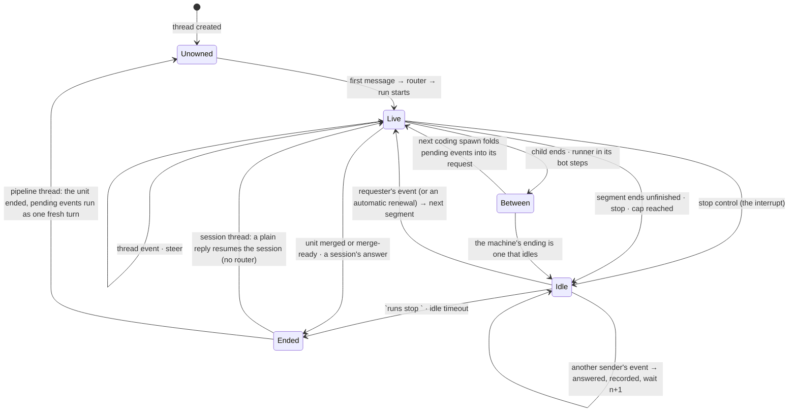

# A thread has one owner for its life, a message is one event in a mode the sender chooses, and a pipeline idles instead of ending

**The ask.** Decide (the maintainer, before the plan is written): adopt this as the one model of a plain follow-up in a thread, for every agent, surface and ingress; retire the `continue` sentence on the stop card and the reply-that-spends-a-renewal that record 0046's plan named as its unit eleven; amend record 0046 so a continuation a person woke carries the person's words beside the previous handoff; and name the model-driven thread owner as the next record, gated on a measurement this record specifies, not built here. Written for an engineer who knows the dispatcher's routing and admission stages and has not followed the lease work.

**Accepted 2026-09-17**, executed from [the plan](../plans/2026-09-17-004-feat-a-thread-has-one-owner-and-a-pipeline-idles-plan.md), with three decisions the maintainer took at acceptance. An idle unit parks the plan's later units; the walk stays sequential. A stop pauses a unit rather than ending it, and the only exits are `runs stop <unit key>` and the idle limit. No mode is a typed word: a plain message steers the owner, and an interrupt is the stop control the surfaces already carry followed by a message, so the `!steer`, `!queue` and `!interrupt` prefixes the draft borrowed from Capy are withdrawn, `queue` with them, and the open question on an interrupt permission is closed by the stop control's own permission. A wake after a stop reopens the cut segment under its remaining lease and spends no renewal, because that lease was not spent; the lease rule below applies at a lease or a cap. The owner rule and the fold between rounds are not behind the idle setting: turning idle off returns the old endings, not the old routing.

Success criteria the decision is judged against:

1. A person's plain reply into a thread whose pipeline unit stopped continues that unit, with the person's words in the next segment's request, on every channel that carries a thread history, with no keyword and no command.
2. No preset gains a verb for "continue": the same event and the same lifecycle carry a coding session, a research thread and a ship pipeline.
3. A plain reply during a live run is steered, and a stop followed by a reply interrupts, on pi and OpenCode alike; no call in flight is aborted, and no word in the reply selects either.
4. A message into a thread whose unit idled at its lease spends nothing unless the requester wrote it, in which case it spends exactly one renewal; at the grant's cap every message, the requester's included, is answered with the cap.
5. The router is not called for a plain reply into a thread that has an owner; a directive naming an agent is not a plain reply.

## TL;DR

A ship pipeline unit that stops at its lease leaves its thread with no owner, so the next reply runs the router as if the thread were new and the only continuation is a by-hand re-issue; 12 of the 59 ship coding children the budget analysis read before this record ended at the clip. The bet is that a thread has **one owner for its life**, the pipeline unit while it is unfinished or else the newest continuable session, that every plain message is **one event** stored on the owner and delivered as a steer, or as the next turn after a stop, and that a unit **idles** instead of ending. It costs a wait on the Workflow runner that parks the plan's later units while a person is needed, a mailbox on the unit row, the instance id written on the live ship run, and an amendment to record 0046. Decided: the owner rule, the two modes, the idle unit, the requester's word at the lease; open: whether a waiting instance is billed. Doing nothing keeps "re-issue `agent:ship` in this thread with the same text" on every stop card.

## Today at `93c64383`

A reply into a stopped pipeline's thread does not reach the pipeline: `stickyAgentOf` skips every run a coordinator spawned and the ship run writes no session, so the reply resolves through the router as a fresh thread's would, and thread-admission item 1 says the same of a reply between two rounds (`src/core/dispatch/thread.ts`). The router never reads a run's state, and it is already skipped for a live thread before it is called (routing-and-config item 21; `src/core/dispatcher.ts`). A finished walk ends the Workflow instance; a re-issue is a new instance `plan-<id>-<n>`, refused while the first still runs (`src/core/coordinator/handOff.ts`). A reply into a live run has one mode, steer at the next turn boundary, and item 2 forbids aborting a tool or model call in flight for it. The runner already blocks on `step.waitForEvent` and the bot already sends events to an instance by id; the platform buffers an event sent before its wait, allows a wait of 365 days, resumes an instance on the code now deployed, and leaves waiting instances out of the concurrency count. The full survey is the appendix.

## The shape

This is a session model, not a routing model. Every thread has an **owner**, the one thing that receives what arrives there. A live run owns the thread while it is in flight. Otherwise the **durable owner** is the pipeline **unit** whose row names the thread, for as long as that unit has no ending, whether its child is live, its runner is between rounds, or it is idle; in a thread with no unfinished unit, the durable owner is the newest continuable session a person addressed, which is today's sticky agent. A plain message into the thread is a **thread event**: the sender, the text, the attachments under the inbox's 400 KiB cap, and a **delivery mode** no word in the text selects. `steer`, what every plain message is, is folded in at the owner's next turn boundary; `interrupt` is a stop control followed by a message: the stop lets the call in flight finish, drops the rest of that turn and idles the owner, and the message is its next turn. An idle owner takes every message as its next turn. A unit **idles** rather than ends when a segment closes with the unit unfinished, when a stop lands, or when the grant's cap is reached; the runner reads the unit's pending events before every spawn and at its wait, and at the lease only the **requester**, the person id the instance record carries, opens a segment, spending one renewal. A request directive keeps today's meaning. The router runs when a thread has no owner and at no other time.

The closest known shape is Anthropic's Managed Agents session: `idle`, `running`, `terminated`; a `user.message` queued while running; `user.interrupt` that lets a running tool finish; a session at `budget_reached` idle and refusing new work until its budget is raised. The one difference is that our owner cannot keep its process across a lease, because containers are replaced on release, so a unit resumes from the recorded sha and the write-up as a new run, the way a Copilot coding-agent follow-up starts a new session with the pull request's context.

The property the diagram shows: while a unit is unfinished its thread never returns to `Unowned`, so the router is paid once per owner, and no window between rounds is unowned.

## One trace: a unit idles at its lease, a teammate nudges, the requester continues, the bot rolls in between

A person posts "fix the flaky parser tests" in a channel whose scope grants six renewals; the product default is zero. The router picks ship; the runner opens the generated plan's one unit in the requesting thread, segment one, under a 120-minute lease; the coding child pushes `a1b2c3d` at minute 37 and its loop ends at the lease with two follow-ups in its handoff and no pull request.

1. The machine reads progress off the record, the grant has six, the fit holds: the segment ends `continued` and segment two opens. Automatic renewal is unchanged.
2. Segment two's child pushes nothing and ends at its lease. Today the unit ends `aborted`. Now it ends **idle**: the runner writes `idle: { why: "no_progress", renewalsLeft: 5, from: "a1b2c3d" }` on the unit row, posts the card ("no progress in the last lease; grant holds 5 renewals; reply in this thread to continue"), and blocks on `step.waitForEvent` under the step name `<unit>/idle/1`, timeout the scope's idle days, seven by default.
3. A teammate replies "looks stuck, keep going". The dispatcher, where it already skips the router for a live thread, finds no live run, finds the instance through the ship run's `instanceId`, and finds the unit row for this thread with no ending. It appends the event to the row's pending list and nudges the instance. The runner wakes, reads that the sender is not the requester, answers "the grant's renewals are the requester's to spend; 5 left", marks the event answered, and waits again under `<unit>/idle/2`. No router ran.
4. A release replaces the bot. The instance keeps waiting and on wake runs the code now deployed; the resident released the thread's idle binding an hour after the child ended, and the continuation needs nothing from it.
5. The requester replies "the flake is the clock mock, pin it and push". The dispatcher appends and nudges. The runner spends one renewal (four left), writes the row for segment three with `from: a1b2c3d` and the event's id, and opens segment three through unit ten's path: a new coding run from `a1b2c3d` in a clean tree, briefed with segment two's write-up and handoff and then the requester's words. The card reads "renewal 2 of 6, continues a1b2c3d".
6. Segment three's child ends with a pull request; the runner is in its `pr-check` step when the requester replies "also drop the retry loop". No run is live and the unit has no ending, so the dispatcher appends and nudges. The next spawn is the review, which is read-only, so the event stays pending; the fix spawn that answers the review's findings folds it into its request as a follow-up, the way a resumed run's inbox is folded today.
7. The fix round pushes, the re-review approves, the unit ends `merge_ready`. The unit has an ending, the thread has no durable owner because a coordinator's child never owns a thread, and any event still pending runs as one fresh turn, as item 4 does for a run's unconsumed follow-ups. The next plain reply routes fresh.
8. Had segment three idled and nobody replied, the requester could end it with `runs stop plan-<id>:<unit>`, or the wait would reach the idle days and the unit would end `idle_expired`; either way the thread routes fresh from then on.

The property the trace proves: while the unit was unfinished, no plain message reached the router, none was lost between rounds, no keyword was typed, and one number bounded every renewal, automatic or by hand.

## The difficulty map

1. **The idle unit** (most likely to be wrong; most work with the modes): a wait that parks the plan, a pending list that closes the between-rounds gap, and a wake that spends at most one renewal per event. Section: the idle unit.
2. **Delivery modes on two harnesses**: an interrupt that is the stop control, honored by both harnesses without cutting a call and without a word. Section: delivery modes.
3. **The owner rule's edges**: finding the unfinished unit from the page the dispatcher already reads, which endings idle, and what an idle unit outranks. Section: the owner rule.
4. **The lease and the cap**: one renewal per event, from the requester only, and the amendment to 0046 it needs. Section: the lease.

## The idle unit

The constraint is that the runner's continuation state lives in three places that die at different times: the Workflow instance (survives a bot roll, dies when `walk` returns), the unit rows on the state Worker (survive everything), and the resident's thread binding (released an hour after it goes idle; its disk lost when the container sleeps). Today `walk` returns on every ending, so the only continuation is a new instance, and a reply between rounds is a fresh request because nothing owns the gap.

The design keeps the instance alive and makes the unit row the mailbox. A unit whose segment ends under a refused renewal, a stop or the cap does not settle in `walk`: the driver writes the idle row and blocks on `step.waitForEvent` for the unit's nudge, under a step name indexed per wait (`<unit>/idle/<n>`), since a step name reused inside one instance is answered from the durable step cache rather than waited on. The dispatcher, finding the unit as owner, appends the thread event to the row's **pending** list, capped like the durable inbox row at 400 KiB with dropped attachments recorded, and sends the instance a payload-free nudge event. The durable inbox itself is keyed by run id and is not reused; the pending list is a new field on the row with the inbox row's shape. On wake the runner reads the pending list, applies the lease rule, and either opens the next segment through unit ten's `continued` path with the pending texts appended to the segment's request, or answers, marks the event answered, and waits under the next index. A hundred answered nudges in one idle end the unit `idle_expired`, since each burns a step. Between rounds the runner does not wait; it reads the pending list before every coding spawn and folds it into the child's request as thread-admission item 5 folds a resumed run's inbox; a review spawn is read-only and leaves the list for the coding spawn after it. Events still pending when the unit ends run as one fresh turn in the thread, as item 4 does for a run's unconsumed follow-ups. The wait's timeout is a scope setting, seven days by default, a design number unrelated to the worktree TTL; at the timeout the unit ends `idle_expired`.

The walk is sequential, one unit at a time in dependency order, so an idle unit parks the plan's later units. That is decided: a unit idles exactly when a person is needed, and a plan that runs past the unit a person must answer would build on work the person has not accepted. It has a cost the record names: a seeded plan that today finishes `failed` in minutes now waits at its first unfinished unit until a reply, `runs stop <unit key>`, or the timeout, and the hand-off's "a runner for this plan is still running" refusal becomes the correct answer to a re-issue, reworded to name the idle unit's thread and the stop. The parent card names the idle unit and its thread.

The platform facts this stands on are documented (appendix): an event sent before its wait is buffered; a wait may last 365 days; a resumed instance runs the code now deployed, at the price the "Rules of Workflows" already exact, that step names before a completed step never change, which our unit-and-segment step names already keep.

Invariants. A unit with no ending owns its thread until it has one. A pending event is consumed once: the runner marks it with the segment, the spawn or the answer that consumed it in the same durable step, so a replay after a reclaim does not fold it twice. The segment row is written before the segment runs, once per index; this is unit ten's row, unchanged. Every answered nudge is on the row, so the card shows who nudged.

Failure modes. The Workflow is terminated by hand: the row keeps its idle mark, the dispatcher's nudge fails, and the message routes fresh with a card line saying the pipeline was terminated. A nudge arrives while the woken segment's child is live: the child is the live owner and admission steers the same text into it; the runner marks the pending event consumed by that run at its next read. A different task typed into an idle thread becomes the segment's request, as any reply does; a new task belongs in a new thread, and the card says so, as Capy's `!new` does.

The alternative it beat: re-issue on reply, where the dispatcher routes the reply to ship and the hand-off opens `plan-<id>-<n+1>` seeded from the rows. It works today and needs no wait. It loses on two facts: a new attempt reruns the unit's pre-check and branch steps and starts a fresh coding round from the branch, discarding the segment sequence and the write-up brief; and a second instance id splits the unit's runs page, its segment rows and its grant count into two places a person and the cap rule must reconcile.

## Delivery modes

The constraint is thread-admission item 2: a tool call or model call in flight is never aborted for a follow-up, because a retry over a side effect that already happened is the failure it avoids. Both harnesses steer at the turn boundary today: pi drains the inbox on every event and tick and delivers after the tool results of the turn in flight, before the next model call; the OpenCode bridge posts a steer into the running execution and already carries a `steer` or `queue` delivery on its continue prompt.

The mode lives on the thread event and nowhere else, and nothing in the message text selects it: the maintainer's rule is that a reply is read by context, never by a keyword, and a `!queue` or `!interrupt` prefix is a keyword. `steer` is every plain message, today's path. `interrupt` is the stop control every surface already has (the card's Stop button, the run page's Stop, `runs stop <run id> --mode soft`) followed by a message: the soft stop lets the call in flight finish, the remaining tool calls of that turn are not executed and their results say the sender cut the turn short, the owner idles, and the next message is its next turn. No new abort primitive is needed, item 2 holds unchanged, and the mode is the harness's to honor, not the preset's. `queue`, which differs from `steer` only on OpenCode mid-turn, is not offered: nothing but a keyword could select it today, and on pi the turn boundary and the turn's end are one moment. A surface that grows a mode control (a picker on the dashboard composer) may offer it later without a record.

Invariants. An interrupt cuts at most one turn; a second stop during the same turn is a no-op. A steer records the `input` event and the `follow_up` note it records today; an interrupt records the stop with its actor and then the message as a fresh turn. Typing the word "stop" is not a stop: it is a message the owner reads as an instruction, the same as any other sentence; the mechanical stop is the control or the command.

Failure modes. A stop lands during the write-up: the write-up is the loop's last turn and is never cut, so the run ends as it would have and the next message runs as the fresh turn item 4 defines. A stop from a sender the run's stop policy excludes is refused as it is today.

The alternative it beat: interrupt as the default, Capy's choice, with `!` prefixes for the others. A filed outside fact (record 0047) will be a frequent sender, and a bot must never cut a person's turn; and a prefix is a keyword one preset's users would learn while the rest never see it.

## The owner rule

The constraint is that the owner must be computable where the dispatcher already skips the router for a live thread, from the runs page it already read, with at most one more read. The rule, in order: a live run in the thread owns it; else, when the page's ship run names its instance or a child names it by `parentInstanceId`, the unit of that instance whose row names this thread owns it if the row has no ending; else the newest continuable run a person addressed, today's sticky agent; else no owner. The one read is the instance's unit rows. The instance id is on a child's view today, and on the ship run's record only when the instance finishes, so unit one writes it on the live ship run's record at the hand-off, as a run event the record projects, and exposes it on the view. A coordinator's child never owns a thread, so an ended unit's thread routes fresh. A request directive keeps today's meaning: `agent:review <pr>` in a pipeline's thread starts a review when no run is live and is refused as an agent mismatch when one is.

The unit outranks a session. A research or general run a person addressed into a pipeline's thread between rounds is continuable, and today the next plain reply would resume it; under this rule the unfinished unit owns the reply. Decided: the pipeline is what the thread was opened for, and the session stays reachable with an `agent:` directive.

Which endings idle. A unit is **ended** when merged, merge-ready, blocked by a dependency, or refused at authorization: nothing a reply can change. It is **idle** in every other terminal: `aborted`, `wall_clock_cap`, `review_pending`, `round_cap`, `merge_refused`, `no_verdict`, `interrupted`, `stopped`; `continued` is not a terminal. The old kind becomes the idle row's `why` and the report keeps its sentence. A stop is idle on purpose: a person who stopped a run paused it, and a pause a later reply visibly wakes, with a card saying so, is what Capy and Managed Agents both do; `runs stop <unit key>` on an idle unit is the exit that ends it, and unit two gives that command a unit resolver and a default mode. The person who wants the thread for another task ends the unit that way, or from the End action beside the idle card's "waiting" line and on the unit's row, or starts a new thread, where the router runs; a stopped unit that nobody ends is closed by the idle limit.

The alternative it beat: run the router on every reply with the thread's state as context. It costs a model call per reply, the router today reads no run state so the context would be new work, and the field's default is owner-continues.

## The lease

The constraint is record 0046's invariant: segments under one request never exceed the grant's renewals. A message that spent nothing would let a nudge renew without bound. Managed Agents refuses a `user.message` at the cap until the budget is raised; the person raising it is the authorization.

Here the event is the authorization when its sender is the requester, the person id on the instance record, the same id every surface authenticates a person to. The requester's event at a lease spends one renewal and opens the next segment, the progress test set aside because a person's word replaces it. Any other sender's event is answered with who may spend and spends nothing. At the cap, no renewals left, every event including the requester's is answered with the cap, naming the scope setting that raises the grant. Widening the holder to a channel is the first thing to revisit.

This amends record 0046, which says a continuation's request "is the previous run's handoff, not the person's message": a continuation the machine renews keeps that rule; a continuation a person woke carries the person's words after the handoff, because the words are what the person asked for. The amendment is dated on 0046 in the plan's first unit.

Invariant: renewals spent by hand and by the machine count against one number, the segment rows, so the grant's ceiling is one ceiling.

## Why not X

**Why not make the ship run continuable, so today's sticky path carries the reply?** A session entry on the ship run would make stickiness name ship, the reply would reach the ship fork, and the fork's only continuation is the re-issue path: a new instance, the same two-places problem. The ship run is a hand-off that lasts seconds; a session entry on it is a name that lies about what can be resumed. What can be resumed is the unit, and the unit is what this record makes the owner.

**Why not a `continue` keyword or a `ship continue` command?** Today the keyword is card text; nothing parses it. Making it real would give one preset a verb, when the maintainer's rule is that any text in a thread is a nudge the system reads by context; a command would need a registry entry, a blast-radius row and a conformance row for one preset. The owner rule needs none and serves research and general threads the same day.

**Why not let the model orchestrate the thread, as Capy's thread agent does?** Record 0034 decided "coordinator as a state machine, never a model" for auditability and cost, and nothing here contradicts it: the owner rule is a lookup, the modes are a header, the idle wait is a step. The model-driven owner is a real option the field has taken; it costs a model call per follow-up and would amend 0034. It is the next record, gated on one measurement: over the first hundred owned threads or thirty days, whichever comes first, the share of plain replies into owned threads that ended in a by-hand re-issue. Under a fifth, the state machine stays; the baseline is the count of re-issued instances (`plan-<id>-<n>`, `n` above one) over the prior thirty days, measured before unit two.

**Why not persist the process instead of re-briefing from the write-up?** Capy sleeps the VM with its filesystem and Managed Agents keeps the sandbox, so both resume in place. Our resident releases an idle binding after an hour and its disk goes with the container's sleep. Re-briefing from the recorded sha and the write-up is the honest continuation until resident hibernation exists, and it is Copilot's shipped shape.

## Boundaries

Steer at the turn boundary stays the default and record 0047's filing is unchanged; the grant's cap stays per request; the model-driven owner and the router's prompt are out of scope; record 0034 stays in force. The old ending kinds remain in the `ship_round` vocabulary for records already written.

## What would change our mind

If a waiting instance is billed, the default idle days shrink to one; the limits page says waiting instances do not count against concurrency, and billing is unconfirmed before unit two. If more than a fifth of plain replies into owned threads still end in a by-hand re-issue after the measurement window, the owner rule is not what people mean by continue, and the model-driven owner record moves up. If parking a seeded plan on an idle unit blocks more than it protects, the idle wait becomes per unit with the walk proceeding to independent units, at the cost of a wait per unit. Reversibility: the idle unit, the wake and the cards sit behind the idle setting, and turning it off returns the old endings; the owner rule and the fold between rounds are the record's first unit and stay, so a reply between rounds is folded rather than routed fresh.

## Rollout

Unit one is the owner rule where the dispatcher skips the router for a live thread, the instance id written on the live ship run and exposed on the view, the pending list on the unit row, and the idle row on the unit machine with every old kind as `why`, behind a scope flag; it rewrites the stop card's sentence, dates the amendment on 0046, and folds unit ten's two review nits (the exhausted-grant sentence for a grant of one; a fresh branch counting a push of the base head as progress). Unit two is the indexed wait, the fold before every coding spawn, the nudge, the lease rule, `runs stop` on a unit key, the reworded re-issue refusal, the baseline count, and the wake latency measured against the run-finished wake, which a code comment today puts within a second. Unit three is the interrupt as stop-then-message on both harnesses: the soft stop's cut-short results, the idle it lands in, and the recorded mode, with the End action beside the idle card. Unit four is the measurement, read on the tracker issue. The plan holds the units; this record ends here.

## Open questions

| Question | Owner | Resolves it | Before |
|---|---|---|---|
| Is a waiting Workflow instance billed? | the maintainer | Cloudflare's billing page or a support ask | unit two |

## Validation criteria

| Criterion | Proof |
|---|---|
| The owner order: live run, the unfinished unit of the instance the page names, continuable session, none; an ended unit's thread and a coordinator's child never own; an `agent:` directive keeps today's meaning | `[gap]` unit one: `src/core/dispatch/thread.test.ts`, `src/core/dispatcher.test.ts` |
| A plain reply into an owned pipeline thread with no live run is appended to the unit's pending list and nudges the instance; no run, no router; the reply is acked with where it went | `[gap]` unit one: `src/core/dispatcher.test.ts` |
| The live ship run's record names its instance from the hand-off and the view exposes it | `[gap]` unit one: `src/core/dispatch/ship.test.ts`, `src/core/runsService.test.ts` |
| Every terminal but merged, merge-ready, blocked and refused ends `idle` with the old kind as `why` and its report unchanged | `[gap]` unit one: `src/core/ship/coordinator.test.ts` |
| The runner folds pending events into the next coding spawn's request, waits under an indexed step name when idle, spends one renewal on the requester's event at a lease, answers any other sender, answers everyone at the cap, marks each event consumed once, and re-waits; pending events at the unit's end run as one fresh turn | `[gap]` unit two: `src/core/coordinator/driver.test.ts` |
| An idle unit parks the walk; `runs stop <unit key>` ends it `stopped` and the walk proceeds; the timeout or the hundredth nudge ends it `idle_expired`; the re-issue refusal names the idle thread and the stop | `[gap]` unit two: `src/core/coordinator/driver.test.ts`, `src/core/coordinator/handOff.test.ts` |
| A nudge sent to an instance before its wait, across a bot roll, is read at the wait | `[gap]` unit two: a probe on the deployed Workflow, human-gated |
| A soft stop on a live owner lets the call in flight finish, drops the turn's remaining tool calls with the cut-short result and idles the owner; the next plain message is its next turn; every mode is recorded; nothing is aborted; no word in a message selects a mode | `[gap]` unit three: `src/core/harness/conformance.test.ts` (both drivers); `src/core/dispatcher.test.ts` |
| Live: an idle unit continued by the requester's plain reply in the channel that grants renewals, its segment row and card read on the tracker issue | `[gap]` unit two, human-gated |

## Sources

- [Managed Agents session operations](https://platform.claude.com/docs/en/managed-agents/session-operations), [session budgets](https://platform.claude.com/docs/en/managed-agents/budgets), [events and streaming](https://platform.claude.com/docs/en/managed-agents/events-and-streaming); [Claude Agent SDK sessions](https://code.claude.com/docs/en/agent-sdk/sessions); [Claude Code channels](https://code.claude.com/docs/en/channels).
- [OpenAI Agents SDK orchestration](https://openai.github.io/openai-agents-python/multi_agent/); [Google ADK multi-agent patterns](https://developers.googleblog.com/developers-guide-to-multi-agent-patterns-in-adk/); [Devin Slack integration](https://docs.devin.ai/integrations/slack); [Copilot coding agent, context within a pull request](https://github.blog/changelog/2025-09-30-copilot-coding-agent-remembers-context-within-the-same-pull-request/).
- Capy: [threads](https://docs.capy.ai/threads.md), [tasks](https://docs.capy.ai/tasks.md), [machines](https://docs.capy.ai/machines.md), [Slack](https://docs.capy.ai/integrations/slack.md), [billing](https://docs.capy.ai/admin/billing.md).
- Cloudflare Workflows: [events and parameters](https://developers.cloudflare.com/workflows/build/events-and-parameters/), [limits](https://developers.cloudflare.com/workflows/reference/limits/).

## Appendix: the survey at `93c64383`

| Fact | Proof |
|---|---|
| Stickiness skips every run a coordinator spawned and names the newest run a person addressed | `src/core/dispatch/thread.ts`, `addressed`, `stickyAgentOf` |
| A run is continuable only when finished with a session log; the ship run writes none | `src/core/dispatch/thread.ts`, `continuable`; `src/core/dispatch/ship.ts` |
| A reply into a finished pipeline's thread, or between two rounds, is a fresh request | `docs/reference/specs/thread-admission.md` item 1 |
| The router is skipped for a live thread before it is called; the thread's runs page is read before resolution, for a thread with history | `src/core/dispatcher.ts`, `threadLive`, `readThread` |
| The router reads the preset table, the thread's last directives, its repository, the sources block, the command tools and the request text; no run state | `docs/reference/specs/routing-and-config.md` item 21; `src/core/dispatch/route.ts` |
| A follow-up into a live run has one outcome, steer, unless it names another agent, which is refused; a tool or model call in flight is never aborted for it | `src/core/threadAdmission.ts`, `decideFollowUp`; thread-admission item 2 |
| Stop modes are `soft` and `hard`; `runs stop` takes a run id and a required mode | `src/core/runEvents.ts`; `src/core/commands/runs.ts` |
| The runner waits on `run-finished-<id>` and `checks-settled-<head>`; the bot sends events to an instance by id; an unmatched event is buffered; a step name is answered from the step cache when reused | `src/core/coordinator/driver.ts`; `src/core/coordinator/contract.ts`; `deploy/cloudflare/worker.ts` |
| The walk runs units one at a time in dependency order; a finished walk calls `finish`; a re-issue is a new instance `plan-<id>-<n>`; a second instance is refused while one runs | `src/core/coordinator/driver.ts`, `walk`; `src/core/coordinator/handOff.ts` |
| A seeded plan's unit runs in a thread of its own with a review thread beside it; a generated plan's one unit runs in the requesting thread | `docs/reference/specs/agent-ship.md` items 5 and 16 |
| The machine's terminals: merged, merge_ready, merge_refused, round_cap, wall_clock_cap, review_pending, stopped, aborted, no_verdict, interrupted, refused; `continued` is a segment's end; `blocked` is written by the walk | `src/core/ship/coordinator.ts`, `UnitEnding` |
| A generated plan's stop card tells the requester to re-issue `agent:ship` with the same text; the renewal card says "reply continue to spend one", which nothing parses | `src/core/ship/coordinator.ts`; `src/core/ship/renewal.ts` |
| The resident releases an idle binding after an hour; the container sleeps after an hour and its disk is lost; the seven-day worktree TTL is a separate bound | `deploy/cloudflare-resident/worker.ts`, `CLEAN_IDLE_RELEASE_S`, `IDLE_AFTER_S`, `WORKTREE_TTL_DAYS_DEFAULT` |
| The durable inbox is keyed by run id, caps a row at 400 KiB and records dropped attachments; a resumed run's inbox is folded into its request | `src/core/runLedgerWorker.ts`; thread-admission item 5; `src/core/dispatch/admission.ts`, `foldCarriedInbox` |
| pi drains the inbox on every event and tick and delivers after the tool results of the turn in flight; its abort is used only on terminal paths | `src/core/harness/pi/harness.ts` |
| The OpenCode bridge posts a steer into the running execution, carries a `steer` or `queue` delivery on its continue prompt, and interrupts on its terminal paths | `src/core/harness/opencode/bridge.ts` |
| The instance record carries the requester's person id, the grant and its source | `src/core/coordinator/contract.ts`, `CoordinatorInstance` |
| The run view carries `parentInstanceId` and not `instanceId`; `run_meta.instanceId` is written on the pipeline's record by `finish` only | `src/core/runsService.ts`; `src/channels/adminCoordinator.ts`, `parentRunRecord` |
| 12 of 59 ship coding children ended at the budget clip | record 0046, "Today" |
| The run-finished event wakes the runner within a second | `src/channels/adminCoordinator.ts`, a comment on `read-record` |
| Record 0046: a continuation's request is the previous handoff, not the person's message; a person's reply spends a renewal by hand | record 0046, "Renewal" |
| Workflows: `waitForEvent` up to 365 days, default 24 hours; an event sent before the wait is buffered; waiting instances do not count against concurrency; a resumed instance runs the code now deployed | Cloudflare Workflows docs |
| Managed Agents: idle at `budget_reached`; `user.message` at the cap is a 400; raising the budget resumes; an interrupt lets a running tool finish | Claude Platform docs |
| Capy: one agent per thread; Interrupt, Queue, Steer modes; `!new` for a separate thread; the machine sleeps after about two minutes | docs.capy.ai threads, machines, Slack |
