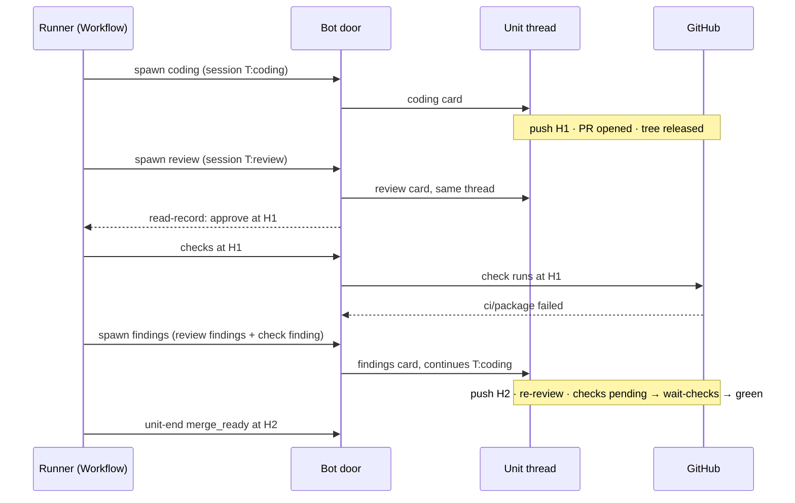

# A unit has one thread, because isolation is already the session's; a round's verdict joins the review with the checks at its head

**The ask.** Decide (the maintainer, before the plan is written): stop opening a review thread per ship unit, so every run of a unit posts in the unit's thread, and make a ship round's verdict the review's verdict joined with the checks at the reviewed head. Written for an engineer who knows the ship runner ([record 0031](0031-the-coordinator-runs-a-plan-not-a-pull-request.md)) and the session model ([records 0034](0034-one-agent-per-unit-a-run-continues-a-transcript.md) and [0051](0051-a-thread-has-one-owner-for-its-life-a-message-is-one-event-in-a-chosen-mode-and-a-pipeline-idles-instead-of-ending.md)), and who has not followed the thread sprawl.

Success criteria: (1) a routed ship ask produces exactly one Slack thread, and a seeded plan of N units produces N + 1; (2) every run of a unit, coding, review and findings, is a card in the unit's thread and a row on its unit page, in round order; (3) the runner never reports merge-ready, and never asks the merge door, at a head where a check it read had failed, and a failed check is a finding of that round beside the review's findings; (4) a round whose checks were green when read adds no wait, and a repository that reports no check at the head waits one chunk per round, never longer.

**Amendment, 2026-09-18, on acceptance: what shipped, what newer records changed, what stays gated.** Both halves of the bet are live on 1.249.0: the one thread per unit (#1723) and the minimal cut of the round verdict, the merge-ready report reading the checks at the approved head (#1726). Two records written after this one touch it and are folded in below where the changed section is: [record 0057](0057-the-operator-is-the-one-door-a-model-binds-every-chat-input-and-deterministic-code-authorizes-fences-and-executes.md) keys a working session by instance, unit and lane and moves admission after the operator, which supersedes this record's shared-review-session trade and rewords how a reply reaches a live child; [record 0058](0058-a-thread-reply-is-read-before-it-is-answered-intake-decides-whether-the-bot-was-addressed.md) makes intake decide whether the bot was addressed, so an unaddressed reply never steers a live run. Nothing written since subsumes the round verdict: no record reads a check into the round, and record 0047 still keeps `check_run` byte-identical. The full loop, a failed check as a finding of the round, is therefore accepted as the design and gated, in [Rollout](#rollout), on evidence the shipped report now produces and on record 0051's idle unit.

## TL;DR

A ship unit opens a review thread beside its own, so a routed ask spreads over two Slack threads and a plan of N units over 2N + 1; the 29 units shipped in the week before this record opened at least 29 review threads nobody asked for, and the dashboard's unit page already stitches the two back together. The runner also acts on CI only at the merge door, so it reported merge-ready over a red required check (#1460) and a person had to steer the fix. The bet is that the thread is where a unit is **read** and the **session**, the thread and agent pair, is already where it is **isolated**: the transcript is keyed by both and the resident tree is released when every run ends, so the review thread guards nothing and the bot simply stops opening it, while a settled failed check joins the review's verdict as a finding of the round. The cost is one bounded wait per round, a field on two briefs and a retired field on the row. Decided: the one thread, the joined verdict, the wait's bound, the flake rule; open: nothing that blocks the plan.

## Today at `689c4d10`

The five facts the design turns on, as the delta from what a reader of record 0034 expects. The survey is Appendix A.

1. **The review thread's two reasons have both moved.** Record 0034 opened it so a person's plain re-review would not continue the coding session, and so no review round would wipe the coding worktree. The first is closed without it: the **sticky agent**, the agent a plain reply continues, is read from the thread's newest run a person addressed, and every **coordinator child**, a run the ship runner spawned, is skipped (`stickyAgentOf`, `src/core/dispatch/thread.ts`); the ship parent writes no session either, so a plain reply in a unit thread goes to the router. The second never held for the runner's children: the bot releases the resident tree at every ending, forcing the release for a read run, a hard stop or a command it knows is in flight and otherwise letting the resident keep the tree only while an operation is still running in it (`releaseModeFor`, `src/core/reviewRound.ts`; `release`, `src/execution/resident.ts`); the worker evicts the binding, and an evicted prior is no mode switch (`priorLive`, `src/execution/residentReadonly.ts`). A review attaching read-only after a coding child ended finds no tree to wipe.
2. **The transcript is already keyed by session.** `sessionKey(threadKey, agent)` is `<thread>:<agent>` (`src/core/runLedger/sessionLog.ts`), so a review run in the coding thread seeds from `<thread>:review`, never from the coding transcript.
3. **A task's unit thread is the requesting thread.** A plan unit's thread is opened by `unit-start`, and the review thread beside both; the review spawn substitutes it (`unitStart`, `ensureReviewThread`, the spawn's thread choice, `src/channels/adminCoordinator.ts`). A routed ask therefore costs two threads and a plan unit three.
4. **Nobody in the loop acts on CI.** The coding child is told to push once its cheapest local checks pass ([agent-ship.md](../reference/specs/agent-ship.md) item 13); every review prompt tells the reviewer not to run the tests because CI does (`src/agents/registry.ts`); the merge door reads the check runs (`fetchCommitChecks`) and answers `refused` on a failed one, but it is asked only under `merge: runner`, and a `merge: person` unit, the routed default, ends `merge_ready` on the approval alone (`src/core/ship/coordinator.ts`). The intake reads the same function only to fire its event, and fires only when at least one check exists (`checksSettled`, `src/index.ts`).
5. **The signal already exists, and CI is fast to start.** The check-run intake sends `checks-settled-<head>` to every instance waiting at that head, from a registry the merge step writes (`MergeWaitRegistry`, `src/core/coordinator/checksIntake.ts`); the driver has a `wait-checks` step over it (`src/core/coordinator/driver.ts`), chunked at five minutes and asked for sixty (`SHIP_WAIT.mergeChunkMinutes`, `MERGE_WAIT_ASK_MINUTES`, `src/core/budgets.ts`). Only the merge step uses them. On six recent pull requests the first check started 8 seconds to 2 minutes after the commit and the last completed 4 to 20 minutes after it; a review lands in about five minutes (`src/agents/registry.ts`), so the wait this design adds is usually the excess of CI over the review, zero to fifteen minutes.

## The shape

A unit becomes one conversation with two kinds of participant and one judge. The **unit thread** is the place: the coding child, every review child, every findings turn and the round cards post there, and the parent's summary lands in the requesting thread as it does now. Nothing moves to make room: each child already seeds from its own session and attaches to a tree of its own life. The **round verdict** is what the runner decides a round on: the review's verdict joined with the check runs at the head the review read. A failed check is a **check finding**, a finding row like a reviewer's with the check's name in the row's `file`, its URL and conclusion in its text and the severity `blocking`, handed to the coding session with the review's findings; a pending check is waited on through the intake's event; only approve-and-green ends a round toward the merge.

The closest known shape is a chat assistant that answers in the thread it was asked in and keeps one memory per participant, so a second participant joining the thread neither reads the first one's notes nor moves the conversation elsewhere. The one way this differs is the judge: the round's outcome is not the reviewer's word but the reviewer's word joined with a fact GitHub reports about the same commit.

## One trace: the review approves a red head, and a person replies mid-round

The unit is a routed task, so its thread T is the requesting thread. The heads are the ones the merge-ready report of #1460 carried.

1. The coding child runs in T on session `T:coding`, pushes `9f4d2a17`, opens the pull request and ends; its tree is released; `pr-check` names the head.
2. The runner spawns the review. The door picks T (no review thread exists or is opened); the child seeds from `T:review`, empty on a first round, plus the brief, and attaches read-only: a fresh tree, nothing prior to switch.
3. A teammate types "also check the webhook route" in T while the review is live. Admission steers it into the live run at its next turn boundary, as it steers every live run; the reviewer reads it. Record 0051 decides this; this record notes it as the trade. *Amended 2026-09-18:* under [record 0058](0058-a-thread-reply-is-read-before-it-is-answered-intake-decides-whether-the-bot-was-addressed.md) intake first decides whether the bot was addressed, so this reply steers only when it is (a mention, or the classifier's read); under [record 0057](0057-the-operator-is-the-one-door-a-model-binds-every-chat-input-and-deterministic-code-authorizes-fences-and-executes.md) the operator binds the reply and delivers it to the unit's one live run. The trade is the same, the door that makes it has moved.
4. The review posts LGTM at `9f4d2a17`. `read-record` returns approve with no findings.
5. The runner's new `checks` step reads the check runs at `9f4d2a17`: `ci / package` failed. The round verdict is changes requested with one check finding, `check:ci / package`, `blocking`, the check's URL and conclusion, under a round note of its own. No merge step, no merge-ready report.
6. The findings step spawns the coding agent in T; it continues `T:coding` with the review's findings and the check finding in its brief, fixes the start path, squashes and pushes `6d0772ad`; `pr-check` names the head.
7. The re-review continues `T:review` and approves at `6d0772ad`. The checks read answers pending; the runner registers at the head and waits on `checks-settled-6d0772ad`; the intake sends it when the last check completes; the read repeats: green.
8. The unit ends `merge_ready` and the report names the checks it read and when. The property: merge-ready is a claim about the head at the time it was read, never issued over a failed check, and the whole unit is one thread a person can scroll.

## The difficulty map

1. The round verdict when no check has reported at the head, and when a red check is a flake ([The round verdict](#the-round-verdict)).
2. A person's review run in the unit thread now shares `T:review` with the runner's re-review ([One session per agent](#one-session-per-agent)).
3. A plain reply during a live review child steers the reviewer ([Boundaries](#boundaries); reworded 2026-09-18 for records 0057 and 0058).
4. The surfaces after the field retires and the check finding's plumbing, the most work by file count and the least likely to be wrong ([Rollout](#rollout)).

## The round verdict

The constraint is that the review approves the diff and CI judges the head, at the same sha, and the runner acts on only the first. A run whose reviewer approved a red head has no round left to fix it in, and under `merge: person` no door ever looks.

The design: after `read-record` on a review round, one bot step, `checks`, reads the check runs at the reviewed head with the merge door's own reading (`fetchCommitChecks`: total, pending, failed), and its answer is a step return the machine folds into the round verdict under a round note of its own, never the parser-mismatch gate. **Failed**: the round is changes requested; each failed check is a check finding, id `check:<name>`, `file` the check's name, severity `blocking` so the level in force always counts it, text the conclusion and URL, merged with the review's findings into the findings brief and the ledger through a `checks` field the two brief kinds gain, since a check finding sits on no run's record; the coding session's dispositions match it by id as they match a reviewer's. **Pending**: the runner notes itself at the head in the merge registry and waits on `checks-settled-<head>` in the same five-minute chunks as the merge step, then reads again, for at most the sixty-minute ask. **Green**: today's path, the merge step or `merge_ready`. **None reported**: the runner waits one chunk, since the first check started within two minutes on every pull request measured, then reads once more; still none, the round proceeds and the report says "no check reported at `<head>`", so a repository without CI, or one whose CI reports only on its default branch (two in this organisation today), costs one chunk per round and never idles. The merge door's read stays: two readers of one function, the second a guard on the first. When no reviewed head is known, the step is skipped as the merge step's is and the unit ends as today.

The flake rule. A check finding the coding session **declines** with the head unchanged is not re-reviewed: today an all-declined round with no new head returns to review at the same head, and a red check at that head would be red again. Instead the unit idles under record 0051 with the reason on the card, "`<check>` red at `<head>`, declined as a flake: rerun it", and the intake's settled event at that head or a person's reply wakes it. The coding session's actions tools are reads, so the rerun is a person's, as it is today.

Invariants: (1) no `merge_ready` ending and no `merge` step at a head where the checks read failed; (2) a check finding is a finding row: it appears in the ledger, in the re-review brief and in the dispositions exactly as a reviewer's; (3) checks are read at the reviewed head only, so a red on an early push the coding child fixed before it ended is never a finding; (4) a round whose checks are green when read adds no wait, since the read precedes any wait; (5) a head with no check reported waits one chunk and never more; (6) a declined check finding at an unchanged head never starts a review.

Failure modes: GitHub unreadable answers as pending and is re-read at the chunk's end, and a head still unreadable at the ask's end idles the unit with the reason; a check that reports failed after the runner read green is the merge door's to refuse under `merge: runner` and, under `merge: person`, is the state #1460 describes, now confined to a check that completed after the last read or started more than five minutes after the push, which the report's time makes visible.

The alternatives it beat: the review agent runs `gh pr checks` and folds a red into its verdict, killed because a model's reading is not a gate, the resident review has no `gh`, and the two variants that have it are told CI is the gate; record 0047 files the settled check as a turn to the owner, killed because that record keeps `check_run` byte-identical on purpose and a filed turn reaches a session while the round already owns the verdict; wait for CI before spawning the review, killed because it adds CI's whole duration to every round where reading after the review costs only the excess; probe the base branch for check runs to learn whether a repository has CI, killed because two repositories in this organisation report eleven checks at the base tip and none on any pull request head, so every round there would wait the whole ask.

*Amended 2026-09-18, on acceptance:* the cheapest part of this section shipped first as #1726: the ending's facts read asks `pr-check` for the check runs at the approved head (`checks: true`) and the merge-ready report's headline is a claim about them, so a failed check reads "approved but not merge-ready" naming the check, a pending one is named, green is counted and none reported is said; the ending kind is unchanged. The `checks` step in the round, the check finding, the wait on the intake's event and the flake rule are accepted as written and not yet built: they are gated as [Rollout](#rollout) says, because the shipped headline now measures the case they exist for.

## One session per agent

**Superseded, 2026-09-18, by [record 0057](0057-the-operator-is-the-one-door-a-model-binds-every-chat-input-and-deterministic-code-authorizes-fences-and-executes.md).** That record keys a working session by instance, unit and lane (`<instance>:<unit>:coding`, `<instance>:<unit>:review`), every round of a lane continuing it, so a person's `agent:review` run in the unit's thread has a lane of its own and never shares the runner's re-review session. The section below is kept as the trade this record accepted at the time; the invariant that a review child's brief names its round's review run and coding run by id stands under both records.

The constraint is record 0034's rule: a run seeds from the session of its thread and agent. With one thread per unit, a person's `agent:review <pr>` run in T and the runner's review child both write `T:review`, where today the runner's rounds lived in `<reviewThread>:review` alone. The runner's next re-review therefore seeds from the person's review transcript too.

Decided: that is what a session is for. Record 0034 already wants the review agent to see the thread's prior verdicts and dispositions as runs of the thread, and the runner's re-review brief still names the previous review run and the coding run that answered it by id, so the typed lineage is unchanged and the transcript gains what a person asked the reviewer to look at. The two never run at once: the door answers `busy` while either is live, and the runner waits. Invariant: a review child's brief names its round's review run and coding run by id; the session is context, the brief is the contract.

## Why not X

**Why not just read the checks before the merge-ready report, with no new step and no finding type?** A red found there has no round to fix it in: the report says "not ready" and the unit idles until a person steers the fix, which is #1460's sequence with a better label. The finding is what puts the fix inside the pipeline.

**Why not post the review card into the unit thread and keep the review thread hidden?** Every surface lists by thread: the unit page cuts runs by the two thread keys, the runs list keys on threads, and a hidden thread is still a top-level message in the channel. Two places would remain.

**Why not one thread for a whole plan?** The session is the thread and agent pair, so N coding children in one thread would share `<thread>:coding`. N units are N threads, and the parent card in the requesting thread links them, as the dashboard's unit list does.

**Why not wait for record 0051 to land first?** The routing reason is already closed by the sticky agent's skip of coordinator children; record 0051 adds owner-continues between rounds and is independent of this design, which touches no admission rule.

## Boundaries

Not in this design: the resident's keys, its attach body and its release discipline, all unchanged; the parent card's shape; the Chats page; record 0047's filing modes and owner index; the intake's `check_run` event, which stays the same event with one more waiter; the unsquashed fix-up commit #1460 also asks about, which is the hand-off's ready state and a separate change. Any failed check counts, as the merge door reads today; a required-only reading is a change to `fetchCommitChecks` and to the door, not to this design. A plain reply into the unit thread while the review child is live is steered into the reviewer, as thread admission steers every live run and record 0051 decides, and a directive naming another agent is refused while a run is live, so a person who wants the coder waits for the round. *Amended 2026-09-18:* [record 0058](0058-a-thread-reply-is-read-before-it-is-answered-intake-decides-whether-the-bot-was-addressed.md) puts intake before that step, so only a reply the bot was addressed by steers, and [record 0057](0057-the-operator-is-the-one-door-a-model-binds-every-chat-input-and-deterministic-code-authorizes-fences-and-executes.md) makes the steer a bind of the operator delivered to the unit's one live run; a person who wants the coder still waits for the round. Rows already written with a `reviewThread` keep reading: the unit page cuts by it when present, and the review spawn stops opening one. The mode-switch rule on the resident stays as the safety net for a tree kept past a run's end because an operation was still running in it or the process died; the runner's own flow cannot reach it, since a review is spawned only after the coding child's confirmed end, and a person's read run that does recreates a tree item 17 already forfeits.

## What would change our mind

If the first ten rounds with a pending wait add more than five minutes to the median round, measured on the unit page's round boundaries, the checks read moves ahead of the review spawn when the intake has already settled the head. If repositories that report no check at the head are common enough that one chunk per round shows in the median, the step reads the head's check suites, which exist as soon as anything is triggered, and skips the wait when there are none. If a person's review in the unit thread visibly degrades the runner's re-review on the first five such units, by the re-review's re-raised findings, the runner's review child gets a session of its own name. Reversibility: the thread choice is one branch in the door; the checks step is one step in the machine with a `[gap]` row per invariant; a revert leaves already-written rows readable.

## Rollout

*Amended 2026-09-18, on acceptance.* The thread pull request shipped as #1723 and the round's report half as #1726, both live on 1.249.0. What remains of the round pull request, the `checks` step with its round note, the wait under the merge registry, the check finding in the ledger and the briefs, the flake rule, is gated on two facts: (1) the count of "approved but not merge-ready" headlines in the run ledger over the fourteen days after 1.249.0 deployed, read on 2026-10-02, is at least two, since a case that does not recur is not worth a lease-consuming wait per round and 300 lines; (2) record 0051's idle unit and wake route (the second and fifth units of its plan) are live, since the flake rule idles the unit and is woken by the intake's event. If (1) fails, the report is the end state and this record's round half is closed as implemented by the headline. The paragraph below is the plan as first written.

Two pull requests, independent of each other, each with its spec rows. The thread: the review spawn runs in the unit thread, `unit-start` opens no review thread, new rows carry no `reviewThread`, the unit page cuts by one thread when the row has one, [agent-ship.md](../reference/specs/agent-ship.md) items 5 and 16, [run-history.md](../reference/specs/run-history.md) item 50. The round: the `checks` step and its round note, the one-chunk grace, the wait under the merge registry, the check finding in the ledger and the `checks` field on the two briefs, the flake rule, the report's checks line and time, #1460's two tests, agent-ship.md's round items and [http-ingress.md](../reference/specs/http-ingress.md) item 12. The execution ledger is the plan this record precedes.

## Open questions

None block the plan. Whether a check finding's `blocking` severity should become a setting is decided by the first five rounds that carry one (owner: the maintainer; needed before: nothing, the default ships).

## Validation criteria

| Criterion | Proof |
|---|---|
| A routed ship ask produces one thread; a plan of N units N + 1 | `src/channels/adminCoordinator.test.ts::the plan runner's steps — plan, unit-start, branch, round, unit-end, finish (item 9)::unit-start opens a plan unit's thread through the requesting thread's channel and no review thread, finds the board issue titled by the unit id, and writes the thread on the row; a generated plan's unit runs in the requesting thread and opens nothing`; the live receipt (one thread on the deployment) is human-gated, owed on the agent-ship receipts issue |
| A review child's card and row sit in the unit's thread in round order | `src/channels/adminCoordinator.test.ts::the plan runner's steps — plan, unit-start, branch, round, unit-end, finish (item 9)::spawn with a review brief dispatches the review child into the unit's thread, where a live run makes it busy; the child is the review preset, whose read identity gives it a readonly worktree of its own; a row written before record 0055 keeps its review thread`; `src/core/unitRuns.test.ts::unitRunsOf — a unit's runs cut at its round boundaries, in time order::a unit with one thread (record 0055) cuts the thread's runs by agent: review runs at the review rounds, the rest at the coding rounds` |
| An approve at a head with a failed check is never reported merge-ready (shipped as the headline: "approved but not merge-ready" naming the check); the findings round with a check finding is the gated remainder | `src/core/ship/coordinator.test.ts::the unit pipeline — every ending the ship pipeline has, on step returns::merge-ready under \`merge: person\` waits for a person: the machine ends merge_ready, never asks for a merge, and the remaining-gate line names the instance's field, not the branch's shape`; `[gap]` the findings round: round pull request |
| An approve at a head with pending checks waits on the intake's event, then re-reads | `[gap]` round pull request: `src/core/coordinator/driver.test.ts` |
| An approve with every check green adds no wait | `[gap]` round pull request: `src/core/ship/coordinator.test.ts` |
| A head with no check reported waits one chunk, then proceeds with the report line | `[gap]` round pull request: `src/core/ship/coordinator.test.ts` |
| A declined check finding at an unchanged head idles the unit and never starts a review | `[gap]` round pull request: `src/core/ship/coordinator.test.ts` |
| A check finding appears in the ledger and the re-review brief as a reviewer's does | `[gap]` round pull request: `src/core/findingsLedger.test.ts`, `src/core/coordinator/briefs.test.ts` |

## Appendix A: the survey at `689c4d10`

| Fact | Proof |
|---|---|
| The sticky agent skips coordinator children; the ship parent writes no session | `src/core/dispatch/thread.ts`, `addressed` and `stickyAgentOf`; `src/core/dispatch/ship.ts` |
| The session key is the thread and agent | `src/core/runLedger/sessionLog.ts`, `sessionKey` |
| The bot releases the tree at every ending; an evicted prior is no mode switch | `src/core/reviewRound.ts`, `releaseModeFor`; `src/core/dispatch/reply.ts` and `src/core/dispatch/runLoop.ts`, the release calls; `src/execution/resident.ts`, `release`; `src/execution/residentReadonly.ts`, `priorLive` |
| The resident keys a tree by thread and recreates a live tree on a mode switch | `deploy/cloudflare-resident/worker.ts`, `threadWorktreePath`; `src/execution/residentReuse.ts` |
| The review attaches read-only, on the resident when serviceable, else seeded | `src/execution/factory.ts`, `readonly: ctx.profile.identity === "read"`; `src/agents/registry.ts` |
| The review thread is opened at unit start and substituted on the review spawn | `src/channels/adminCoordinator.ts`, `unitStart`, `ensureReviewThread`, the spawn's thread choice |
| The unit page cuts runs by the coding and review thread keys | `src/core/unitRuns.ts` |
| The merge door refuses on a failed check; `merge: person` never asks | `src/channels/adminCoordinator.ts`, the merge step; `src/core/ship/coordinator.ts`, `merge_ready` |
| The intake's registry and event fire only with at least one check; the driver's `wait-checks` step; the chunk and the ask | `src/core/coordinator/checksIntake.ts`; `src/index.ts`, `checksSettled`; `src/core/coordinator/driver.ts`; `src/core/budgets.ts` |
| The severity ladder and the `file` a finding row requires | `src/core/reviewVerdict.ts`, `FINDING_SEVERITIES`, `parseFinding` |
| The gate on the level in force; an all-declined round with no new head returns to review | `src/core/ship/coordinator.ts`, `findingsAtOrAbove`, the findings-round transition |
| The briefs read findings from the review run's record | `src/core/coordinator/briefs.ts` |
| A directive naming another agent is refused while a run is live | `src/core/threadAdmission.ts`, `agent_mismatch` |
| The coding child pushes after its cheapest checks; every reviewer prompt defers tests to CI; a review lands in about five minutes | `docs/reference/specs/agent-ship.md` item 13; `src/agents/registry.ts` |
| 29 units shipped in the week before this record | pull requests with `plan/` or `ship/` heads created in that week, uncapped listing |
| First check 8 s to 2 min after the commit; last check 4 to 20 min | check runs on six pull requests merged the day of this record |
| Two repositories in the organisation report checks at the base tip and none on pull request heads | check runs at `main` and at the open pull request heads of those repositories, read the day of this record |

## Amended 2026-09-18: the round verdict is built, with the flake rule reshaped by the field

This re-evaluation records what the field decided. The gated remainder of [The round verdict](#the-round-verdict) shipped: after a posted approve settles, the machine's `checks` step reads the check runs at the reviewed head with the merge door's own reading; a failed check becomes a check finding of the round — id `check:<name>`, severity `blocking`, the conclusion and URL — under a round note of its own (`checks_failed`), riding the findings and re-review briefs by value through the `checks` field the two brief kinds gained, and the findings step runs as for any changes-requested round; a pending head registers in the merge-wait registry and waits on the intake's `checks-settled-<head>` event in the merge wait's chunks for at most its ask, an unreadable GitHub reading as pending; a head with no check reported waits one chunk of grace and never more; a green head adds no wait. The invariants hold as written: no `merge_ready` and no `merge` step at a head where the checks read failed, and a check finding is a finding row in the ledger, the briefs and the dispositions exactly as a reviewer's. Two deviations from the section as first written, both decided by the field (the ship pipeline ending prematurely on known flakes). First, the step reads after a posted approve rather than after every review round: a changes-requested round already has its findings step, and the re-review's own read meets the checks at the new head, so nothing is lost and no round waits on CI it will not act on. Second, the flake rule re-runs instead of idling: a suspected flake — a test timeout or runner stall on a shard whose named test files the pull request's changed paths never touch, judged conservatively so anything unprovable is a real failure — is re-run once before it becomes a finding — through the Actions `rerun-failed-jobs` retry where an Actions run backs the check, and through GitHub's check-run rerequest (the ask to the app that created the run) for any other, this repository's Depot CI legs included — and a second failure is the finding; a re-run the bot could not dispatch spends the one retry and the head is read again at once, so the failure becomes the finding without a wait on a settle that never comes; the idle-and-wake shape this record sketched waited on machinery the retry does not need. The `[gap]` rows above are proven by the round-verdict rows on [agent-ship.md](../reference/specs/agent-ship.md) item 9.

## Amended 2026-09-19: a failed check outranks a pending one in the checks step's read

This re-evaluation restates why the record was accepted and checks a field-decided reorder of [The round verdict](#the-round-verdict) against it. The record was accepted because the review approves the diff while CI judges the head, at the same sha, and the runner acted on only the first: a failed check must become a finding of the round — a fix inside the pipeline — never a refusal or a report a person has to act on. The section lists **Failed** and **Pending** as separate cases and never says pending outranks failed, but the step as built read them in the pending-first order: a head with one check that never completes hid a failure already in view behind the chunked wait for the whole sixty-minute ask, and the unit then ended merge-ready at a red head — exactly the outcome invariant (1) forbids a person to be handed. Reordered (issue 1991): a failed check at the reviewed head is the round's answer as soon as it is read, whatever else is still pending — the check finding is written, the `checks_failed` note posted, the findings step entered — and only a head with no failed check waits on its pending ones in the merge wait's chunks. The flake rule keeps its place: when every failure is a suspect the one re-run is spent first, and the re-read after it applies the same order. Every invariant stands as written — (1) is strengthened, since a red head now reaches the findings step even while another check pends, and (2) through (6) are untouched; the grace chunk, the ask's bound and the green path are unchanged. The change is the checks step's read order alone, so it amends this record in place rather than superseding it.

## Amended 2026-09-20: the checks step is one decision table — expected checks and drafts join it, and no exit is nameless

This re-evaluation restates why the record was accepted and checks a field-decided reshape of [The round verdict](#the-round-verdict) against it. The record was accepted because the review approves the diff while CI judges the head, at the same sha, and only a step that reads the head's facts after the approve can join the two — the unit must own its pull request through that read, never hand a person an unnamed exit. The field found two heads the step's cases did not cover (issue 2063): a head whose reported checks were all green while a required check's run did not exist yet — the repository's approve workflow at the verdict instant — read as green, and a draft pull request read as any other; five units in one night ended with the machine's word `unfinished` and no cause seconds after their review's LGTM. The step is now one decision table over the reviewed head's facts, read once GitHub has recomputed and re-read on every checks-settled event from the merge-wait book: (a) any failed check is the round's answer at once, whatever else is pending — the check finding, the transient ladder's one re-run for a suspect, the fix round — exactly as the 2026-09-19 amendment ordered it; (b) no failure and a check pending, queued, or expected but not yet reported — the base's required contexts (`githubPulls.requiredCheckContexts`) not among the reported runs ride the read as `RoundChecks.expected` — registers in the merge-wait book and waits for the settled event; (c) no failure and every expected check reported green is merge-ready, or the runner's merge under `plan:merge`; (d) a draft pull request waits for the ready event the same way and, still a draft at the ask's end, ends `held: draft — mark it ready to continue`, a red check on a draft still buying its fix round. Every invariant stands as written — (1) is strengthened twice over, since a head is called green only once every expected check reports and a draft is never merged over — and `unfinished` leaves the set of endings a person can read: every exit of the table names its cause in the user's nouns in one line, and a unit row a seal finds with no ending prints the cause and the next step instead of the bare word. The change extends the step's read and its table without moving any accepted boundary, so it amends this record in place rather than superseding it; the rows are proven by the round-verdict rows on [agent-ship.md](../reference/specs/agent-ship.md) item 9.
