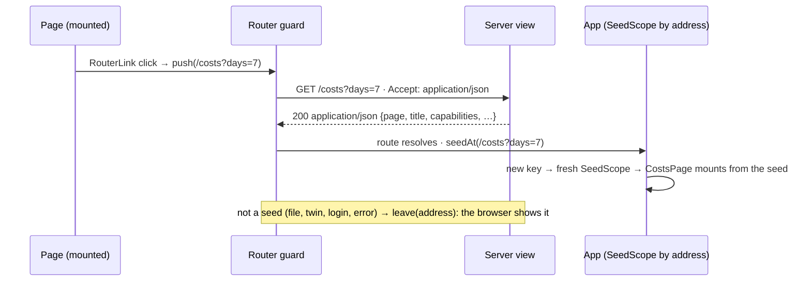

# The dashboard navigates in place; a page is one view, one seed, two encodings

**The ask.** Decide (the maintainer, in the session that built it): the dashboard stops reloading the document on every link and navigates between its pages in place, the way a Vue application is expected to, without any page learning to fetch its own data and without a second API beside the one the pages already paint from. Reader: an engineer who knows the shell-and-seed shape ([live-view.md](../reference/specs/live-view.md), the "Rendering = the web app" paragraph) and has not read the router. The maintainer's frame, 2026-09-17: every route is a new refresh, the app is built on Vue, so it should already be a single-page application — make it one now.

Success criteria: (1) a click on any link between the dashboard's pages — sections, tabs, rows, pagers, back links, the run links inside a thread or a fold — repaints the page without a document load; (2) no page component changes: each still reads its seed once at setup, and a full load and an in-app navigation give the same mount; (3) nothing a full load could reach becomes unreachable — a file, a JSON twin, a login redirect, an error page are shown by the browser exactly as before; (4) the server gains no route: every page's URL is the one resource, answered as a document or as its seed; (5) the address bar, the title, the favicon, the back button and the scroll position behave as they do on a full load.

## TL;DR

The bet: the shell-and-seed shape already separates the page's data (the seed the view builds) from its paint (the Vue page that reads it), so the only thing a single-page application needs is a way to get the next page's seed without the document around it — and the resource for that already exists: the page's own URL. The view keeps building one seed; the sender that used to render the shell now answers the seed alone when the request's `Accept` names `application/json` and not `text/html`, at the same status and with the same stamps (`webShell.ts`, `makePageSender`/`wantsSeed`). On the client a `beforeResolve` guard asks the next address for its seed before the route resolves (`seedRouting.ts`), the app keys one seed scope per address around the `RouterView` so a new address is a fresh mount of its page from that seed (`App.vue`, `SeedScope.vue`), every page link is a `RouterLink`, and `browser.navigate` goes through the router for the app's own paths. An answer that is not a seed — a file, a twin, a login page, an error — cancels the in-app navigation and hands the address to the browser, so nothing regresses below the full-load behavior. Cost: one more branch in the sender, one guard, one scope component, a `title` stamp on the seed, and one more request shape the server answers. Decided: negotiation on the existing resource, the router as the loader, remount per address. Open: whether pages that redraw from their own writes (`browser.reload()` after a settings save) should later re-seed in place too.

## Today at `6d9373df`

| Fact | Where |
|---|---|
| Every page route renders one shell with the page's seed as a JSON island; the Vue page reads it once at setup (`useSeed`) | `src/channels/webShell.ts` `renderShell`; `web/src/lib/seed.ts` |
| Navigation is by design full page loads: plain anchors and `window.location.assign`; the router only mounts the component for the URL the shell was served for | `web/src/routes.ts` header comment; `web/src/lib/browser.ts` `navigate` |
| The rail's conversation switch was left as a page load, to be swapped only if the reload read as a flash | [record 0043](0043-the-home-page-is-a-chat-the-browser-is-a-channel-and-a-turn-is-a-run.md), open questions |
| The settings page's tabs are full page loads over a seed | [record 0041](0041-the-settings-page-is-a-surface-over-the-registry-and-configures-the-shared-tiers.md), the shape |
| Two pages already have a JSON twin at another path (`/costs/<group>.json`, `/delivery/<owner>/<name>.json`) — reports for agents, not seeds | `src/channels/costsView.ts`, `src/channels/deliveryView.ts` |
| The shell renderer stamps `capabilities` and `viewingAs` on every seed; the title is the shell's `<title>` alone | `src/channels/webShell.ts` `makeShellRenderer` |
| Every view calls the renderer the same way: `res.writeHead(status, WEB_HTML_HEADERS); res.end(shell(viewer, title, seed))` — fourteen sites | `liveView.ts`, `web.ts`, `residentsView.ts`, `costsView.ts`, `deliveryView.ts`, `settingsView.ts` |

## The shape

**Server: one view, two encodings.** `ShellRenderer` becomes `PageSender`: `page(req, res, status, viewer, title, seed)`. It stamps `title`, `capabilities` and `viewingAs` on the seed, then answers the shell under `WEB_HTML_HEADERS` — or, when `wantsSeed(req)` (the `Accept` header names `application/json` and not `text/html`; a browser's document request names `text/html` and `*/*`), the seed alone under `WEB_SEED_HEADERS` (`application/json`, `no-store`, `Vary: Accept`). The body is built before the head is written, so a sender that throws is the view's one error answer, never a head without a body. Fourteen call sites become one line each; no view learns anything new.

**Client: the router loads the seed.** `installSeedRouting(router, { island, load, leave })` registers a `beforeResolve` guard: the first navigation is the document's own and takes the island; a later one loads `pageAddress(to)` (path and query, never the hash) with `fetchSeed` (`Accept: application/json`, same-origin credentials) before the route resolves; a hash-only move keeps the page; a navigation superseded while loading never lands; a null or thrown load calls `leave(to.fullPath)` — a full navigation — and cancels the in-app one. `App.vue` renders one `SeedScope` keyed by `pageAddress(route)` around the `RouterView`; the scope provides the seed under the same `SeedKey` the pages already inject and sets the title and favicon from it. Every link to a page becomes a `RouterLink`; `browser.navigate` routes an app path through the router (the address the page is already at reloads, as a link to the page you are on does in a browser; `browser.leave` stays the browser's). A 2 px progress bar shows while a seed loads; the current page stays until it lands.

## One trace: a thread's row, a run inside it, and the run's raw stream

On `/threads/abc` the reader clicks the rail's row for thread `def`. The `RouterLink` pushes `/threads/def`; the guard asks `GET /threads/def` with `Accept: application/json`; the web adapter's view builds the same `HomeSeed` it would for a document and the sender answers it as JSON; the route resolves, `pageAddress` changes, `SeedScope` remounts `HomePage` from that seed — the transcript, the rail, the composer, all from the seed as on a full load — and the title is the seed's. The reader opens a turn's "open the run": `/runs/<id>?t=<token>` is a `RouterLink`; the run view answers the `RunLiveSeed` as JSON at 200 (or `runNotFound` at 404 — the same non-revealing seed the document would carry); `RunPage` mounts and opens its `EventSource` exactly as before. The reader clicks the timeline's "raw stream" link to `/runs/<id>/events`: it is a plain anchor, the browser loads the SSE document. Had it been a `RouterLink`, the guard would have fetched it, found `text/event-stream`, called `leave` and the browser would still have loaded it — the fallback is the same result by a longer road, which is why non-page links stay anchors and the fallback exists for the ones nobody foresaw.

## The difficulty map

| Part | Hard? | Why |
|---|---|---|
| Deciding by `Accept` | no | a browser's document request always names `text/html`; the app's never does; `Vary: Accept` on both answers keeps any cache honest, and both are `no-store` anyway |
| Keeping the pages unchanged | the point | remount per address means a page reads its seed once, exactly as today — no page grew a fetch, a watcher or a loading state |
| The stale race | small | a navigation superseded while its seed loads is dropped by generation, so a slow older answer never lands over a newer page |
| The hash | small | `pageAddress` excludes it, so a step anchor or a fold's `#run-…` stays on the page; the router scrolls to the element when the page has it |
| A page that sends itself to its own address | small | the browser would reload; `browser.navigate` reloads too, so view-as entering on `/runs` sees the banner |
| A fixture preview that relaxes framing | small | the sender writes the head, so the preview patches `writeHead` on the response instead of the headers it used to hand `writeHead` itself |
| A full load's other reachables | none | anything that is not a seed is handed to the browser; the worst case is the old behavior |

## Why not X

- **A second API (`/api/pages/...`) the pages fetch from.** Two routes per page, two authorization paths to keep equal, and every page rewritten to fetch and to show a loading state. The seed already is the page's data; the page's URL already is its resource.
- **A global click delegate that intercepts every same-origin anchor.** One place, no template edits, but implicit: a reviewer cannot tell from a template whether a link is a page or a file, and the exclusions (streams, files, twins, the docs) become a list to maintain. `RouterLink` says it at the link.
- **Pages that react to route params without remounting.** The idiomatic long-term shape, and a rewrite of every page: each would watch its params, refetch, and manage a loading state. Remount per address gives the same result today with the pages as they are; a page may earn that shape later on its own evidence.
- **A hash router.** Changes every URL the bot mints and every Access rule's path; nothing to gain.

## Boundaries

- `browser.reload()` after a write (a settings save, exiting view-as) stays a full reload: the page must be seeded anew as the new state, and a reload is the one honest way to say so today.
- The JSON twins stay where they are: they are reports for agents with their own shape; a seed is the page's data, stamped with the chrome's facts.
- The server still decides every page's content, status and visibility. The router only chooses which component paints the seed the server answered for the URL.

## What would change our mind

- A page whose seed is slow to build (Delivery reads GitHub live on `?fresh=1`): if the wait with the old page in view reads worse than a blank document did, that page shows its own loading state or the guard gives the app a skeleton.
- If a page starts keeping state across addresses (a composer draft across conversations), remount per address is the wrong grain for it and it moves to reacting to params.

## Rollout

One pull request: the sender and its fourteen call sites, the guard, the scope, the RouterLinks, the specs ([live-view.md](../reference/specs/live-view.md) item 31, [web-chat.md](../reference/specs/web-chat.md) item 7, the dashboard routes reference), this record, and dated amendments to records 0041 and 0043 whose navigation sentences it retires. No flag: the fallback is the old behavior.

## Validation criteria

Bound in [live-view.md](../reference/specs/live-view.md) item 31's rows: the `Accept` rule, the sender's two answers and its single head, a live route answering its seed, `fetchSeed`'s nulls, the guard's six cases, `browser.navigate`'s routing and reload, the app's remount per address, the nav's RouterLinks, and one agent-run procedure in the fixture preview.

## Sources

- [live-view.md](../reference/specs/live-view.md) — the shell-and-seed shape this builds on; item 31 is this record's behavior.
- [record 0041](0041-the-settings-page-is-a-surface-over-the-registry-and-configures-the-shared-tiers.md), [record 0043](0043-the-home-page-is-a-chat-the-browser-is-a-channel-and-a-turn-is-a-run.md) — where full page loads were the stated shape; amended.
- [record 0053](0053-viewing-as-a-person-borrows-their-ceiling-and-keeps-your-name-on-the-line.md) — the `viewingAs` stamp the sender carries into both encodings.

## Accepted 2026-09-17

The maintainer asked for the change in plain words and the record and the code landed together; the fallback to a full navigation for anything that is not a seed is what makes the acceptance safe without a flag.
