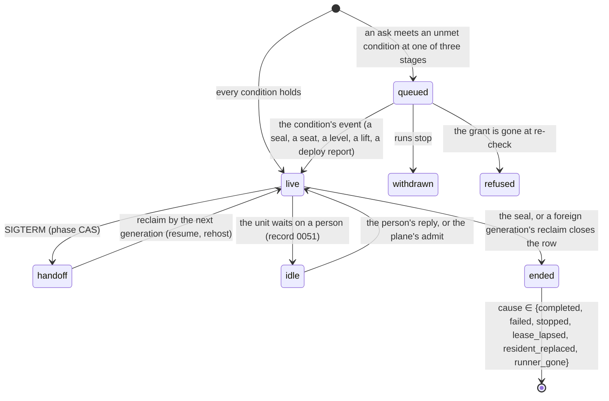

# The plane owns every run's state and the bot is one of its clients; a refusal becomes a queue position, an ending is judged by the ledger that saw it, saturation is a checkpoint steer, and a release is a quiet window a person closes

**The ask.** Decide (the maintainer, before the plan is written): the ledger object grows into the **plane**, the one owner of every run's state, with the bot and the plan runner as its clients; today's refusals become queue conditions asked at the three stages where they are decided; the incidents' hand recoveries become named watches and moves; saturation becomes a checkpoint steer; a release becomes a quiet window whose merge stays a person's; the dashboard gains a panel set over it. Written for an engineer who knows the dispatcher's stages, the run ledger and the plan runner and has read records 0046, 0051, 0055, 0057, 0059 and 0060. The frame is the maintainer's: "the stuff we have been doing in this agent should be a part of the product." Success criteria:

1. An ask that today meets `plan_runner_live`, `thread-live`, `user-pool-exhausted`, the memory gate or a drain waits with a position and the condition it waits on, and is admitted when the condition's event arrives; a runner can be paused and stopped from the product, and nothing sends a person to a vendor dashboard.
2. A stalled child, a died or errored runner, a mistitled or conflicting pull request, an orphaned child whose runner was stopped, a run page that answers 404 while the run is live, and an ending that blames the wrong component are detected by the plane and recovered by a named move or filed as a finding, with no person's hand in the loop.
3. Saturation reaches every live coding child on the saturated resident as one checkpoint steer per round inside the band between the soft and the hard line, never a kill, and the door to that resident stays closed until the resident reports a reading below the line; the steer-to-push latency is the number that judges it.
4. A fresh chat that asks what is happening gets the table, not a transcript; the plane's state and findings survive every bot roll in the object, and memory receives only lessons in record 0061's shape.
5. A release pull request past its threshold declares a quiet window, drains the fleet to zero, hands the approve and merge to a person with the consequence named, and lifts when the deploy reports or the person lifts it.
6. Runs, queue, windows, health and costs are panels of the existing dashboard, and the service that decides them outlives the bot.

## TL;DR

On 2026-09-18 seven releases landed, two bursts each lost fifteen runs' work, and every detection and every recovery was a person's: a table kept by hand, three seeds refused in four minutes, five pull requests retitled, seven CI reruns typed, and an ending that said "the bot restarted" while the bot's generation never changed, because no component outside the rolling process was asked to decide. The bet is that the ledger object, which already sees every claim, heartbeat and seal and already outlives the bot, becomes the plane: a pure **decider** over runs, pull requests, a queue and windows, moved only by events that exist, with the bot and the runner as clients that ask at three stages, heartbeat and execute typed **effects**. It costs moving admission and ending judgement out of the bot, an outbox, level reports from the resident objects, and three clocks the design names instead of hiding: an alarm at named deadlines, the bot's existing sweep, and one re-ask cadence for a reporter that fell silent while something waits on it. Decided: the object, the conditions, the watches and moves, the steer as the only lever on live work, the quiet window with a person's merge, the panels; open: the release threshold, a soft stop of pushed children at the hard line, the panel's name and the adoption verb. Doing nothing keeps a person on the table for every burst and every release.

## Today at `a578f314`

Five facts a veteran would not expect; the full survey is the [appendix](#appendix-the-survey).

| Fact | Value | Proof |
|---|---|---|
| Six doors refuse at three stages and one waits | the coordinator's spawn meets `busy` at admission and re-asks every two minutes; the ship fork refuses `thread-live` on its host-key claim and `plan_runner_live` after it, offering the Workflows dashboard; the resident refuses `user-pool-exhausted` at attach and the bot falls to a cold sandbox from the card; the lease floor refuses before any row exists; only the fleet drain waits, by a client poll every 30 s under the run's lease; a seventh door, the memory gate, merged the same night after this sha | `src/core/dispatch/admission.ts:400`; `src/core/ship/coordinator.ts:1557-1573`; `src/core/dispatch/ship.ts:379-409`, `:466-467`; `src/core/coordinator/handOff.ts:401-412`; `src/execution/factory.ts:537-541`; `src/execution/resident.ts:1136-1169` |
| An ending's words are composed by the process that rolls, though the reason is typed | the runner receives `child_interrupted { reason }` and still ends the unit with a note that hard-codes "The bot restarted while this ship pipeline was running"; the generation was unchanged the whole evening | `src/core/runEvents.ts:886`; `src/core/ship/coordinator.ts:85-93`; #1876 |
| The ledger object already holds the run's truth and survives the roll | `live_runs(run_id, thread_key UNIQUE, owner_gen, lease_until, phase, state_json…)`, `run_inbox`, `run_steps`; the heartbeat is `(runId, gen, leaseMs)` every 10 s against a 30 s lease and carries no other fact; at seal the object sends `run-finished-<id>` to the runner's Workflow; its one alarm is a six-hour retention sweep; lapsed leases are found by the bot's periodic reclaim sweep | `deploy/cloudflare-memory/worker.ts:1531-1564`, `:1853`, `:2053`, `:1392`; `src/core/runLedger/writeThrough.ts:984`; `src/core/boot.ts:366-391` |
| Every health fact exists and nothing acts on it | the index knows a stalled call (`inFlight { tool, since, boundMs }`, `eventsLast5m`) for this process's runs only; `/healthz` carries `inFlight`, `held`, `generation`; `/residents` carries `inFlight` and `draining`; the merge door reads `mergeableState` and the check runs; `pushed_head` rides the record; the moves were hands: five retitles, seven reruns, three steers per unit | `src/core/runPace.ts:22-35`; `src/channels/health.ts:59-100`; `deploy/cloudflare-resident/worker.ts:8892-8931`; `src/core/ship/coordinator.ts:1782-1800`; #1877, #1861, #1796 |
| A live run is steered through a durable inbox row and no component chooses to end one but a person's stop | a plain reply lands in `run_inbox` and folds at the next turn boundary; the runner spawns through `dispatch()` and never steers; runs die to infrastructure, never to a decision | `src/core/dispatch/admission.ts:438-452`; `src/core/runLedger/inboxMessage.ts`; thread-admission items 2, 5, 8 |

## The shape

The plane is a control plane over the bot as its data plane. Every fact that moves a run already lands in the ledger's Durable Object: the claim under a thread key, the heartbeat, the phase, the inbox row, the seal that wakes the runner. The plane is that object holding four more tables, **queue**, **pull requests**, **windows** and **findings**, and one pure function, the **decider**: given the state and one event it returns the next state and a list of typed **effects** for the bot, such as admit this stored request, redraw this card, retitle this pull request, re-issue these units, hand this step to a person. A steer is not an effect: the object owns `run_inbox`, so the decider writes the row itself. The object commits the state and the effects in one transaction, pushes the effects to the bot, and repeats every unacknowledged effect in its answer to the bot's heartbeats and its periodic sweep, so a roll loses nothing. The bot asks the plane at the three stages where it refuses today, before a row exists, before the ship claim, and at the resident attach, and stops deciding two things: whether an ask may run now, and what an ending means. The runner keeps its Workflow and stops judging its children's deaths.

The closest known shape is a Kubernetes controller manager over pods: watched objects, a reconciler per kind, named recoveries. It differs in two ways. The plane never restarts a run to fix it, because a run is a transcript in a model's context and a restart loses it, so its only lever on live work is a message folded at a turn boundary. And it resyncs on nothing: every **condition** names the event that flips it, every reporter re-states its level at its own boot and on every answer it gives the bot so a lost edge heals, and the three clocks the plane keeps, an alarm at named deadlines, the bot's existing sweep, and one re-ask cadence for a reporter that fell silent while something waits on it, bound waits, carry deliveries and re-ask a silent party; none of them decides an ending, and the only admission a clock touches is the one the re-asked answer decides.

## One trace: nine children, a tenth ask, a roll

The resident for one repository holds nine coding children at 23:49; its cap is 12,288 MiB; the gate's lines are 80 % for attach and 90 % for exec; the bot is at generation A.

1. The resident object takes a memory sample at an exec start and reads 82 %. Crossing the soft line is an edge, so it posts its level, `resident.memory { resident, pct: 82, side: "above-soft" }`, to the plane's edge route through its own outbox. The decider stores the level, opens a **pressure window** on that resident, and writes one inbox row per live coding child on it, nine rows keyed by run, round and cause so a second crossing writes none again: "finish the step you are on, push a checkpoint and end the round; start no new command; the resident takes your push."
2. Child A is four minutes into a test call; the row folds when the call ends. Child B is between turns; the row folds, B pushes, its record gains `pushed_head`, and its round ends with a write-up. Nothing in step 1 or 2 left the object.
3. A person asks for a tenth coding child in a fresh thread. At the admission stage the bot asks the plane; `thread_free` holds and no window covers the fleet, so the ask proceeds, resolves its repository, and reaches the executor's attach, which asks again with the resident named. The decider answers `queued { id: r10, position: 1, waiting: ["memory(resident) below soft"] }` and stores the request. The bot abandons the registry row it had made, so the run's only durable shape is its queue row: no lease, no heartbeat, no seat, no credential, nothing the drain or the deploy preflight counts. The bot posts "queued first: the resident is at 82 % memory, admitted when it reports below 80 %", and `/runs/r10` reads the position from the plane.
4. A release lands. A receives SIGTERM, marks its rows `handoff` and exits within its drain. The queue, the pressure window and one unacknowledged card effect are in the object, untouched. Generation B boots, reclaims the rows, and its first sweep call carries `generation: B` and `build.commit`; the answer carries the card effect A never acknowledged, and B redraws the card once, because the effect's id says it was never done.
5. Child A's test call ends; the row folds; A pushes. The resident's next sample reads 78 %, another edge, so it posts `resident.memory { pct: 78, side: "below-soft" }`. The decider flips the condition, closes the pressure window, walks the queue oldest first and admits `r10`: in one transaction it writes the attaching row under `r10` and the `admit(r10)` effect, delivered to B, which dispatches the stored request under that id; the claim finds its own reservation and promotes it. The card reads "admitted after 6 min"; the child's lease starts now, not at the ask.
6. Had the resident hung instead, as it did at 23:50, no sample could be taken and no edge posted; the bot's executor meets `runtime-unreachable` and forwards it as an observation, the decider marks the resident's level `unknown`, write presets fall cold for it as today, and while `r10` waits on a resident that has said nothing since, the plane emits one `probe(resident)` effect per re-ask cadence, so the replaced resident's first answer, a level, reaches the plane within minutes and closes the window if it is below the line. No child was killed by anything in this story but its own lease.

The property the trace proves: every wait ended because an event arrived, the only component that changed during it held none of the state, and no live run was ended by a decision.

## The difficulty map

1. **The queue** (section below): three asks at three stages, each answer a reservation, six refusals as conditions with a real flipping event each, levels that heal a lost edge and a re-ask for a reporter that fell silent, a request stored and replayed from nothing but its queue row. Most likely wrong.
2. **Endings and the watches** (section below): the bot observes, the plane records the cause, everyone renders; each incident's hand move becomes a named, tested move or a finding, including a runner's pause and stop.
3. **The backpressure contract** (section below): a steer folds only at a turn boundary; the band between the lines is minutes wide; the resident's gate is the belt; the plane never kills.
4. **The release manager** (section below): a quiet window that closes coding first and everything second, drains to zero of every kind, hands the merge to a person and lifts on the deploy runner's report.
5. **Where it lives and how effects move** (section below): the object grown, one decider module, an outbox on the calls the bot already makes, two named clocks, the sequencing across four deployables.
6. **The table, the panels and adoption** (most work, least risk): the read-only table first, the panel set, the costs fold, an outside pull request taken over.

## The queue

Admission moves into the object because the object is the only place that holds a thread's occupancy, a runner's liveness and a resident's last reported level together, and a decision made anywhere else races the rows it is made about. Today six doors refuse at three stages: the coordinator's spawn meets a live thread at admission and re-asks every two minutes; the ship fork claims the host key and refuses `thread-live`, then reads the plan and refuses `plan_runner_live` with the advice to terminate a live Workflow (three seeds in four minutes on 2026-09-18, #1857); the resident refuses `user-pool-exhausted` and, since the gate merged, memory pressure at attach, and the bot falls to a cold sandbox whose GitHub credential dies after an hour (#1915); the lease floor refuses a budget that cannot hold its loop; the fleet drain alone waits, by a poll the run's lease pays for. A queued request must be replayable after minutes or an hour: its text, attachments, requester, channel and thread, the preset and repository it resolved to, and the authorization it passed.

**Design.** The bot asks the plane where each refusal is decided today, and every answer is `admitted` or `queued { id, position, waiting }`. At the admission stage, before any row exists, the ask is for `thread_free`, `window_open` and `deploy_settled`. In the ship fork the ask is for `runner_free(plan)`, made after the plan is read and before the host-key claim, which moves after it. At the executor's attach the ask is for the resident's conditions. A `queued` answer at any stage ends the dispatch as a stored request: the bot abandons the registry row it made (the ledger's `abandon`, no record), and the run's only durable shape is its queue row, so it holds no lease, no heartbeat, no seat and no credential, counts in no drain and no deploy preflight, and a roll leaves it where it is. Every `admitted` answer reserves in the same transaction, the thread at the first stage, the plan instance at the second, the attaching row at the third, and the bot's claim promotes the reservation, so two asks a second apart never both pass to meet the ledger's unique index with today's card. The plane mints every queued run's id, the admit carries it, and the registry creates the row under it. A queued request is a run: the plane stores the request as it arrived, in the durable inbox's shape (text, attachments under the 400 KiB cap, the card naming any that will not travel, `authenticatedAs`, `postedBy`, the thread key), and the run page reads a queued id from the plane, so the card, the page and `runs stop` all work; a run queued at two stages in one life shows its positions in sequence and its card sums the waits. The lease floor stays a refusal: a budget that cannot hold its loop has no event that would make it fit. The conditions form a closed set, each naming the refusal it replaces and the event that flips it:

| Condition | Replaces | Flipped by |
|---|---|---|
| `thread_free(thread)` | the spawn's `busy` re-ask; the ship claim's `thread-live` | the seal or closing reclaim of the run on that thread |
| `runner_free(plan)` | `plan_runner_live`, after the append below | the instance's `finish`; an engine status of `errored` or `terminated`, read by the bot at a seed or by the plane at the re-ask cadence while a seed waits; or the hosting deadline on an instance that is not `waiting` |
| `seat(resident)` | `user-pool-exhausted` (thread users and op users both) | a level reporting a free seat, posted by the resident or answered to a probe |
| `memory(resident) below soft` | the memory gate's attach refusal | a level below the soft line, posted by the resident or answered to a probe |
| `fleet_open(resident)` | `draining` (today's poll) | the registry reporting `cleared`, at `/undrain` or by its alarm at the record's `until` |
| `window_open(kind)` | new: a quiet or pressure window; the runner's `busy-wait` | the window's lift |
| `deploy_settled` | record 0059's "deploy pending" | the deploy runner's `deploy.landed` report |
| `provider_up(provider)` | a model provider's transient ending a child after the proxy's one retry (#1932) | the model proxy's next successful answer from that provider, for any run |

Resident facts are **levels**, not deltas: each repository's resident object reports its side of each line whenever a sample or an allocation crosses it, and once more on its first sample after a boot, so a resident replaced between an upward and a downward crossing re-states where it stands and a lost edge heals at the next boot or crossing; the registry object reports the drain set, cleared, and, by one alarm at the record's `until`, expired. Both objects post through an outbox of their own, and both need the state Worker's bearer wired into the object, which today only the watchdog cron holds. A resident's levels also ride every answer it gives the bot, at attach, exec and the status probe, and the bot forwards a change; so a post lost to a 5xx is healed by the resident's next answer to anyone. While a queued run waits on a resident that has said nothing since, the plane emits one `probe(resident)` effect per re-ask cadence, the bot's status probe answers with the levels, and a silent replacement is heard within minutes. The bot forwards every refusal-by-name it meets at attach or exec as an observation, and an admitted run that meets one re-enters the queue at its old position instead of falling cold. A resident that has never reported, or whose generation changed without a report, or whose Worker the deploy runner reports landed, is `unknown` until its next level: write presets fall cold for it as today, so a silent resident cannot strand a queue. A `restartOf` claim passes windows and the memory line, as the drain passes a registered run. The mirror mutex is not a condition; it holds for one fetch and its timeout is the fix. A provider transient is a condition, never a cause: a turn the model proxy could not complete after its one retry (a gateway 502 ended a child and aborted its unit on 2026-09-19, #1932) parks the run on `provider_up(provider)` with the harness holding the turn, the proxy reports the provider's level from every answer it relays, and the next success flips the condition and the plane's steer re-issues the held turn; the lease keeps counting, and the run ends on its lease as today if the provider never answers.

A seed that names units of a plan whose runner is live is a request to that runner, not a rival (#1857): the plane writes the units onto the instance's rows, re-carves their minutes from the parent's remaining lease, and wakes the runner through the Workflow binding the object already holds; the driver re-reads its selection at every unit boundary, a change that ships one release ahead like `not_host` did, and until then such a seed waits on `runner_free`. A seed naming units already in the selection or already merged is answered with one line and starts nothing. `runner_free` reads the engine's status: an idle unit's instance is `waiting` and stays live, so a seed for an idle plan appends and never re-issues, and the hosting deadline frees nothing while the engine says `waiting`. Write presets queue; read presets (`explore`, `research`, `general`, and `review` for admission's purposes) fall cold under a resident condition and never wait on a window, since a cold sandbox costs them nothing and a wait costs the person minutes. A `queued` answer to a runner's spawn idles the unit under record 0051, spending no lease, and the plane's `admit` wakes it; a queued child's lease starts at admission, the parent's round is re-carved then, and its hosting deadline moves. Position is the rank among queued runs sharing the unmet condition, shown per condition; at every event the decider admits, oldest first, each run whose conditions all hold, re-evaluating after each admission because an admission spends a seat. Authorization runs when the request is queued and again in the bot when it is admitted; a grant lost in between ends the run `refused` with the reason on its card, reported back so the plane re-walks. `runs stop` on a queued id withdraws it, and a plain reply into a thread whose only run is queued is a thread event appended to the stored request, never a fresh dispatch ahead of it.

**Invariants.** No queue-or-admit decision is made outside the object; the resident's own gates and the fail-open path below are the named exceptions. Every condition names the event that flips it, and the decider reads no clock except its alarm and the re-ask cadence. A queued run holds nothing but its queue row and its id. Every `admitted` answer and every `admit` effect reserves in the transaction that decides it, so a claim never meets a rival the plane admitted. Admission is exactly once per queued run: `admit` carries the run id and a duplicate delivery finds the run admitted and does nothing. A position never rises except by a withdrawal ahead of it.

**Failure modes.** The plane is unreachable: admission fails open to today's refusal-or-cold path with one warning, as the ledger's `untracked` path does; a run admitted that way still claims its ledger row, which is what `thread_free` reads, so the plane's view of occupancy is never a belief beside the rows. A stored request outlives its thread: the card write fails and the run ends `failed` with the delivery error. A thousand queued runs: the queue is bounded per requester by the plan bind's unit cap (record 0057) and per installation by a setting (200 by default), and a refusal past the bound names it. A queued run withdrawn or refused writes a final record with its cause, so record 0063's trend counts it.

**The alternative it beat.** Generalize the drain's wait: every refusal becomes a client poll under the run's lease, the shape the runner's `busy-wait` and the drain already have. Killed by what those two cost: a poll spends the lease it waits under, holds the slot and the row it should not hold yet, cannot say a position, and fifty waiting runs are fifty pollers where one object walk would do.

## Endings and the watches

The plane assigns an ending's cause because it is the only component that saw both the lease and the generation, and it renders none of the words. Today four events reach the runner, `run-finished-<id>`, `child-interrupted-<id>`, `child-resumed-<id>` and `checks-settled-<sha>`, and the typed `child_interrupted { reason }` names a resident replacement, yet the runner's ending note still hard-codes "the bot restarted" and the runner ends the unit on it: on 2026-09-18 seven children a resident replacement killed were reported that way, four instances ended `interrupted`, and the card's advice, re-issue, would have made a rival of the instance that was still running (#1876). Each of the evening's recoveries was one move a person made by hand, and the same five recur: re-issue with the pull request URL appended, rerun a red check and merge over the green head, merge or adopt a pull request, retitle a runner-opened pull request, steer a child to push before its suite (#1689, #1861, #1877, #1796).

**Design.** The bot observes, the plane records, everyone renders. An ending is a plane fact, `ended { kind, cause }`, with the cause from a closed set: `completed`, `failed`, `stopped`, `withdrawn`, `refused`, `lease_lapsed`, `resident_replaced`, `runner_gone`. The bot forwards what it sees as observations, the executor's `runtime-unreachable` and `runtime-replaced` answers, a claim that names `restartOf` (a new claim meta field), the reclaim's outcome (`resume`, `restart`, `rehost`, `closed`); the plane records the cause only when a row closes, so a roll that resumes every row assigns nothing. The old run's ending carries `restarting: true` when the reattach path restarts it, and the runner keeps waiting for `child_resumed` on such an ending instead of ending the unit, which is #1876's orphan order fixed; the plane's `child_resumed` lands beside the bot's own announcement of the roll, and a runner that hears it twice re-arms its wait and loses nothing. A run the restart path creates registers with the plane before its card names the page, so the page answers at once (#1880). The interrupted notes, the reattach path's text and the runner's report render the plane's cause and never compose one; an older state Worker that gives no cause leaves the bot today's words.

A **watch** is a named predicate over the plane's state, evaluated only at the events that can change it; a **move** is its mechanical recovery, one pure step with its own test; a **finding** is filed when no move applies. Elapsed time is read at the heartbeat every live run already pays, whose body grows to carry the facts the watches read: the round index, the in-flight call with its declared bound, the last event's time and the pushed head. The moves the plane makes:

| Watch | Evaluated at | Move |
|---|---|---|
| `long_call`: a coding run's in-flight call is past its own declared bound, or past the no-bound line | each heartbeat of that run | the checkpoint steer, once per round |
| `no_push`: a coding round with no `pushed_head` past `noPushMinutes` (15, from #1796) | each heartbeat | the checkpoint steer, once per round |
| `runner_gone`: the engine reports the instance `errored` or `terminated` with units unfinished, or the hosting deadline passes on an instance the engine does not report `waiting` | the bot's status report; the re-ask while a seed waits; the deadline alarm, which reads the status first | `reissue(plan, remaining units)` as a fresh attempt with the same seed, keyed by the attempt number |
| `runner_stop`: a person's `plane stop <instance>` | the command | terminate the instance and end its live child in one move, recorded on the parent run and the unit thread, so no orphan is left (#1924) |
| `orphaned_child`: a child ends with a pushed branch, no pull request and no live runner | the child's seal | `pr_open` from the branch, titled by the head commit's subject when it passes the title rule |
| `unit_title`: a tracked pull request whose title fails the title rule | `pr_opened`; the adoption read | `retitle` from the head commit's subject when it passes `check:pr-title`, else `<type>(<scope>): <title cut to fit>`; the runner's own open takes the same rule at open, so the required check passes first time |
| `dirty_at_approval`: `mergeableState: dirty` on an approved head | the merge door's `pr-check` | `rebase_round`: a fix round on the unit's coding lane briefed "rebase onto the base and push"; the reviewed-head gate voids the approval; re-review |
| `saturation`: a resident reports the soft side of its memory line | the resident's level | `pressure_window(resident)` and the checkpoint steer to every live coding child on it, once per round |
| `release_grew`: the release pull request carries more merged pull requests or days than the threshold | the release pull request's `pull_request` event | `quiet_window` |

The rules the plane records without a move of its own:

| Watch | Evaluated at | What happens |
|---|---|---|
| `lease_lapsed` | the object's alarm at `lease_until` | the object offers the row to any generation but its owner, the way the bot's sweep already does within one lease; the owner's next heartbeat refreshes an unreclaimed row; the cause is assigned only when a foreign reclaim closes the row |
| `red_at_approval` | the round's verdict | #1921 puts the check finding, the pending wait and the one flake rerun in the runner; the plane records the outcome on the table |
| `owner_gap`: a `merge: person` unit ends `merge_ready` with its pull request open | `unit-end` | the unit stays unfinished until the pull request merges or closes (#1845; record 0060 takes the amendment) |
| `credential_refused`: a `tool_result` carrying the git credential refusal | the event | a finding; the executor's refresh is #1915's fix, not the plane's |
| `misroute`: record 0057's verifier disagrees with the route | the `route` event | a finding |

A move whose precondition no longer holds when the bot executes it (a person retitled the pull request first) is a no-op the bot acknowledges as `skipped`. A finding carries the watch's name and the timeline of events that fired it, deduplicated by watch and subject; the bot dispatches a research-tier run over that timeline inside the untrusted fence and files its answer through the path `friction propose` uses. That is the whole of the plane's model layer: the plane itself calls no model, and no steer's words are composed by one.

**Invariants.** One cause per closed row, recorded by the plane, rendered by everyone. A watch fires only at an event and reads time only from that event's clock. A move is idempotent under redelivery through its precondition read or its attempt key. A pull request the runner opens passes the title rule before its first check runs.

**Failure modes.** The resident cannot say `runtime-replaced` (an older Worker): the cause falls to `lease_lapsed`, which is true and blames nobody. A move needs a credential the bot lacks: the watch degrades to a finding naming what is missing. The plane and a person race on the same move: the precondition read makes the second a `skipped`. An idle instance's hosting deadline passes: `runner_gone` reads the engine's `waiting` and does nothing; the deadline's meaning for an idle unit is an amendment owed to record 0060.

**The alternative it beat.** Teach each hand move to the runner's state machine, one branch per incident. Killed by #1876's shape: the runner sees one pipeline and judges from inside the process that rolls, so its note said "the bot restarted" with the typed reason in hand, and every incident would add a branch the next incident contradicts.

## The backpressure contract

The steer is the plane's only lever on live work because a kill destroys exactly the work that has not been pushed, and on 2026-09-18 the children that had not pushed lost everything while the five that had pushed lost only their descriptions (#1877). The constraint: nine coding children on one resident ran full suites at once; the container held 10 GiB and 99 % of four cores for twenty minutes, then sat at 11.54 GiB with the CPU collapsed and its control port hung, and no kill fired, so no log line carried a number (#1879). A steer lands only at a turn boundary (thread-admission item 2), and a four- to ten-minute test call has none (#1909). The gate refuses attach at 80 % and exec at 90 %, so the band in which a steer can land and be obeyed is ten points wide, and the incident crossed it in under four minutes.

**Design.** The plane has one lever on a live run, the **checkpoint steer**: a fixed sentence, "finish the step you are on, push a checkpoint and end the round; start no new command; the resident takes your push", written by the decider as a durable inbox row keyed by run, round and cause, folded at the run's next boundary like a person's reply, authored by a system actor `plane` under a standing steer grant on write-preset runs (an amendment to record 0057). The gate's hard line lets a checkpoint's git commands through, so a steered child can always comply. The harness's checkpoint turn (record 0046) is the response the plane reads: `pushed_head` after the steer is compliance. The plane never kills, cuts or shortens a lease. At the hard line it may take one more step, decided here and marked revisable because the maintainer's word was "never a kill": a **soft stop**, record 0051's pause, of children whose newest `pushed_head` is marked clean and is newer than their last tool call; the harness records at every push whether the tree carried uncommitted or unpushed work, so a clean push is the fact that nothing after it would be lost at the detach that follows a stop, and a child whose newest push is not clean is never stopped. The stop frees memory for the children that have not pushed yet; the unit idles with its card and the requester's reply wakes it. When memory keeps climbing after that, the plane does nothing more: the pressure window stays open, the table shows it, and the children end at their leases. Record 0051's unit idle is accepted and not yet built at this sha: the soft stop, the queued spawn's idle and the owner gap all lean on it, and the plan sequences it first.

**Invariants.** No effect kills, hard-stops or cuts a run; a soft stop never lands on a child whose newest push is not clean. A checkpoint steer is written at most once per run per round per cause, and the same sentence at most once per round. A pressure window closes only on a reported level below the line, or a person's `plane window lift`.

**Failure modes.** The steer lands after the damage: a child in a ten-minute call reads it in ten minutes, and the band closes faster than that under a burst. That is the price of never killing; the exec refusal at the hard line is what makes it survivable, and the contract's own reading (#1909) is that the command shapes, not the children's count, are the lever below the plane. A child ignores the steer: it ends at its lease, as today. The resident hangs before reporting: the level is `unknown`, the bot's observation says so, and the window closes on the replaced resident's first sample.

**The alternative it beat.** Kill the largest child. Killed by the record's premise and the incident's facts: the killed children were the ones with the least on GitHub, and a soft stop of a pushed child buys the same memory with nothing lost.

## The release manager

The window is declared by the plane and closed by a person because the release moment is a person's, and the incident that taught it was a command that bundled the merge into a batch. Seven releases landed on 2026-09-18 (the changelog); five resident deploys were lost across three of them to steady traffic (#1681's comments). The bot's deploy preflight refuses while `/healthz inFlight` is above zero for any preset, and record 0059's amendment closes admission to every new ask while a deploy is pending. The release pull request grows on every merge to main, and the bot's webhook intake reads `check_run` only (record 0047).

**Design.** The intake reads `pull_request` events for the release pull request and for every pull request the plane tracks, emitting `release.grew { prs, ageDays }` and the tracked pull requests' state changes; the subscription is a human-gated step, and record 0047 takes the one exception. The plane compares the growth to a setting, `release.quiet: { prs, days }`. A **quiet window** has five states. *Quiet*: coding admission closes across the fleet (queued on `window_open(coding)`), reads still run, one checkpoint steer goes to every live coding child, and the runner's next-unit spawn idles its unit. *Closing*: when no coding run is live, every new ask queues, which is record 0059's pending-deploy state, now a window phase, with one exception: a review round of a unit already in flight is admitted, since it is a read of minutes that lets the pipeline reach merge-ready or the owner gap by itself instead of idling on the window. *Drained*: what the deploy's own preflight counts reads zero, the bot's held rows and the resident's in-flight operations; a hosted parent and an idle unit's Workflow count for nothing, as they count for nothing at the preflight today. *Handed*: the plane emits one card for the person naming the release, the count of pull requests since the last one and the step, approve and merge the release pull request, with the sentence "this deploys production"; the plane calls no merge. *Released*: the deploy runs as today, record 0059 drains the fleet and each Worker lands, and the deploy runner, which already posts to the state Worker with its bearer, posts `deploy.landed { version, workers }` beside its `/undrain`; the window lifts for the fleet when the bot's deploy is in the list, and `fleet_open(resident)` for a resident stays closed until that resident's Worker is in the list too, so a release that lands the bot and loses the resident admits no coding child onto a resident that is behind. A resident's part lifts on that resident's first level after the deploy, its reconcile, never on the preflight's pass: on 2026-09-19 a deploy lifted the resident drain eight seconds after declaring it and the image reconcile then restarted the shared container under a live child (#1931). A release that deploys no bot lifts on the same report. A person lifts a window early with `plane window lift`, a destructive-class command that shows the button of record 0044. A window has no deadline: a release a person chooses not to cut leaves the fleet quiet, visibly, until they lift it. A person who merges during *Quiet* moves the window to *Closing* at once, on the release pull request's merge event, and the card says so; the deploy's own hold then waits on the runs in flight as today.

A short trace: the twelfth merge of the day lands; the window opens; two coding children read the steer, push and end at their rounds; a review ends; the ledger reads zero and the card is posted; the person merges; the deploy drains the fleet, lands three Workers and reports them, and the window lifts as the three queued coding asks admit oldest first.

**Invariants.** The plane never merges or approves a pull request. At most one quiet window is open; pressure windows are per resident and independent. Reads never wait on a window in *Quiet*; everything but a unit's review round waits in *Closing*. A window ends only on the deploy runner's report or a person's lift.

**Failure modes.** The deploy fails after the merge: the window stays open and the card says which Worker did not land, which is the person's signal to rerun it. Release-please is replaced: the intake's release-branch rule is one setting. A coding child never checkpoints: it ends at its lease, at most 90 minutes after the window opened. The deploy runner's report is lost: the person lifts, as they merge, by hand.

**The alternative it beat.** A cron that cuts a release at a fixed hour, or a window that lifts on the bot's build stamp. The first is killed by the maintainer's rule that the release moment is a person's; the second by the deploy's own record, since a release that lands the bot and loses the resident would lift the window onto a resident that is behind.

## Where it lives and how effects move

The plane is the ledger object grown because the truth is already there and a copy would race it: every claim, heartbeat and seal commits in `RunHistoryDO`, one object per store key in the state Worker, which deploys only when its inputs change and already binds the runner's Workflow to send it events. The bot is a container that rolls on every release, up to fifteen minutes of drain before SIGKILL; the runner is a Workflow on the bot's Worker that survives the roll; each repository's resident object and the registry object survive their own deploy. A Durable Object is a single writer with SQLite storage and one alarm.

**Design.** Four tables beside `live_runs`, one **decider** module, `src/core/plane/decide.ts`, node-free and imported by the Worker and the bot's tests alike as `runRecord.ts` is, and an **outbox**: `effects(id, body, offered_at, acked_at)` written in the same transaction as the state. What the object owns it writes itself: a checkpoint steer is an inbox row, an appended unit is a unit row plus the Workflow wake the object already sends, and neither is an effect. Effects come in three kinds and the ack has three words. A state-observable effect, `admit`, writes the run's attaching row in the same transaction, so the thread is held from the decision and a duplicate is judged by the row. An external move, `retitle`, `pr_open`, `card`, `probe`, is idempotent through the precondition the bot reads before acting. An instance-keyed effect, `reissue`, carries the attempt number the hand-off already uses. The bot answers `done`, `skipped` when the precondition was gone, or `deferred` when it is draining: a draining generation still redraws cards and answers probes, and defers only `admit` and `reissue`, which start what it is about to hand off. Delivery is push with a pull as its backstop: the state Worker gains a service binding to the bot's Worker and posts effects to a new bearer-gated route the Worker forwards to the container, as it forwards the runner's step routes; every answer the object gives to the bot's heartbeats and its periodic sweep also carries the unacknowledged effects, 32 per answer, and the bot acknowledges by id. All effects target the bot, which holds the ingress bearer and the hand-off code; the runner executes nothing. The outbox is bounded: effects for a sealed run are dropped, and a cap per run and in total names itself when hit.

The plane keeps three clocks and names them. The object's alarm is set to the earliest hosting deadline, lease end or re-ask across its rows, re-armed when that earliest changes; at a lease end it offers the row to a generation other than its owner, which the bot's sweep already does within one lease, so for leases it is a latency shave and never a verdict, since a lapsed lease on the owner's own row means a heartbeat that could not land and the owner's next heartbeat refreshes it. The bot's existing periodic sweep keeps running and now drains the outbox, so an effect the push could not deliver rides it within one sweep even when no run is live. The **re-ask cadence**, `plane.reaskMinutes` (2 by default, the runner's own busy re-ask), runs only while something waits on a reporter that has fallen silent: a seed on `runner_free` while the engine's status is unread, a run on a resident condition while that resident has answered nobody; at each tick the object reads the instance's status through the Workflow binding it holds, or emits one `probe`, and the answer decides. That is the one place a clock reaches an admission, and it reaches it through the party that knows. Beyond those, the heartbeat every run pays, the runner's step timeouts and retries bounded by record 0046's leases, the resident's memory sample at every exec and attach start and on its ten-minute measure tick, and the drain record's `until` are the clocks that already exist; none of them decides an ending. Lease arithmetic uses the object's clock, never the client's.

Cost. Every claim and heartbeat already passes through the object; the evening's peak of 29 live runs is one heartbeat per 10 s each, about three writes a second; the decider adds one pure evaluation and a few reads per event. Storage stays far under the object's limits: a queued request is at most 400 KiB and the effects table is trimmed at acknowledgement.

**Sequencing.** Four deployables must learn answers in order. Record 0051's unit idle, accepted and not yet built, lands first: the queued spawn's idle, the soft stop and the owner gap all rest on it. The driver learns `queued` as a spawn answer in a release before any bot gives it, as it learned `not_host`. The state Worker learns the routes and the effects field before the bot asks or acknowledges, which the deploy order (memory first) gives for free; a split release that lands the Worker and loses the bot leaves effects nobody acknowledges, bounded and harmless. An older Worker under a newer bot gives no cause, and the bot's text falls back to today's words. The resident objects learn to report before the plane accepts their conditions, and the resident deploys last, so the route exists first. The `pull_request` subscription, which arrives per installation for every pull request of every installed repository and is read through record 0047's delivery-id dedupe so a redelivered `closed` fires nothing twice, and the bearer wired into the resident objects are human steps the plan names.

**Invariants.** State and effects commit together or not at all. An effect is executed at most once per id, through its row, its precondition or its attempt key. The plane holds no credential the bot does not already hold and calls no model. A draining generation starts nothing: it defers `admit` and `reissue` and executes the rest.

**Failure modes.** The push cannot reach the bot: the effect rides the next heartbeat or sweep. The object is slow under a burst: admission fails open with a warning, as the ledger's untracked path does, and the alarm's wake finds owners still alive and does nothing. Two installations share a state Worker: each has its own object by store key, as today.

**The alternative it beat.** A new container beside the resident, or a new Worker and object of its own. Killed by two facts: a container is a fourth process that rolls and needs its own drain, and a separate object would have to mirror every claim and seal the ledger object already commits, doubling the writes and adding a race between the copy and the truth.

## The table, the panels and adoption

The **table** is the plane's projection: every queued, live, idle and recently ended run with its requester, its instance and unit, the generation hosting it, its lease, its last event and in-flight call, its pushed head and pull request, the pull request's state (reviewed, approved, checks, mergeable, title), the open windows and the open findings. It is one typed registry command, `plane show`, so it reaches chat, the CLI, HTTP and MCP by derivation, and the operator of record 0057 binds "what is happening" to it. The first unit builds this table read-only from the stores that exist, the ledger's live rows, the run records, the coordinator's instance store and the merge door's pull request reads for the tracked pull requests, and draws it as the first panel; it changes no object and is useful the day it lands. The panel set, **Plane** in the navigation (revisable), holds the table, the queue, the windows, the health findings and the costs report, whose own page redirects into it; the metrics page of record 0063 lands there when built. Runs stays the operator surface, as decided on 2026-09-16, and the plane is that surface grown. Three more typed commands join it: `plane stop <instance>` and `plane window lift` in the destructive class, `plane adopt <pull request URL>` in the write class.

The plane's state and findings survive rolls in the object; memory receives lessons only in record 0061's shape, a cause and its remedy without the timeline's ids, when a finding's research run reflects one. A fresh chat gets the table, memory gets the lesson, and neither is a transcript.

**Adoption** (a second-priority unit): `plane adopt` puts a pull request nobody in the plane opened onto the **docket**, the set of work the plane is responsible for finishing. The plane reads the pull request's facts, enters its state machine at the matching state, and drives it as it drives a unit: an unreviewed head gets a review, findings get a fix round on the branch as a generated one-unit plan whose pre-check adopts the existing pull request (the pre-check #1689 asks for, in the shape of the already-landed check that ended a re-issue in eleven seconds, #1901), a head already merged ends `already_landed` at once, a conflicting approved head gets the rebase round, and `merge_ready` hands the merge to a person. The adopter is the requester and authors the commits (record 0062). The names are proposed, not decided.

## Why not X

**Why not keep it in the bot, which has the registry, the dispatcher and every refusal, and hands off on SIGTERM already?** The bot misjudged two incidents from inside on one day: an ending blamed on a restart that never happened, with the typed reason in hand, and two bursts that lost fifteen runs each while the executor saw `runtime-unreachable` and nothing outside the process was asked whether to keep admitting. The judge of a roll cannot be the thing rolling, and the ledger object already holds the claims and survives.

**Why not a Workflow per queued ask, with `waitForEvent`, like the ship runner?** A Workflow instance sees one pipeline; a position and a saturation condition are facts over the whole fleet, which only the ledger holds; and the runner's own waits are the ones misjudging deaths today.

**Why not a level-triggered reconcile loop, the way every real controller survives a missed edge?** A resync hides the missing event and polls fifty residents for nothing most of the day. Every condition here names its event, and the one event a lost edge needs is the reporter's own boot, at which it re-states its level; that is a resync by the party that knows, once, not by the plane, forever.

**Why not let the operator of record 0057 steer the children by judgement?** The operator binds one chat input per event from the thread's session; it has no view of the fleet and runs only when someone speaks. The plane feeds it facts through `plane show` and never asks it to decide admission.

## Boundaries

Not here: the operator's binding of inputs (record 0057); the memory gate itself (#1910) and the credential refresh (#1915), which the plane observes and does not build; the check finding, the pending wait and the flake rerun (#1921), which the runner owns and the plane records; thread topology; a cost cap per run. The plane never merges, approves, hard-stops, kills or cuts. Adoption is a second-priority unit and its names are open. Superseded here: record 0059's bot-side amendment (the deploy-pending record on `/healthz`, the ledger-inbox queue and the idling spawn) and the second and third units of its plan, which `deploy_settled`, `window_open` and the queue table replace; its open question closes, since a run asked during a drain is queued and holds no lease. Migration: a setting, `plane.admission: off | shadow | on`, in the shape of record 0057's flag; under `shadow` the bot posts its own outcome per request (`proceeded`, `refused:<code>`, `fell_cold:<token>`) and the object computes its decision beside it, condition by condition as each one's inputs land, and nothing runs from it. A run in flight at the cutover keeps its row and gains a cause at its end.

## What would change our mind

- *Assumption:* a resident object can post a level to the state Worker. *Test, before the resident conditions unit:* one `resident.seats` post from a resident object in staging, read back from the plane's edge route.
- *Assumption:* the state Worker can push an effect to the bot's container through the Worker's forward. *Test, before the shadow unit:* one `card` effect pushed in staging and acknowledged.
- *Assumption:* one decider evaluation per event fits the object's budget at burst. *Test:* a bench over the evening's recorded ledger events at 29 live rows, measuring the heartbeat's answer time with the decider on.
- *Assumption:* a checkpoint steer lands before the hard line in a real burst. *Test:* the first pressure window's steer-to-`pushed_head` latencies, read from the table; if the band closes faster than the steer lands twice running, the soft stop moves from revisable to required.
- *Assumption:* queueing write presets beats falling cold. *Test:* wait times on the table over two weeks; the setting `plane.coldFallback` flips write presets back.
- Reversibility: `off` returns every refusal and the bot's judgement; the tables stay and hurt nothing; the decider is one module.

## Rollout

One paragraph; the plan carries the units. The table first, read-only over existing stores, one command and one panel. Then the driver's `queued` passing condition alone, in its own release. Then the object's tables, the decider, the outbox and the bot's outcome posts behind `plane.admission: shadow`, with `thread_free`, `window_open` and `deploy_settled` as the first conditions, since their events are the ledger's and the deploy runner's; then `runner_free` with the engine-status report and `runner.append`; then the resident objects' reports and the bearer wiring, and the two resident conditions. Then the endings' causes, `restartOf` and `restarting`; then the heartbeat's facts, the checkpoint steers and the provider condition, whose level the model proxy reports; then the first moves, `unit_title` at the runner's open, `orphaned_child`, `dirty_at_approval`, `runner_stop`; then `saturation` and the pressure window; then the release manager with the `pull_request` subscription; then the remaining panels and the costs fold; then adoption. Each unit is one pull request through the review loop and each move ships with its test and its spec row.

## Open questions

| Question | Owner | Resolves it | Needed before |
|---|---|---|---|
| The release threshold: how many pull requests or days open a quiet window | the maintainer | the first two windows' outcomes; a setting until then | the release manager unit |
| The re-ask cadence's number, two minutes by default | the plan | the first week's probe counts on the table | the resident conditions unit |
| Whether a soft stop of pushed children at the hard line is acceptable under "never a kill" | the maintainer | the first pressure window's steer-to-push latencies | the saturation unit |
| The panel's name (Plane) and the adoption words (docket, adopt) | the maintainer | one line in the plan | the panels unit; the adoption unit |
| What the hosting deadline means for an idle unit that waits days under record 0051 | record 0060's amendment | the engine-status read | the runner conditions unit |
| Do read presets fall cold or queue under a pressure window | the maintainer | wait times on the table after two weeks | the resident conditions unit |

Validation criteria bind in the plan; every row would be `[gap]` here.

## Records this design amends

- 0046: a queued run's wait is outside every lease; the child's lease starts at admission, the parent's round is re-carved and its hosting deadline moved then; the drain's client-wait rows retire with the poll.
- 0047: the release pull request's and the tracked pull requests' `pull_request` events are read ahead of the door through its delivery-id dedupe; the plane is a waiter for `checks-settled-<head>` through a row of its own, never the in-memory registry; the subscription is the human-gated step.
- 0051: a request queued in a thread does not own it, and a reply during the wait appends to it; an idle instance is `waiting`, not gone, and no deadline move re-issues it; the unit idle is the first unit the plan builds, since the queued spawn, the soft stop and the owner gap rest on it.
- 0057: a system actor `plane` authors the checkpoint steer under a standing grant; `coordinator_thread_live` becomes the plane's `thread_free`; `plane stop`, `plane window lift` (destructive) and `plane adopt` (write) join the class audit.
- 0059: the bot-side amendment and its plan's second and third units are superseded as stated in Boundaries.
- 0060: a `merge: person` unit stays unfinished until its pull request merges or closes; the hosting deadline moves at a queued child's admission and at an idle wait; `runner_gone` reads the engine status; the driver learns `queued`; `runs stop` on a queued id is the plane's withdraw.
- 0061: a finding enters memory only as a lesson, a cause and its remedy, never with the timeline's ids.
- 0062: a run the plane re-issues or adopts keeps as its requester the sender who started the instance it replaces, or the adopter; the `plane` actor is never a requester.
- 0063: the point's next schema carries the ending's cause; a queued run withdrawn or refused writes a final record so the trend counts it.

## Spec rows that change with the code

- thread-admission: item 1 (admission asks the plane; `queued` as an outcome), item 5 (the queue spans generations), item 8 (a spawn that meets a live thread queues and idles its unit), item 9 (a queued request does not own its thread).
- run-history: item 29 (a queued run has an id and no row), item 33 (the cause set), items 36 and 39 (the alarm offers the row; the reclaim's outcome is reported), item 40 (checkpoint steers as inbox rows keyed by run, round and cause), item 41 (queued ids on the index), item 42 (the attaching row is written by the admit, never before it), items 47 and 47a (`restarting` on an ending; `child_resumed` from a `restartOf` claim), the heartbeat's body, `pushed_head` marked clean, and new items for the queue, the outbox, the windows and the edge route.
- agent-ship: item 8 (the lease floor refuses as today), item 9 (`merge: person` stays unfinished until merged or closed), item 15 (the machine renders the plane's cause and waits through a restarting ending), item 16 (a seed for a live runner appends to its selection; a runner can be paused and stopped), item 10 (the runner's open passes the title rule).
- http-ingress: item 9 (the driver's passing conditions gain `queued`), item 12 (the intake reads `pull_request` for tracked pull requests).
- resident-repos: items 19 and 38 (seat exhaustion reported as a level), item 69 (the drain reports set, cleared and expiry; the client poll retires), the memory gate's item once #1910 is on main (crossings reported; git commands pass the hard line), and every answer to the bot carrying the resident's levels.
- execution: items 25 to 27 (the cold fallback stops applying to write presets under a resident condition).
- release-and-deploy: item 13 (the deploy runs inside a quiet window and reports `deploy.landed`), item 31 (the fleet drain composes with the window).
- live-view: items 8 and 17 (the table beside the index), item 32 (the stall facts ride the heartbeat).
- routing-and-config: a new item for `plane.admission`, `release.quiet` and `plane.coldFallback`.
- command-registry and authorization: `plane show`, `plane stop`, `plane window lift`, `plane adopt` with their classes; the `plane` actor and its standing grant.
- model-proxy: the provider's level reported from every relayed answer; a failure past the one retry parks the run's turn instead of erroring it.
- costs: the page redirects into the panel. load-harness: the resident driver's refusal tokens count observations. run-metrics: the cause blob. memory: the finding's lesson under the gate.
- A new living spec, `orchestration-plane.md`, opened by the first unit with a Code and Tests header.

## Appendix: the survey

| Fact | Proof at `a578f314` |
|---|---|
| `plan_runner_live` refuses on the shim's instance status after the plan read and offers the Workflows dashboard; `RUNNING` includes `waiting`; siblings `plan_runner_state_unknown`, `plan_runner_state_unread`, `plan_units_merged` | `src/core/coordinator/handOff.ts:151-152`, `:365-433`; `src/core/refusal.ts:98-104` |
| The ship claim is made under the host key before the plan read and refuses `thread-live` by name; a key that cannot carry the suffix runs untracked | `src/core/dispatch/ship.ts:379-409`, `:466-467`; `src/core/runLedger/hostKey.ts:12-36` |
| The coordinator's spawn meets `busy` and the machine `busy-wait`s, re-asking every two minutes | `src/core/dispatch/admission.ts:400`; `src/channels/adminCoordinator.ts:716`; `src/core/ship/coordinator.ts:1557-1573`; `src/core/budgets.ts:176` |
| `user-pool-exhausted` is decided over the 16 thread users' binding rows and over the op-user set; both answer 429 and the bot falls cold from the card | `deploy/cloudflare-resident/worker.ts:545`, `:4998-5003`, `:7269-7274`; `src/execution/factory.ts:537-541` |
| The fleet drain is a self-expiring record read at attach, refused only for a thread with no run registration; nothing publishes its expiry; the bot polls every `DRAIN.pollMs` under the lease and gives up by name | `deploy/cloudflare-resident/worker.ts:5081-5084`, `:7093-7095`; `deploy/cloudflare-resident/drain.ts:17-108`; `src/execution/resident.ts:1136-1169`, `:208-223` |
| The budget fit is checked before any row exists | `src/core/dispatch/ship.ts:214-239`; `src/core/budgets.ts:428-436` |
| The memory gate is absent at this sha and merged the same night as a two-threshold refusal, attach at 80 % in the `mirror-busy` shape and exec at 90 %, with no kill and no new timer | #1910 |
| `live_runs` schema, claim, heartbeat as `(runId, gen, leaseMs)`, reclaim, phase CAS, seal in one transaction with `sendRunFinished` to the Workflow; the six-hour retention alarm; the bot's periodic reclaim sweep | `deploy/cloudflare-memory/worker.ts:1531-1564`, `:1876-1880`, `:1853`, `:2085-2092`, `:2000-2022`, `:2053`, `:2073`, `:1392`, `:2461`; `src/core/runLedger/writeThrough.ts:984`; `src/core/boot.ts:366-391` |
| One object per store key (`runs:default`); the state Worker binds the bot's Workflow; the resident Worker's `MEMORY_TOKEN` and `STATE_WORKER_URL` are optional env fields used by the watchdog cron alone, by no object | `deploy/cloudflare-memory/wrangler.template.jsonc:19-66`; `deploy/cloudflare-resident/worker.ts:445-448`, `:8534` |
| The driver arms `run-finished`, `child-interrupted` and `child-resumed` waits and `checks-settled-<head>`; every wait carries a timeout and is confirmed by `read-record`; the driver builds its unit graph once from the plan step; a spawn answer it does not know kills the instance | `src/core/coordinator/driver.ts:257-258`, `:434-474`, `:539-553`, `:514`, `:718-735`; `src/core/coordinator/contract.ts:80-88`, `:223-224` |
| `child_interrupted { reason }` is typed on the child's record; the interrupted note hard-codes "The bot restarted" and is routed from boot; the hosted parent's deadline is hand-off plus `caps.maxMinutes` plus 60 minutes | `src/core/runEvents.ts:886`; `src/core/ship/coordinator.ts:85-93`, `:1964`; `src/core/boot.ts:60-61`, `:123-127`; `src/core/budgets.ts:171`; `src/core/runLedger/types.ts:124-131` |
| The merge door's headline order: dirty, fix-up commits, no checks, red, pending, none reported, green | `src/core/ship/coordinator.ts:1748-1800`; `src/channels/adminCoordinator.ts:1023-1040`, `:1770-1840` |
| A runner-opened pull request is titled `<unit>: <title>` and nothing runs the title rule on it | `src/channels/adminCoordinator.ts:939`; #1877 |
| A plain reply is a durable inbox row folded at the next turn boundary; `run_inbox` is keyed `(run_id, seq)`; admission spans generations; the spawn never steers; `restartOf` lives on dispatch options, not on the claim | `src/core/dispatch/admission.ts:289-296`, `:438-452`, `:456-539`; `deploy/cloudflare-memory/worker.ts:1553-1558`; `src/core/runLedger/inboxMessage.ts:1-45`; `src/core/refusal.ts:51`; `src/core/dispatcher.ts:304` |
| The stall facts, `eventsLast5m`, `lastToolCallAt`, `inFlight { tool, since, boundMs }`, live on this process's live summaries and never on a ledger row; the index sorts stalled rows first | `src/core/runPace.ts:22-35`; `src/core/runsService.ts:113-116`; `web/src/lib/indexRow.ts`; live-view item 32 |
| `/healthz` carries `inFlight` (runs, reflections and history writes), `held`, `generation`, `build`, `process`; the deploy preflight refuses while it is above zero; the resident's `/healthz` carries none of them and `/residents` carries `inFlight` and `draining` | `src/channels/health.ts:59-174`; `src/index.ts:736`; `src/deploy/plan.ts:192`; `deploy/cloudflare-resident/worker.ts:8403-8412`, `:8892-8931` |
| The webhook intake reads `check_run` only and answers `ignored` for every other event; the documented subscription posts `check_run` only; the merge wait registry is in memory on purpose | `src/core/coordinator/checksIntake.ts:9-11`, `:37-47`, `:103`; `docs/how-to/turn-features-on-and-off.md:34` |
| Every page is one view with two encodings; the nav is gated by capabilities; the costs page is its own route and seed | `src/channels/webShell.ts:94-137`; `web/src/lib/navSections.ts:24-34`; `src/channels/costsView.ts`; `web/src/routes.ts:11-33` |
| The GitHub App credential is minted once per sandbox and lives one hour; the model bearer follows the lease | `src/execution/factory.ts:1183-1195`; `src/execution/githubApp.ts:11`, `:226-228`; `src/core/budgets.ts:285-287` |
| `friction propose` files an issue and starts no run | `src/core/commands/friction.ts:54-55`, `:149` |
| Seven releases on 2026-09-18; five resident deploys lost across three of them | `CHANGELOG.md:3-187`; #1681 and its comments |
| Two bursts: 29 runs in flight, 16 pool users busy, 11.54 GiB of 12,288 MiB, fifteen runs lost each time; model time 5 to 15 % of a coding child; test calls of four to ten minutes | #1879; #1909 |

## Sources

Records [0046](0046-a-budget-is-a-lease-carved-from-its-parent-and-one-module-proves-the-leases-fit.md), [0047](0047-an-outside-fact-finds-the-thread-that-owns-the-work.md), [0051](0051-a-thread-has-one-owner-for-its-life-a-message-is-one-event-in-a-chosen-mode-and-a-pipeline-idles-instead-of-ending.md), [0054](0054-a-refusal-the-person-caused-is-one-question-with-a-best-guess.md), [0055](0055-a-unit-has-one-thread-and-a-round-reads-the-checks-at-its-head.md), [0057](0057-the-operator-is-the-one-door-a-model-binds-every-chat-input-and-deterministic-code-authorizes-fences-and-executes.md), [0059](0059-a-deploy-drains-the-resident-fleet.md), [0060](0060-a-ship-pipeline-is-a-live-run-for-its-whole-life-and-runs-on-every-channel-that-can-open-a-thread.md), [0061](0061-memory-keeps-lessons-not-status-a-gate-on-every-fact-a-repo-window-in-every-run-a-restated-lesson-merges.md), [0062](0062-the-requester-authors-the-commits-the-bot-commits-and-opens-them-and-a-run-keeps-the-requester-who-started-it.md), [0063](0063-every-finished-run-writes-one-metrics-point-and-a-metrics-page-reads-the-trend.md); specs [thread-admission](../reference/specs/thread-admission.md), [run-history](../reference/specs/run-history.md), [agent-ship](../reference/specs/agent-ship.md), [resident-repos](../reference/specs/resident-repos.md), [release-and-deploy](../reference/specs/release-and-deploy.md), [live-view](../reference/specs/live-view.md), [routing-and-config](../reference/specs/routing-and-config.md), [http-ingress](../reference/specs/http-ingress.md), [execution](../reference/specs/execution.md); issues #556, #1681, #1689, #1796, #1845, #1857, #1861, #1876, #1877, #1879, #1880, #1901, #1909, #1910, #1915, #1921, #1924, #1931, #1932.
