# A hosted pipeline run is an orchestrator, so every surface reads its standing from one fold of its own events and never from a model run's signals

**The ask.** Decide (the maintainer, before the plan's first unit is seeded): a hosted ship parent is presented as an orchestrator on the runs index and on its run page, its stage, round and pull request read from one fold of its own `ship_unit` and `ship_round` events, and every model-run signal (tool-call pace, thinking verbs, model chip, step count, the thinking and tools buckets) is withheld from it. Children collapse behind the pipeline's row. Written for an engineer who knows the runs index, the run page model and the plan runner's events. Success criteria:

1. On `/runs` a pipeline is one row that names its unit, its stage, its round and its pull request; its runs are one click away; its pace cell says what it waits on, never a stall of its own.
2. On the pipeline's page a reader sees every unit's stage, round, pull request, thread and live run without opening a transcript, and no word of the model-run vocabulary appears; the same holds for the pipeline's turn on the home page.
3. The page's time bar attributes the run's wall clock to stages and the printed items sum to the header's total.
4. The Slack card changes in words only, never in shape.
5. No new store and no runner change: the standing is a fold of events the runner already publishes, so a record written after the fold lands reads exactly as its live row did.

## TL;DR

Since record 0060 a ship pipeline's parent is a live run for its whole life, and both surfaces that show runs render it as a model run: on 2026-09-19 a one-unit pipeline's page read `22m 51s — Switchboard overhead`, a model chip, `Ruminating…` for 22 minutes and `U12 · started` twice, and until #1939 its index row read `stalled` while its coding child ran at 12.8 events a minute (receipts on #1960). The parent runs no model after the hand-off, so every signal items 25 and 32 compute for it is empty or false, and nothing on either surface says what stage the work is in, though the runner publishes exactly that. The bet: one pure fold of the parent's own `ship_unit` and `ship_round` events yields the pipeline's **standing** (per unit: stage from a closed vocabulary, round, pull request, thread, since when), carried on the summary of all three row sources the way `instanceId` already is, and both surfaces render that standing while withholding every model-run signal from a hosted row. It costs a stage vocabulary the card and the unit page adopt, a field on the registry summary, the ledger view and the record, a rebuilt page for hosted runs, and a default that hides children behind a caret. Doing nothing leaves the dashboard's most-watched rows lying about the work that costs the most.

## Today at `c96eda5a`

The delta from what live-view items 25, 32 and 33 lead a reader to expect; proofs in the [appendix](#appendix-the-survey).

1. **The index has nothing to say about a hosted row.** #1939 (v1.253.0) withholds the pace facts on a hosted summary, so the false `stalled` is gone and the pace cell is empty; the count cell prints the parent's own event count, a number that means nothing for an orchestrator.
2. **The run page draws the parent as a transcript.** The header takes the model from `run_meta`; the pending-turn row rotates `thinkingVerb` while `liveWait` is `thinking`, which a hosted run always is because it has no pending call; the timeline's residual bucket is `Switchboard overhead`. The home page's turn for the run uses the same model and verbs.
3. **The unit facts are on the stream and mostly dropped.** The runner's `round` route publishes `ship_round { index, agent, outcome }` and, next in the same batch, `ship_unit { unit, state: outcome, pr? }`; `unit-start` and `unit-end` publish `ship_unit` alone. `ship_round` names no unit and no pull request. `runTimeline.ts` draws `ship_unit` as a step and has no `ship_round` case, so a unit's start draws twice and every round outcome draws nowhere.
4. **The board exists only for the record, and the record has no standing.** `RunUnitsBlock` lists an instance's units from `seed.units`, which the history seed alone carries; the live seed is store-free by rule and lists no children for a hosted parent because ship children carry `parentInstanceId`, not `parentRunId`. Neither seed nor the record carries `hosted`; `instanceId` reaches the record at write time, in `assembleRunRecord`.
5. **The runner's vocabulary is wider than its route.** `ShipRoundOutcome` has eleven members; the `round` route accepts nine, missing `continued` and `idle`, so a renewed round 0 throws in the driver (#1968). `UnitEnding` has fourteen kinds; `blocked` is a unit status the driver posts to `unit-end` for a unit that never started.

Measured on 2026-09-19 (receipts on #1960): the 100 newest ship parents all started within the day, median 24 minutes, 90th percentile 85. Over 53 finished records (29 with `ship_unit`, 24 older ones with `ship_round` alone): `pr_opened` to review `started` is 3.5 s at the median; `approve` to `merge_ready` is 1.0 min at the median, 5.2 at most; every `ship_round` on a record with `ship_unit` events was followed by its unit's `ship_unit` at the same stamp (161 of 161); no `merge_ready` unit ever gained a later `merged`, because the parent finishes at that ending.

## The shape

```mermaid
stateDiagram-v2
    [*] --> coding: ship_unit started
    [*] --> ended: ship_unit blocked
    coding --> review: round coding pr_opened
    coding --> merged: round coding completed (found merged)
    review --> fix: round review request_changes
    fix --> review: round coding pr_opened (index ≥ 1)
    review --> approved: round review approve
    approved --> fix: round review checks_failed
    approved --> merge_ready: ship_unit merge_ready (a person merges; the parent finishes)
    approved --> merged: ship_unit merged
    coding --> idle: ship_unit idle
    idle --> coding: ship_unit started (the next segment)
    coding --> ended: ship_unit <other ending kind>
```

A hosted parent becomes an **orchestrator run**: a run whose standing is a projection of its units' rounds, not of its own turns. One node-free function, `pipelineStandingOf(events)`, folds the parent's `ship_unit` and `ship_round` events into a **standing**: the units in order of first appearance, each with a **stage** from a closed vocabulary (`coding`, `review`, `fix`, `approved`, `merge-ready`, `merged`, `idle`, `ended`), its latest round index, its pull request, its thread key and the stamp that set the stage, plus the list of changes the fold made, which is the page's log. The registry runs the fold where it folds `instanceId` (`appendToBacklog`, so a re-host replay carries it); the ledger view folds the mirrored events; the record stores the fold's result at assembly. The index draws a hosted head as a **pipeline row** (the standing where a model run prints its count, the live child's pace borrowed, the runs behind a caret) and the run page draws a hosted run as a **pipeline page** (the request, a **board** of units, the time bar in stage buckets, a **runner's log** whose last row is `waiting on <unit> <stage>`). The closest known shape is a CI provider's pipeline view over its jobs; the one difference is that our jobs are model runs with transcripts of their own, so the pipeline draws a link into a child and never its content.

## One trace: a one-unit pipeline through a review round, a bot roll and the approved wait

The maintainer's ask arrives at 08:40:16; the router picks `ship`; the parent `r1` is created `hosted`.

1. Nine intake spans run in 2.4 s; the page folds them into one runner's-log row, `received and handed off · 5s`. The header shows `SHIP`, the label and `pipeline` in the model's slot; the seed says `hosted`, so the `run_meta` models are withheld.
2. At 08:40:21 the ship branch publishes `ship_handoff { instanceId }` and the card's text as an `answer`, drawn as the log row `handed to the plan runner`; the Reply card waits for the finished run's last `answer`.
3. At 08:40:25 `unit-start` publishes `ship_unit U12 started`: U12 enters at `coding`, round 0. At 08:40:32 the spawn answers and the `round` route publishes `ship_round { 0, coding, started }` then `ship_unit { U12, started }` at the same stamp; the fold binds the round to U12 by that adjacency, takes nothing else from the companion, and adds no log row.
4. The index row for `r1` reads `U12 coding · round 0 · no PR yet` and borrows the coding child's `5.2/min`, the child being on the page under it; the caret reads `▸ 1 run`.
5. At 09:02 the child pushes; the route publishes `ship_round { 0, coding, pr_opened }` and `ship_unit { U12, pr_opened, pr: 412 }`. The fold records #412 and moves U12 to `review`: the runner spawns the review at once (3.5 s at the median), and `ship_round { 1, review, started }` follows. The pace cell now borrows the review child's pace; the caret says `2 runs`.
6. A release lands at 09:14. Generation A hands `r1` off; generation B re-hosts it, replaying the ledger's events through `appendToBacklog`, where the fold runs: the row reads `review · round 1 · #412` before any new event.
7. The review requests changes at 09:19: `ship_round { 1, review, request_changes }` moves U12 to `fix`; the findings step's `ship_round { 1, coding, started }` confirms it. The log reads `review round 1 · changes requested` and `U12 fix · round 1 ›`; the findings count is not on the parent's stream, so the row links to the unit page.
8. Round 2 approves at 09:33: `ship_round { 2, review, approve }` moves U12 to `approved`. No child is live: the runner polls the checks and, on a runner-merged plan, the merge door (1.0 min at the median, 60 at its ask ceiling). The pace cell and the page's last row read `waiting on the runner · 2m`, muted; nobody judges the wait here.
9. At 09:36 `unit-end` publishes `ship_unit { U12, merge_ready, report, pr: 412 }`; a person merges this unit, so `finish` publishes the plan summary as the last `answer` and finishes `r1`. The final stage is `merge-ready`; the Reply card is the summary; the row leaves the default view.
10. The time bar reads `55m 51s — coding 21m 40s · review 17m · fix 14m · approved 3m · Switchboard 11s`: units run one at a time, so each instant belongs to the one unit's stage and the items sum to the total by the same floor-and-residual rule the model run's bar uses.
11. The record stores `hosted` and the standing, so `Show completed` lists `r1` as `U12 merge-ready · #412 · 2 rounds` and the history page draws the board from the record alone. The person's merge, minutes later, is not on this stream: record 0064's unfinished-until-merged rule (not built) or record 0051's idle ending at a non-zero `ship.idleDays` is what would move it to `merged`.

The property: at every step the standing came from the parent's own events, so the three row sources and the two surfaces could not disagree, and no model-run signal was ever computed for a run that has no model.

## The difficulty map

1. **The standing fold** ([section](#the-standing-fold)): binding rounds to units by adjacency and mapping nine outcomes and fourteen ending kinds onto eight stages, with idle and continued keeping a unit open; a wrong rule shows on every surface at once.
2. **The three row sources** ([same section](#the-standing-fold)): the registry folds on append, the ledger view on read, the record at assembly; records written before the field carry none and must read as today.
3. **The pipeline page's data** ([section](#the-pipeline-page)): the standing is the fold's, the titles are a store read the live seed may not make; the board draws from either alone. (most work)
4. **The collapsed index** ([section](#the-pipeline-row-and-the-collapsed-index)): a caret that keeps item 33's promise and the tests that pin nesting.

## The standing fold

**Constraint.** The card, the unit page and the plane table each say how a unit stands, in their own words. The runner publishes the facts twice per round, `ship_round` without a unit and `ship_unit` with one, and once per ending; 24 of the 53 records sampled predate `ship_unit`; the plan's unit list is not on the parent's stream. The fold must key on `ship_unit`, bind rounds by adjacency, take stage from rounds and endings only, be total over words it does not know, and be the one vocabulary the card and the unit page adopt; the plane's health words are a different axis (whether the plane must act) and stay.

**Design.** `pipelineStandingOf(events)` in `src/core/pipelineStanding.ts`, node-free, pure, one pass:

- A unit enters at its first unbound `ship_unit`: `started` → `coding`, round 0 (a unit adopted at review skips round 0 and its next bound round says so); `blocked` with no prior → `ended · blocked`.
- **Binding** is the route's contract, not an observation: the `round` route publishes `ship_round` and its unit's `ship_unit` in one `hostPublish` batch, consecutive seqs, one stamp, and the ledger mirror keeps seq order. The fold binds each `ship_round` to the `ship_unit` published next at the same stamp; the **companion** contributes only its pull request and thread key, never a stage. A `ship_round` with no companion, as on the 24 older records, is a round of an unnamed unit, listed as `round n · <agent> · <outcome>`.
- The bound round sets the stage by `(agent, outcome)`: coding `started` → `coding` at index 0, `fix` at any higher index; coding `pr_opened` → `review` (the review spawns at once); review `started` → `review`; review `request_changes` → `fix`; review `approve` → `approved`; review `checks_failed` → `fix`; coding `completed` → `merged` (the runner found it landed); `continued` → `coding` with the segment count raised (dead on the stream until #1968); `idle` → `idle` (dead until record 0051's wake); `aborted`, `stopped`, `no_verdict` and any word the fold does not know hold the stage, the ending will say.
- An unbound `ship_unit` whose state is an ending kind closes the unit: `merged` and `already_landed` → `merged`; `merge_ready` → `merge-ready`; `idle` → `idle`; `continued` is not an ending and holds `coding`; every other kind → `ended` with the kind as detail. An `idle` or continued unit reopens at its next `ship_unit started`.
- The pull request is the latest `pr` seen; the changes list is the log; the plan's unit total is not derivable and is not printed by the fold.
- Three carriers, one function: the registry calls it in `appendToBacklog` beside the `instanceId` fold, so `publish()` and the re-host replay both carry `RunSummary.pipeline`; `ledgerView()` in `runsService.ts` folds the mirrored events into `RunView.pipeline`; `assembleRunRecord` stores `RunRecord.pipeline` and `RunRecord.hosted` at the seal, validated with the record and carried by the stored row. A record written before the field carries none, and its row reads as today.

**Invariants.** The fold is total over any event list and never throws. A companion never changes a stage. A re-hosted row's standing equals the standing the previous generation held. A unit has one stage at a time; a closed unit reopens only on a `started`. The fold's final stage for every unit of a finished record equals the card's ending or idle word under the adopted vocabulary.

**Failure modes.** The runner publishes a word the fold does not know: the stage holds and the ending's word shows; the fold's tests pin both unions so the build fails before the word ships. An unbound `ship_unit` arrives with a round-outcome word (a route that skipped its round): it holds the stage. The fold and the card disagree on a record's final state in the shadow diff: one disagreement is a fold bug, a class is a vocabulary the card knows and this record does not, and the record is amended before the words reach a person.

**The alternative it beat.** Read the instance store for the row's standing, as the unit page does. Killed by the row sources: the index is fed by registry upserts on this generation's rows, by ledger rows live under another generation and by records; only the parent's events are present on all three, and a store read per upsert would put the instance store on the index's hot path.

## The pipeline row and the collapsed index

**Constraint.** After #1939 a hosted row's pace cell is empty and its count cell prints its own event count. Item 33 nests children under the head, always expanded, under the invariant that nesting never hides a run; `runsIndex.test.ts` pins children as `li.run` rows wearing `nested` and `data-parent-id`. The row is a stretched link over the `<li>` with a pointer-events-none body.

**Design.**

- The pace cell of a live hosted head borrows the pace text of its newest live child on the page. With none it reads `waiting on the runner` for `approved` (the checks poll and the merge door), muted, never amber; for a child-bearing stage (`coding`, `review`, `fix`) it stays empty, the child being elsewhere, not absent. Nobody judges a childless gap today; record 0064's runner conditions are where one would.
- The count cell of a hosted row that carries `pipeline` holds the standing instead: `U12 coding · round 1 · #412`, `no PR yet` before a pull request, `U14 · 2 merged · coding` for a plan (the units seen, never the plan's total), `round 2 · review` for an unnamed round; the cell links to the unit's page, the row itself opens the pipeline page (decided, revisable at unit three's screenshot review).
- A head with children carries a caret, a `<button aria-expanded>` with its own pointer events and a count (`▸ 2 runs`, `· 1 leaving` when a child is inside the expiry window); children render only while open; a group with a stalled child renders open. The open state is component state for the page's life (decided not persisted, revisable after a week). Item 33's invariant becomes "nesting never removes a run from the page: a collapsed run is counted on its head and one click away, and a stalled one is shown".
- A nested child row hides its source, requester and repository cells and leads with the agent chip; the narrow layout gives the caret and the standing cell the count cell's slots.

**Invariants.** Every run on the page is reachable within one click of a top-level row. A group with a stalled row is open and first. No hosted row wears `stalled`, `no tool call for N min` or an event count.

**Failure modes.** A viewer relies on seeing children at a glance: the count and the stalled-opens rule cover the two reasons to look, and the default is one line to flip. A child reaches the feed before its parent: it draws as a head and moves under the parent on the parent's upsert, as item 33 already has it.

## The pipeline page

**Constraint.** The run page is a timeline of turns (header, request, `This run · N steps`, `Where the time went`, steps, pending-turn row, Reply) and the home page's turn is the same model in a narrower frame; every piece reads wrong on a hosted run. The board that would read right exists for the record only, the live seed is store-free by rule (item 33), and its children list is empty for a hosted parent.

**Design.** `RunPage.vue` and `AssistantTurn.vue` keep one component each and branch on `seed.hosted`, a field both seeds gain (the live seed from the registry meta, the history seed from the record):

- *Header.* The agent chip, the label, `pipeline` in the model's slot, the elapsed; no model, no effort, no stop control.
- *The board.* `RunUnitsBlock` draws live and finished from the fold: one row per unit in order of appearance, its stage chip with the `since` elapsed, round, pull request, thread and, for a live child on this registry, its link with its pace (the live seed's children filter gains the `parentInstanceId` match). Titles, branches, idle facts and the plan's not-yet-started units (`queued`) come from `GET /api/runs.unit`, fetched after mount and again on each `ship_unit` or `ship_round` event, never on the seed; that route admits the Access actor's `runs:read`, so a viewer holding only the run's capability token sees the fold's board and one line saying the names need a sign-in.
- *Where the time went.* `buildTimeline` in hosted mode buckets the window by stage from the fold's stamps, one unit in flight at a time (the driver runs units sequentially), plus `Switchboard` for the intake and any gap before the first unit's start and `idle` as its own bucket, through `printedShape` generalized over a variable term list so the items sum to the total; live, the open stage is the drill-down. The `ship_*` events are not head material, so a truncated record's first `since` can start late and the gap lands in `not loaded`, as item 25 has it.
- *The runner's log.* Replaces the steps list: the intake spans folded into one row with a disclosure, then one row per fold change with its stamp and link; the heading's count counts changes. `runTimeline.ts` gains its `ship_round` case and the binding rule.
- *The last row.* `liveWait` gains the kind `child`: `waiting on U12 coding · 21m 54s ›` linking the live child, or `waiting on the runner · 2m`; `thinkingVerb` is never called on a hosted seed.
- *The Reply.* On a live hosted run every `answer` is a log row; the Reply card draws once the run is finished, with the last `answer` (the plan summary; the hand-off text on a run the reclaim closed without a `finish`; the hard-stop seal answer).

**Invariants.** The printed buckets sum to the header's total. Each row of the runner's log is one fold change and each change one row. The page and the home turn draw no model chip, thinking verb or model bucket for a hosted seed. The history page of a finished pipeline whose record carries the standing equals its live page at finish, board included.

**Failure modes.** The listing is unreadable (a token-only viewer, a process without the coordinator's records): the board draws the fold's units and one line says so. The re-read races the listing's write: the next event re-reads; the stage never waits on the listing.

## Why not X

**Why not have the runner publish the stage as a field or an event?** It needs a runner release ahead of every reader, helps none of the records already written, and #1968 is what a new word invites, a route and a union drifting apart. The fold reads what every record already has, and the vocabulary changes in the reader alone.

**Why not hide the parent again and list the children, as before record 0060?** The parent is the record that survives a deploy and carries the report and the pipeline's thread; a child is one round of one unit and knows neither the plan nor what came before it.

**Why not a Pipelines page beside Runs?** It splits the one list people watch, adds a nav word, and contradicts record 0060's thesis that a pipeline is a run. The pipeline row is that page's row, in place.

**Why not keep the transcript view and rename the buckets?** The vocabulary is wrong at the type level: a hosted run has no turns, so `thinking` and `in tools` are zero by construction and the residual is everything; renaming it would still attribute 22 minutes to one word when the work had four stages.

## Boundaries

Not changed: the unit page's layout (its chip adopts the stage words; item 28 takes the row), the card's shape (`unitLines` adopts the words; agent-ship item 12 takes the row, and `fix` is item 12's own word for the findings round), the conductor's stall rule and nesting (its group takes the caret like any other), the plane table's health words (a different axis; record 0064 takes a note), the runner's routes beyond the accepted list. Not owned here: judging a childless gap (nobody does today; record 0064's runner conditions would); the person's merge after a merge-by-a-person ending (record 0064's unfinished-until-merged rule, not built; record 0051's idle). Owed to record 0063: a hosted record's metrics point stores its whole wall as `overhead` under the seven partition terms; 0063 takes a note naming that and deferring the stage terms to the schema record 0064 already claims. Vocabulary widened: `PrintedTerm` gains the stage words for every consumer of `TERM_PAINT`. Compatibility: `pipeline` and `hosted` are additive and optional on the summary, the view, the seeds and the record; no event changes shape and no record is rewritten.

## What would change our mind

- *The fold disagrees with the card.* The shadow diff over the 53 records' final states before unit three; a class of disagreements amends this record's mapping.
- *The approved wait is longer than a muted cell can carry.* Measured 1.0 min median, 5.2 max, 60 at the runner's ask ceiling; re-measured after unit three over a month of records, and a 90th percentile past the review lease (25 min) adds the runner's poll count to the cell, still muted.

## Rollout

Six units, one pull request each, in the plan `docs/plans/2026-09-19-002-feat-orchestrator-surfaces-plan.md`. Unit one is the remainder of #1960: the pace cell borrows and reads `waiting on the runner`. Unit two lands the fold, the field on the three carriers, the #1968 route fix with the unions pinned, `runs get`, and the shadow diff, visible nowhere a person reads. Unit three draws the pipeline row and the collapsed groups; unit four the pipeline page and the home turn, with `hosted` on both seeds and the children filter; unit five the stage buckets; unit six adopts the words on the card and the unit page and takes the record notes for 0060, 0063 and 0064. Screenshots regenerate in units three, four and five; the spec items each unit changes take their rows in that unit.

## Validation criteria

Each criterion is bound to a test the plan's unit lands; the table lives in the plan's Verification Contract (`docs/plans/2026-09-19-002-feat-orchestrator-surfaces-plan.md`), every row `[gap]` until its unit merges.

## Sources

Records 0034, 0046, 0051, 0055, 0060, 0063, 0064; live-view items 12, 13, 19, 20, 21, 22, 25, 28, 32, 33; agent-ship items 12 and 17; tracing item 5; #1939, #1960 (receipts), #1968.

## Appendix: the survey

| Claim | Proof at `c96eda5a` |
|---|---|
| The registry summary withholds pace facts on a hosted run; `stalledFor` is then undefined | `src/core/runRegistry/projections.ts` lines 181 to 190 (#1939); `src/core/runPace.ts` lines 42 to 46 |
| `rowStalled` is `stalledFor` on a live row; `groupRuns` sorts a stalled group first; the count cell prints `stepCount ?? eventCount` | `web/src/lib/indexRow.ts` lines 90 to 93, 112 to 120 and 139 to 178 |
| The pending-turn row rotates `thinkingVerb` while `liveWait` is `thinking`; `liveWait` has the kinds starting, call, thinking | `web/src/pages/RunPage.vue` lines 329 to 332; `web/src/lib/runPageModel.ts` lines 1149 to 1168 |
| The home turn uses `createRunPageModel`, the model name and `thinkingVerb` | `web/src/components/home/AssistantTurn.vue` lines 15 to 19, 55, 67 to 70, 109 |
| The timeline's terms; `printedShape` takes a six-field partition and names the residual | `web/src/lib/timelineVm.ts` lines 115 to 124; `src/core/trace/partition.ts` lines 186 to 215 |
| The `round` route publishes `ship_round` then `ship_unit { state: outcome, pr?, threadKey? }` in one `hostPublish` batch; `unit-start` and `unit-end` publish `ship_unit`; `finish` publishes the `answer` | `src/channels/adminCoordinator.ts` lines 1241 to 1260, 1360 to 1375, 1548 to 1570, 1687 to 1701, 2092 to 2099 |
| `ship_round` carries index, agent, outcome, gate; no unit, no pull request | `src/core/runEvents.ts` lines 929 to 943 |
| `runTimeline.ts` draws `ship_unit` as a step and has no `ship_round` case | `src/channels/runTimeline.ts` lines 365 to 373 |
| `RunUnitsBlock` renders `seed.units`, history seed only; the live seed is store-free; its children filter matches `parentRunId` only; ship children carry `parentInstanceId` | `web/src/pages/RunPage.vue` lines 67 to 69, 739 to 743; `src/channels/liveView.ts` lines 684 to 686, 710, 930 to 932; `src/channels/adminCoordinator.ts` line 749 |
| Neither seed nor the record carries `hosted`; `RunPage.vue` infers it from the missing `stopUrl` | `src/channels/webSeed.ts` lines 95 to 127 and 148 to 190; `src/core/runRecord.ts`; `web/src/pages/RunPage.vue` line 251 |
| `instanceId` is folded in `appendToBacklog` (publish and replay), by `ledgerView()`, and stored on the record at assembly; the stored row is the record without events | `src/core/runRegistry/backlog.ts` lines 76 to 82; `src/core/runRegistry.ts` lines 247 to 252; `src/core/runsService.ts` lines 471 to 476 and 538 to 544; `src/core/dispatch/record.ts` line 368; `src/core/runRecord.ts` line 579 |
| `ShipRoundOutcome` has eleven members; the route accepts nine; the `continued` note is emitted at round 0 only; the `idle` outcome has no emitter yet | `src/core/runEvents.ts` lines 393 to 412; `src/channels/adminCoordinator.ts` lines 1418 to 1428; `src/core/ship/coordinator.ts` line 1740 |
| `UnitEnding` has fourteen kinds; `blocked` is a unit status posted to `unit-end` without a start | `src/core/ship/coordinator.ts` lines 299 and 632 to 720; `src/core/coordinator/driver.ts` lines 905 to 919 |
| `pr_opened` goes straight to the review spawn; the checks phase follows an approve and `checks_failed` is published from it; `completed` marks a found-merged round; `MERGE_WAIT_ASK_MINUTES` is 60 | `src/core/ship/coordinator.ts` lines 1265 to 1269, 1432, 1466 to 1484, 1561, 1621 to 1640, 1690 to 1695, 1827 to 1829; `src/core/budgets.ts` line 165 |
| A merge-by-a-person unit ends `merge_ready`; the driver settles it and runs to `finish` | `src/core/coordinator/driver.ts` lines 876 to 957 |
| Units run one at a time; a `continued` ending re-runs the unit's next segment and republishes `ship_unit started` | `src/core/coordinator/driver.ts` lines 870 to 889; `src/core/ship/coordinator.ts` lines 672 to 704 |
| `ship_*` events are not head material | `src/core/runEvents.ts` lines 430 to 457 |
| The card's unit line words; the unit page's standing words; the plane table's health words | `src/channels/adminCoordinator.ts` lines 1436 to 1463; `web/src/pages/UnitPage.vue` lines 67 to 81; `docs/plans/2026-09-19-001-feat-orchestration-plane-plan.md` requirement one |
| `/api/runs.unit` admits the Access actor's `runs:read`, not the run's capability token | `src/core/commands/runs.ts` lines 359 to 372; `src/channels/commandHttp.ts` line 368; `src/channels/liveView.ts` lines 60 to 66 |
| The volumes and gaps | `runs list --agent ship` and 53 finished records read through the MCP on 2026-09-19; the extraction and script kept with the session; receipts on #1960 |
