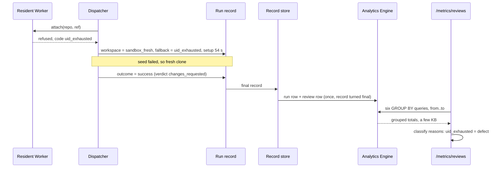

# Every run row carries its outcome and its workspace, and the review dashboard is six queries over them

**The ask.** Decide (the maintainer, before any build unit is seeded): adopt this data model and vocabulary as an amendment to [0063](0063-every-finished-run-writes-one-metrics-point-and-a-metrics-page-reads-the-trend.md), so a review dashboard with a Usage tab and a System health tab can be built on `/metrics`. Written for an engineer who knows the run record and the dispatcher and has not read 0063. The tracker is #2899; the target layout and the numbers below are recorded there.

Success is judged on:

1. For any range up to 90 days, the maintainer sees on a page and as JSON: review runs by requester and surface, completed runs, review time (total, median, p95), reviews per pull request, verdicts and findings (Usage); run success rate, warm-start share per day, every fallback and lost run by reason, and what a cold start costs (System health).
2. Every number on both tabs is a query over rows written when the run finished. No page load reads the run store or a run's events.
3. Whether a fallback is "by design" or "a defect" can be changed without rewriting a row.
4. Every stored value is an id or a word from a closed vocabulary the code types; no run note text is parsed.

## TL;DR

The hand-built version of this dashboard for one week (594 review runs) needed about 3.6 MB of run records, 594 event reads and 2.5 minutes, and it classified fallbacks by matching the text of a run note; it found that warm residents fell from 79% of review runs to 4% in three days, which nothing in the product shows today. The bet is to record two facts as typed fields at the moment they happen (the run's **outcome** and its **workspace**) and widen 0063's one-row-per-run fact with them, plus a **review row** of the same grain for verdicts and findings, so the dashboard becomes about six grouped Analytics Engine queries per load, at effectively no cost and an expected second of latency. The cost is four new text columns that fill the run row (20 of 20), a second row per review run, a typed refusal code from the resident Worker, and an outcome mapping every tile depends on. Decided: the vocabulary, the columns, the mapping, event-time bucketing and the reader; open: whether a resident attach that restores a snapshot counts as warm, and the measured query latency. Doing nothing leaves the next resident collapse visible only to someone who runs the crawl by hand.

## Today at `b52049366`

- **The run row is 16 of 20 text columns and 20 of 20 numbers.** `POINT_COLUMNS` in `src/core/runMetrics.ts` names 16 blobs and 20 doubles; Analytics Engine caps a data point at 20 of each. A new number on the run row is not possible without a new schema word.
- **Which workspace a run got exists only as a span attribute and a sentence.** The dispatcher publishes a `cold_sandbox` run note whose summary is free text (`src/core/dispatcher.ts`, the `kind: "cold_sandbox"` publish), and the attach span carries `backend: resident | sandbox`. The resident Worker refuses with a string prefix (`"pool-recycle-required: all UIDs spent …"` in `deploy/cloudflare-resident/worker.ts`); a failed seed is the string `seed failed (…)` (`src/execution/factory.ts`). The run row's `machine class` column is the profile's requested machine (`repo-resident` on 588 of 594 review runs), not the workspace the run got.
- **"failed" mixes four different things.** `RunStatus` is `completed | stopped_soft | stopped_hard | failed | interrupted` (`src/core/runRecord.ts`), and `RUN_FAILURE_KINDS` names only four failures (`policy_refusal`, `provider_transient`, `model_stream_incomplete`, `sandbox_fleet_busy`); a run that never got a workspace, a run that hit its time budget and a run the model refused all read `failed` or carry no kind.
- **Days are bucketed by write time, and write time is close to finish time.** The reader groups on `toStartOfInterval(timestamp, INTERVAL '1' DAY)` (`src/core/metrics.ts`), Analytics Engine's write stamp; the row's `finished at` double is stored but unused by the report. Over 583 review runs in the hand-built week, a record sealed a median 0.8 s after its finish (p99 2.2 s, maximum 17 s) and none crossed a UTC day.
- **The review facts are typed but stay in the run store.** `ReviewVerdictKind` is `approve | request_changes` and `FINDING_SEVERITIES` is `blocking | major | minor | nit` (`src/core/reviewVerdict.ts`); the pull request rides `reviewPost.target`. The run store keeps six to ten days (0063), so a week-old pull request's reviews are already gone from it.

## The shape

The design is a **wide event**: one row per finished run, written once at the commit point 0063 already uses, carrying every dimension a chart needs; every metric is a `GROUP BY` over those rows at read time, never a counter incremented at write time. This is Stripe's canonical log line or a Honeycomb event, stored in Analytics Engine; the one way it differs is the platform's fixed 20-column budget, which forces review facts into a second row of the same grain instead of more columns.

## One trace: a fallback that falls back again, finishing after midnight

A review run asked at 23:58 UTC on a Thursday, during the week the resident ran out of UIDs.

1. The dispatcher asks the resident to attach. The resident has spent all its UIDs and is busy, and answers the refusal with `code: "uid_exhausted"` (today it answers only the sentence).
2. The dispatcher selects a sandbox and tries to seed it from the resident snapshot. The seed fails; the dispatcher starts a fresh clone. It writes `workspace: { provider: "sandbox", seed: "fresh", fallback: "uid_exhausted", setupMs: 54300 }` onto the run record, and publishes the same `cold_sandbox` note it publishes today for the person reading the run page.
3. A deploy rolls the bot at 00:01 UTC. The run resumes under the new generation; the workspace block is on the record it resumes from, so nothing is re-derived.
4. The review submits `request_changes` with one `major` finding and the run ends `completed` at 00:06 UTC on Friday, answer ending `answered`.
5. The record turns final. `pointOf` writes the run row: `outcome = success` (a changes-requested verdict is work that succeeded), `error type` empty, `workspace = sandbox_fresh`, `fallback = uid_exhausted`, `surface = slack`, `finished at = 00:06 Friday`. `reviewRowOf` writes the review row: the pull request, the head, `verdict = changes_requested`, findings 1, major 1.
6. A later abridged-diff re-put of the same record writes no second row (0063's turned-final rule).
7. The page asks for Thursday to Friday. The run lands on Friday, its finish day; its start on Thursday does not move it.
8. The System health tab counts it once as cold, once under `uid_exhausted` (mapped to **defect** by the report), and once under "seed failed, fresh clone". The Usage tab counts one review, one success, one changes-requested verdict, one more review for that pull request.

The property: one run produces exactly one run row and one review row, each fallback reason is a typed code chosen where the fallback happened, and the run lands on the day it finished, across a resume and a deploy.

## The difficulty map

Ranked by risk of being wrong:

1. **The workspace block**: classifying all nine attach paths into a closed vocabulary at the one place that knows, without leaving a path that writes nothing or falls back to text. [The workspace block](#the-workspace-block).
2. **The outcome mapping**: every tile divides by it, and today's `failed` hides four meanings. [Outcome and error type](#outcome-and-error-type).
3. **The column budget**: the run row fills to 20 of 20 text columns. [Rows and columns](#rows-and-columns).
4. The page (two tabs, nine charts) and the reader's six queries with their in-memory twin (most work; low risk, the costs and metrics pages are the pattern). [The reader and the page](#the-reader-and-the-page).

Bucketing by finish time instead of write time is not on this list: the measured lag is seconds, so either clock gives the same day ([Bucketing](#bucketing-by-finish-time)).

## The workspace block

**Constraint.** Only the dispatcher, at executor selection, knows which workspace a run got and why; the facts leave it today as a span attribute and a sentence. The hand-built week found the note in two shapes ("seeded sandbox from resident snapshot", "using fresh sandbox (seed failed …)") and four refusal reasons, all recovered by string matching. A reworded note silently moves a run between buckets.

**Design.** The run record gains one optional block, written by the dispatcher once, at the first attach, and carried by the record through every resume:

| Field | Values | Set when |
|---|---|---|
| `provider` | `resident`, `sandbox`, `none` | once a workspace was asked for; `none` only when the run ended before getting one (`lost` set). An agent that asks for no workspace has no block |
| `restored` | boolean | provider is `resident` and the attach restored a snapshot into the checkout |
| `seed` | `snapshot`, `fresh` | provider is `sandbox` |
| `fallback` | `uid_exhausted`, `fleet_draining`, `deploy_fence`, `workspace_preserved`, `settlement_pending`, `not_resident`, `other` | the run asked for a resident and got a sandbox |
| `lost` | `sandbox_start_timeout`, `stopped_in_drain`, `resident_claim_error`, `other` | the run ended before any workspace |
| `setupMs` | number | the attach span's duration |

Every attach path the hand-built week observed, and the words it writes:

| Path | Runs that week | `provider` | other fields |
|---|---|---|---|
| resident attached, checkout ready | 180 | `resident` | |
| resident attached after restoring a snapshot | 27 | `resident` | `restored` |
| resident refused (UIDs spent), sandbox seeded from its snapshot | 262 | `sandbox` | `seed: snapshot`, `fallback: uid_exhausted` |
| resident refused, the seed failed, fresh clone | 50 (all reasons) | `sandbox` | `seed: fresh`, `fallback` as refused |
| fleet closed for a deploy (drain or fence) | 16 | `sandbox` | `fallback: fleet_draining` or `deploy_fence` |
| resident holding another run's workspace | 9 | `sandbox` | `fallback: workspace_preserved` or `settlement_pending` |
| repository has no resident | 0 that week | `sandbox` | `fallback: not_resident` |
| sandbox did not start in time | 17 | `none` | `lost: sandbox_start_timeout` |
| stopped while waiting on a deploy, or the resident claim errored | 5 and 2 | `none` | `lost: stopped_in_drain` or `resident_claim_error` |

The resident Worker's refusal answer gains `code`, one of the `fallback` words, beside the sentence it sends today; the sentence stays for people. The dispatcher maps the code; an unknown or absent code is `other`, never a guess from the sentence, so the Worker and the bot can deploy in either order. **Cold start** is derived, `provider = sandbox`, after OpenTelemetry's `faas.coldstart`, and is not stored. Whether a `restored` resident attach counts as warm is a report-side mapping, like the fallback classes: the row stores what happened, the page decides what to call it.

**Invariants.** A run that reached executor selection has exactly one workspace block. `fallback` is set if and only if a resident was asked and a sandbox was used. `seed` is set if and only if `provider = sandbox`; `restored` only if `provider = resident`. A word appears in at most one field: `fallback` words name why a sandbox was used, `lost` words why there was no workspace. No code path reads the note text to fill a field. A resumed run's block equals the block its first generation wrote. The block is persisted before the run's first model turn.

**Failure modes.** A new refusal reason added to the resident Worker without a code shows up as `other`; the System health tab shows `other` as its own bar, so a growing `other` is visible rather than misfiled. A run that dies between attach and the record write that carries the block has no block; the reader counts it under "workspace not recorded". In the hand-built week that bucket held 27 runs, all resumed runs whose setup events belonged to an earlier generation, which carrying the block on the record removes.

**The alternative it beat.** Classify in the reader from the note text, as the hand-built page did. It works until the note is reworded, and then it fails silently by moving runs between bars; a typed code fails a unit test instead.

## Outcome and error type

**Constraint.** Every tile on System health is a ratio of outcomes, and today's `failed` covers a model refusal, an infrastructure error, a time budget and a run that never got a workspace.

**Design.** The run row stores an **outcome** using OpenTelemetry's CI/CD result vocabulary, derived in `pointOf` from fields the record already has, and widens the existing `failure kind` column into **error type** (its four values stay valid, so old rows read correctly):

The first matching row wins, top to bottom:

| Record | Outcome | Error type |
|---|---|---|
| `stopped_soft`, `stopped_hard` | `cancellation` | empty |
| workspace `lost` set | `error` | the `lost` word |
| answer ending `time_budget` | `timeout` | empty |
| `interrupted` | `error` | `interrupted` |
| `completed` | `success` | empty |
| `failed`, failure `policy_refusal` | `failure` | `policy_refusal` |
| `failed`, any other failure kind | `error` | the failure kind |
| `failed`, nothing named | `error` | `unclassified` |

A **failure** is work that ran and said no; an **error** is the system breaking. A review whose verdict is changes-requested is a success: the verdict lives on the review row, never in the outcome. `RunStatus` is not renamed; the outcome is a reading of it.

**Invariants.** Every run row has exactly one outcome. `error type` is empty unless the outcome is `failure` or `error`. `unclassified` is a value the page shows, as a count beside the run success rate, so its size is the measure of how much the error vocabulary still misses.

**Failure modes.** A new failure path with no kind lands in `unclassified`; nothing is hidden, and the count says which vocabulary to extend next.

**The alternative it beat.** Rename `RunStatus` to the five outcomes. It would touch every status reader in the product for a reporting need; a derived column gives the same report and leaves the record alone.

## Bucketing by finish time

The reader groups by the row's `finished at` double, so a run's day is the UTC day it finished, and bounds its scan by write time from the range start to one hour past the range end, so a row sealed a few seconds after a finish just before the end is still read. Measured lag is seconds (maximum 17 s), so today the two clocks agree on every day; the finish clock is chosen because it is the one that means something to the reader of the page. A row written weeks late is outside the scan and is not counted; backfill is a non-goal. If the SQL dialect cannot turn a double into a day inside `GROUP BY` (one query in the reader unit tests it), the reader keeps write-time days, wrong by at most the lag.

## Rows and columns

**Constraint.** 16 of 20 text columns and 20 of 20 numbers are used on the run row.

**Design.** The run row gains four text columns, appended so no position changes meaning (schema word unchanged): `surface` (`slack`, `mcp`, `web`, `http`, `cli`), `workspace`, `fallback` (the block's word, or empty), `outcome`. `workspace` folds the block into one word:

| Block | `workspace` |
|---|---|
| `provider: resident` | `resident` |
| `provider: resident`, `restored` | `resident_restored` |
| `provider: sandbox`, `seed: snapshot` | `sandbox_snapshot` |
| `provider: sandbox`, `seed: fresh` | `sandbox_fresh` |
| `provider: none` (`lost` set) | `none` |
| no block (an agent with no workspace, or not recorded) | empty |

A `lost` word reaches the row as the error type (the outcome table's second row), so it needs no column. Column 6 is renamed from `failure kind` to `error type`. Setup time uses the existing `getting ready` number, labelled "time to ready", which contains the attach. The run row is then full; the next field needs a new schema word and a reader that understands both.

A **review row** is written beside the run row for every review run with a verdict, with its own schema word so 0063's reader (which filters on the run row's schema word) never counts it:

| Text | Numbers |
|---|---|
| schema word, run id, pull request number, repository, head revision, verdict (`approved`, `changes_requested`), requester, surface | finished at, duration in ms, findings total, `blocking`, `major`, `minor`, `nit` |

Names follow OpenTelemetry where a convention exists (the pull request is `vcs.change.id`, the repository `vcs.repository.name`, the head `vcs.ref.head.revision`) and GitHub's review states for the verdict; the column names live in `POINT_COLUMNS`, never as magic positions. The review row is an **extension** of the run row, not a second fact: one row per review run, joined by run id, never summed with run rows. Reviews per pull request is a rollup at query time.

**Invariants.** A review run with a verdict writes exactly one review row, under the same turned-final rule as its run row. A run row's appended columns are empty, never absent, for rows written before this change.

## The reader and the page

One command, `metrics.reviews` with `from` and `to` (at most 90 days), answers one JSON report with `usage` and `system` sections, and the page and its JSON twin render only that report, as `/metrics` and the costs page do. The reader issues six queries in parallel, every count weighted by `_sample_interval`:

1. run rows of the review agent by day, outcome, surface and requester;
2. weighted p50 and p95 of duration by requester, by surface and overall, successes only;
3. the duration histogram, bucketed in SQL;
4. review rows grouped by pull request, then the reviews-per-pull-request distribution, verdicts and findings in TypeScript;
5. run rows by day, workspace and fallback;
6. weighted p50 of duration and time to ready by workspace.

The by-design, defect and failure grouping is a constant map in the report (`uid_exhausted` to defect; `fleet_draining`, `deploy_fence`, `workspace_preserved`, `settlement_pending`, `not_resident` to design; every `lost` word to failure), so a reclassification is a one-line change. Requester ids become names at render through the existing identity directory. The bot caches each answer for five minutes, and for 24 hours when the range ended before today.

Every tile is written as **good events over total events**, the form a service-level indicator takes:

| Tile | Good | Total |
|---|---|---|
| Run success rate | outcome `success` | outcomes other than `cancellation` |
| Warm-start share | workspace `resident` (and `resident_restored` if the page maps it warm) | workspace `resident*` or `sandbox_*` |
| Lost at setup | workspace `none` | all runs |
| Completed reviews | outcome `success` | review runs |

Page words are checked against [the vocabulary](../reference/vocabulary.md): "reviews per pull request", never "rounds" (a round is a pass over a unit); "warm start", "cold start" and "time to ready", never resident or sandbox; "run success rate", never uptime, which needs a time-based probe this design does not have.

**Cost.** Run rows do not change in number (0063 measured 480 to 860 runs a day); review rows add one per review run, about 100 a day at the hand-built week's rate, so about 3,000 rows a month. A load is six queries; with the cache, a busy day is tens. Cloudflare's published Workers Paid pricing includes 10 million written data points and 1 million read queries a month, so both are under one percent of the included amount. **Latency** is expected around a second uncached and is unmeasured; it is the first receipt.

## Why not X

**Why not compute it from the run store and run events, as the hand-built page did?** One week took about 3.6 MB of records and 594 event reads over 2.5 minutes, against a Durable Object that also admits live runs, and the store keeps six to ten days, so a 90-day range is impossible.

**Why not a weekly snapshot job?** It needs exactly the same typed facts, which are what is missing; it adds a cron and storage and gives fixed weeks instead of any range. It stays the fallback if the measured latency is poor, behind the same reader seam.

**Why not export OpenTelemetry spans to a hosted tracing backend?** It would bring wide events and a query engine, at the price of a vendor, run data leaving the platform, and spans that today live only in the run's event stream. Naming the columns after the semantic conventions keeps that door open as a second sink behind 0063's `RunMetricsSink`.

**Why not a separate dataset for review rows, instead of filling the run row and adding a row kind?** A second dataset is a second binding, a second retention clock and a second reader for facts that join on run id; a schema word already separates row kinds in one dataset (`intakeMetrics.ts` writes its rows under `intake-1` and filters on it). The full run row is the real cost, named in [Rows and columns](#rows-and-columns).

**Why amend 0063 rather than supersede it?** 0063 is `proposed`; this record keeps its sink, its emission rule and its reader seam and adds columns, a row kind and a report. Nothing in 0063 becomes wrong, so nothing is superseded.

**Why not start with a resident capacity gauge, since saturation is what collapsed?** A gauge of UIDs in use against capacity would have warned before the fallbacks began, but it says nothing about what runs experienced: which ones went cold, which fell back twice, which were lost, what it cost per review. The run rows answer those for every cause, the next unknown one included; a gauge answers one. It is the next record, and its tile sits on the same System health tab.

**Why not store "expected" or "defect" with each fallback?** The judgement changes (UID exhaustion may become accepted capacity behaviour after its fix); a stored judgement makes history wrong, a report-side map does not.

## Boundaries

Not in this design: renaming `RunStatus`; a resident capacity gauge (UIDs in use against capacity is the saturation signal that would have shown the collapse before the fallbacks, and is the natural next record); uptime; backfill of weeks before the change ships (rows start the day it deploys); a new vocabulary noun (the page uses plain English for workspaces). The System health tab is behind the same `metrics:read` action as `/metrics`.

## What would change our mind

**A 90-day query takes more than two seconds.** It is timed once before the page unit; the fallback is a cached snapshot behind the reader seam. **Sampling.** At about 100 review rows and a few thousand run rows a day, Analytics Engine is not expected to sample, and every count is weighted anyway; the report states the largest sample interval it saw, so a sampled range, and a p95 over too few rows, is visible on the page rather than silent. Everything is additive and flag-free: unread columns and an unread row cost nothing, so backing out is deleting the reader.

## Rollout

Four units, in order: the workspace block and the resident's refusal codes; the run row's columns, the outcome mapping and the review row; the reader; the page. The execution plan is a separate document.

## Open questions

| Question | Owner | Resolves it | Needed before |
|---|---|---|---|
| Measured latency of a 90-day review query | reader unit's author | one timed query against the live dataset | the page unit |
| Does a `restored` resident attach read as warm on the page? | maintainer | a week of time to ready by workspace; a one-line mapping either way | the page unit |

## Validation criteria

| Criterion | Proof |
|---|---|
| Every attach path writes exactly one workspace block with the right words, including resume | `[gap]` dispatcher unit tests, workspace-block unit |
| An unknown resident refusal maps to `other`, never to a word guessed from text | `[gap]` workspace-block unit |
| The outcome table above, row by row | `[gap]` `pointOf` tests, row unit |
| A review run with a verdict writes one review row; a re-put writes none | `[gap]` record-store tests, row unit |
| The six queries over the in-memory source equal the SQL over the same fixture | `[gap]` reader unit |
| A run finishing after midnight that is written later lands on its finish day | `[gap]` reader unit |
| The page renders only the report's values, in both tabs | `[gap]` page unit and screenshot fixture |
| A 90-day query's latency | `[gap]` human-gated receipt on #2899 |

## Sources

OpenTelemetry semantic conventions: the CI/CD, VCS and FaaS attribute registries.
