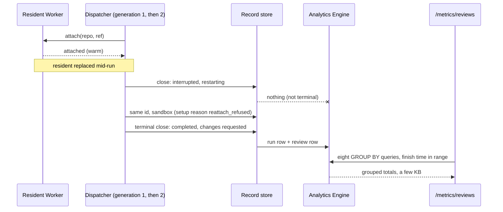

# Every terminal run row carries its outcome and its workspace, and the review dashboard is grouped queries over them

> **Amended 2026-10-09, while proposed, after a correctness review (one blocking and nine major findings, recorded on #2899).** The changes, each at the section it touches: a run row is written at the run's **terminal close**, so a same-id restart no longer freezes an intermediate result (amends 0063's emission rule); the workspace facts are a typed setup result beside the existing `WorkspaceBinding` and cover every executor path, including a same-id reallocation; the seed attempt is recorded, so "seed failed" is countable; the setup reason has its own column, so a cancellation keeps it; the outcome order puts the terminal status first and decides every answer ending; the reader is eight queries, not six; emission is promised as at-most-once and best effort, with the store's failed writes counted; the row widens in two deploy steps; the review row takes its target from the run, not from the post; every aggregate filters on finish time. A second review of this correction (three major, one minor) added the emission latch, the guard against a late `restarting` write, the store sweep that closes an unclaimed restart (fenced on the deadline and on no live claim for the id, after a third review), the setup result in place of binding fields, and the failed-write count in place of a completeness ratio. The title changed because it said "six queries"; the file keeps its path, which is the record's identity.

**The ask.** Decide (the maintainer, before any build unit is seeded): adopt this data model and vocabulary as an amendment to [0063](0063-every-finished-run-writes-one-metrics-point-and-a-metrics-page-reads-the-trend.md), so a review dashboard with a Usage tab and a System health tab can be built on `/metrics`. Written for an engineer who knows the run record and the dispatcher and has not read 0063. The tracker is #2899; the target layout and the numbers below are recorded there.

Success is judged on:

1. For any range up to 90 days, the maintainer sees on a page and as JSON: review runs by requester and surface, completed runs, review time (total, median, p95), reviews per pull request, verdicts and findings (Usage); run success rate, warm-start share per day, every fallback and lost run by reason, and what a cold start costs (System health).
2. Every number on both tabs is a query over rows written when the run reached its terminal close. No page load reads the run store or a run's events.
3. Whether a fallback is "by design" or "a defect" can be changed without rewriting a row.
4. Every stored string dimension is an id or a word from a closed vocabulary the code types; no run note text is parsed.

## TL;DR

The hand-built version of this dashboard for one week (594 review runs) needed about 3.6 MB of run records, 594 event reads and 2.5 minutes, and it classified fallbacks by matching the text of a run note; it found that warm residents fell from 79% of review runs to 4% in three days, which nothing in the product shows today. The bet is to record two facts as typed fields where they happen (the run's **outcome** and its **workspace**), widen 0063's one-row-per-run fact with them, and add a **review row** of the same grain for verdicts and findings, so the dashboard becomes eight grouped Analytics Engine queries per load, at effectively no cost and an expected second of latency. The cost is four text columns that fill the run row (20 of 20) behind a two-step deploy, a typed refusal code from the resident Worker, a stricter emission rule (a row only at the run's terminal close), and an outcome mapping every tile depends on. Decided: the grain, the vocabulary, the columns, the mapping, finish-time bucketing and the reader; open: the measured query latency and whether a restored resident attach reads as warm. Doing nothing leaves the next resident collapse visible only to someone who runs the crawl by hand.

## Today at `b52049366`

- **A run id can close twice, and today's metrics rule keeps the first close.** When a run loses its workspace mid-flight, `closeResumedRow` (`src/core/dispatch/admission.ts`) writes a non-provisional `interrupted` record with `restarting: true`; the successor keeps the same id and finishes it (`src/core/dispatch/reattach.ts`). `pointTurnsFinal` (`src/core/runMetrics.ts`) ignores `restarting`, so the intermediate close writes the run's metrics row and the eventual result writes none.
- **The workspace is typed, but not what was asked for or why it differs.** `WorkspaceBinding` (`src/execution/factory.ts`) is persisted on the record with the `backend` (`resident`, `sandbox`, `local`, `e2b`), the ref and a sandbox's seed identity. Why a sandbox was used exists only as free text: the dispatcher's `cold_sandbox` run note (`src/core/dispatcher.ts`), the resident Worker's refusal sentence (`"pool-recycle-required: all UIDs spent …"`, `deploy/cloudflare-resident/worker.ts`) and `seed failed (…)` (`src/execution/factory.ts`).
- **The row is 16 of 20 text columns and 20 of 20 numbers, and its validator requires the exact width.** `POINT_COLUMNS` names 16 blobs and 20 doubles; `isRunMetricsPoint` rejects any other tuple length, and the record store refuses the whole put when the point is invalid (`deploy/cloudflare-memory/worker.ts`).
- **"failed" mixes a refusal, an infrastructure error, a lost workspace and a failed delivery.** `RunStatus` is `completed | stopped_soft | stopped_hard | failed | interrupted` (`src/core/runRecord.ts`), and `RUN_FAILURE_KINDS` names four failures. An ordinary time budget is a `completed` run with answer ending `time_budget` (`src/core/answerOutcome.ts`: `answered`, `time_budget`, `turn_budget`, `interrupted`, `hard_stop`, `soft_stop`, `unknown`).
- **Emission is at most once and best effort.** The store writes the point after the commit, catches any error and never retries (`writeMetricsPoint`, `deploy/cloudflare-memory/worker.ts`; `runMetricsSink.ts`).
- **The run store is not a 90-day source.** Its defaults are 30 days, 5,000 runs and 2 GiB (`DEFAULT_RETENTION_POLICY`, `src/core/runRecord.ts`); at the measured 480 to 860 runs a day that is six to ten days (0063).

## The shape

The design is a **wide event**: one row per run at its terminal close, carrying every dimension a chart needs; every metric is a `GROUP BY` over those rows at read time, never a counter incremented at write time. This is Stripe's canonical log line or a Honeycomb event, stored in Analytics Engine; it differs in two ways that the platform forces: a fixed 20-column budget, which puts review facts in a second row of the same grain, and best-effort delivery, which the report must show rather than hide.

## One trace: a run restarted on a new workspace under the same id

A review run on a resident during the week the resident fleet was being replaced.

1. The dispatcher attaches the run to a warm resident. The binding records `backend: resident`; the setup result records `requested: resident` and no reason.
2. A deploy replaces the resident while the run is in its third model turn. The run cannot reattach; `closeResumedRow` writes `interrupted`, `restarting: true`.
3. The record store commits that close. Under this design `pointTurnsFinal` sees `restarting` and writes no row; under today's rule this is the row that would be kept.
4. The next generation claims the run under the same id. Reattach is refused, so it allocates a sandbox seeded from the resident snapshot. It replaces the binding (`backend: sandbox`) and the setup result (`requested: resident`, `seed: snapshot`, `reason: reattach_refused`, `reallocated: true`).
5. The review submits `request_changes` with one `major` finding. The run ends `completed`, answer ending `answered`, at 00:06 UTC on Friday.
6. The terminal close commits. `pointOf` writes the run row: `outcome = success`, `workspace = sandbox_snapshot`, `setup reason = reattach_refused`, `surface = slack`, `finished at = 00:06 Friday`. `reviewRowOf` writes the review row from the record's own target: repository, pull request number, verified head, `changes_requested`, findings 1, major 1.
7. A later abridged-diff re-put of the same record writes nothing: the run's emission latch is set.
8. The page asks for Friday. Every query filters on `finished at`, so the run is on Friday. The System health tab counts one cold start with reason `reattach_refused`; the Usage tab counts one successful review and one more review for that pull request.

The property: a run that closes twice produces one run row and one review row, both describing its eventual result, and the workspace it finished on carries the reason it moved.

## The difficulty map

Ranked by risk of being wrong:

1. **The terminal close**: which close of a run id writes its rows, given restarts, unclaimed restarts and best-effort delivery. [The terminal close](#the-terminal-close).
2. **The workspace facts**: one closed vocabulary across every executor path, including a same-id reallocation. [The workspace facts](#the-workspace-facts).
3. **The outcome mapping**: every tile divides by it, and records combine status, failure kind, answer ending and delivery in ways the record validator allows. [Outcome and error type](#outcome-and-error-type).
4. **Widening the row while two generations write**. [Rows and columns](#rows-and-columns).
5. The page and the reader's eight queries with their in-memory twin (most work; the costs and metrics pages are the pattern). [The reader and the page](#the-reader-and-the-page).

## The terminal close

**Constraint.** A run id can close more than once: a `restarting` close, then the successor's close. Today the first non-provisional close writes the row, so a restarted run is counted as `interrupted`, on the wrong day, with the wrong duration, and a verdict reached only by the successor gets no review row.

**Design.** A close is **terminal** when the record is not `provisional` and not `restarting`. Three rules in the record store make a run's rows describe its terminal close, exactly once at most:

1. **Emit on the first terminal close.** The store writes the run row, and the review row when there is one, when the stored record is terminal and the run's **emission latch** is unset; it sets the latch in the same transaction as that write. A `restarting` or provisional close writes nothing. This amends 0063's emission rule, which counted the first non-provisional close; a reclaimed `interrupted` close that is not `restarting` still counts once, as 0063 says.
2. **A terminal row is never replaced by a non-terminal one.** The store's guard that answers a late provisional write without storing it (`worker.ts`, the provisional-regression branch) extends to a late `restarting` write, including the plain `put` a refused ledger finish falls back to. With the latch, a terminal retry or an abridged-diff re-put after such a write still emits nothing.
3. **An unclaimed restart is closed by the store.** A `restarting` row carries `restartUntil`, its claim deadline. The store's existing run sweep (the alarm it already sets every `RUN_SWEEP_INTERVAL_MS`) finds a `restarting` row whose deadline has passed and, in one transaction, rewrites it as a terminal `interrupted` close with error type `restart_unclaimed` only if the row still carries the same `restartUntil` and no `live_runs` row exists for the run id; that close emits under rule 1. A same-id successor never touches the `runs` row while it works: its claim inserts a `live_runs` row, and its start tombstone is refused by the provisional guard. So the deadline alone is not evidence that nobody claimed the run; the live row is, the same test `adminCoordinator.ts` applies when it reads a restart. A successor still running after the deadline keeps the sweep a no-op, and its own terminal close later emits the run's only rows. Today `restartUntil` expiry is only a read-time projection and nothing writes the run's end after a whole-process death, so without this rule an orphaned restart would never be counted.

Delivery stays at most once and best effort: the sink write follows the commit and is not retried. The store counts every sink write that throws, by row kind, and serves the counts on its status route; the System health tab shows them as "rows the store failed to write". A drop inside the platform after an accepted write is not detectable from here, and the page says so.

**Invariants.** At most one run row and at most one review row per run id, guarded by the latch. No `restarting` or provisional write replaces a terminal row. Every `restarting` row is eventually replaced by a terminal close, by its successor or by the sweep. The sweep rewrites a `restarting` row only when its deadline has passed and no `live_runs` row exists for the id, decided in the rewrite's transaction. A row describes the run's terminal close.

**Failure modes.** A store crash between the commit and the sink write loses that run's rows without a count (the latch is set, the write never happened); this is the price of not adding a delivery queue. A sweep that runs late only delays the orphaned run's row.

**The alternative it beat.** Write a row at every close and keep the newest per id at read time. The dialect has no window functions to pick the newest row under sampling weights, and every count would carry the duplicates (0063's "Why not" makes the same argument).

## The workspace facts

**Constraint.** Only the executor factory and the dispatcher know which workspace a run got and why; today the why is three sentences. The hand-built week recovered it by string matching, and a reworded note silently moves runs between bars.

**Design.** The run record gains a **setup result**, a typed field written by the dispatcher whenever the run asked for a workspace, whether or not it got one. `WorkspaceBinding` stays what it is, the executor a resume consults, and exists only when there is a workspace; the setup result says what was asked for and why the run did not get it, which is exactly what a run with no workspace still has to say. Its fields, never derived from text:

| Field | Values | Set when |
|---|---|---|
| `requested` | `resident`, `cold`, `blank` | always: what the run's repository and profile asked for |
| `seed` | `snapshot`, `fresh_no_snapshot`, `fresh_after_seed_failure` | the binding's `backend` is `sandbox` and `requested` is `resident` |
| `restored` | boolean | the binding's `backend` is `resident` and the resident's attach answer says it restored a snapshot |
| `reason` | a fallback word or a lost word, below | the run did not get what it requested |
| `reallocated` | boolean | a same-id successor replaced the binding after reattach was refused |

A run with a lost word has a setup result and no binding, so nothing claims a reattachable executor. An agent that asks for no workspace has neither, which keeps "asked for nothing" distinct from "lost its workspace".

**Fallback words** say why a sandbox was used when a resident was requested: `uid_exhausted`, `fleet_draining`, `deploy_fence`, `workspace_preserved`, `settlement_pending`, `not_resident` (cold registration or not onboarded), `resident_unreachable` (probe failed or the outage breaker is open), `restore_failed`, `resident_not_serviceable`, `reattach_refused`, `fallback_other`. **Lost words** say why there was no workspace: `sandbox_start_timeout`, `stopped_in_drain`, `resident_claim_error`, `ref_unresolved` (needs a ref and the repository has no default), `registration_mismatch`, `seed_claim_refused` (a claimed seed refused a fresh start), `lost_other`. The two sets are disjoint, each with its own unknown word.

The resident Worker's refusal answer gains `code`, one of the fallback words, beside the sentence it sends today; its attach answer gains `restored`. The dispatcher maps the code; an absent or unknown code is `fallback_other`, never a guess from the sentence, so the Worker and the bot deploy in either order. A same-id reallocation replaces both the binding and the setup result, with `reallocated: true` and the reason for the newest allocation. **Cold start** is derived (the binding's `backend` is `sandbox` while `requested` is `resident`), after OpenTelemetry's `faas.coldstart`; it is not stored. Whether `restored` counts as warm is a report-side mapping.

Every executor path, with mutually exclusive counts from the hand-built week where it had them, is in [the appendix](#appendix-every-executor-path).

**Invariants.** A run that asked for a workspace has a setup result with `requested` set. `reason` is a fallback word only when the binding's `backend` is `sandbox` and `requested` is `resident`; it is a lost word only when there is no binding. `seed` is set only with a fallback word; `restored` only with a resident binding. No code path reads note text to fill a field. The setup result and the binding are persisted before the run's first model turn; if that write fails, the run ends through the existing failed-record path with a setup result carrying `lost_other` and no binding.

**Failure modes.** A new refusal without a code shows as `fallback_other`, its own bar, so growth is visible rather than misfiled. A run that dies after attach and before the setup write has neither field; its row shows an empty workspace and counts under "workspace not recorded".

**The alternative it beat.** Putting these fields on `WorkspaceBinding`. The binding requires a real backend and is what a resume reattaches to; a run that lost its workspace would need a fake one to carry its reason.

## Outcome and error type

**Constraint.** Every System health tile is a ratio of outcomes, and the record validator accepts any status with any answer ending, so the mapping must decide every combination, not just the common ones.

**Design.** The run row stores an **outcome** in OpenTelemetry's CI/CD result vocabulary, derived in `pointOf`, and widens the existing `failure kind` column into **error type** (its four values stay valid). The terminal status decides first; within a status, the first matching row wins:

| Status | Condition | Outcome | Error type |
|---|---|---|---|
| `stopped_soft`, `stopped_hard` | any | `cancellation` | empty |
| `interrupted` | closed by the store's sweep (an unclaimed restart) | `error` | `restart_unclaimed` |
| `interrupted` | otherwise | `error` | `interrupted` |
| `failed` | failure `policy_refusal` | `failure` | `policy_refusal` |
| `failed` | another named failure kind | `error` | the failure kind |
| `failed` | a lost word | `error` | the lost word |
| `failed` | `replyOk` false | `error` | `reply_failed` |
| `failed` | ending `time_budget` or `turn_budget` | `timeout` | the ending |
| `failed` | otherwise | `error` | `unclassified` |
| `completed` | ending `time_budget` or `turn_budget` | `timeout` | the ending |
| `completed` | ending `interrupted` | `error` | `answer_interrupted` |
| `completed` | ending `hard_stop` or `soft_stop` | `cancellation` | empty |
| `completed` | otherwise | `success` | empty |

A **failure** is work that ran and said no; an **error** is the system breaking. A changes-requested review is a success: the verdict lives on the review row. The setup reason has its own column, so a cancellation during a drain keeps `stopped_in_drain`. `RunStatus` is not renamed; the outcome is a reading of it.

**Invariants.** Every terminal row written after the change has exactly one outcome. Error type is empty exactly for `success` and `cancellation`. `unclassified` is counted on the page beside the run success rate.

**Failure modes.** A new failure path with no kind lands in `unclassified`, visibly.

**The alternative it beat.** Rename `RunStatus` to the five outcomes: every status reader in the product would change for a reporting need.

## Rows and columns

**Constraint.** 16 of 20 text columns are used, the validator requires the exact width, and during a deploy two generations write at once.

**Design.** The run row gains four text columns, appended so no position changes meaning: `surface` (`slack`, `mcp`, `web`, `http`, `cli`), `workspace`, `setup reason` (the setup result's `reason`, or empty) and `outcome`. Column 6 is renamed from `failure kind` to `error type`. `workspace` folds the binding and the setup result into one word:

| Binding and setup result | `workspace` |
|---|---|
| `resident` | `resident` |
| `resident`, `restored` | `resident_restored` |
| `sandbox`, seed `snapshot` | `sandbox_snapshot` |
| `sandbox`, seed `fresh_no_snapshot` | `sandbox_fresh` |
| `sandbox`, seed `fresh_after_seed_failure` | `sandbox_seed_failed` |
| `sandbox`, requested `cold` or `blank` | `sandbox_cold` or `sandbox_blank` |
| `local`, `e2b` | `local`, `e2b` |
| no binding, a lost word | `none` |
| neither field | empty |

**Two deploy steps.** First the validator, on the bot and in the store, accepts a run point of 16 or 20 text columns, and that ships alone. Then the writer emits 20. The reader projects a 16-column row as empty appended columns and reports those rows as outcome "not recorded"; the page names the first day on which every row carries an outcome. Setup time uses the existing `getting ready` number, labelled "time to ready", which contains the attach and more. The run row is then full; the next field needs a new schema word.

A **review row** has its own schema word, so 0063's reader never counts it, and is written under the terminal rule for every review run with a verdict:

| Text | Numbers |
|---|---|
| schema word, run id, repository, pull request number, head revision, verdict (`approved`, `changes_requested`), requester, surface | finished at, duration in ms, findings total, `blocking`, `major`, `minor`, `nit` |

The repository, number and head come from the run record (`repo`, `pr`, `headSha`, set from the review's verified target before the model starts), never from `reviewPost.target`, which exists only when the post succeeded. A branch review with no pull request writes an empty number: its verdict counts, it is left out of reviews per pull request. Pull requests group by repository and number. Names follow OpenTelemetry where a convention exists (`vcs.repository.name`, `vcs.change.id`, `vcs.ref.head.revision`) and GitHub's review states for the verdict; the names live in `POINT_COLUMNS`.

## Finish-time bucketing

Every aggregate filters and groups on the row's `finished at`, converted with `toDateTime` (documented for the SQL service; the reader's first test runs it). The scan is also bounded by write time, widened one day on each side of the range so the platform can prune: a record seals a median 0.8 s after its finish (p99 2.2 s, maximum 17 s, over 583 runs), and the metrics write follows asynchronously with retries (`src/core/runHistoryWriter.ts`), so a day is a generous bound. A row written more than a day late is outside the scan; backfill is a non-goal. There is no write-time fallback: a run's day is the UTC day it finished.

## The reader and the page

One command, `metrics.reviews` with `from` and `to` (at most 90 days), answers one JSON report with `usage` and `system` sections; the page and its JSON twin render only that report, as `/metrics` and the costs page do. Eight queries run in parallel, every count weighted by `_sample_interval`:

1. review run rows by day, outcome, surface and requester;
2. weighted p50 and p95 of duration for successes, by requester;
3. the same by surface;
4. the same over all review runs in range;
5. the duration histogram, bucketed in SQL;
6. review rows by repository and pull request, then reviews per pull request, verdicts and findings in TypeScript;
7. run rows by day, workspace, setup reason and error type;
8. weighted p50 of duration and time to ready by workspace.

Quantiles cannot be merged across groups, which is why 2 to 4 are separate. The report states the largest `_sample_interval` it saw; when it is above 1, the reviews-per-pull-request distribution is suppressed, because sampled rows cannot say how many distinct pull requests there were.

The by-design, defect and failure grouping is a constant map in the report: `uid_exhausted`, `resident_unreachable`, `restore_failed`, `resident_not_serviceable` and `fallback_other` map to defect; `fleet_draining`, `deploy_fence`, `workspace_preserved`, `settlement_pending`, `not_resident` and `reattach_refused` to design; every lost word to failure. Requester ids become names at render through the existing directory (`names.person`). The bot caches each answer for five minutes, and for 24 hours when the range ended before today.

Every tile is **good events over total events**:

| Tile | Good | Total |
|---|---|---|
| Run success rate | outcome `success` | outcomes other than `cancellation` and "not recorded" |
| Warm-start share | workspace `resident` (and `resident_restored` when mapped warm) | rows whose setup result requested a resident and got a workspace |
| Lost at setup | workspace `none` | all rows |
| Reviews with a verdict | review rows | review run rows |

Page words are checked against [the vocabulary](../reference/vocabulary.md): "reviews per pull request", never "rounds" (a round is a pass over a unit); "warm start", "cold start" and "time to ready", never resident or sandbox; "run success rate", never uptime, which needs a time-based probe this design does not have.

**Cost.** Run rows do not change in number (480 to 860 a day, 0063); review rows add about 100 a day. Cloudflare's published Workers Paid allowance is 10 million written data points and 1 million read queries a month; at the stated volume both stay under one percent of it. **Latency** is expected around a second uncached and is unmeasured; it is the first receipt.

## Why not X

**Why not compute it from the run store and run events, as the hand-built page did?** One week took about 3.6 MB of records and 594 event reads over 2.5 minutes, against a Durable Object that also admits live runs, and the store holds six to ten days at today's volume.

**Why not a weekly snapshot job?** It needs exactly the same typed facts, which are what is missing; it adds a cron and storage and gives fixed weeks instead of any range. It stays the fallback if the measured latency is poor, behind the same reader seam.

**Why not export OpenTelemetry spans to a hosted tracing backend?** Spans reach the run's event stream and the log sinks today, but not as rows anything can `GROUP BY` over 90 days. A hosted backend would add a vendor and send run data off the platform. Naming the columns after the semantic conventions keeps it open as a second sink behind 0063's `RunMetricsSink`.

**Why not a separate dataset for review rows?** A second binding, retention clock and reader for facts that join on run id; a schema word already separates row kinds in one dataset (`intakeMetrics.ts` writes and filters `intake-1`).

**Why amend 0063 rather than supersede it?** 0063 is `proposed`. This record keeps its sink, its reader seam and its write-once intent, and corrects one rule in it, the first non-provisional close; a dated note in 0063 points here.

**Why not start with a resident capacity gauge?** A gauge of UIDs in use would have warned before the fallbacks began, but it says nothing about what runs experienced: which went cold, which were lost, what it cost per review. The rows answer that for every cause, including the next unknown one. The gauge is the next record.

**Why not store "expected" or "defect" with each fallback?** The judgement changes (UID exhaustion may become accepted capacity behaviour after its fix); a stored judgement makes history wrong, a report-side map does not.

## Boundaries

Not in this design: renaming `RunStatus`; a delivery queue for metrics rows; the resident capacity gauge; uptime; backfill of weeks before the change ships. `/metrics` pages are behind the Access gate today; the `metrics.reviews` command, like `metrics.trend`, requires `metrics:read`.

## What would change our mind

**A 90-day query takes more than two seconds.** Timed once before the page unit; the fallback is a cached snapshot behind the reader seam. **The store's failed-write count is more than a handful a week.** Then best-effort delivery is too lossy and a queue between the store and the sink is the next decision. Everything is additive: unread columns and an unread row cost nothing, so backing out is deleting the reader.

## Rollout

Five units, in order: the validator accepts both widths; the setup result and the resident's codes; the terminal emission rule (latch, guard, sweep), the outcome mapping, the four columns and the review row; the reader; the page.

## Open questions

| Question | Owner | Resolves it | Needed before |
|---|---|---|---|
| Measured latency of a 90-day review query | reader unit's author | one timed query against the live dataset | the page unit |
| Does `resident_restored` read as warm on the page? | maintainer | a week of time to ready by workspace; a one-line mapping either way | the page unit |

## Validation criteria

| Criterion | Proof |
|---|---|
| The twelve absent, provisional, restarting and terminal transitions in the review of this correction: only a first terminal close emits, a late provisional or `restarting` write never replaces a terminal row, and a retry or artifact re-put after it emits nothing | `[gap]` record-store tests, emission unit |
| The sweep closes an expired restart with no live row as terminal `interrupted` with `restart_unclaimed` and emits once; it is a no-op when a successor that claimed is still live after the deadline, when the successor finished first, when the successor's provisional tombstone was refused over the restarting row, and when a successor claims between the sweep's scan and its rewrite | `[gap]` record-store tests, emission unit |
| A sink write that throws increments the store's failed-write count for its row kind | `[gap]` record-store tests |
| A 16-column and a 20-column point both pass validation; a 16-column row is projected with empty appended columns | `[gap]` validator unit, reader unit |
| Every executor path in the appendix writes its listed setup result and binding, including reallocation, each setup loss with no binding, a failed setup write, and an agent that asks for no workspace | `[gap]` factory and dispatcher tests, setup unit |
| An absent or unknown resident code maps to `fallback_other` | `[gap]` setup unit |
| Every row of the outcome table, including `interrupted` with `time_budget`, `failed` with `time_budget` and `replyOk` false, and `stopped_hard` with `stopped_in_drain` | `[gap]` `pointOf` tests |
| A review with a verdict and no successful post writes a review row from the record's target; a branch review writes an empty number | `[gap]` emission unit |
| Each aggregate counts only rows whose finish is in range, including one written 800 ms after a midnight finish | `[gap]` reader unit |
| Quantiles by requester, by surface and overall each come from their own query | `[gap]` reader unit |
| A sampled range suppresses the reviews-per-pull-request distribution | `[gap]` reader unit |
| The page renders only the report's values, in both tabs | `[gap]` page unit and screenshot fixture |
| A 90-day query's latency | `[gap]` human-gated receipt on #2899 |

## Appendix: every executor path

Counts are the hand-built week's 594 review runs, mutually exclusive; "none seen" means the path exists in code and did not occur that week.

| Path | Week | Setup result (and binding) |
|---|---|---|
| Warm resident, checkout ready (including a resident serviceable while refreshing, and a ref retried once on the default branch) | 180 | `resident` |
| Resident restored a snapshot, then attached | 27 | `resident`, `restored` |
| UIDs spent: sandbox seeded from the snapshot | 262 | `sandbox`, seed `snapshot`, `uid_exhausted` |
| UIDs spent: seed failed, fresh clone | 46 | `sandbox`, seed `fresh_after_seed_failure`, `uid_exhausted` |
| Fleet drained or fenced: seeded / seed failed | 13 / 3 | `sandbox`, `fleet_draining` or `deploy_fence` |
| Workspace preserved or settling: seeded / seed failed | 8 / 1 | `sandbox`, `workspace_preserved` or `settlement_pending` |
| Fell back with no reason recorded | 3 | `sandbox`, `fallback_other` |
| Cold registration or not onboarded | none seen | `sandbox`, `not_resident` |
| Probe unreachable or outage breaker open | none seen | `sandbox`, seed `fresh_no_snapshot`, `resident_unreachable` |
| Restore unsupported or failed in transport | none seen | `sandbox`, `restore_failed` |
| Lifecycle not serviceable, or a degraded build | none seen | `sandbox`, `resident_not_serviceable` |
| Reattach refused, same id reallocated | not separable that week | newest binding, `reattach_refused`, `reallocated` |
| Explicit cold repository, or a blank workspace | none seen | `sandbox`, requested `cold` or `blank`, no setup reason |
| Local or E2B backend | none seen | `local` or `e2b` |
| Sandbox did not start in time | 17 | none, `sandbox_start_timeout` |
| Stopped while waiting on a deploy drain | 5 | none, `stopped_in_drain` |
| Resident claim errored | 2 | none, `resident_claim_error` |
| Needs a ref and the repository has no default | none seen | none, `ref_unresolved` |
| Registration or fence mismatch | none seen | none, `registration_mismatch` |
| A claimed seed refused a fresh start | none seen | none, `seed_claim_refused` |
| Resumed run whose setup events belonged to an earlier generation | 27 | the fields carried on the record |
| No workspace requested (an agent without one) | none among reviews | neither field |

The week's rows sum to 594.
