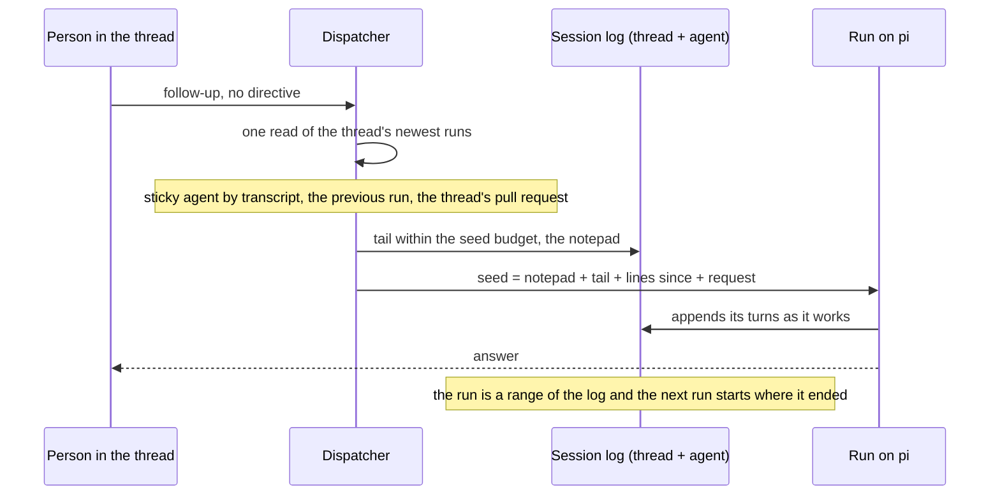

# A thread's conversation outlives its runs

One agent does a unit of work, and a follow-up in its thread continues the conversation that agent already had — not a summary of it, the conversation itself. The store behind that is one log per thread and agent that every run of the pair appends to and no run owns ([decision 0034](../decisions/0034-one-agent-per-unit-a-run-continues-a-transcript.md), [decision 0035](../decisions/0035-a-session-log-outlives-its-runs-compaction-is-a-pointer.md)).

## Why one agent, and why the transcript

Two rules from the field shaped this. The agent that gathered the evidence is the agent that acts on it: a fix handed to a second agent as a list of findings arrives without the hour of context that produced them, and the second agent spends its budget rediscovering what the first already knew. And a summary passed between agents is exactly the context the next agent never has. Switchboard had grown the opposite shape in places — a fix round as a fresh child run, a re-review re-parsing the thread's text — and the record collapsed those into one rule: a run **continues a transcript**.

The transcript is not Slack's. A thread's channel history is what people said; the conversation an agent had includes every tool call, every result and every compaction, and it lives in the run records. So the store gained one object per **session** — a thread and an agent — holding the rows of every run of that pair in order, each run a contiguous range of it. The object outlives its runs, is indexed for search, and is dropped only when its last kept run leaves retention ([session-log spec](../reference/specs/session-log.md)).

## What a follow-up starts from

The dispatcher reads the thread's newest runs once and derives everything it knows about the thread from that page: the run whose transcript the thread holds (its agent is **sticky by transcript** when it runs on the pi harness, and the router is not asked), the previous run of that agent (when it ended, so the lines written after it can be told apart), and the pull request that run opened, if any ([routing-and-config spec](../reference/specs/routing-and-config.md), [resident-repos spec](../reference/specs/resident-repos.md)).

The seed is then built in a fixed order, within a fixed budget:

| Part | Where it comes from | Why |
|---|---|---|
| the notepad | the session's notes, as the agent last wrote them | decisions and names survive every compaction and every run boundary |
| the tail | the log's newest turns that fit the budget, cut after the newest compaction and to a whole user turn; results answering calls made before the cut are dropped from that first turn, and the run's notes say so | the model resumes mid-conversation, not from a retelling |
| the lines since | what people wrote in the thread after the previous run ended | the conversation the agent missed while it was not running |
| the request | the message that started this run | as the last user turn |

The record says which source a run's conversation came from — the thread's channel history, a spawning parent's turns, or its own session — and a run's range in the log begins at the tail's end, so the rows the seed reused are never written twice. The channel path still exists: a thread whose newest run ran on the native loop, or one with no run at all, behaves as it always did.

## Compaction is a pointer, never a loss

pi compacts its own context when it fills. Before the log, a compaction was a loss: the summary replaced the turns and nothing downstream could read them again. Now the compaction entry is one more row — the summary, and where the window resumed — and the turns it replaced stay in the log. Two tools give the agent the rest back:

- `recall` searches the session's whole log in relevance order and reads any turn whole by its number, across every run of the pair in the thread. A test output from an hour ago is one query away.
- `notes` keeps the notepad: at most eight kilobytes, replaced whole, read at three points — into the next run's system prompt, on demand, and steered into pi right after every compaction so the model finds its own decisions again.

The notepad and the tail are the two things a compaction cannot take away, and both are the agent's own words rather than a second model's précis.

## The branch follows the transcript

A coding follow-up continues the pull request its thread opened. The run record names the PR the coding post-step opened or edited, the dispatcher's read of the thread hands it to the target resolution, and a follow-up that names no branch of its own runs on that PR's head — so its pushes land on the PR and its resubmitted description edits it. A branch phrased in the message still wins, and a PR a person named in the thread keeps its own rule.

## Across a bot restart

A run on pi continues across a bot restart because pi runs in the execution container, not in the bot. The next generation reclaims the run's row, finds pi alive at the directory the row recorded, adopts the bearer pi was started with (the row carries its hash, never the bearer) so pi's model calls keep verifying, and reads pi's log from where the last generation stopped. A failed model call it catches up on is a note, never a turn, so the log stays whole and a second restart resumes the run again. Where pi died with its container, pi restarts on a session rebuilt from the log with every call in flight answered by a restart note ([harness-pi spec](../reference/specs/harness-pi.md) item 8, [model-proxy spec](../reference/specs/model-proxy.md) item 2).

The first live receipts found two gaps, and both were closed rather than papered over. A re-attach reads pi's log again from the last turn the ledger holds, not from where the old generation's transport had read to: a tool result pi wrote just before the death becomes the next step's user turn, and a turn read twice is written once. And a resume re-attaches the workspace the run's row recorded instead of provisioning a fresh one, so the resident keeps the tree pi was working in. Both closures are proven live: a run carried across two restarts, each inside a command, with a tool result written between them, finished on the tree it started on.

## What this deleted

The fix child and its brief, the fix round's disposition sink, the conductor's hand-written preset list, and the rule that a re-review "sees none of this thread": each was a summary handed between agents or a special case the transcript makes unnecessary. A review still runs in a review thread of its own — the wall between author and reviewer is deliberate — and a unit's story is two threads read in round order.

## Read next

- [Runs: live, then remembered](runs-live-and-history.md) — the run record the log's ranges point into.
- [How a request flows](how-a-request-flows.md) — where the thread read sits in the pipeline.
- The contract: [session-log](../reference/specs/session-log.md), [harness-pi](../reference/specs/harness-pi.md) item 8, [routing-and-config](../reference/specs/routing-and-config.md) item 3, [resident-repos](../reference/specs/resident-repos.md) item 29.
