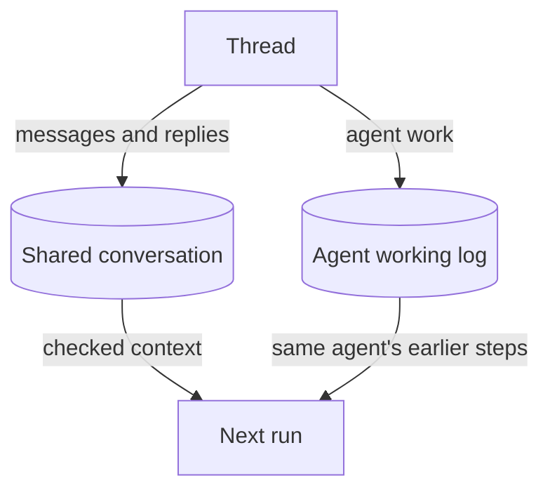

# A thread outlives its runs

A thread holds the conversation with a person. With saved context configured, Switchboard keeps a shared conversation and separate working logs for each agent. Coding and review can work on the same unit without mixing their private model steps.

```mermaid
flowchart TB
    T["Thread"] -->|"messages and replies"| S[("Shared conversation")]
    T -->|"agent work"| A[("Agent working log")]
    S -->|"checked context"| R["Next run"]
    A -->|"same agent's earlier steps"| R
```

A reply while a run is live joins that run as a follow-up. A later reply starts a new run in the same thread. The new run reads available channel or saved context and, when it uses the same agent, that agent's earlier work. Source access is checked before saved text reaches the model. See [How a request flows](how-a-request-flows.md).

With the run ledger configured, live progress is stored so the bot can reclaim a run after a restart. Without it, live progress is local to the process. See [Runs: live and recorded](runs-live-and-history.md) and the [session log spec](../reference/specs/session-log.md).
