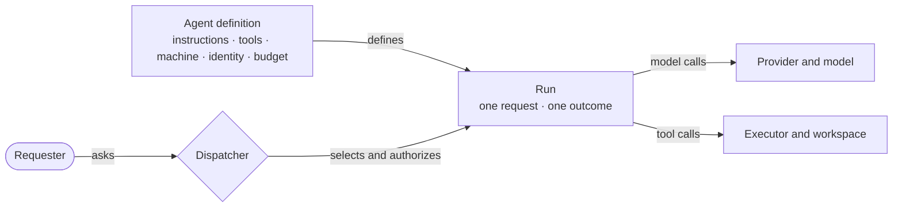

# What an agent is

An agent is a named **kind of work**, not a separate service or a fixed model. Its definition chooses the instructions, available tools, execution machine, credential scope and time budget. A **run** is one use of that definition for one request. The dispatcher selects the agent, checks the requester's access and starts the run; the configured model handles its turns.

The model and its effort resolve through [configuration layers](config-layers.md). The agent definition controls what work the run can do; the requester's grants and configured boundaries may narrow it further. A `review` run, for example, gets a read-scoped repository identity, while a `coding` run may push a branch. A toolset alone is not a security boundary: a shell can change local files even when the agent has no file-write tool. [Execution and trust](execution-and-trust.md) explains the machine boundary.

## The built-in agents

| Agent | Use it for | Reach |
| --- | --- | --- |
| `general` | Answer questions, read repositories and URLs, manage issues | No workspace or shell; GitHub issue writes |
| `coding` | Make a code change and prepare a pull request | Repository workspace; write-scoped identity; direct `agent:coding` request only |
| `review` | Review a pull request and return findings | Repository workspace; read-scoped identity |
| `ship` | Run coding, review and findings rounds for a pull request | A pipeline that starts `coding` and `review` runs; no model receives a `ship` prompt |
| `research` | Search the web and answer with sources | No workspace or shell |
| `explore` | Investigate a repository with commands and web research | Cold repository workspace; read-scoped identity |
| `orchestrator` | Read fleet status and coordinate linked private work | Scoped status and work tools; no workspace or shell |
| `conductor` | Split independent read-only asks into child runs and report back | Can start and follow permitted child runs; no workspace or shell |

A plain request is routed to a suitable agent. `coding` is only selected by an explicit `agent:coding` directive; a plain code-change request can route to `ship` so it receives a review loop. A compound request can route to `conductor`. `agent:<name>` explicitly selects an agent when the requester has access to it. The registry defines these entry paths, and the [routing spec](../reference/specs/routing-and-config.md) covers the exact rules.

`ship` is the unusual agent: its definition selects the pipeline and its limits, but the pipeline starts ordinary child runs rather than sending its own prompt to a model. A single-task pipeline keeps its unit in the asking thread; units from a plan have their own threads. [Data model](what-holds-what.md) shows the relationship.

The `orchestrator` is a model-backed agent for an ongoing conversation. It can answer general questions and read fresh fleet or source facts in each run. In a verified private Slack DM, its current work tools can start, inspect, steer and stop a linked Ship unit. It has no general child-agent spawn tool; `conductor` uses those tools for permitted read-only child runs. [A thread outlives its runs](a-thread-continues.md) explains follow-ups and saved context.

## What a review reports

The review agent reports verified defects introduced by the PR and violations of explicit rules that apply to the changed code. Each finding identifies the failure scenario or rule and its practical impact. The reviewer checks callers, guards, contracts, and the PR's intent before submitting a candidate. A bug can depend on a realistic input or existing state.

Optional polish, cosmetic preferences, unsupported suspicions, pre-existing problems, generic requests for more tests, and failures already reported by automated checks are omitted. Repository spec, test-guard, and unit-contract obligations still apply. A correct PR can receive an approval with no findings.

Severity belongs to each finding: `blocking`, `major`, `minor`, or `nit`. A minor means a real, bounded defect worth fixing. The normal review omits polish suggestions. The model judges impact; deterministic code validates the submitted severity and finding structure, applies the configured gate to an approval, and checks the reviewed head before posting.

The existing `review.addressSeverity` setting defaults to `minor`. It controls the severity addressed by the review loop; there is no separate reporting threshold. An explicit request for changes still enters the findings loop. See [Configure your defaults](../how-to/configure-your-defaults.md#choose-the-review-action-threshold) for the existing control and [decision 0088](../decisions/0088-review-selects-verified-defects-before-applying-severity.md) for the sources, alternatives, and evaluation plan.

## When to add an agent

Add one when a recurring kind of work needs its own instructions **and** a distinct set of tools, machine access, identity or limits. If only the model, effort or instructions for an existing kind of work need to vary by person or channel, use [configuration](../how-to/configure-your-defaults.md). If the new capability belongs to every agent using an existing toolset, extend that toolset instead.

An agent is [added in the repository](../how-to/add-an-agent.md): declare its definition and budgets, give it a behavioral spec, and decide how it is routed and who may run it. The channel adapters and dispatcher do not need a new branch for its name.

The current definitions are in [`src/agents/registry.ts`](../../src/agents/registry.ts), toolsets in [`src/tools/toolsets.ts`](../../src/tools/toolsets.ts), and budget defaults in [`src/core/budgets.ts`](../../src/core/budgets.ts).
