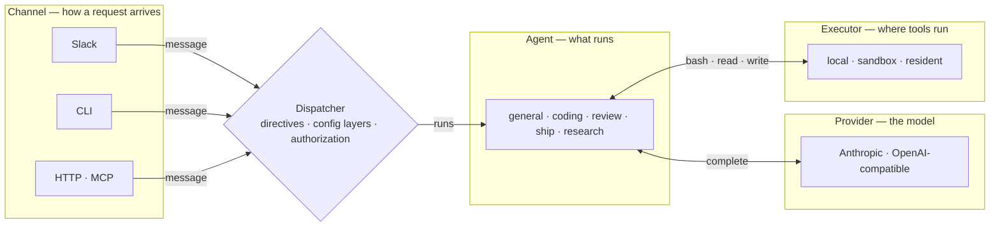
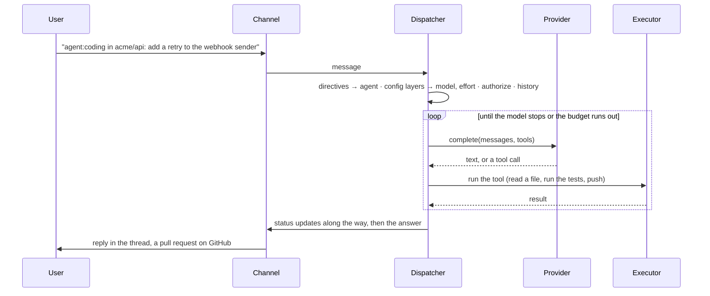
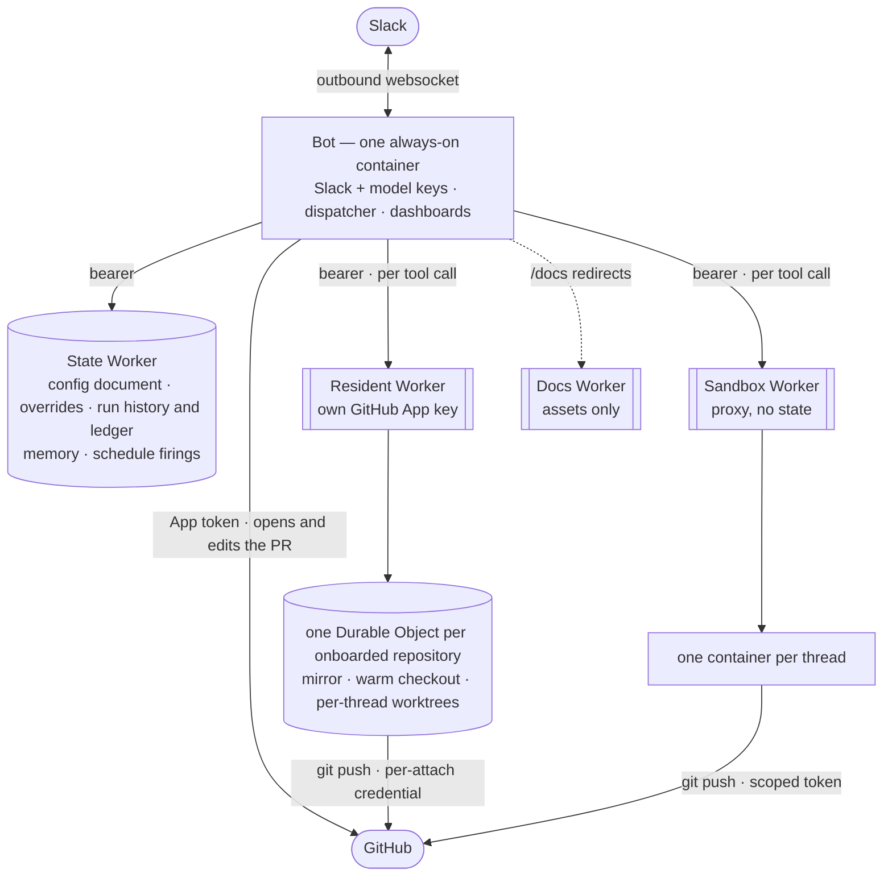

# Architecture

OpenSwitchboard is an agent gateway. A message arrives over a channel, a dispatcher routes it to an agent, the agent runs on a model provider and executes its tools through an executor it never touches directly. Slack is one channel among several; Cloudflare is one place to run. This page is the three pictures a newcomer needs, in one style; every box links to the page that goes deeper.

## The four seams

Every boundary is an interface with more than one implementation, and the core in the middle imports none of the platforms behind them. A new channel, provider, executor or agent is a new implementation behind its seam, never a special case in the core.

<!-- generated:four-seams · npm run docs:gen — drawn from docs/.vitepress/theme/seams.mjs and src/deploy/plan.ts, do not edit by hand -->

<!-- /generated:four-seams -->

The reply travels the same path back: the agent's answer and its status updates go through the dispatcher to whichever channel asked.

- **A channel** turns a platform event into one message shape and a reply back into platform calls: chunking a Slack message, editing a status card, printing to a terminal, answering an HTTP request. It has no opinion about agents, models or execution.
- **The dispatcher** is the only orchestrator. It reads the directives on a message, resolves the layered config, asks the policy table whether this actor may run this agent, assembles the thread's history and runs the agent loop. No platform SDK is imported anywhere near it.
- **An agent** is a registry entry — a system prompt, a toolset, a budget — not a pipeline of its own. Adding one is adding data.
- **A provider** turns "call this model with these messages and tools" into one vendor's request and back.
- **An executor** runs a tool call somewhere — the bot host, a throwaway container per thread, an always-warm checkout — and returns the result. Tools never touch the host directly; the executor is the only place that does.

Deeper: [How a request flows](how-a-request-flows.md) for what each seam refuses to know about the others; [Add a model provider](../how-to/add-a-provider.md) or [Add an agent](../how-to/add-an-agent.md) for extending two of them without touching the rest.

## One request, end to end

The same sequence runs whether the user is in Slack, at a terminal, or an automation calling over HTTP. Only the implementation plugged into each seam differs.

Three facts about the loop shape everything else. The config a request runs under is layered — this message, this thread, this user, this channel, the organization's defaults, the agent's own floor — and each of agent, model and effort resolves independently ([Why config is layered](config-layers.md)). A thread runs one agent at a time, so a reply while a run is in flight is folded into it rather than starting a second ([How a request flows](how-a-request-flows.md#one-run-per-thread-replying-while-it-works)). And every step is a span in one trace, from the moment the channel sees the message to the reply, so the status card's timing, the run page's timeline and the friction report all read the same measurements.

A run has two lives: live in a registry while it happens, streamed to a page anyone with the card's link can watch; then a durable record in history, read by identity ([Runs: live, then remembered](runs-live-and-history.md)).

*The run page for a finished coding run: the request, the timeline's buckets, then every model turn and tool call in order, each with its own duration. Rendered from the dashboard's fixture preview; the repository and people are made up.*

## Where it runs

Production is one long-lived process plus Workers that each solve a problem the process structurally cannot: outliving its own restarts, running untrusted commands somewhere that is not the bot, keeping a repository warm, serving docs without a container rollover.

The bot dials out to Slack over a websocket, so it needs no inbound address to be a Slack bot; the HTTP server it does listen on serves the health probe, the dashboards behind an identity gate, and the token-authenticated ingress. Each arrow to a Worker carries a bearer that Worker checks before doing anything, and the same trace id, so one run is one trace across four logs. The state Worker is what makes the bot's restarts free: anything that would otherwise need the container's disk lives in a Durable Object instead, and a live run survives a restart because the next container reclaims it from the ledger.

The Workers deploy in one order — state Worker, bot, resident, sandbox — and a release deploys only the ones whose inputs changed, derived from the diff rather than declared. Deeper: [Worker topology](worker-topology.md) for what each Worker owns and why the order; [Security model](security-model.md) for what each holds and what its compromise would yield; [Deploy](../how-to/deploy.md) for doing it.

## Where to read next

| You want to know… | Read |
|---|---|
| what a request goes through, step by step | [How a request flows](how-a-request-flows.md) |
| why an agent, model and effort resolve the way they do | [Why config is layered](config-layers.md) |
| where `bash` actually runs and why that is the design constraint | [Execution and trust](execution-and-trust.md), [Security model](security-model.md) |
| how one command definition becomes chat, CLI, HTTP and MCP | [One definition, every surface](one-command-many-surfaces.md) |
| what each Worker owns and how they call each other | [Worker topology](worker-topology.md) |
| what was decided, what was rejected, and the pattern each choice instantiates | [Design decisions](design-decisions.md) |
| the behavioral contract behind any of it | [`docs/reference/specs/`](../reference/specs/README.md) |
