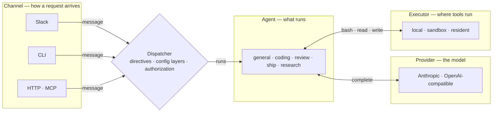
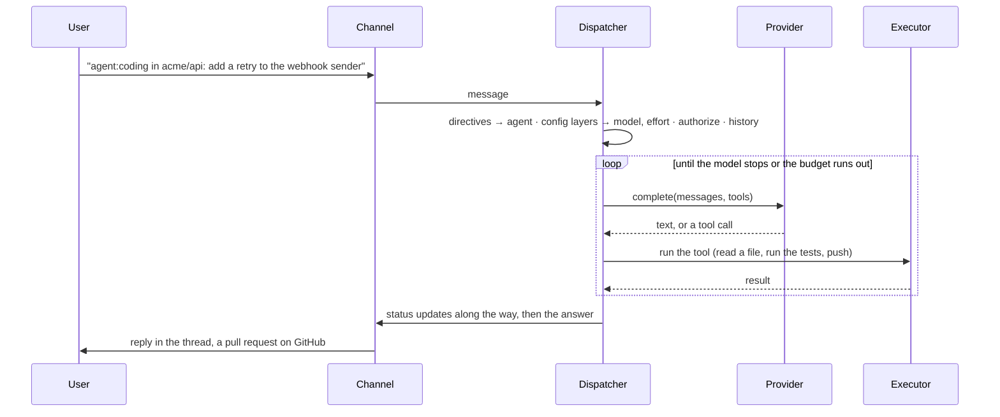

# Architecture

OpenSwitchboard is an agent gateway: a message arrives over a channel, a dispatcher routes it to an agent, the agent runs on a model provider and executes tools through an executor.

## The four seams

The seams are Channel, Provider, Executor and Agent, each an interface with more than one implementation. The dispatcher sits between them as the core and the only orchestrator, importing none of the platforms behind them. A new implementation goes behind its seam, never into the core.

<!-- generated:four-seams · npm run docs:gen — drawn from docs/.vitepress/theme/seams.mjs and src/deploy/plan.ts, do not edit by hand -->

<!-- /generated:four-seams -->

The reply travels the same path back, through the dispatcher to the channel that asked. What each seam does and refuses to know: [How a request flows](how-a-request-flows.md).

## One request, end to end

The same sequence runs from Slack, a terminal or HTTP; only the implementations differ.

Agent, model and effort resolve independently through [layered config](config-layers.md). A thread runs [one agent at a time](how-a-request-flows.md#one-run-per-thread-replying-while-it-works), so a reply mid-run is folded in.

Every step is a span in one trace. A run is live in a registry, then a [durable record](runs-live-and-history.md) read by identity.

*Fixture preview; the repository and people are made up.*

## Where it runs

One long-lived process plus Workers, each solving a problem the process cannot: outliving restarts, running untrusted commands elsewhere, keeping a repository warm, serving docs without a rollover.

The bot dials out to Slack and needs no inbound address; its HTTP server serves the health probe, the gated dashboards and ingress. Each arrow to a Worker carries a bearer and the same trace id.

Durable state lives in Durable Objects, so a bot restart loses nothing and a live run is reclaimed from the ledger. Workers deploy in one order (state, bot, resident, sandbox); a release deploys only those whose inputs changed.

## Read next

- [Worker topology](worker-topology.md) — what each Worker owns and why the order.
- [Security model](security-model.md) — what each piece holds and what a compromise yields.
- [Design decisions](design-decisions.md) — what was decided and what was rejected.
