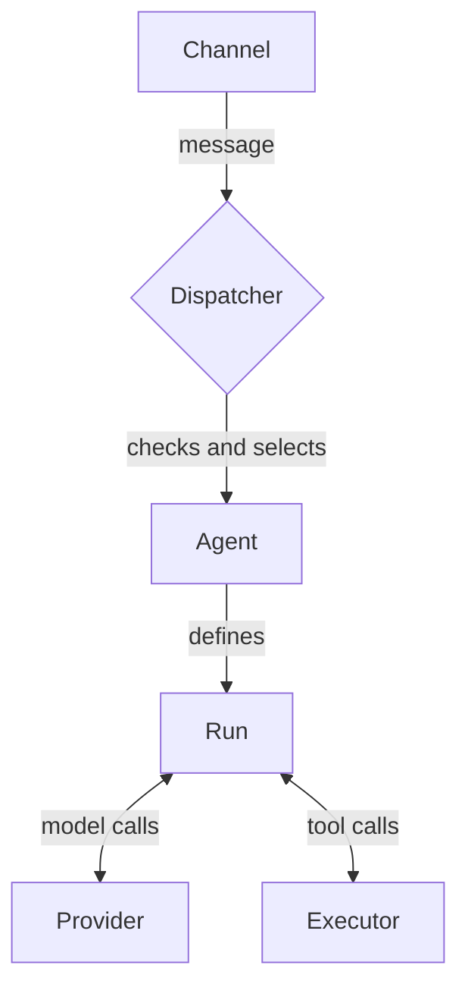
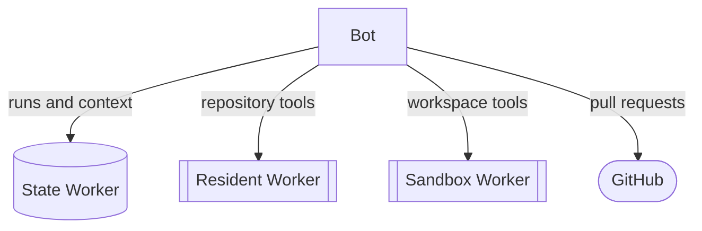

# Architecture

Switchboard receives text from a channel, checks the request, chooses an agent and starts a run. The run calls a model and tools; the answer returns through the channel.

## The four parts around the dispatcher

<!-- generated:four-seams · npm run docs:gen — drawn from docs/.vitepress/theme/seams.mjs and src/deploy/plan.ts, do not edit by hand -->

```mermaid
flowchart TB
    C["Channel"] -->|"message"| D{"Dispatcher"}
    D -->|"checks and selects"| AG["Agent"]
    AG -->|"defines"| R["Run"]
    R <-->|"model calls"| P["Provider"]
    R <-->|"tool calls"| E["Executor"]
```

<!-- /generated:four-seams -->

A channel (Slack, CLI, HTTP or MCP) moves messages. An agent is a work definition. A provider supplies the model. An executor supplies a place for tools to run. The dispatcher connects them and enforces routing and access rules.

## Where work and state live

```mermaid
flowchart TB
    B["Bot"] -->|"runs and context"| S[("State Worker")]
    B -->|"repository tools"| R[["Resident Worker"]]
    B -->|"workspace tools"| X[["Sandbox Worker"]]
    B -->|"pull requests"| G(["GitHub"])
```

The bot process handles requests and holds provider credentials. The state Worker stores durable run, conversation and work records when configured. Repository work can use a resident checkout or a sandbox; local development can run tools on the bot host. [Worker topology](worker-topology.md) gives the deployment detail.

For the human view of the system, start with [Data model](what-holds-what.md), then [How a request flows](how-a-request-flows.md). [Execution and trust](execution-and-trust.md) explains why tools run behind a separate boundary.
