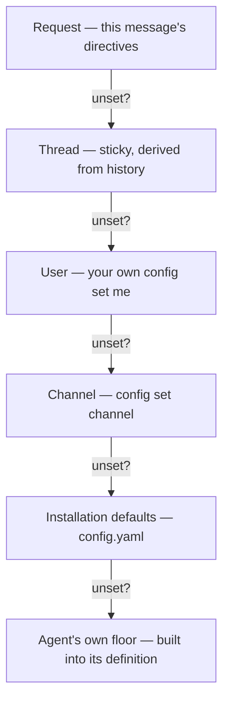

# Why config is layered

Three different people reasonably want to control the same knob — which agent runs, which model answers, how hard it thinks — at three different scopes, and none of them should have to coordinate with the others to get their way locally. Switchboard resolves each knob independently through six layers, the most specific winning:

The commands that set each layer are in [Configure your defaults](../how-to/configure-your-defaults.md). The decision that shaped the ladder, and made effort one of its dimensions, is [decision 0005](../decisions/0005-layered-config-effort-first-class.md).

## Why "thread" is a layer with no storage

The thread layer is not config anyone sets; it is derived from what the thread's history already shows. A follow-up with no directive does not inherit a setting: the dispatcher looks at what the last message in this thread used and keeps using it. So there is nothing to leak, nothing to clean up, and nothing that survives a restart incorrectly. A thread's stickiness is only as durable as the channel history it is read from; restart the bot mid-conversation and the next reply rebuilds the same behaviour by reading Slack again, not from anything the bot remembered on its own. That is a consequence of [state living where it survives a restart](worker-topology.md), not a special case.

## Why agent and model resolve independently

A channel may want every review to run on a specific model without forcing every other agent in that channel onto the same model. `config set channel --agent review` and `config set channel --models.coding openai/gpt-5` are two separate decisions, resolved through the same six layers, landing on different agents. Collapsing agent and model into one setting would let one scope's model preference leak into agents that scope never meant to touch.

## Why effort is a first-class layer, not a model detail

Effort (`low` through `max`) rides the same ladder as the model: a request directive, a per-agent override at any scope, the installation's defaults, then the agent's built-in floor. That is a deliberate elevation. Wall-clock time is an agent's real budget, and effort is the dial that decides how much of a turn's time goes to thinking rather than doing. Treating it as an independently resolved setting, rather than something buried inside a model string, lets a channel that wants fast, cheap `general` answers and a careful, high-effort `review` say exactly that without two model configurations to fake it.

## Why the gate checks the resolved agent, not the request

None of the layering above is a security boundary; it is a convenience ladder for picking a default. The gate that matters — `restrict.agents` against the caller's `agent:run:<name>` grant — runs after all six layers have produced a final agent, against that answer, every time an agent is about to run. That is why setting your own default to a restricted agent is harmless: `config set me --agent coding` always succeeds as a write, because the check is not at write time but at run time, against whatever agent actually resolved, and it is asked again on the very next message. The gates themselves are in the [Authorization](../reference/authorization.md) reference; why authorization is one table asked once is [decision 0007](../decisions/0007-authorization-policy-table.md).

## Custom instructions are not a seventh layer

`config instructions me` and `config instructions channel` look like config — set the same way, scoped the same way — but they are not part of this ladder at all. They are free text folded into the system prompt as a labelled advisory block; they never change which agent, model or effort resolves, and never affect a gate. The two systems are kept apart on purpose: a phrasing preference should not be able to reroute which agent runs, and an authorization decision should not have to account for prompt text as an input.

## See also

- [Configure your defaults](../how-to/configure-your-defaults.md) — the commands, not the reasoning.
- [How a request flows](how-a-request-flows.md) — where resolution sits in the pipeline.
