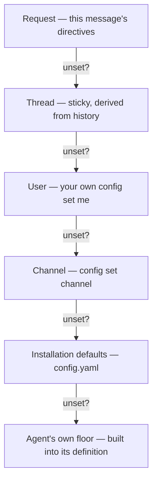

# Why config is layered

Agent, model and effort each resolve independently through six layers, the most specific winning, so three people can control the same knob at three scopes without coordinating. One setting deliberately breaks the pattern: a boundary intersects across the scopes instead of overriding (below).

Commands: [Configure your defaults](../how-to/configure-your-defaults.md). Record: [decision 0005](../decisions/0005-layered-config-effort-first-class.md).

## The thread layer has no storage

The thread layer is derived, not set. A follow-up with no directive keeps what the last message in the thread used, read from the channel's history.

Nothing to leak, clean up, or lose on restart: the next reply rebuilds the same behaviour by reading the thread again.

## Agent and model resolve independently

`config set channel --agent review` and `config set channel --models.coding openai/gpt-5` are two decisions through the same six layers. A channel can pin the review model without forcing every other agent onto it.

## Effort is a layer, not a model detail

Effort (`low` through `max`) rides the same ladder as the model: request directive, per-agent override at any scope, installation defaults, the agent's built-in floor.

Wall-clock time is an agent's real budget, and effort decides how much of each turn goes to thinking. A channel can want cheap `general` answers and a high-effort `review` without faking it through two model configurations.

## Boundaries intersect, they do not override

A `budget:<minutes>` directive is the caller's own boundary on one message: it narrows that run's wall clock below the agent's budget and never widens it, the card says what it did (`budget 30 min (budget directive; preset asks 120)`, or that it narrowed nothing), and unlike the other three directives it is never sticky — a thread that wants a lower budget on every turn sets a user boundary.

A boundary (`maxMinutes`, `maxIdentity`, `machines`) is the one scope setting that does not ride the ladder. The installation's, the channel's and the user's boundaries are intersected — the smallest budget, the lowest identity, the machine classes every one of them allows — because a cap that a more specific scope could replace would not be a cap: anyone could widen it with `config set me`.

Intersection is what makes a user boundary safe to leave open to everyone: it can tighten what the channel allows and never loosen it. The preset's own profile is the starting point, the boundaries narrow it, and the result — the effective profile — is what the run is provisioned with. A budget above a cap is clipped and the card says so; an identity or a machine class above a cap is refused before anything starts, because a preset that needs to push cannot do its job with a read token.

A boundary never grants. Who may run a preset stays the policy table's question ([Authorization](../reference/authorization.md)); how much a run in a scope may have is the boundary's. The two never read each other's fields.

## The gate checks the resolved agent

The ladder picks a default; it is not a security boundary. `restrict.agents` is checked after all six layers produce a final agent, against that agent, on every message.

`config set me --agent coding` therefore always succeeds as a write. The check happens at run time ([Authorization](../reference/authorization.md), [decision 0007](../decisions/0007-authorization-policy-table.md)).

## Custom instructions are not a seventh layer

`config instructions me` and `config instructions channel` are scoped like config, but they are free text folded into the system prompt as a labelled advisory block. They never change which agent, model or effort resolves, and never affect a gate.

The two systems stay apart on purpose: a phrasing preference cannot reroute which agent runs, and authorization never reads prompt text. Where resolution sits in the pipeline: [How a request flows](how-a-request-flows.md).
