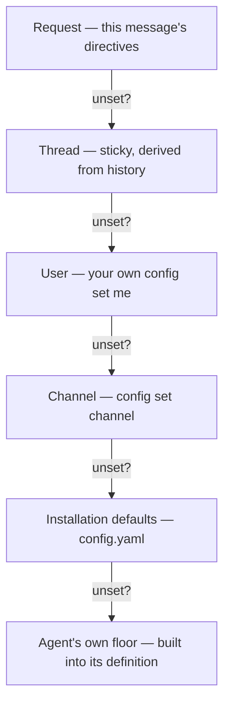

# Why config is layered

Agent, model and effort each resolve independently through six layers, the most specific winning, so three people can control the same knob at three scopes without coordinating.

Commands: [Configure your defaults](../how-to/configure-your-defaults.md). Record: [decision 0005](../decisions/0005-layered-config-effort-first-class.md).

## The thread layer has no storage

The thread layer is derived, not set. A follow-up with no directive keeps what the last message in the thread used, read from the channel's history.

Nothing to leak, clean up, or lose on restart: the next reply rebuilds the same behaviour by reading the thread again.

## Agent and model resolve independently

`config set channel --agent review` and `config set channel --models.coding openai/gpt-5` are two decisions through the same six layers. A channel can pin the review model without forcing every other agent onto it.

## Effort is a layer, not a model detail

Effort (`low` through `max`) rides the same ladder as the model: request directive, per-agent override at any scope, installation defaults, the agent's built-in floor.

Wall-clock time is an agent's real budget, and effort decides how much of each turn goes to thinking. A channel can want cheap `general` answers and a high-effort `review` without faking it through two model configurations.

## The gate checks the resolved agent

The ladder picks a default; it is not a security boundary. `restrict.agents` is checked after all six layers produce a final agent, against that agent, on every message.

`config set me --agent coding` therefore always succeeds as a write. The check happens at run time ([Authorization](../reference/authorization.md), [decision 0007](../decisions/0007-authorization-policy-table.md)).

## Custom instructions are not a seventh layer

`config instructions me` and `config instructions channel` are scoped like config, but they are free text folded into the system prompt as a labelled advisory block. They never change which agent, model or effort resolves, and never affect a gate.

The two systems stay apart on purpose: a phrasing preference cannot reroute which agent runs, and authorization never reads prompt text. Where resolution sits in the pipeline: [How a request flows](how-a-request-flows.md).
