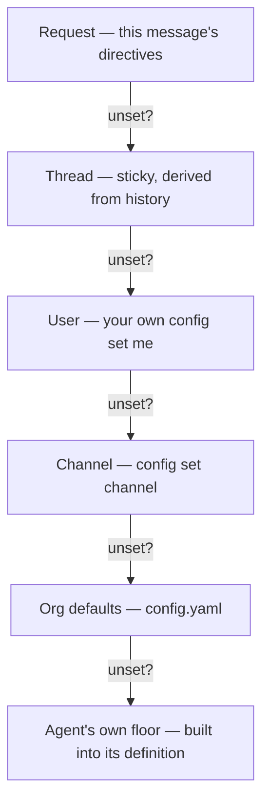

# Why config is layered, not just "settings"

Three different people reasonably want to control the same knob — which agent runs, which model answers, how hard it thinks — at three different scopes, and none of them should have to coordinate with the others to get their way locally. Switchboard resolves each knob independently through six layers, highest-specificity wins:

## Why "thread" is a layer with no storage

Layer 2 isn't config anyone sets — it's *derived* from what the thread's history already shows. A follow-up with no directive doesn't "inherit a setting"; the dispatcher looks at what the last message in this thread actually used and keeps using it. This means there's nothing to leak, nothing to clean up, and nothing that survives a restart incorrectly: a thread's stickiness is only ever as durable as the channel history it's read from — restart the bot mid-conversation, and the next reply rebuilds the same "sticky" behavior by reading Slack again, not from anything the bot remembered on its own. It's a consequence of [state living where it survives a restart](worker-topology.md), not a special case.

## Why agent and model resolve independently

A channel might want every review to run on a specific model without forcing every *other* agent in that channel onto the same model — `config set channel --agent review` and `config set channel --models.coding openai/gpt-5` are two separate decisions, resolved through the same six layers but landing on different agents. Collapsing "agent" and "model" into one setting would force one scope's model preference to leak into agents that scope never meant to touch.

## Why effort is a first-class layer, not a model detail

`effort` (`low | medium | high`) rides the exact same ladder as model — a request directive, a per-agent override at any scope, org defaults, then the agent's built-in floor. That's a deliberate elevation: wall-clock time is an agent's real budget, and effort is the dial that decides how much of a turn's time goes to *thinking* versus *doing*. Treating it as a first-class, independently-resolved setting (rather than something buried inside a model string) means a channel that wants fast-and-cheap `general` answers but a careful, high-effort `review` can say exactly that, without needing two different model configurations to fake it.

## Why permission gates check the *resolved* agent, not the request

None of the layering above is a security boundary — it's a convenience ladder for picking a default. The gate that actually matters (`permissions.agents`, `permissions.repos`) runs **after** all six layers have already produced a final agent, against that final answer, every single time an agent is about to run. This is why setting your own default to a restricted agent is harmless: `config set me --agent coding` always succeeds as a *write*, because the gate that matters isn't at write time — it's at run time, against whatever agent actually ends up resolved, checked again on the very next message. See [reference: permissions](../reference/permissions.md) for the gates themselves.

## Custom instructions are not a seventh layer

`config instructions me/channel` looks like config — it's set the same way, scoped the same way — but it's not part of this resolution ladder at all. It's free text folded into the system prompt as a clearly labeled advisory block, and it never changes which agent, model, or effort gets resolved, and never affects a permission gate. The two systems are kept separate on purpose: a user's phrasing preference shouldn't be able to accidentally reroute which agent runs, and a permission decision shouldn't have to account for prompt text as an input.

## See also

- [How-to: configure your defaults](../how-to/configure-your-defaults.md) — the commands, not the reasoning.
- [Explanation: how a request flows](how-a-request-flows.md) — where resolution sits in the overall pipeline.
