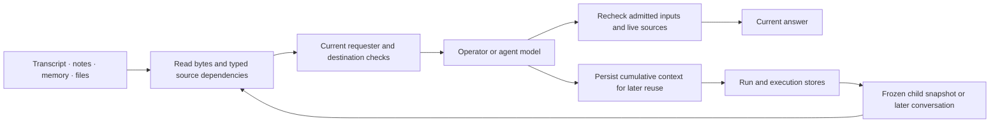

# Durable context across conversations and children

The model interprets the request. Storage preserves the evidence it used, and current policy decides whether the next reader may use it. A product name can resolve from working notes, memory or a repository README; the person need not repeat `owner/repo` when the existing context is enough. Execution still checks the resolved target and its ownership.

## One reader over the existing stores

`contextAccessForMessage` supplies the current reader's checks. It composes the existing stores; it does not create another database or permission system.

| Store or record | What survives |
|---|---|
| `RunLedger` | Working transcripts, summaries, notepads, shared conversation rows and cumulative source metadata. |
| `RunStore` / `RunRecord` | Finished run identity, log range, child snapshot, dependency closure and original source-action archive. Public run projections omit internal context and source bodies. |
| `MemoryStore` / `MemoryRecord` | Scoped reusable facts, their immutable content digest and inherited dependencies. |
| Artifact store | File bytes. Original run events and frozen event cursors identify which files a child snapshot contains. |
| `ChildHandoff` | Original source and consumer identities, log window and digest, note snapshot, file references and bounded ancestor context. |
| `CoordinatorUnit.context` | The immutable context capsule accepted with queued work; every child execution reads that same admitted source. |
| Shared status row | An immutable committed unit outcome, with its original unit, execution round and delivery identity. Report prose is stored separately. |

The common `ContextDependencies` envelope records original producer identities, Slack receipts, MCP action references, repository access, memory scopes and typed unit status references. It carries a revision and a known, unknown or revoked state. Transformations union dependencies: summarizing a private memory into an org-scoped fact does not erase its original private scope.

## The flow

1. Capture saved text before reading its cumulative metadata, so a concurrent source write cannot be hidden by an older metadata snapshot.
2. Check original run identities and current source access. An MCP result is inspected using its original action, owner, query and connection; reuse does not execute that action again. A repository must remain in the current public requester-authorized catalog. Memory scopes pass the existing memory policy.
3. Give the model admitted content and track its dependency union. Before publishing the answer, revalidate those inputs and the existing live source checks. Missing proof omits saved context before acceptance; losing proof for an admitted input withholds the answer.
4. At finish, merge the latest working-log metadata and archive original source evidence before the live row disappears. Live or retained holders keep referenced sources available. Frozen child snapshot ranges also protect tool results from byte trimming until the holder is removed; a pin cannot restore already trimmed content.

## Current answer and later reuse

Two envelopes use the same type for different questions:

- **Admitted inputs:** the seed and new context actually supplied to this run. Publication checks a frozen snapshot of this envelope alongside the existing live source checks. If another input arrives during validation, it retries once; continuing changes, unknown proof or a denied check withhold publication.
- **Retained context:** the cumulative history preserved for a future reader or export. It can remain unknown because old rows or opaque tool results lack reusable provenance. Covered public GitHub reads retain exact result hashes and original call identities before exposure. Other results need their own source contract. Unknown status prevents later replay; it does not by itself block the current answer when its admitted inputs and live source checks pass.

Omitting an old row never clears its retained obligations. Equally, an old row that never reached this model is not treated as an input to the current answer.

## Shared conversation, separate working indices

The shared conversation uses a durable context epoch under the thread's `@thread` log. Each row carries explicit source metadata. A command result without proof can be omitted while other proved conversation rows remain readable. Old rows are not relabelled as source-free merely because they have a user role.

Execution keeps its own execution log and indices. A unit's coding and review lanes remain separate. `RunSession.threadSession` connects working runs to the shared conversation. This keeps connector appends from changing the transcript indices owned by an active model run. At migration, validated legacy context can precede the first admitted request already written to the new shared log.

Compaction changes the prompt window, not the original dependency obligations. Child recall can retrieve retained original results, notes and files through the frozen child snapshot references.

Ordinary continuations seal their acknowledged initial seed in the canonical run. The checkpoint binds the original actor and audience, exact transcript, system prompt, note snapshot, source revision and flattened membership in the existing retention index. It substitutes one verified origin for earlier ordinary origins with the same authority. External source dependencies remain explicit. Readers verify the committed receipt directly, so longer conversations do not accumulate a chain of archive reads or hit the envelope's origin limit merely by continuing. Frozen historical child snapshots remain unchanged.

Main-agent work and Ship use the same structured child snapshot as direct child spawning. A queued unit stores a bounded capsule before workflow creation. Dispatch verifies the canonical unit, execution round and child step, then loads the frozen source bytes. The current execution target remains separately authorized.

Work publication commits a report hash with the unit outcome, then stores the accepted full report and selected reply immutably before delivery. A competing or stale outcome cannot freeze its report under the winner's delivery identity. Replays use the accepted bytes. Freeform reports remain unknown until their producer context is proven. A separate status row carries only committed machine fields; later conversation can read that status under current unit, repository and audience checks without treating arbitrary report prose as proof.

## Current boundaries

The operator, execution memory, reflection, direct children, main-agent units and Ship use these seams. Repository briefs read bounded README, guidance and package metadata from the current public requester-authorized catalog. The main-DM work-start pilot remains restricted to its configured repository; repository-name inference does not expand that execution authority.

Legacy context without proof remains unavailable. Cross-requester Slack receipts retain the adapter's original requester binding. Repository metadata and dependency envelopes have explicit size limits, and large displayed catalogs name their truncation. These limits affect available context, rather than asking the model to reinterpret access policy from prose.

Behavior and proofs: [Saved operator context](../reference/specs/operator-context.md), [run history](../reference/specs/run-history.md), and [child runs](../reference/specs/agent-conductor.md).
