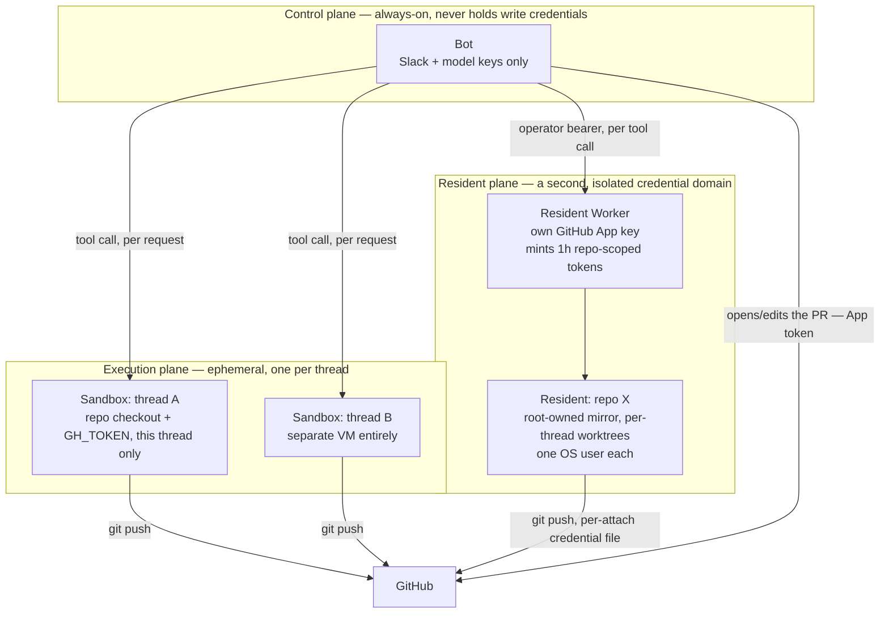

# Execution and trust

Every agent's `bash` tool executes commands the model wrote. That is the whole value — an agent that can run tests, install dependencies, push code — and the whole risk: a prompt-injected instruction, a malicious request, or a bad model turn can run anything the tool's environment can reach. OpenSwitchboard's answer is not to sandbox the model's judgement (it cannot) but to control the **blast radius** of a tool call, by choosing where it runs. The full threat model is in [Security model](security-model.md); this page is the reasoning behind the execution part of it.

## Three planes, three blast radii

**The control plane (the bot)** is always on and deliberately the least dangerous thing in the system to compromise. It holds Slack and model provider keys — enough to read and answer messages — and, with sandboxed or resident execution, never a repository-write credential. Compromising the bot process gets you a chatty assistant, not a way to push code.

**The execution plane (per-thread sandboxes)** is where a cold thread's tools run when execution is `e2b` or `cloudflare`. Each thread gets its own disposable VM holding that thread's checkout and a scoped `GH_TOKEN`. A malicious or successfully injected request can do damage inside its own sandbox and to the one repository its token reaches, and nothing else: the bot host, every other thread's sandbox and the hosting account are unreachable from inside. Sandboxes expire when idle (`execution.timeoutMinutes`, 30 by default); a thread's follow-ups reconnect to its sandbox through a map the bot keeps under `data/`, and an expired sandbox is recreated on the next follow-up, its repository re-cloned.

**The resident plane (always-warm repositories)** is a second, deliberately separate credential domain for repositories an admin has chosen to onboard. The resident Worker holds its own GitHub App private key — never the bot's, never shared — and mints short-lived, repository-scoped installation tokens on demand. Even inside a resident, repository code runs token-free and unprivileged; a per-thread credential file (mode 600, never an argument, never process-wide) is the only thing that sees the token, and only for the git operations that need it. Why a second domain rather than a copy of the bot's credential: [decision 0009](../decisions/0009-residents-second-credential-domain.md).

## `local` execution collapses all of this on purpose

With `execution.type: local`, the default and meant for development, there is no plane separation: tools run on the bot host, and the boundary is whatever the user or container the bot runs as can reach, plus the scope of the `GH_TOKEN` in its environment. The file tools are confined to the thread's workspace directory; `bash` is inherently unconfined, so isolation belongs at the host level. That is fine for a solo machine where you trust every message that reaches the bot. It stops being fine the moment untrusted users can reach the `coding` agent, which is why the [capability matrix](../how-to/turn-features-on-and-off.md) treats `execution` as the one capability that is about safety rather than features. If you must run `local` for other people: run the bot in a container or as a dedicated user, scope the GitHub credential to the repositories it should touch, and put the `coding` agent behind `restrict.agents` ([Restrict who can do what](../how-to/restrict-who-can-do-what.md)). Whatever the plane, model provider keys are only ever read from environment variables (`apiKeyEnv` in the config), never from a config file, so a checkout of the configuration never carries a credential.

## `review` is read-only by convention, not by wall

The review agent's toolset has no write tool, but it still has `bash`, and `bash` can do anything its executor can reach, including writing files by other means. "Read-only" is a contract held by prompt and toolset design, not a hard boundary the way a sandbox is. The hard boundary is which plane a review run's tools execute in, not which tools are on its list.

## Why only an org-wide MCP server reaches the writing agents

A remote MCP server's tool descriptions and results are attacker-controlled text as far as OpenSwitchboard is concerned, the same untrusted input as anything else a model reads off the internet. The `coding`, `review` and `ship` agents run with repository-write credentials or a trust contract that a channel's or a person's server must not get to influence, so only a server an admin set at the `org` scope may reach them. `general` and `research`, the agents with no write access, can use a server from any scope. Naming a writing agent on a `me` or `channel` server is refused outright rather than silently ignored, so nobody discovers the rule by a tool that quietly never appears ([Connect an MCP server](../how-to/connect-an-mcp-server.md)).

## Why `repo:write` is never a baseline

Onboarding a repository is the one action that creates a resident-plane credential relationship: it provisions always-on compute and binds a real GitHub identity to a real repository. Running an agent defaults open because getting that wrong mostly costs an unwanted chat reply. Letting repository management default open would mean anyone could bind a new repository-scoped credential without anyone deciding to, which is why `repo:write` is a grant only an entry (or an admin's `all`) confers ([Authorization](../reference/authorization.md)).

## See also

- [Security model](security-model.md) — the whole threat model, this page's planes included.
- [Worker topology](worker-topology.md) — which Worker each plane runs on and how they are wired.
- [Every boundary is an interface with two implementations](../decisions/0001-seams-with-two-implementations.md) — why "where tools run" is a seam at all.
