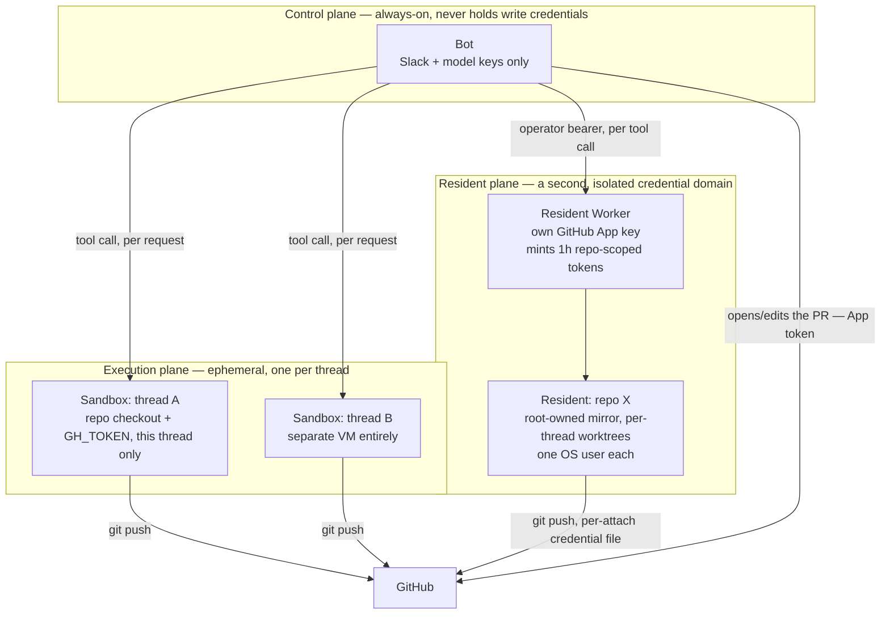

# Execution and trust: where "bash" actually runs, and why it matters

Every agent's `bash` tool executes commands *the model wrote*. That's the whole value proposition — an agent that can run tests, install dependencies, push code — and also the whole risk: a prompt-injected instruction, a malicious request, or just a bad model turn can run anything the tool's environment can reach. Switchboard's answer isn't to sandbox the model's judgment (it can't); it's to control the **blast radius** of what a tool call can reach, by choosing where it runs.

## Three planes, three different blast radii

**Control plane (the bot):** always-on, but deliberately the least dangerous thing in the system to compromise. It holds Slack and model provider keys — enough to read/answer messages — but with sandboxed or resident execution, it never holds a repo-write credential. Compromising the bot process gets you a chatty assistant, not a way to push code anywhere.

**Execution plane (per-thread sandboxes):** where a *cold* thread's tools actually run when execution is `e2b` or `cloudflare`. Each thread gets its own throwaway VM holding that thread's repo checkout and a scoped `GH_TOKEN`. A malicious or successfully-injected request can do damage inside its own sandbox and to the one repo its token can reach — and nothing else. The bot host, every other thread's sandbox, and the hosting account are simply unreachable from inside one. Sandboxes expire when idle and are transparently recreated on the next follow-up.

**Resident plane (always-warm repos):** a second, deliberately separate credential domain for repos an admin has chosen to onboard. The resident Worker holds its *own* GitHub App private key — never the bot's, never shared — and mints short-lived, repo-scoped installation tokens on demand. Even inside the resident, repo code executes token-free and unprivileged; a per-thread credential file (mode 600, never argv, never process-wide env) is the only thing that ever sees the token, and only for the git operations that need it.

## `local` execution collapses all of this on purpose

With `execution.type: local` (the default, meant for development), there's no plane separation at all — tools run on the bot host itself, and the boundary is whatever the container/user the bot runs as can reach. This is fine for a solo dev box where you trust every message that reaches the bot. It stops being fine the moment untrusted users can reach the `coding` agent — which is exactly why the root README's security notes and this project's own defaults push toward sandboxed or resident execution for anything real.

## `review` is read-only by *convention*, not by wall

The review agent's toolset has no `write_file` — but it still has `bash`, and `bash` can do anything its executor can reach, including writing files by other means. "Read-only" here is an agreed contract enforced by prompt and toolset design, not a hard capability boundary the way sandboxing is. The actual hard boundary is *which plane* a review run's tools execute in, not which tools are on the list.

## Why this is also why `repoManagement` fails closed

Onboarding a repo (`repo onboard`) is the one action that *creates* a resident-plane credential relationship — it provisions always-on compute and binds a real GitHub identity to a real repo. Every other permission in the system defaults open because getting it wrong mostly costs you an unwanted chat reply. Getting `repoManagement` wrong by default would mean anyone could bind a new repo-scoped credential without anyone deciding to — which is why it's the one gate in [reference: permissions](../reference/permissions.md) that's locked unless an admin explicitly opens it.

## See also

- [Explanation: Worker topology](worker-topology.md) — which physical Worker each plane actually runs on, and how they're wired together.
- [How-to: connect an MCP server](../how-to/connect-an-mcp-server.md) — the same untrusted-input reasoning applied to a remote tool's descriptions and results, not just to `bash`.
