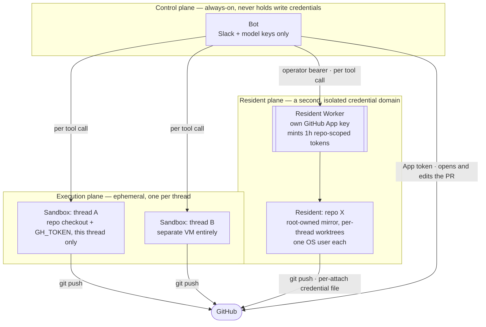

# Execution and trust

OpenSwitchboard cannot make the model's judgement safe, so it bounds the blast radius of a tool call by choosing where the call runs.

Every agent's `bash` runs commands the model wrote; an injected instruction or a bad turn runs anything the tool's environment reaches. The full threat model is [Security model](security-model.md).

## Three planes, three blast radii

| Plane | Holds | A compromise yields |
|---|---|---|
| Control (the bot) | Slack and model keys; no repository-write credential once execution is sandboxed or resident | A chatty assistant |
| Execution (one sandbox per thread) | That thread's checkout and a scoped `GH_TOKEN` | One sandbox and the one repository its token reaches; the bot host and other threads are unreachable |
| Resident (always-warm repositories) | Its own GitHub App key, never the bot's; short-lived repository-scoped tokens | The repositories it is attached to; nothing about Slack or the model |

Sandboxes expire when idle (`execution.timeoutMinutes`, default 30) and are recreated on the next follow-up. Docker inside one runs within the same microVM and adds no privilege.

Inside a resident, repository code runs token-free and unprivileged. Only a per-thread credential file (mode 600) sees the token, and only for the git operations that need it ([decision 0009](../decisions/0009-residents-second-credential-domain.md)).

## `local` execution collapses the planes on purpose

With `execution.type: local` (the default) tools run on the bot host, bounded by the bot's user and the scope of its `GH_TOKEN`. File tools stay in the workspace; `bash` does not.

Fine for one developer; wrong once untrusted users reach `coding`, so the [capability matrix](../how-to/turn-features-on-and-off.md) treats `execution` as the one safety capability. Running `local` for others: containerize the bot, scope the GitHub credential, put `coding` behind `restrict.agents` ([Restrict who can do what](../how-to/restrict-who-can-do-what.md)). Provider keys come only from environment variables (`apiKeyEnv`).

## `review` is read-only by convention, not by wall

The review toolset has no write tool, but `bash` does anything its executor reaches. The hard boundary is the plane the run executes in.

## Why only an org-wide MCP server reaches the writing agents

An MCP server's tool descriptions and results are attacker-controlled text. `coding`, `review` and `ship` carry write credentials or a trust contract, so only a server set at the `org` scope reaches them; `general` and `research` accept any scope. Naming a writing agent on a `me` or `channel` server is refused outright ([Connect an MCP server](../how-to/connect-an-mcp-server.md)).

## Why `repo:write` is never a baseline

Onboarding provisions always-on compute and binds a GitHub identity to a repository. A mistaken agent run costs an unwanted reply; a mistaken onboarding binds a credential nobody chose. So `repo:write` is conferred only by an entry or an admin's `all` ([Authorization](../reference/authorization.md)).

## Read next

- [Worker topology](worker-topology.md) — which Worker each plane runs on.
- [Decision 0001](../decisions/0001-seams-with-two-implementations.md) — why "where tools run" is a seam.
