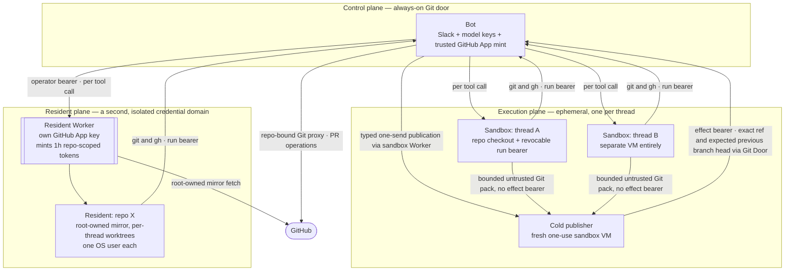

# Execution and trust

Switchboard cannot make the model's judgement safe, so it bounds the blast radius of a tool call by choosing where the call runs.

Every agent's `bash` runs commands the model wrote; an injected instruction or a bad turn runs anything the tool's environment reaches. The full threat model is [Security model](security-model.md).

## Three planes, three blast radii

```mermaid
flowchart TB
    subgraph cp ["Control plane — always-on Git door"]
        BOT["Bot<br/>Slack + model keys + trusted GitHub App mint"]
    end

    subgraph ep ["Execution plane — ephemeral, one per thread"]
        S1["Sandbox: thread A<br/>repo checkout + revocable run bearer"]
        S2["Sandbox: thread B<br/>separate VM entirely"]
        PC["Cold publisher<br/>fresh one-use sandbox VM"]
    end

    subgraph rp ["Resident plane — a second, isolated credential domain"]
        RW[["Resident Worker<br/>own GitHub App key<br/>mints 1h repo-scoped tokens"]]
        RD["Resident: repo X<br/>root-owned mirror, per-thread worktrees<br/>one OS user each"]
    end

    GH(["GitHub"])
    BOT -->|"per tool call"| S1 & S2
    BOT -->|"typed one-send publication via sandbox Worker"| PC
    S1 & S2 -->|"bounded untrusted Git pack, no effect bearer"| PC
    PC -->|"effect bearer · exact ref and expected previous branch head via Git Door"| BOT
    BOT -->|"operator bearer · per tool call"| RW --> RD
    S1 & S2 -->|"git and gh · run bearer"| BOT
    RD -->|"git and gh · run bearer"| BOT
    RW -->|"root-owned mirror fetch"| GH
    BOT -->|"repo-bound Git proxy · PR operations"| GH
```

| Plane | Holds | A compromise yields |
|---|---|---|
| Control (the bot) | Slack/model keys and GitHub App credentials, used only on the trusted side of the Git door | Control of the bot and its trusted GitHub actions |
| Execution (one sandbox per thread) | That thread's checkout and a revocable run bearer, with no App token | One sandbox and the run's bounded Git/gh capability until revocation |
| Resident (always-warm repositories) | Its own App key for the root-owned mirror; writable thread trees use the Git door | Mirror access for its onboarded repositories; no Slack or model key |

Sandboxes expire when idle (`execution.timeoutMinutes`, default 30) and are recreated on the next follow-up. Docker inside one runs within the same microVM and adds no privilege. A cold model owns root in its own VM: no program running there can independently inspect or protect its environment. Cold credential inspection therefore stays incomplete. For runner-owned publication alone, the Worker allocates a fresh controller identity from a reserved namespace that model routes cannot select; it validates bounded untrusted Git objects in a clean repository with the image's Git before sending the exact typed ref and expected previous branch head through the Git Door. Only that short-lived controller receives the effect bearer, and it is destroyed after use. A response loss remains uncertain for the existing durable settlement, not a reason to resend. The extra VM consumes capacity from the existing sandbox fleet and may be refused; it does not attest inspection, revocation or adoption ([decision 0085](../decisions/0085-a-cold-publication-controller-is-a-fresh-sandbox-not-an-inspector.md)).

Inside a resident, repository code runs unprivileged with a run bearer. The Worker scrubs older thread App credential files and keeps its mirror token root-only ([decision 0009](../decisions/0009-residents-second-credential-domain.md)).

## `local` execution collapses the planes on purpose

With `execution.type: local` (the default) tools run on the bot host, bounded by the bot's user; Git/gh commands receive a run bearer for the local Git door. File tools stay in the workspace; `bash` does not.

Fine for one developer; wrong once untrusted users reach `coding`, so the [capability matrix](../how-to/turn-features-on-and-off.md) treats `execution` as the one safety capability. Running `local` for others: containerize the bot, scope the GitHub credential, put `coding` behind `restrict.agents` ([Restrict who can do what](../how-to/restrict-who-can-do-what.md)). Provider keys come only from environment variables (`apiKeyEnv`).

## `review` is read-only by convention, not by wall

The review toolset has no write tool, but `bash` does anything its executor reaches. The hard boundary is the plane the run executes in.

## Why only an org-wide MCP server reaches the writing agents

An MCP server's tool descriptions and results are attacker-controlled text. `coding`, `review` and `ship` have a repository trust contract, so only a server set at the `org` scope reaches them; `general` and `research` accept any scope. Naming a writing agent on a `me` or `channel` server is refused outright ([Connect an MCP server](../how-to/connect-an-mcp-server.md)).

## Why `repo:write` is never a baseline

Onboarding provisions always-on compute and binds a GitHub identity to a repository. A mistaken agent run costs an unwanted reply; a mistaken onboarding binds a credential nobody chose. So `repo:write` is conferred only by an entry or an admin's `all` ([Authorization](../reference/authorization.md)).

## Read next

- [Worker topology](worker-topology.md) — which Worker each plane runs on.
- [Decision 0001](../decisions/0001-seams-with-two-implementations.md) — why "where tools run" is a seam.
