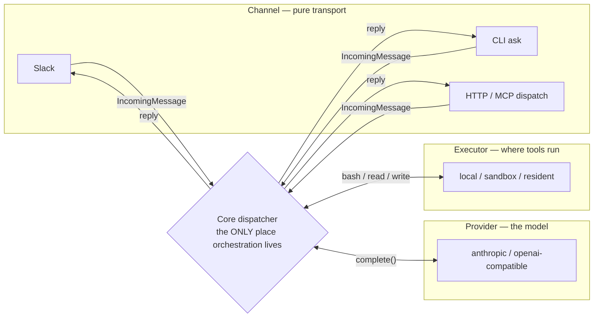

# How a request flows

Every entry point — a Slack mention, a CLI `ask`, an HTTP dispatch — reduces to the same four seams, in the same order, handled by the same code. There is exactly one orchestrator; everything else plugs into it.

## What each seam refuses to know about the others

- **A channel adapter** turns a platform event into one shape (`IncomingMessage`) and turns a reply back into platform calls (chunking a Slack message, editing a status card, printing to stdout). It has zero opinion on which agent runs, which model answers, or where a tool executes — it doesn't import anything from `providers/` or `execution/`.
- **The dispatcher** is the only place that reads directives, resolves the six-layer config (see [config layers](config-layers.md)), checks permissions, assembles history, and runs the agent loop. It never imports a platform SDK — there is no `import bolt from '@slack/bolt'` anywhere near it. This is enforced, not just conventional: adding Slack-specific logic here would be a bug, not a style nit.
- **A provider adapter** turns "call this model with these messages and tools" into one vendor's HTTP shape and back. It knows nothing about Slack, permissions, or where the tools it's being asked to call will actually run.
- **An executor** runs a tool call somewhere — the bot host, a per-thread sandbox, an always-warm resident — and returns a result. It has no idea which agent asked, what model is driving the loop, or which channel started it.

## One real request, end to end

Nothing above changes if `U` is typing at the CLI instead of Slack, or if `agent:review` runs against a local execution backend instead of a sandbox — the same four boxes, the same order, just different implementations plugged into each seam.

## One run per thread: replying while it works

A thread has one workspace (its sandbox or resident worktree), so it runs one agent at a time. Replying in a thread while its card is still spinning does not start a second run:

- **Coding, general and research runs take the reply as a follow-up.** You get a one-line ack — `↪ Folded into the *coding* run already in flight…` — and the running agent reads your message at its next step, alongside the results of the tool it was running. Nothing in flight is interrupted or redone. The run page lists the follow-up as a second request. If the agent had just finished writing its answer when your message landed, it keeps going with your message as the next turn instead of stopping.
- **Review and ship runs do not.** A review is one pass over one head and a ship pipeline is a fixed sequence, so a reply during either gets `⏳ A *review* run is already in flight…` and is not run — wait for it to finish, then re-send (a re-review, say).
- **Asking for a different agent mid-run is refused too**, for the same one-workspace reason: `agent:review …` in a thread where coding is running waits or goes in a new thread.
- **A follow-up is never lost.** If the run ends before reading it (it finished, hit its budget, or failed), the follow-up runs as its own turn in the thread. If an operator stopped the run from the dashboard, the follow-up is not run and you are told so — re-send it.

Operator commands (`help`, `runs stop …`, `config …`) are not runs and always answer inline, live run or not.

## Why this shape, not a framework-per-integration

The alternative — a Slack-specific pipeline, a separate CLI pipeline, HTTP handlers that reimplement resolution — is how integrations drift: fix a permission bug in one, forget the other three exist. Here, a bug fixed in the dispatcher is fixed everywhere at once, because there is nowhere else the logic could have been duplicated to. The same discipline shows up one layer down, in how operator commands (not agent runs — a separate, adjacent concept) are exposed identically across surfaces: see [one definition, every surface](one-command-many-surfaces.md).

## See also

- [Explanation: config layers](config-layers.md) — the resolution step in detail.
- [Explanation: execution and trust](execution-and-trust.md) — what "run the tool call" actually means once execution is sandboxed.
- [How-to: add a provider or agent](../how-to/add-a-provider-or-agent.md) — extending two of these seams without touching the other two.
