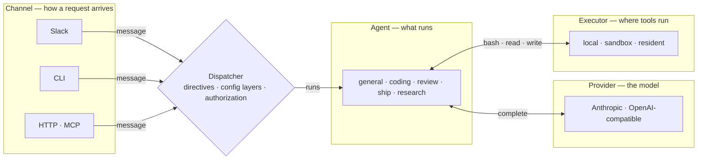
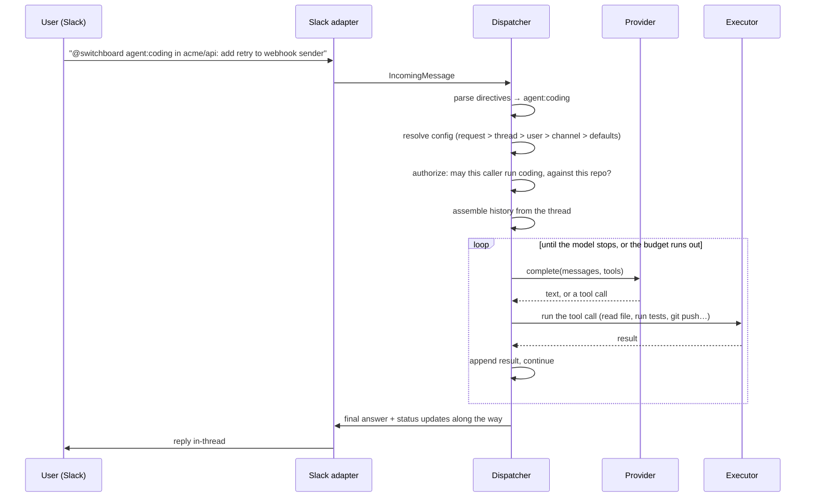

# How a request flows

Every entry point — a Slack mention, a CLI `ask`, an HTTP or MCP dispatch — reduces to the same four seams, in the same order, handled by the same code. There is exactly one orchestrator; everything else plugs into it.

<!-- generated:four-seams · npm run docs:gen — drawn from docs/.vitepress/theme/seams.mjs and src/deploy/plan.ts, do not edit by hand -->

<!-- /generated:four-seams -->

The reply travels the same path back, through the dispatcher to the channel that asked.

## What each seam refuses to know about the others

- **A channel adapter** turns a platform event into one shape (`IncomingMessage`) and turns a reply back into platform calls: chunking a Slack message, editing a status card, printing to stdout. It has no opinion on which agent runs, which model answers, or where a tool executes, and it imports nothing from the provider or execution modules.
- **The dispatcher** is the only place that reads directives, resolves the six-layer config ([Why config is layered](config-layers.md)), checks authorization, assembles history, and runs the agent loop. It never imports a platform SDK. That is a rule the tree is checked against, not a style preference: Slack-specific logic in the dispatcher is a bug.
- **A provider adapter** turns "call this model with these messages and tools" into one vendor's HTTP shape and back. It knows nothing about Slack, authorization, or where the tools it is asked to call will run.
- **An executor** runs a tool call somewhere — the bot host, a per-thread sandbox, an always-warm resident — and returns the result. It does not know which agent asked, which model is driving the loop, or which channel started it.

Each seam is an interface with at least two implementations behind it, which is what keeps the core honest: a second implementation is what proves the interface is one. That rule is [decision 0001](../decisions/0001-seams-with-two-implementations.md); that only the dispatcher may start a run is [decision 0002](../decisions/0002-dispatcher-is-the-only-orchestrator.md).

The same pattern at every seam, each with a fixed way to add an implementation:

| Seam | Interface | Implementations today | Adding one |
|---|---|---|---|
| Channel | `ChannelIO` + `IncomingMessage` (`src/core/types.ts`) | Slack (Socket Mode), the CLI's `ask`, HTTP ingress, MCP | one adapter file in `src/channels/` |
| Provider | `Provider` (`src/providers/types.ts`) | Anthropic; OpenAI-compatible, which covers OpenAI, Groq, Ollama and vLLM with config alone | one adapter file, or just a config block |
| Executor | `Executor` (`src/execution/executor.ts`) | the bot host; an E2B micro-VM per thread; a Cloudflare Sandbox per thread through the sandbox Worker; a resident repo environment through the resident Worker | one backend file plus config |
| Agent | `AgentDef` data (`src/agents/registry.ts`) | `general`, `coding`, `review`, `ship`, `research` | one registry entry |

A channel adapter translates exactly three things: an incoming platform event into an `IncomingMessage`, a history fetch into `HistoryItem[]`, and replies and status back into platform calls (chunking, formatting and message editing are the adapter's concern). Identifiers are namespaced by platform — `slack:C…` for a channel, `slack:U…` for a user, `slack:C…:<ts>` for a thread — so config scopes, grants and memory can key on them and a new adapter brings its own prefix. Everything else is the dispatcher's: directives, the six config layers, authorization against the resolved agent, one live run per thread, history assembly, and the agent loop itself.

## One real request, end to end

Nothing above changes if `U` is typing at the CLI instead of Slack, or if `agent:review` runs against a local execution backend instead of a sandbox: the same four boxes, the same order, different implementations plugged into each seam.

## Every step is measured

The request above is also one span tree. The adapter starts a root the moment the process sees the message; every awaited step the dispatcher takes is a child of it — reading the thread, resolving the repository, attaching the workspace, each model turn, each tool call, posting the reply. The status card ticks from receipt and names the setup step in flight; when it closes, its detail leads with the request's shape: `32s getting ready · 2m 30s thinking · 55s in tools · 8s finishing up · 7s Switchboard overhead`. Nothing here is a second bookkeeping system: the spans are the timing, and the timeline, the card line and the friction report all read the same set. The bot's own work outside a request — the reconnect catch-up pass, the shutdown drain, every step of a deploy — gets a root of its own on the same log. Why one measurement primitive: [decision 0020](../decisions/0020-spans-one-measurement-primitive.md); the contract is the [tracing spec](../reference/specs/tracing.md).

## One run per thread: replying while it works

A thread has one workspace (its sandbox or its resident worktree), so it runs one agent at a time. Replying in a thread while its card is still spinning does not start a second run:

- **Every agent takes the reply as a follow-up.** You get a one-line acknowledgement, and the running agent reads your message at its next step, alongside the result of the tool it was running. Nothing in flight is interrupted or redone; the run page stays one run, with your follow-up listed under the original request. A review hears "also check the migration" mid-pass and folds it into the one review it posts; a ship pipeline hands your reply to whichever round is running.
- **Asking for a different agent mid-run is the one refusal**, for the one-workspace reason: `agent:review …` in a thread where coding is running is told a coding run is in flight, and waits or moves to a new thread.
- **A follow-up is never lost.** If the run ends before reading it, the follow-up runs as its own turn in the thread. If an operator stopped the run from the dashboard, the follow-up is not run and you are told so.

Operator commands (`help`, `runs stop …`, `config …`) are not runs and always answer inline, live run or not. Why admission is one live run per thread rather than a queue: [decision 0011](../decisions/0011-thread-admission-one-live-run.md).

## Why this shape, not a pipeline per integration

The alternative — a Slack-specific pipeline, a separate CLI pipeline, HTTP handlers that reimplement resolution — is how integrations drift: fix an authorization bug in one, forget the other three exist. Here, a bug fixed in the dispatcher is fixed everywhere at once, because there is nowhere else the logic could have been duplicated to. The same discipline applies one layer down, to operator commands (a separate, adjacent concept from agent runs), which are exposed identically across surfaces: [One definition, every surface](one-command-many-surfaces.md).

## See also

- [Architecture](architecture.md) — the same four seams drawn as the system's parts.
- [Why config is layered](config-layers.md) — the resolution step in detail.
- [Execution and trust](execution-and-trust.md) — what "run the tool call" means once execution is sandboxed.
- [Add a model provider](../how-to/add-a-provider.md) and [Add an agent](../how-to/add-an-agent.md) — extending two of these seams without touching the other two.
