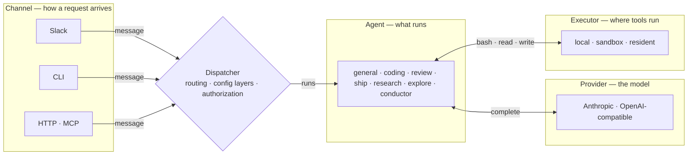
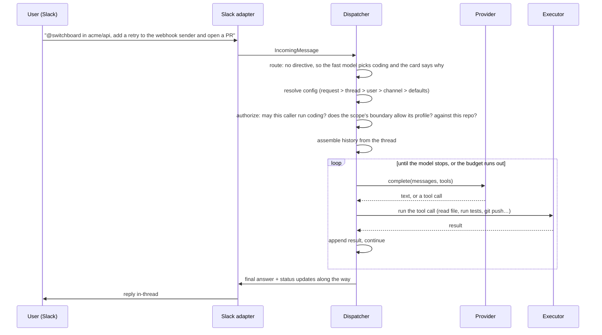

# How a request flows

Every entry point reduces to the same four seams around one dispatcher, in the same order, handled by the same code. A plain message picks its own agent: the dispatcher asks the fast model which preset the words mean and says so on the card; a directive on the message always wins over it.

<!-- generated:four-seams · npm run docs:gen — drawn from docs/.vitepress/theme/seams.mjs and src/deploy/plan.ts, do not edit by hand -->

<!-- /generated:four-seams -->

The reply travels the same path back, through the dispatcher to the channel that asked.

## What each seam refuses to know

The seams are Channel, Provider, Executor and Agent. The dispatcher sits between them as the core: routing (the message's own directive, else the fast model's pick), the [six config layers](config-layers.md), authorization, history, the agent loop. It never imports a platform SDK; the tree is checked for that.

| Seam | Interface | Implementations | Knows nothing about |
|---|---|---|---|
| Channel | `ChannelIO` + `IncomingMessage` (`src/core/types.ts`) | Slack (Socket Mode), the CLI's `ask`, HTTP ingress, MCP | agents, models, where tools run |
| Provider | `Provider` (`src/core/provider.ts`) | Anthropic; OpenAI-compatible (OpenAI, Groq, Ollama, vLLM); the same blocks on pi's model library for the router's and reflection's calls | Slack, authorization, where tools run |
| Executor | `Executor` (`src/execution/executor.ts`) | the bot host; an E2B or Cloudflare sandbox per thread; a resident | which agent, model or channel asked |
| Agent | `AgentDef` data (`src/agents/registry.ts`) | `general`, `coding`, `review`, `ship`, `research`, `explore`, `conductor` | the channel, the executor |

Every seam has two or more implementations; the second proves the interface ([decision 0001](../decisions/0001-seams-with-two-implementations.md)). Only the dispatcher starts a run ([decision 0002](../decisions/0002-dispatcher-is-the-only-orchestrator.md)). Identifiers are platform-namespaced (`slack:C…`, `slack:U…`, `slack:C…:<ts>`) so scopes, grants and memory key on them.

## One request, end to end

The same sequence runs from the CLI, or on a local backend.

The example names no agent, so the dispatcher asks the fast model which preset the message means and says so on the card (`routed: <reason>`); `agent:coding` on the message, the thread's sticky preset, or a channel or user `agent` skips the question, and a deployment that set `routing: { auto: false }` never asks it (every plain message then runs `defaults.agent`). The gates then judge the routed preset exactly as they judge a typed one, `ship` is never routed, and a message with several independent parts runs as a `conductor` with one child per part ([routing-and-config item 21](../reference/specs/routing-and-config.md)).

A `ship` request is the one that runs other runs. The plan runner (a Workflow in the bot's shim Worker, with no model turn of its own) opens a thread per unit and a review thread beside it, then dispatches ordinary runs into them as the requester: a coding run with the unit's contract, a review run at the pull request's head in the review thread, and, after a verdict that requests changes, the review's findings as a message into the unit thread with `agent:coding` on it, so the coding session that wrote the code answers its own review. The runner matches the dispositions that run records to the review's findings, dispatches the re-review into the review thread, and on a plan branch merges the approved head ([agent-ship spec](../reference/specs/agent-ship.md); [decision 0034](../decisions/0034-one-agent-per-unit-a-run-continues-a-transcript.md)).

## Every step is measured

The request is one span tree: a root when the process sees the message, a child for every awaited step (thread read, workspace attach, each model turn and tool call, the reply). The status card, the run timeline and the friction report read the same spans ([decision 0020](../decisions/0020-spans-one-measurement-primitive.md); [tracing spec](../reference/specs/tracing.md)).

## One run per thread: replying while it works

A thread has one workspace, so it runs one agent at a time. A reply mid-run does not start a second run:

- **Every agent takes the reply as a follow-up**, read at its next step; the run page stays one run.
- **Asking for a different agent mid-run is the one refusal.** `agent:review …` during a coding run is told so, and waits or moves to a new thread.
- **A follow-up is never lost.** If the run ends first it runs as its own turn; after an operator stop you are told it was not run.

Operator commands (`help`, `runs stop …`, `config …`) are not runs and always answer inline. Why one live run rather than a queue: [decision 0011](../decisions/0011-thread-admission-one-live-run.md).

## Why this shape

A pipeline per integration drifts: fix an authorization bug in one, forget the other three. A dispatcher fix is fixed everywhere, because nowhere else can hold the logic. Operator commands follow the same rule: [One definition, every surface](one-command-many-surfaces.md).

## Read next

- [Architecture](architecture.md) — the seams as the system's parts.
- [A thread's conversation outlives its runs](a-thread-continues.md) — what a follow-up in a thread starts from, and why.
- [Execution and trust](execution-and-trust.md) — what "run the tool call" means once sandboxed.
- [Add a model provider](../how-to/add-a-provider.md), [Add an agent](../how-to/add-an-agent.md).
