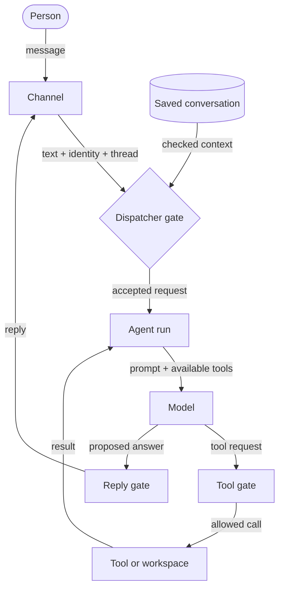
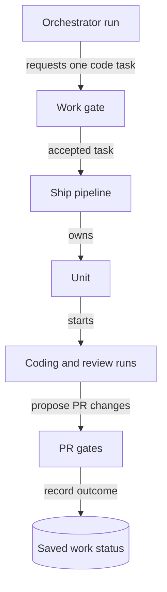

# How a request flows

The model decides what to say or ask a tool to do. Switchboard's code decides what the requester may access, which tool calls may run, and whether an answer may be sent.

## Text through one run

```mermaid
flowchart TB
    P(["Person"]) -->|"message"| C["Channel"]
    C -->|"text + identity + thread"| D{"Dispatcher gate"}
    S[("Saved conversation")] -->|"checked context"| D
    D -->|"accepted request"| R["Agent run"]
    R -->|"prompt + available tools"| M["Model"]
    M -->|"tool request"| G["Tool gate"]
    G -->|"allowed call"| T["Tool or workspace"]
    T -->|"result"| R
    M -->|"proposed answer"| V["Reply gate"]
    V -->|"reply"| C
```

The dispatcher may use a model to understand a plain request, but its choice still passes authorization. Before a model sees saved text, Switchboard checks that the requester can still use its sources. Each model step can produce text or a tool request. Code checks the tool request; its result becomes input to the next model step. Before sending the answer, code checks source access and current work facts again. Ship uses coding and review runs for those model steps; the pipeline itself has none.

A run can make several model calls before it ends. A reply can steer a live run or start a later run in the same thread. [A thread outlives its runs](a-thread-continues.md) explains follow-ups and saved context; [the data model](what-holds-what.md) separates threads, runs and units.

The orchestrator can answer questions and read current work. The next diagram shows one action it can take: starting private code work.

## One current action: private code work

```mermaid
flowchart TB
    O["Orchestrator run"] -->|"requests one code task"| G["Work gate"]
    G -->|"accepted task"| P["Ship pipeline"]
    P -->|"owns"| U["Unit"]
    U -->|"starts"| A["Coding and review runs"]
    A -->|"propose PR changes"| V["PR gates"]
    V -->|"record outcome"| S[("Saved work status")]
```

On the current private-work path, a verified requester in a direct Slack message can ask the orchestrator to start one unit in the configured repository. Code checks the latest delivered request, private audience, repository access and durable work ownership before it starts. The coding and review runs use the unit's saved task and context. Push, review, check and merge decisions use recorded facts at the current pull-request head; a model cannot waive those gates.

The orchestrator run can answer while that unit continues. In a later verified private turn, it can read status and progress, steer or stop the linked work through checked tools; the result remains attached to the requester and thread. Its current work-start action creates this Ship unit. [What an agent is](agents-and-toolsets.md) explains the different roles.
