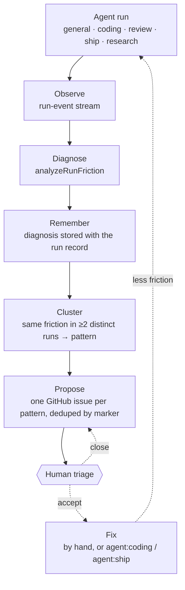
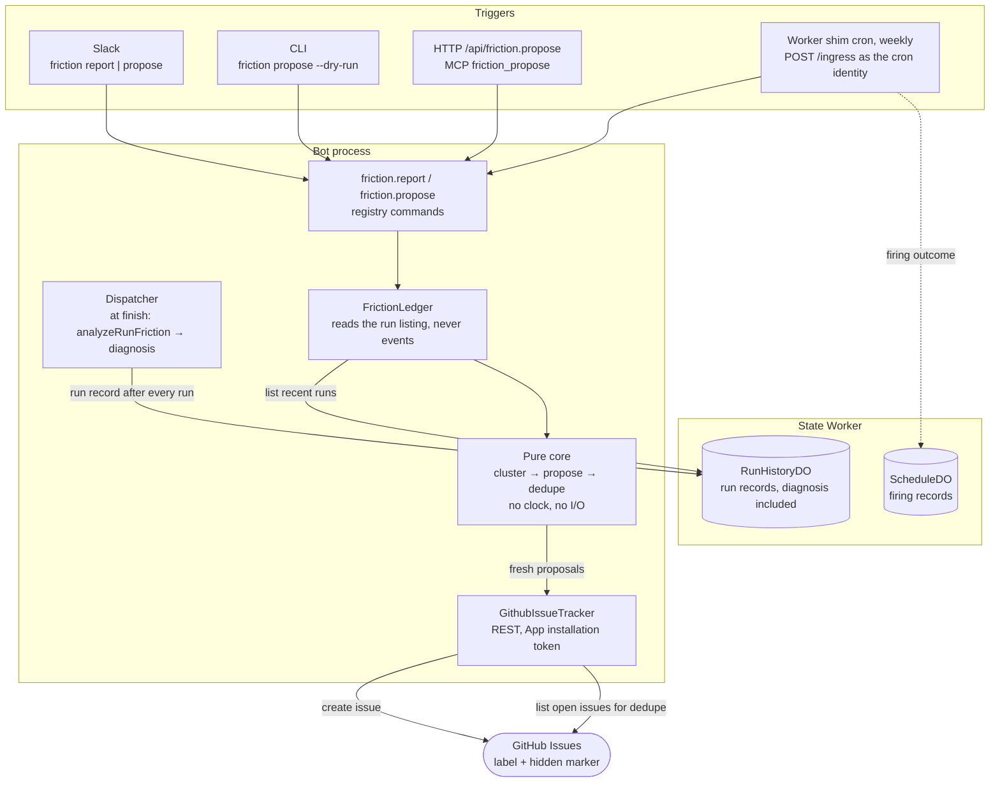
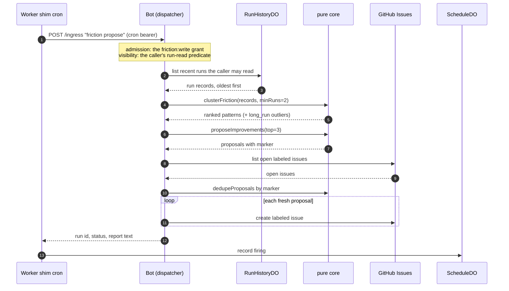
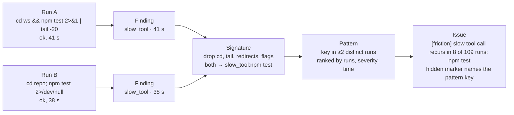

# How OpenSwitchboard improves itself

OpenSwitchboard diagnoses every run, clusters friction that recurs across runs, and files each pattern as a labelled GitHub issue for a person to triage.

## It proposes and never fixes

The only side effect is a labelled issue: no pull request, no merge, no config edit, no channel post, and a ledger row carries no message text. An automatic pull-request arm would need its own review, budget and rollback story, so a person is the gate.

The dashed arrows are the ones OpenSwitchboard never follows.

## Where each piece runs

Diagnoses live on the state Worker, so a bot redeploy loses nothing. The analysis is a pure function over ledger records: unit-tested on recorded runs, and a dry run is the real run minus `create issue`.

## A scheduled pass

The firing is an ordinary run: a record on `/runs`, a row in the Scheduled panel. Without `friction:write` it finishes `failed`; without `channels: all` it analyzes zero runs; without a cron token it is recorded `misconfigured`.

## Noisy commands, stable patterns

An exact-command key never recurs, so the signature keeps only each command's ordered program heads:

- **Recurrence counts distinct runs**; ten slow calls in one run count once.
- **`long_run` is the cost proxy**: a run at twice the median wall time (and at least ten minutes), flagged per agent.
- **Dedupe is by marker, not title**; closing an issue makes its pattern eligible again.

## Triggers and gates

| Surface | Command | Who |
|---|---|---|
| Slack | `friction report` | anyone; read-only |
| Slack | `friction propose [--dry-run] [--top n] [--min-runs n] [--repo o/n]` | `friction:write` (admins through `all`) |
| CLI | `npm run cli -- friction propose --dry-run` | the local operator |
| HTTP / MCP | `POST /api/friction.propose`, tool `friction_propose` | tokens holding `friction:write` |
| Schedule | the `self-improvement` entry, weekly | the `cron` identity, granted `friction:write` and `channels: all` |

A caller analyzes what its run-read predicate allows: an admin or the cron sees the fleet, a token granted one channel sees that channel ([authorization](../reference/specs/authorization.md)). Every surface is [the same registered command](one-command-many-surfaces.md).

## Read next

- [Self-improvement](../reference/specs/self-improvement.md) — the contract.
- [Run friction](../reference/specs/run-friction.md) — categories, thresholds, `friction analyze`.
- [Run history](../reference/specs/run-history.md) — where diagnoses persist and for how long.
