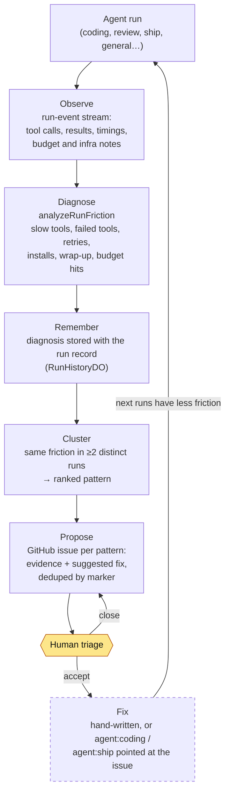
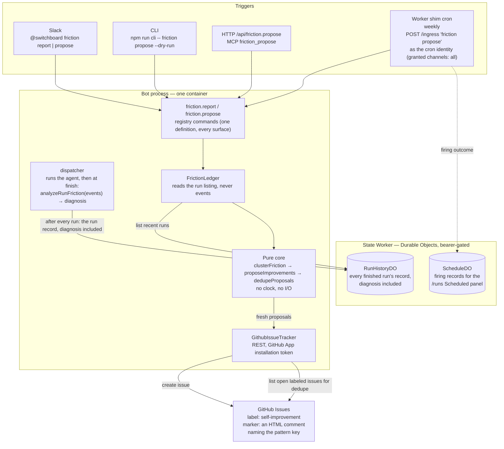
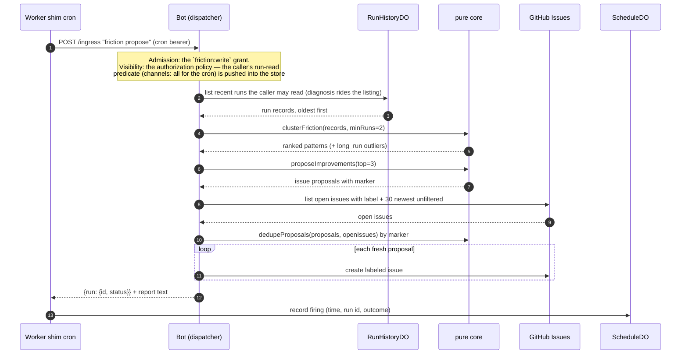
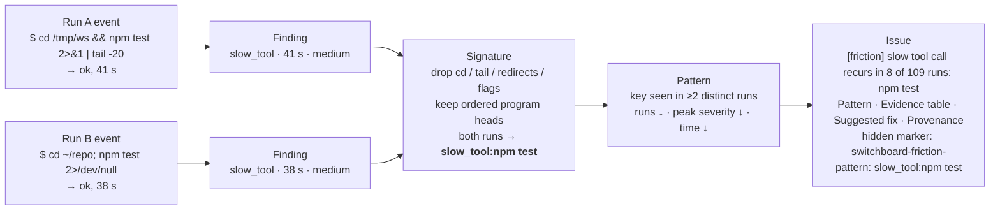

# How Switchboard improves itself

After every agent run Switchboard diagnoses where the time went, keeps that diagnosis with the run, and on a schedule (or on demand) looks for friction that recurs across runs and files each recurring pattern as a labelled GitHub issue with evidence and a suggested fix, for a person to triage. This page is why the loop is shaped that way and where each piece runs. The contract is the [self-improvement spec](../reference/specs/self-improvement.md); the per-run diagnosis it builds on is [run friction](../reference/specs/run-friction.md).

## Why it proposes and never fixes

The only side effect is opening a labelled issue. It never opens a pull request, never merges, never edits config. The fix is a separate, human-initiated step, typically pointing `agent:coding` or `agent:ship` at the filed issue.

That narrowing is a safety boundary, not an unfinished feature. A self-modifying system with an automatic pull-request arm would need its own review, budget and rollback story. A person is the gate between "we noticed this keeps happening" and "we changed something": observe, diagnose, propose, with the arrow into *fix* held by a human.

Everything left of the human gate is automatic. *Fix* is dashed because Switchboard does not perform it; the loop closes only when a person acts on the issue.

## Where each piece runs

Two facts worth holding onto:

- **The bot container is stateless for this feature.** A redeploy loses nothing: the diagnoses live on the state Worker's Durable Objects, so `friction report` after a restart sees the same runs as before ([Runs: live, then remembered](runs-live-and-history.md)).
- **The analysis is a pure function.** Clustering, ranking, rendering and dedupe take ledger records in and produce proposals out, with no clock and no network. That is why the whole pipeline is unit-tested against recorded runs, and why a dry run is exactly the real run minus the final `create issue` call.

## A scheduled pass, step by step

The firing is an ordinary run: it gets a record on `/runs`, its answer is the report text, and the Scheduled panel shows when it fired and what came of it. If the cron identity lacks the grant, the run finishes `failed` with the refusal as its answer and nothing is filed. If it lacks `channels: all`, the pass runs and analyzes zero runs; the installation's config grants it to the cron identity, and the schedule registry declares the same for the schedule's own actor. If there is no cron token at all, nothing runs and the firing is recorded `misconfigured`.

## Why a noisy command becomes a stable pattern

Real agents chain the same work differently every run, so an exact-command key never recurs. The signature reduces each command to its program heads:

Three consequences for reading a filed issue:

- **Recurrence counts distinct runs.** A command that was slow ten times inside one run counts once toward "recurs", though all ten occurrences and their time are reported. Recurring means a process problem, not one bad run.
- **`long_run` is the cost proxy.** There is no per-run token accounting, so a run at least twice the median wall time (and at least ten minutes) is flagged per agent as a cost-spike stand-in.
- **Dedupe is by marker, not title.** Titles change as run counts grow; the HTML comment in the body is the identity. Closing an issue makes its pattern eligible to be filed again, which is the intended "we fixed it, tell us if it comes back" behaviour.

## Triggers and gates

| Surface | Command | Who may run it |
|---|---|---|
| Slack (any channel the bot is in) | `@switchboard friction report [--since-ms n] [--limit n] [--min-runs n]` | anyone (read-only, GitHub never consulted) |
| Slack | `@switchboard friction propose [--dry-run] [--top n] [--min-runs n] [--repo o/n]` | actors granted `friction:write` (admins through `all`) |
| CLI (no bot needed) | `npm run cli -- friction propose --dry-run` | the local operator; without `--repo` or config it is a pure dry run |
| HTTP / MCP | `POST /api/friction.propose`, tool `friction_propose` | tokens holding `friction:write` |
| Schedule | the `self-improvement` entry of the schedule registry, weekly | the `cron` ingress identity, whose `grants` entry (`http:cron`) holds `friction:write` and `channels: all` |

Who may call a command is the table above; what it analyzes is the [authorization policy](../reference/specs/authorization.md): the caller's run-read predicate, pushed into the run store. An admin or the cron sees the fleet; a token granted one channel sees that channel; a caller granted no channel sees only its own runs. All of these are the same registered command with the same JSON output and the same rendered text ([One definition, every surface](one-command-many-surfaces.md)).

## What it deliberately does not do

- Open pull requests, push commits, or merge anything.
- Change agent prompts, the agent contract, config, or sandbox images.
- Post to a channel when it files. The issues are the notification.
- Read message text into the ledger. A ledger row carries `{ runId, label, agent, finishedAt, diagnosis }` and nothing else, so an issue body can never leak a conversation or grant live-view access.

## Further reading

- [Self-improvement](../reference/specs/self-improvement.md): the contract, every edge case, and the validation criteria with their tests.
- [Run friction](../reference/specs/run-friction.md): the per-run diagnosis, its categories and thresholds, and `friction analyze` for one saved stream.
- [Run history](../reference/specs/run-history.md): where the diagnoses persist and for how long.
