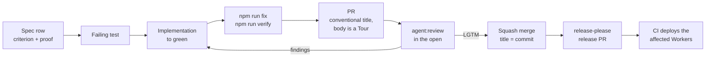

# How we work

Switchboard is built by the same kind of agents it runs. This page is the loop a change goes through, from the sentence that says what should be true to the release that makes it so, and why each step is where it is. The agent's half of the contract is [AGENTS.md](https://github.com/coreplanelabs/switchboard/blob/main/AGENTS.md); the human's half is [CONTRIBUTING](https://github.com/coreplanelabs/switchboard/blob/main/CONTRIBUTING.md). Both describe this loop.

## The loop

**1. The spec says what should be true.** Every behavior has a row in a feature spec under `features/`: the criterion, and the proof that holds it — a named test (`file::describe::it`), a written procedure an agent runs against the live system, or an honest `[gap]` linked to the issue that will close it. A change starts by writing or editing that row. The spec is the contract, so a spec that describes code that no longer exists is a bug, and the same PR that changes the code changes the spec.

**2. A failing test, then the code.** The proof comes before the implementation. Unit tests are the default because they are the fastest proof that can be run anywhere; a live procedure is the exception for what a unit test genuinely cannot reach (a Slack flow, a sandbox, a deploy).

**3. One gate, run locally first.** `npm run fix` regenerates every generated artifact and repairs formatting; `npm run verify` is the whole gate — the same scripts CI runs, split into parallel jobs. Nothing lives only in CI: a step that is not `npm ci` or `npm run <script>` fails a unit test over the workflow file itself. Generated things (the reference tables, the AGENTS.md command table, the vendored skills) each have a `gen` and a `check`, so they cannot drift from the code without failing the build.

**4. The PR is written for the reader.** Its title is a Conventional Commit, because that title becomes the squash commit on `main` and a changelog line — a required check refuses anything else. Its body opens with two sentences a stranger can act on, then a Tour: the change in reading order, each step explained before the code it points at, anchored at the pushed head. Decisions that are not obvious from the diff are written down in the body; the ones that shape the architecture become a dated record in the tree.

**5. Switchboard reviews it, in the open.** A maintainer posts the PR to the review agent (`agent:review`) in the team's Slack channel. The agent reads the whole change in a warm checkout, runs what it needs to, and posts one verdict with labeled findings — never an approval or a merge; it has no such rights. A finding at or above the agreed severity is addressed or declined with a reason on the thread; the branch is rewritten so each commit stays a reviewable unit; the review is re-requested at the new head. An `LGTM` verdict trips an auto-approve workflow so the human sees green, but a person presses merge.

**6. Merge is a squash whose subject is the title.** The body stays on the PR, where its links render; `main` reads as a changelog. Every required status is a job name in the workflow, and gate jobs stand in for fan-outs, so the matrix can change shape without touching the ruleset.

**7. Release and deploy are automatic and reviewable.** release-please keeps one release PR open with the accumulated changes; merging it tags the version, writes the changelog, and CI deploys only the Workers whose inputs changed since the commit each one serves. The release PR carries that plan as a comment before anyone merges it.

## Why this shape

- **Specs are the contract, tests are the proof, and the check binds them.** Prose that describes behavior drifts; a proof reference that must resolve to a real test title cannot. Renaming a test makes the build red until the spec follows.
- **Scripts, not YAML.** An agent can run `npm run verify` and get the same answer CI would. A rule that lives only in a workflow file is a rule an agent cannot check before pushing.
- **The review agent is a reviewer, not a gatekeeper.** It reads and reports. Authority stays with people, and the agent's own run page is the audit trail of what it actually looked at.
- **Generated over hand-maintained.** Anything derivable from the code is generated and checked. The reference tables, the command table, the vendored skills, the deploy plan — each is one `gen` away from correct and one `check` away from red.
- **Conventional titles are the release process.** The title check is the only place a human types the changelog; everything downstream is derived.

## Where the loop is enforced

| Step | Enforced by |
|---|---|
| Spec proofs resolve to real tests | `npm run specs:check` (in `check:consistency`) |
| CI runs only repository scripts | `src/ciWorkflow.test.ts` over the workflow files |
| Generated artifacts are current | `docs:check`, `agents:check`, `skills:check` |
| PR titles are conventional | the required `title` check (`npm run check:pr-title`) |
| Squash-only, title as commit | the repository's merge settings and the `main` ruleset ([Configure the repository](../how-to/configure-the-repository.md)) |
| Only the changed Workers deploy | `deploy plan --affected`, shown on every PR and on the release PR |
