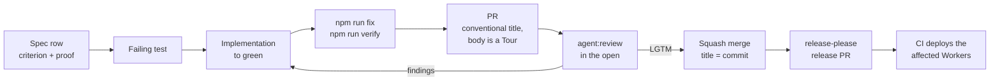

# How we work

A change goes from a spec row to a failing test, to a PR with a Tour, to an agent review in the open, to an automated release; each step is checked, not trusted.

The agent's half of the contract is [AGENTS.md](../../AGENTS.md); the human's half is [Contributing](../../CONTRIBUTING.md). Why records are immutable and specs are checked: [decision 0021](../decisions/0021-records-are-immutable-specs-are-checked.md).

## The loop

| Step | What happens | Why |
|---|---|---|
| 1. Spec | Every behavior has a row under `docs/reference/specs/`: criterion plus proof (a `file::describe::it` test, a live procedure, or an honest `[gap]`). The change starts there, in the same PR as the code. | A spec describing code that no longer exists is a bug. |
| 2. Failing test | Proof before implementation. Unit tests by default; a live procedure only for what they cannot reach (a Slack flow, a sandbox, a deploy). | The fastest proof that runs anywhere. |
| 3. One gate | `npm run fix` regenerates and repairs; `npm run verify` is the whole gate, the scripts CI runs; every generated thing has a `gen` and a `check`. | An agent gets the same answer CI would; nothing lives only in YAML. |
| 4. The PR | A Conventional Commit title, refused otherwise. Two sentences a stranger can act on, then a Tour: the change in reading order, explanation before code, anchored at the pushed head. | The title becomes the squash commit and a changelog line. |
| 5. Review | A maintainer posts the PR to `agent:review`. It reads the change in a warm checkout and the specs it touches (`npm run specs:coverage`) and posts one verdict; a spec contradiction is a `minor`-or-above finding. Findings are addressed or declined, the branch rewritten, review re-requested at the new head. | The same-PR rule is enforced, not assumed. The agent never approves or merges; in an opted-in repository `LGTM:` trips auto-approve, a person presses merge. |
| 6. Merge | A squash whose subject is the title. Every required status is a job name; gate jobs stand in for fan-outs. | `main` reads as a changelog; the matrix changes shape without touching the ruleset. |
| 7. Release | release-please keeps one release PR open; merging it tags, writes the changelog, and deploys only the Workers whose inputs changed. The deploy plan is a comment on the release PR. | The changelog is the titles verbatim, so a title is the line an operator will read ([the rule](../../CONTRIBUTING.md#the-pr-title-is-the-changelog-line)). |

## Where the loop is enforced

| Rule | Check |
|---|---|
| Spec proofs resolve to real tests | `npm run specs:check` |
| A diff agrees with the specs it touches | the review agent, over `npm run specs:coverage` |
| A test is removed or narrowed only with its spec | the review agent, over `npm run specs:coverage -- --test-guard` |
| CI runs only repository scripts | a unit test over the workflow files |
| Generated artifacts are current | `docs:check`, `agents:check`, `skills:check` |
| Records are superseded, never edited | `decisions:check` |
| PR titles are changelog lines | the required `title` check |
| Squash-only, title as commit | the `main` ruleset ([Configure the repository](../how-to/configure-the-repository.md)) |
| Only the changed Workers deploy | `deploy plan --affected` on every PR |

## Switchboard develops Switchboard

The rules in [AGENTS.md](../../AGENTS.md) are written for the product's own agents, who follow them:

- **`agent:review` reviews every PR**: read-only, one verdict at the head it read; a reviewed-head guard refuses any other head.
- **`agent:coding` implements issues** in the vendored skills' house style, submitting a typed description Switchboard renders as the PR.
- **`agent:ship` runs the loop end to end** to an `LGTM`, in one thread.
- **Run pages are the audit trail**: what each run read, ran and wrote.
- **`friction propose` files the process's own improvement issues**; proposals only, never PRs ([How Switchboard improves itself](how-switchboard-improves-itself.md)).

## Read next

- [Ship a release](../how-to/ship-a-release.md) — the release PR and its deploy plan.
