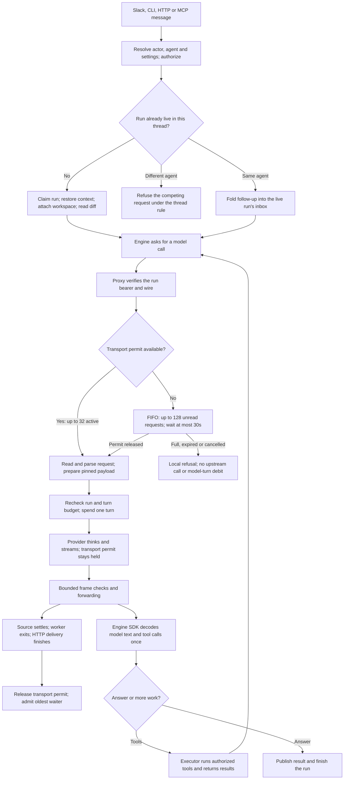

# How model calls use capacity

A user request is a run. A run can make many model calls. Capacity is reserved **per HTTP model exchange**, then reused by later calls. It is not reserved for every call the run might make.

This describes the source policy in this checkout; verify the deployed build before using it for a live diagnosis.

This page describes engine calls through `/v1/responses`. Other provider wires keep their own transport contracts. The current policy is [decision 0098](../decisions/0098-bound-stream-concurrency-separately-from-parsing.md); its executable contract is [model-proxy.md](../reference/specs/model-proxy.md).

## From message to answer



Request parsing, request preparation and complete-frame processing each borrow the **single parsing permit** before temporary allocations. Each short step returns it when done. Provider waiting and HTTP backpressure hold the transport permit, but leave the parsing permit free. Frames repeat through this path as they arrive.

The engine can decode streamed data while delivery continues. A ready answer does not itself release a transport permit: cleanup must finish too.

## Three separate controls

| Control | Scope | What it protects | When it releases |
|---|---|---|---|
| Thread owner | One conversation | One live writer; follow-ups reach that writer | The run fully ends; unconsumed inputs return to the existing follow-up path |
| Transport permit | Shared by Responses calls in one bot process | Whole exchange, retained data, source, worker and HTTP delivery | Request processing, original source settlement, actual worker exit and HTTP finish/close have all settled |
| Parsing permit | Shared by short processing steps | CPU work and overlapping temporary memory | The step finishes; failed work waits for actual worker exit |

The acquisition order is **transport, then parsing**. A caller waiting for a transport must not hold the parsing permit. Otherwise, it could block the work that needs to finish before that transport becomes free.

The settings in `src/core/budgets.ts` set 32 active exchanges,128 waiting places,one parsing step and a30-second queue wait. The global512MiB managed-storage policy and the byte, graph and worker-heap limits remain independent refusal boundaries. An available transport permit does not promise room for every simultaneous maximal payload.

The bot template selects one `standard-2` container: one vCPU and6GiB. Identity slots in a resident and seats in the Sandbox fleet are separate resources; increasing model capacity does not increase either.

## Follow-ups and reuse

A six-call task normally uses capacity like this:

```text
model call → finish exchange → tools → next model call → finish exchange → …
```

Six follow-ups in the same live thread normally enter its inbox and reach the engine at its next step boundary. They do not create36 simultaneous reservations. Separate threads, child runs and other callers can overlap; they share the bot's pool. Each new call competes with existing waiters in FIFO order. A follow-up asking for a different agent remains subject to the [thread rule](a-thread-continues.md).

## Where a capacity refusal occurs

A run can be accepted, attach its workspace and read its PR diff, then fail at the model-call door. Under the earlier two-active/two-waiting policy, another call was refused when both active permits and both waiting places were occupied. That refusal happened before body reads, provider contact or a model-turn debit. It did not establish a provider failure or identify which calls occupied the pool.

The new policy absorbs a larger burst. A queued call shows "waiting for model capacity" in its trace. Logs record acceptance and actual release with the run identity and active/waiting counts. A full queue or expired wait still produces a bounded, authenticated local refusal; it grants no model replay or provider-recovery authority. Timeout removes the waiter and never frees unfinished active work.

## Why this design

The limit protects finite CPU and memory. Keeping a transport reservation until actual settlement prevents unfinished work from being admitted again under the same resource credit. A separate short parsing permit avoids spending that scarce working-space credit while a provider thinks.

Both queues are local FIFO semaphores attached to live connections. They are not durable job queues. A process restart can interrupt those connections; existing run ownership handles that interruption. This queue does not create a durable model-request replay mechanism.

Cloudflare Queues is useful for background jobs, but its at-least-once delivery and lack of ordering would require new replay and response-routing rules here. A separate Durable Object would also move control away from the process whose resources it protects. The existing local queue and Cloudflare container sizing meet this scope.

Sandbox v2 changes the execution backend. This model-call policy remains in the bot, behind the existing provider/executor boundaries. It adds no Sandbox scheduler, alarm owner or migration controller. Adaptive concurrency remains deferred until sustained usage provides a baseline.

## Verify before changing it

Read the [benchmark guide and recorded baselines](../reference/benchmarks/model-capacity/README.md). Run both fixed profiles and compare settings, source hashes, runtime image, CPU/memory quota and workload before interpreting timing changes. The benchmark covers the model proxy and cleanup under a synthetic provider; it does not establish full review latency, workspace performance or production acceptance.

Source anchors: `src/core/threadAdmission.ts` (thread ownership), `src/channels/modelProxy.ts` (door and request preparation), `src/channels/responsesValidationCapacity.ts` (transport ownership), `src/channels/responsesConsumer.ts` (short processing permit), and `src/channels/modelProxyResponses.ts` (frame processing).
