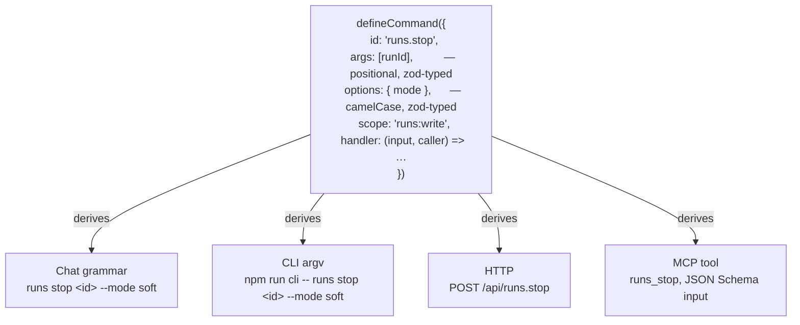
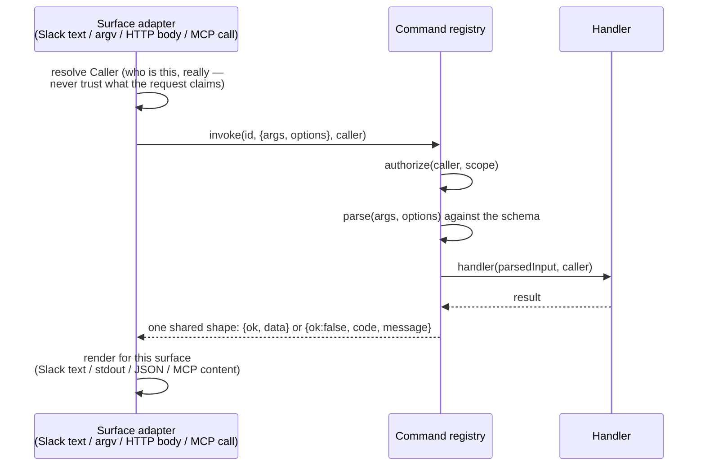

# One definition, every surface

Each operator command is written once as a typed definition; chat, CLI, HTTP and MCP are derived from it, so no surface can drift ([decision 0008](../decisions/0008-one-command-definition-every-surface.md)).

## What "once" looks like

The `args` and `options` schema is the one source for a valid call, the `--help` text, the MCP `inputSchema`, and every surface's validation error. The reference tables are generated from the same definitions and checked by CI ([Reference](../reference/README.md)).

## One pipeline underneath all four

An adapter translates its request into `{args, options, caller}` and the result back out. It holds no command logic or validation.

- **The caller is resolved by the adapter, never read from the request.** Slack derives it from the event (`slack:U…`); HTTP from the identity the dashboard gate verified. Nothing upstream of `invoke()` reads an identity field from the payload, so a scope rule is enforced in one place ([decision 0004](../decisions/0004-platform-namespaced-ids.md)).
- **One error vocabulary.** A malformed call is `invalid_input` everywhere; a caller without the scope is `unauthorized`, decided before parsing, so a refusal reveals nothing about a well-formed call.

## Commands versus runs

The registry covers operator commands (`config`, `runs`, `repo`, `memory`, `friction`, `schedule`, `deploy`, `env`) and nothing that starts a model. Agent runs go through the dispatcher from a message-shaped input: the CLI's `ask`, MCP's `dispatch`, a Slack message. Those are channels beside the registry ([decision 0002](../decisions/0002-dispatcher-is-the-only-orchestrator.md)).

Commands are scope-authorized and synchronous to a typed result; a run is long-lived, budgeted and side-effecting, with its own gates. So `/api/config.show` behind a read scope is always cheap.

## For a developer

A new command is one schema and one handler. It appears on every surface with no further code, and a conformance suite drives every command through every surface, so a misfit fails loudly.

## Read next

- [CLI](../reference/cli.md), [Slack commands](../reference/slack-commands.md) — derived surfaces.
- [Command registry](../reference/specs/command-registry.md) — the contract.
