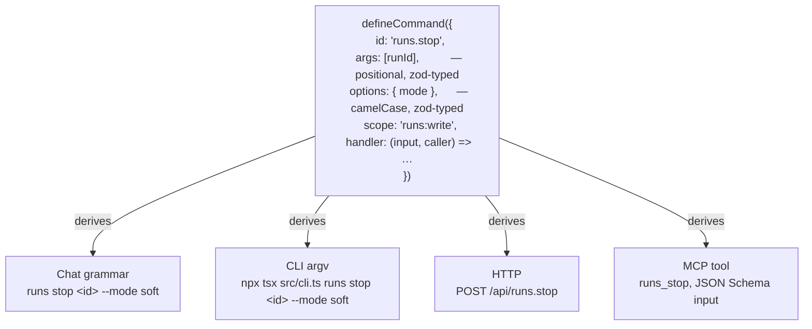
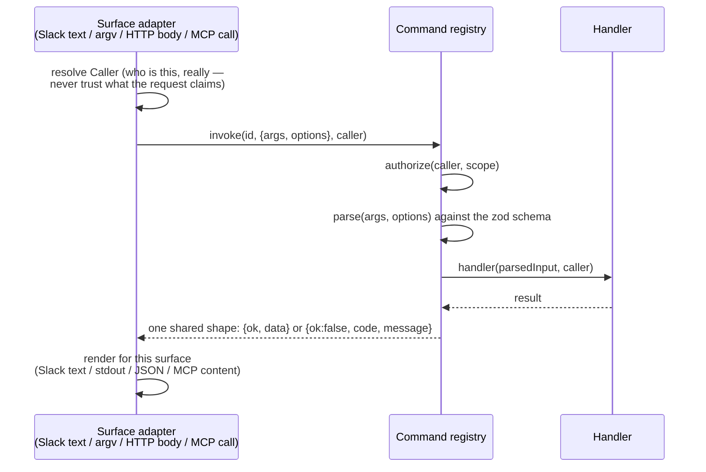

# One definition, every surface

Switchboard exposes the same operator commands four ways: type them in Slack, run them on the CLI, call them over HTTP, or expose them as MCP tools. The naive way to build that is to write four things per command — a chat parser branch, an argv parser, an HTTP handler, an MCP tool schema — and watch them drift the moment someone edits one and forgets the other three. Switchboard writes each command **once** and derives the other three.

## What "once" actually looks like

A command is a typed function definition, not a handler wired into four places by hand:

The zod schema for `args`/`options` is the single source of truth for: what a valid call looks like, the generated `--help` text, the MCP tool's `inputSchema`, and the validation error every surface gives on a bad call. Nobody hand-writes a second copy of "runId is required" for the HTTP route.

## One pipeline underneath all four

Every surface funnels into the same sequence, regardless of how the request arrived:

The adapter's *only* job is translating this surface's request into `{args, options, caller}` and this surface's response format back out. It contains no command logic and no validation of its own — a Slack-specific bug in argument parsing simply isn't a category of bug that can exist, because Slack text goes through the same tokenizer and the same zod schema as everything else.

**`Caller` is resolved by the adapter, never taken from the request.** A Slack adapter derives it from the platform event (namespaced `slack:U…`); the HTTP adapter derives it from the Cloudflare Access identity or service-token claim; nothing upstream of `invoke()` ever reads an identity field out of the payload itself. This is what makes "a service token can only reach `/api/*`" or "a chat caller is gated by Slack admin lists" enforceable in one place rather than trusted per-adapter.

**One error vocabulary, not four.** A malformed call is `invalid_input` whether it came from a bad CLI flag, a bad JSON body, or bad chat text — same code, only the surface-appropriate usage hint differs. A caller without the scope is `unauthorized` everywhere, decided *before* the input is even parsed (so a permission denial never leaks what a well-formed call would have looked like).

## The line this draws: commands vs. runs

This registry deliberately covers **operator commands** — `config`, `runs`, `repo`, `memory`, `friction`, `schedule`, `deploy`, `env` — and nothing that starts a model. **No command handler is allowed to start an agent run.** Anything that runs an agent goes through `dispatch()` instead, reached only from a message-shaped input: the CLI's `ask`, MCP's `dispatch` tool, or an ordinary Slack message. Those are channels, sitting beside the command registry, not entries in it.

Why the line matters: commands are authorized by scope and run synchronously to a typed result — cheap to reason about, cheap to test exhaustively. A run is a long-lived, budgeted, potentially side-effecting agent loop with its own permission gates (which agent, which repo) resolved *after* config layering. Collapsing the two would mean every command call could, in principle, kick off an expensive model run — which breaks the assumption that `/api/config.show` behind a read scope is always cheap and safe to call.

## Why this is worth knowing as a developer

Adding a new operator command means writing one zod schema and one handler. It shows up correctly formed on Slack, the CLI, HTTP, and MCP with no additional code — and a conformance suite enumerates the whole catalogue and drives every command through every surface automatically, so a new command that doesn't fit the generic fixture *fails loudly* instead of shipping silently untested on one surface. You cannot add a command that only works from the CLI by accident; the same derivation that gives you the CLI form gives you the other three, whether you remembered to think about them or not.

## See also

- [Reference: CLI](../reference/cli.md) and [reference: Slack commands](../reference/slack-commands.md) — the derived surfaces, as they exist today.
- [`features/command-registry.md`](https://github.com/coreplanelabs/switchboard/blob/main/features/command-registry.md) — the full behavioral contract, every edge case, every test.
