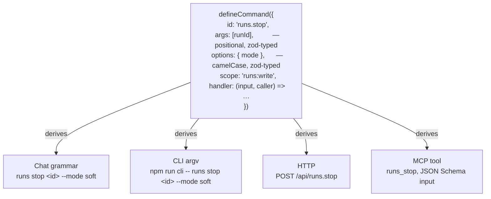
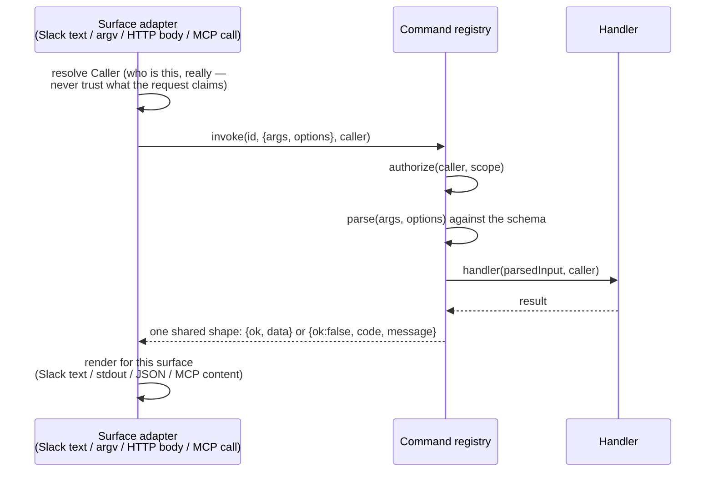

# One definition, every surface

OpenSwitchboard exposes the same operator commands four ways: type them in Slack, run them on the CLI, call them over HTTP, or expose them as MCP tools. The naive way to build that is to write four things per command — a chat parser branch, an argv parser, an HTTP handler, an MCP tool schema — and watch them drift the moment someone edits one and forgets the other three. OpenSwitchboard writes each command once and derives the other three. That is [decision 0008](../decisions/0008-one-command-definition-every-surface.md); this page is why it holds.

## What "once" looks like

A command is a typed function definition, not a handler wired into four places by hand:

The schema for `args` and `options` is the single source of truth for what a valid call looks like, the generated `--help` text, the MCP tool's `inputSchema`, and the validation error every surface gives on a bad call. Nobody writes a second copy of "runId is required" for the HTTP route. The reference tables on this site are derived from the same definitions, by a generator CI checks ([Reference](../reference/README.md)).

## One pipeline underneath all four

Every surface funnels into the same sequence, regardless of how the request arrived:

The adapter's only job is translating this surface's request into `{args, options, caller}` and this surface's response format back out. It contains no command logic and no validation of its own. A Slack-specific bug in argument parsing is not a category of bug that can exist, because Slack text goes through the same tokenizer and the same schema as everything else.

**The caller is resolved by the adapter, never taken from the request.** The Slack adapter derives it from the platform event (`slack:U…`); the HTTP adapter derives it from the identity the dashboard gate verified — a Cloudflare Access session or service-token claim, a bearer's configured actor, or the local operator, whichever strategy the installation runs. Nothing upstream of `invoke()` reads an identity field out of the payload. That is what makes "a service token can only reach `/api/*`" enforceable in one place rather than trusted per adapter; the ids themselves are platform-namespaced by [decision 0004](../decisions/0004-platform-namespaced-ids.md).

**One error vocabulary, not four.** A malformed call is `invalid_input` whether it came from a bad CLI flag, a bad JSON body or bad chat text; only the surface-appropriate usage hint differs. A caller without the scope is `unauthorized` everywhere, decided before the input is parsed, so a refusal never reveals what a well-formed call would have looked like.

## The line this draws: commands versus runs

The registry covers **operator commands** — `config`, `runs`, `repo`, `memory`, `friction`, `schedule`, `deploy`, `env` — and nothing that starts a model. No command handler may start an agent run. Anything that runs an agent goes through the dispatcher, reached only from a message-shaped input: the CLI's `ask`, MCP's `dispatch` tool, an ordinary Slack message. Those are channels, sitting beside the command registry, not entries in it ([decision 0002](../decisions/0002-dispatcher-is-the-only-orchestrator.md)).

Why the line matters: commands are authorized by scope and run synchronously to a typed result, cheap to reason about and cheap to test exhaustively. A run is a long-lived, budgeted, side-effecting agent loop with its own gates (which agent, which repository) resolved after config layering. Collapsing the two would mean any command call could, in principle, start an expensive model run, which breaks the assumption that `/api/config.show` behind a read scope is always cheap and safe.

## Why this is worth knowing as a developer

Adding an operator command means writing one schema and one handler. It appears, correctly formed, on Slack, the CLI, HTTP and MCP with no further code, and a conformance suite enumerates the whole catalogue and drives every command through every surface, so a command that does not fit the generic fixture fails loudly instead of shipping untested on one surface. You cannot add a command that only works from the CLI by accident.

## See also

- [CLI](../reference/cli.md) and [Slack commands](../reference/slack-commands.md) — the derived surfaces as they exist today.
- [Command registry](../reference/specs/command-registry.md) — the contract, every edge case, every test.
