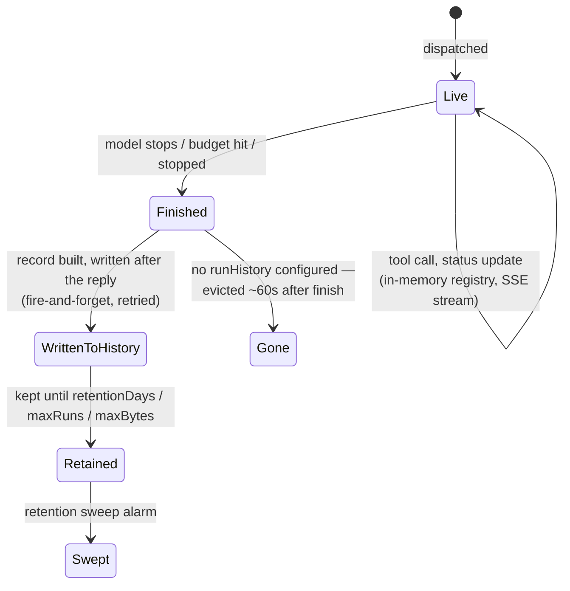

# Runs: live, then remembered

A run has two lives, backed by two different stores, and the seam between them is deliberate rather than an implementation detail leaking through. That is [decision 0006](../decisions/0006-runs-have-two-lives.md); this page is why.

## Why "live" is in memory and cheap

While a run is active, every tool call, status edit and intermediate note is held in an in-memory registry on the bot process: bounded by count and by bytes, evicted on a TTL, opened by a per-run capability token (the token in a run's URL is the access control, alongside whatever gate sits at the edge — [decision 0013](../decisions/0013-capability-tokens-for-live-run-pages.md)). A viewer who opens the page mid-run is replayed the newest of what the registry holds, within a budget, and is told which range it did not get; the record keeps everything, so nothing a viewer skipped is lost. That is what makes the live page and its stream fast and free of any durable write per event.

## Why "finished" is a separate, deliberate write

The moment a run finishes — answered, stopped, or out of budget — the dispatcher builds one durable record (identity, timing, the redacted event stream, the friction diagnosis) and writes it after the reply has gone out, so a slow or failed history write never delays or breaks the visible answer. The write is fire-and-forget with bounded retries; on shutdown, the drain waits for exactly this queue to empty.

## Why run history is a switch, not always on

Without a `runHistory` block, the second write never happens: runs are live-only, evicted from the registry about a minute after they finish, exactly as if durable history did not exist. That is a choice, not a degraded fallback. A small installation with no state Worker should not pay for storage it never asked for, and the dashboard's `/runs` index says so honestly rather than pretending history exists. Turn it on — `store: file` on the host, or `runHistory.worker` pointing at the state Worker — and the same runs become readable for a retention window (`retentionDays`, `maxRuns`, `maxBytes`, whichever bites first), through one read service that merges "still live" and "already history" rows.

## What a restart loses, and what it no longer does

The bot restarting — a deploy, a crash, a container recycle — has three different effects depending on what a run was doing at that instant:

- **A run that already finished and was written to history** is unaffected; it is not in the bot's memory to lose.
- **A conversation's context in an idle thread** is unaffected; it is rebuilt from Slack's own thread history on the next message, never held by the bot itself ([decision 0012](../decisions/0012-reconnect-catch-up-as-recovery.md)).
- **A run in flight at the moment of restart** depends on the **run ledger**. With run history on the state Worker, every run has a leased, fenced row there and a write-ahead record of its steps; on SIGTERM the bot marks its resumable runs handed off, and the next container reclaims them within seconds and continues them under the same status card, with a follow-up still steering into them. Without the ledger, the run is the one real loss: it has no record (the write happens after the reply, and there was no reply), so it disappears and its card closes as interrupted. A `ship` pipeline is never resumable and holds the drain until it finishes. Why a lease with a fencing token: [decision 0019](../decisions/0019-durable-run-ledger-resume-after-kill.md).

This is why deploy tooling no longer waits on runs in flight, and why the one thing it still waits out is a container rollout in progress ([Operate production](../how-to/operate-production.md)).

## Why every duration is one definition

A run's duration is shown in six places — the run page header, the runs index row, `runs list`, the history seed, the Slack card, and the friction report — and if each computed it from whatever stamps it happened to hold, two surfaces could disagree about the same run with neither being wrong. So one function defines it: from the moment the bot received the message to the moment the agent finished, or to now while live. The live page projects the server's clock forward from the seed rather than subtracting a server stamp from the browser's, so clock skew never shows in a tick. Every duration falls out of a span ([decision 0020](../decisions/0020-spans-one-measurement-primitive.md)); the stamps are in the [tracing spec](../reference/specs/tracing.md).

## See also

- [Watch a run](../how-to/watch-a-run.md) — the dashboard built on this.
- [Worker topology](worker-topology.md) — where the durable half lives.
- [Configuration](../reference/configuration.md) — the `runHistory` block's knobs.
