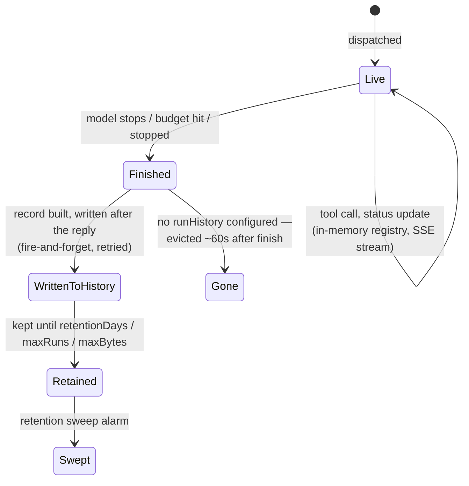

# Runs: live, then (optionally) remembered

A run has two distinct lives, backed by two different stores, and the seam between them is deliberate rather than an implementation detail leaking through.

## Why "live" is in-memory and cheap

While a run is active, every tool call, every status edit, every intermediate note is held in an in-memory registry on the bot process — bounded by count and by bytes, evicted on a TTL, capability-token-gated (the token in a run's URL *is* the access control, alongside Access at the edge). This is what makes the live run page and its SSE stream fast and free of any durable-write cost per event: nothing here is designed to survive a restart, because a run *in flight* during a restart is genuinely gone — there's no safe way to resume a half-finished tool call across a process boundary, so the system doesn't pretend to.

## Why "finished" is a deliberate, separate write

The moment a run finishes — answered, stopped, or budget-exhausted — the dispatcher builds one durable record (identity, timing, the redacted event stream, the friction diagnosis) and writes it *after* the reply has already gone out, so a slow or failed history write never delays or breaks the user-visible answer. This write is fire-and-forget with bounded retries; on shutdown, the drain waits for exactly this queue to empty, and nothing else.

## Why run history is an on/off switch, not always-on

Without a `runHistory` block in config, this second write never happens at all — runs are **live-only**, evicted from the in-memory registry roughly a minute after they finish, exactly as if the durable-history feature didn't exist. This isn't a degraded fallback; it's a genuine choice: a small deployment with no state Worker configured shouldn't pay for durable storage it never asked for, and the dashboard's `/runs` index reflects that honestly (nothing to show once a run's minute is up) rather than silently pretending history exists. Turn it on — point `runHistory.worker` at the state Worker — and the exact same runs become readable for a real retention window (`retentionDays` / `maxRuns` / `maxBytes`, whichever limit bites first), through the identical `RunsService` merge of "still live" and "already history" rows.

## Why a restart loses nothing durable — and exactly what it does lose

The bot process restarting (a deploy, a crash, a container recycle) has three different effects depending on what a run was doing at that instant:

- **A run that already finished and was written to history:** completely unaffected — it's not in the bot's memory to lose.
- **A conversation's context in an idle thread:** unaffected — it's rebuilt by reading Slack's own thread history on the next message, never held durably by the bot itself.
- **A run genuinely in flight at the moment of restart:** this is the one real loss. It has no record (the write happens *after* the reply, and there was no reply), so it simply disappears from every surface. The Slack reconnect catch-up exists specifically to paper over the Slack-side consequence of this — a message that arrived while the socket was down gets picked up and re-dispatched on reconnect — but the interrupted run itself is not resumed, it's redone.

This is why deploy tooling treats "a run is in flight" as something to wait out rather than plow through: not because the bot can't restart safely, but because the one thing that *doesn't* survive is whatever was mid-flight at the exact moment it goes down.

## See also

- [How-to: watch a run and check spend](../how-to/watch-a-run-and-check-spend.md) — the dashboard surface built on this.
- [Explanation: Worker topology](worker-topology.md) — where the durable half of this actually lives.
- [Reference: configuration](../reference/configuration.md) — the `runHistory` block's exact knobs.
