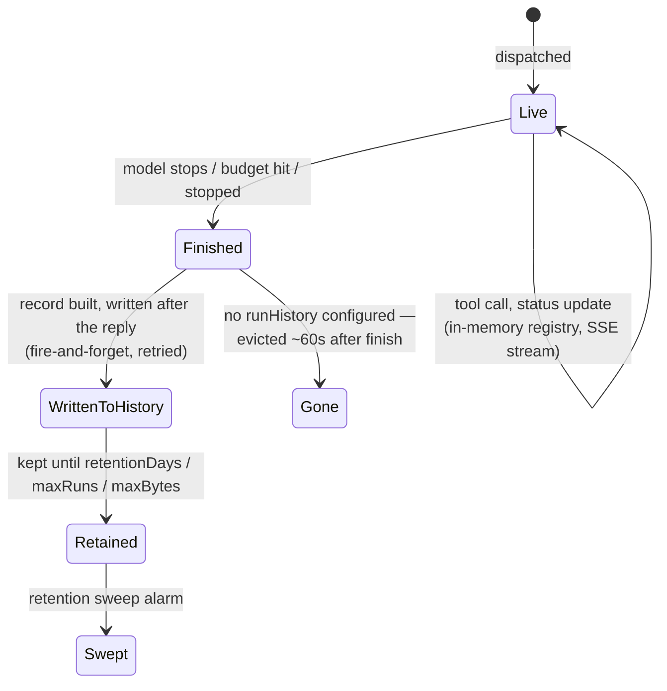

# Runs: live, then remembered

A run is held in memory while it happens and written to durable history once it finishes; the seam between the two is deliberate ([decision 0006](../decisions/0006-runs-have-two-lives.md)).

## Live is in memory and cheap

An active run's events sit in an in-memory registry: bounded by count and bytes, evicted on a TTL, opened by the per-run token in the run's URL ([decision 0013](../decisions/0013-capability-tokens-for-live-run-pages.md)). A viewer arriving mid-run gets the newest events within a budget and is told which range was skipped. No durable write happens per event.

## Finished is one deliberate write

When a run ends the dispatcher builds one record: identity, timing, the redacted event stream, the friction diagnosis. It is written after the reply has gone out, fire-and-forget with bounded retries, so a slow history write never delays an answer. On shutdown, the drain waits for exactly this queue.

## History is a switch

Without a `runHistory` block the second write never happens: runs are evicted about a minute after they finish, and the `/runs` index says so. With `store: file` on the host, or `runHistory.worker` naming the state Worker, runs stay readable for a retention window (`retentionDays`, `maxRuns`, `maxBytes`, whichever bites first) through one read service that merges live and history rows.

## What a restart loses

| A run that was… | After a restart |
|---|---|
| finished and written | unaffected |
| idle conversation context | rebuilt from the channel's thread history ([decision 0012](../decisions/0012-reconnect-catch-up-as-recovery.md)) |
| in flight, ledger on the state Worker | reclaimed by the next container within seconds, continued under the same card ([decision 0019](../decisions/0019-durable-run-ledger-resume-after-kill.md)) |
| in flight, no ledger | lost: no reply, so no record; its card closes as interrupted |

A `ship` pipeline is never resumable and holds the drain until it finishes. Deploy tooling waits only on a container rollout ([Operate production](../how-to/operate-production.md)).

## Every duration is one definition

Six surfaces show a run's duration (page, index, `runs list`, seed, card, friction report). One function defines it, from message receipt to the agent's finish, so no two can disagree. The live page projects the server's clock forward from the seed, so skew never shows. Every duration is a span ([decision 0020](../decisions/0020-spans-one-measurement-primitive.md); [tracing spec](../reference/specs/tracing.md)).

## Read next

- [Watch a run](../how-to/watch-a-run.md) — the dashboard built on this.
- [Configuration](../reference/configuration.md) — the `runHistory` block.
