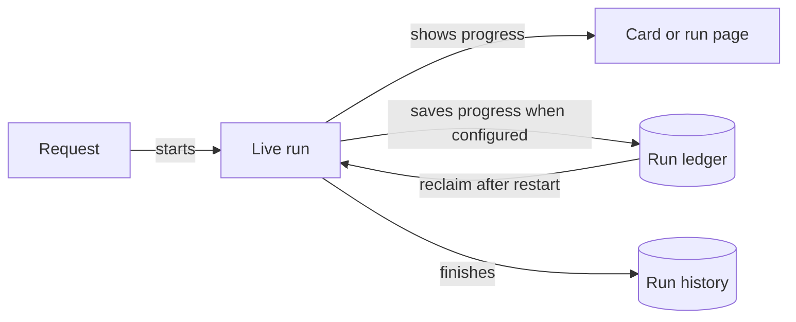

# Runs: live and recorded

A run has one identity from start to finish. While it is live, the bot serves its current status. When the run ledger is configured, it also saves live progress so a restart can reclaim the run. A finished run has a stored outcome and redacted events when run history is configured.

```mermaid
flowchart LR
    Q["Request"] -->|"starts"| L["Live run"]
    L -->|"shows progress"| C["Card or run page"]
    L -->|"saves progress when configured"| G[("Run ledger")]
    G -->|"reclaim after restart"| L
    L -->|"finishes"| H[("Run history")]
```

A Ship pipeline has a parent run record. Its coding and review runs have their own records; the pipeline's units also keep their work state. These are distinct from the [thread's conversation](a-thread-continues.md). Without the ledger and history configuration, live status is process-local and short-lived. See the [run history spec](../reference/specs/run-history.md).
