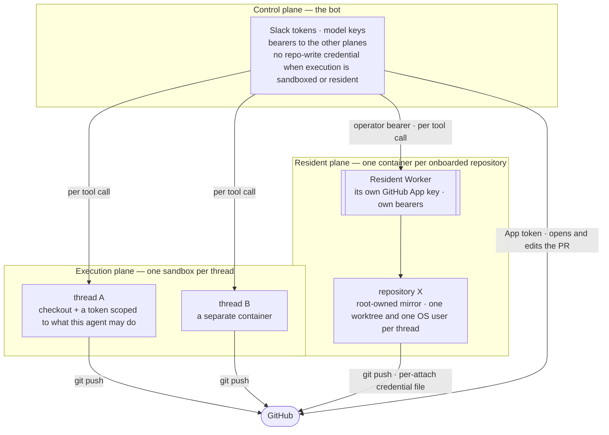

# Security model

Every piece is arranged so that compromising it yields less than everything: three execution planes with separate credentials, every surface authenticating in-band, one policy table asked once.

It runs commands a model wrote and does not try to make the model's judgment safe.

## Three planes

| Plane | Holds | A compromise yields |
|---|---|---|
| Control: the bot | Slack tokens, model keys, bearers; no code-pushing credential once execution is sandboxed or resident | A chatty assistant and the conversations it sees |
| Execution: one container per thread | The checkout and a GitHub token scoped to the agent's role; a read-only agent's token cannot push | One checkout and one repository for the token's one-hour life; nothing else is reachable |
| Resident: warm checkouts of onboarded repositories | Its own GitHub App key, never seen by the bot; a per-thread credential file for one attach | The repositories it is attached to; nothing about Slack or the model |

Planes never share a credential: the bot's App key and the resident's are two secrets for one GitHub App, rotated separately, and each Worker checks its own bearer first ([decision 0009](../decisions/0009-residents-second-credential-domain.md)).

`local` execution collapses the planes: tools run on the bot host as its user, fine only while everyone who reaches the bot is trusted ([Execution and trust](execution-and-trust.md)).

## What each surface checks

| Surface | Check |
|---|---|
| Slack | The bot's tokens authenticate the bot; workspace membership decides who reaches a channel; the policy table decides what they may do. |
| HTTP and MCP ingress | A bearer mapped to one identity. No token means disabled, not open; comparisons are constant-time over every token; authorization is decided before a body is read. |
| The dashboards | One gate, three strategies: a Cloudflare Access JWT re-verified in the bot's own code, a bearer, or `none`, which serves loopback only. Missing inputs fail startup; `none` on a public hostname refuses to start. |
| A live run page | An unguessable per-run token in the card's link, valid for the page, its stream and its stop control until the run ends. Wrong token, unknown run and expired run share one `404`; the token is never logged. Finished runs are read by identity ([decision 0013](../decisions/0013-capability-tokens-for-live-run-pages.md)). |
| The dashboard's pages | No inline script: a CSP allows the page's own origin only and nothing renders HTML from data, so an escaping bug becomes text, not code ([decision 0014](../decisions/0014-dashboard-csp-script-src-self.md)). |

## One policy table, asked once

Authorization is one function over one table: may this actor take this action on this resource? Every surface resolves the caller into a typed actor once; every command and agent run asks the same question. Adapters resolve identity, never authority.

The table is closed by default: no matching row is a deny. The condition vocabulary is validated at startup. A denied read of a run is `not_found`; deny reasons are short tokens on the audit line, never in a reply ([decision 0007](../decisions/0007-authorization-policy-table.md); [Reference: authorization](../reference/authorization.md)).

An entry has three axes (actions, channels, repositories); an absent axis is empty. A Slack user without an entry holds the open chat commands and every unrestricted agent; a machine credential holds exactly its entry. `restrict` closes an agent or repository to everyone not granted it, checked at run time against the resolved agent, so no directive or default routes around it.

## The defaults

| Default | If you do nothing |
|---|---|
| Credentials come from the environment only | A key in `config.yaml` is not read; a missing one fails startup. |
| A credential in the process is a `Secret` | Read once through one module and revealed only where it crosses a boundary — an SDK constructor, an `Authorization` header, a sandbox's env. Logged, stringified or serialized, it is `[secret:<NAME>]`; a raw `process.env` read of one anywhere else is a lint error, so a new leak fails CI. |
| Channel config, repository management, run operations | Never a baseline; only an entry or an admin's `all` confers them. |
| The review agent's sandbox | A read-only GitHub token, whatever the model attempts. |
| Trace context from an outside caller | Stripped and re-minted. |
| A Worker's bearer does not match | `401`; nothing degrades to open. |

Free text the model sees is data, not instruction: run records wrap it as untrusted when read back, and an MCP server's descriptions and results are treated the same way.

## Not defended

The review agent is read-only by token and toolset, not by a wall around `bash`; under `local` it can write files. A sandbox contains damage to one repository, but the model can still do anything its token allows there. Whoever holds the control plane holds the conversation ([Known limits](known-limits.md)).

## Read next

- [Worker topology](worker-topology.md) — which Worker each plane runs on.
- [Restrict who can do what](../how-to/restrict-who-can-do-what.md) — `grants` and `restrict`.
